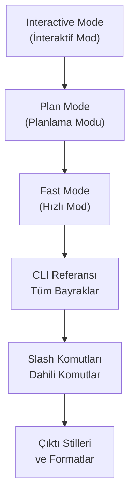
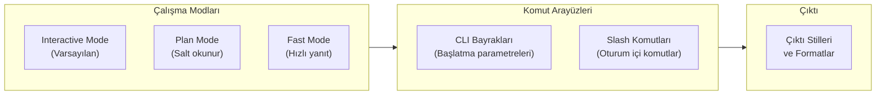

# Bölüm 07: Claude Code — Arayüz ve Komutlar

Claude Code ile etkileşim kurmanın farklı yollarını, çalışma modlarını ve komut satırı referansını kapsayan bölüm. Temel kullanımdan ileri düzey CLI otomasyonuna kadar tüm arayüz özelliklerini öğreneceksiniz.

## Bu Bölümde Neler Öğreneceksiniz?

## İçerik

| # | Dosya | Konu | Süre |
|---|-------|------|------|
| 01 | [İnteraktif Mod](./01-interaktif-mod.md) | Klavye kısayolları, çok satırlı giriş, dosya sürükleme, @-mention, görsel yapıştırma | ~12 dk |
| 02 | [Plan Modu](./02-plan-modu.md) | Araştırma-planlama-uygulama akışı, Shift+Tab, token tasarrufu | ~10 dk |
| 03 | [Hızlı Mod](./03-hizli-mod.md) | Faster Opus 4.6, hız/derinlik dengesi, uygun senaryolar | ~8 dk |
| 04 | [CLI Referansı](./04-cli-referansi.md) | Tüm bayraklar: -p, -c, -r, --output-format, --model ve daha fazlası | ~15 dk |
| 05 | [Dahili Komutlar](./05-dahili-komutlar.md) | /help, /compact, /context, /permissions, /resume, /init ve diğerleri | ~12 dk |
| 06 | [Çıktı Stilleri](./06-cikti-stilleri.md) | Çıktı özelleştirme, JSON modu, yapılandırılmış çıktı, formatlama seçenekleri | ~10 dk |

## Ön Koşullar

Bu bölümü okumadan önce aşağıdaki konulara aşina olmanız önerilir:

| Konu | Bölüm |
|------|-------|
| Claude Code nedir ve nasıl çalışır | [Bölüm 06](../06-claude-code-tanitim/README.md) |
| Kurulum ve kimlik doğrulama | [Bölüm 06 - Kurulum](../06-claude-code-tanitim/03-kurulum-ve-gereksinimler.md) |
| Terminal / komut satırı temel kullanımı | Harici kaynak |

## Bölüm Haritası

## Hızlı Referans Tabloları

### CLI Bayrakları

| Bayrak | Kısa | Açıklama | Varsayılan |
|--------|------|----------|------------|
| `--print` | `-p` | Non-interactive mod | Kapalı |
| `--continue` | `-c` | Son oturuma devam | - |
| `--resume` | `-r` | Belirli oturuma devam | - |
| `--session-id` | - | Oturum ID belirle | Otomatik |
| `--worktree` | `-w` | Çalışma dizini | Geçerli dizin |
| `--output-format` | - | Çıktı formatı | `text` |
| `--model` | - | Model seçimi | `claude-opus-4-20250514` |
| `--max-tokens` | - | Maks. yanıt token | Model limiti |
| `--allowedTools` | - | İzinli araçlar | Tümü |
| `--disallowedTools` | - | Yasaklı araçlar | Yok |
| `--dangerously-skip-permissions` | - | İzinleri atla | Kapalı |
| `--fast` | - | Hızlı mod | Kapalı |
| `--verbose` | - | Detaylı çıktı | Kapalı |
| `--version` | - | Sürüm bilgisi | - |
| `--help` | - | Yardım | - |

### Slash Komutları

| Komut | Kategori | Açıklama | Parametre |
|-------|----------|----------|-----------|
| `/help` | Bilgi | Tüm komutları listele | - |
| `/compact` | Bağlam | Konuşma geçmişini sıkıştır | `[talimat]` (opsiyonel) |
| `/context` | Bağlam | Context window durumunu göster | - |
| `/permissions` | Güvenlik | İzin ayarlarını görüntüle | - |
| `/resume` | Oturum | Önceki oturuma devam et | - |
| `/init` | Konfigürasyon | CLAUDE.md oluştur | - |
| `/install-github-app` | Entegrasyon | GitHub App kur | - |
| `/plugin` | Eklenti | Eklenti yönetimi | `list\|add\|install` |
| `/loop` | Çalışma | Döngü modunu aç/kapa | - |
| `/clear` | Oturum | Konuşmayı temizle | - |
| `/doctor` | Bilgi | Sistem sağlık kontrolü | - |
| `/config` | Konfigürasyon | Ayarları görüntüle/düzenle | `[set key value]` |
| `/cost` | Bilgi | Oturum maliyet bilgisi | - |
| `/vim` | Görüntüleme | Vim modunu aç/kapa | - |
| `/terminal-setup` | Konfigürasyon | Terminal entegrasyonu kur | - |

## Sonraki Adım

Bu bölümü tamamladıktan sonra → [08 - Claude Code: Araçlar (Tools)](../08-araclar/README.md)
