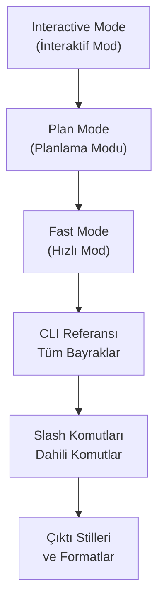
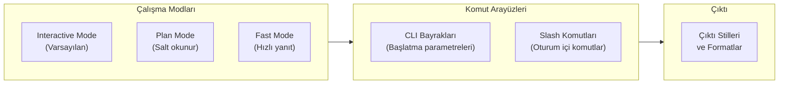

# Bölüm 07: Claude Code — Arayüz ve Komutlar

Claude Code ile etkileşim kurmanın farklı yollarını, çalışma modlarını ve komut satırı referansını kapsayan bölüm. Temel kullanımdan ileri düzey CLI otomasyonuna kadar tüm arayüz özelliklerini öğreneceksiniz.

## Bu Bölümde Neler Öğreneceksiniz?

## İçerik

| # | Dosya | Konu | Süre |
|---|-------|------|------|
| 01 | [İnteraktif Mod](./01-interaktif-mod.md) | Klavye kısayolları, çok satırlı giriş, dosya sürükleme, @-mention, görsel yapıştırma | ~12 dk |
| 02 | [Plan Modu](./02-plan-modu.md) | Araştırma-planlama-uygulama akışı, Shift+Tab, token tasarrufu | ~10 dk |
| 03 | [Hızlı Mod](./03-hizli-mod.md) | Faster Opus 4.6, hız/derinlik dengesi, uygun senaryolar | ~8 dk |
| 04 | [CLI Referansı](./04-cli-referansi.md) | Tüm bayraklar: -p, -c, -r, --output-format, --model ve daha fazlası | ~15 dk |
| 05 | [Dahili Komutlar](./05-dahili-komutlar.md) | /help, /compact, /context, /permissions, /resume, /init ve diğerleri | ~12 dk |
| 06 | [Çıktı Stilleri](./06-cikti-stilleri.md) | Çıktı özelleştirme, JSON modu, yapılandırılmış çıktı, formatlama seçenekleri | ~10 dk |

## Ön Koşullar

Bu bölümü okumadan önce aşağıdaki konulara aşina olmanız önerilir:

| Konu | Bölüm |
|------|-------|
| Claude Code nedir ve nasıl çalışır | [Bölüm 06](../06-claude-code-tanitim/README.md) |
| Kurulum ve kimlik doğrulama | [Bölüm 06 - Kurulum](../06-claude-code-tanitim/03-kurulum-ve-gereksinimler.md) |
| Terminal / komut satırı temel kullanımı | Harici kaynak |

## Bölüm Haritası

## Sonraki Adım

Bu bölümü tamamladıktan sonra → [08 - Claude Code: Araçlar (Tools)](../08-araclar/README.md)
