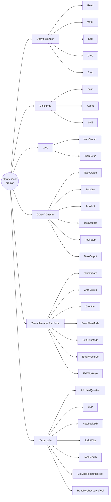
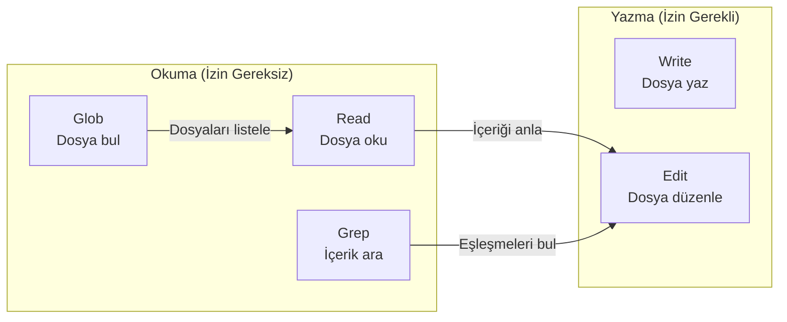
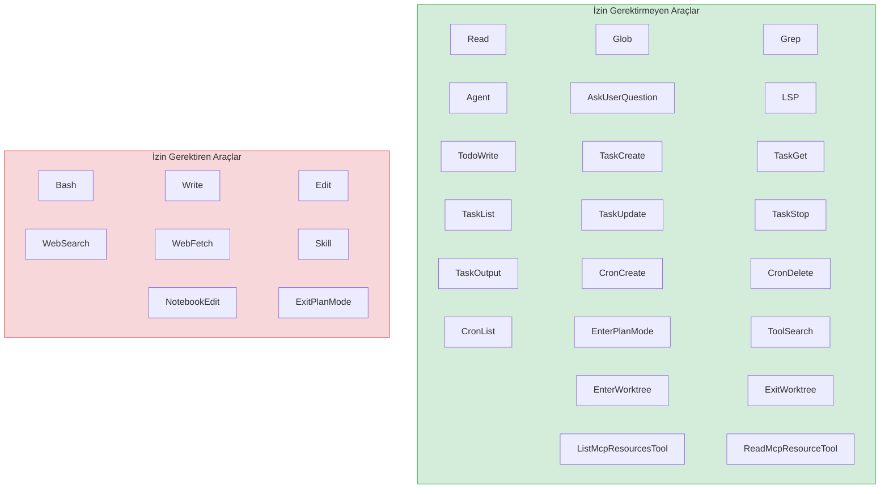
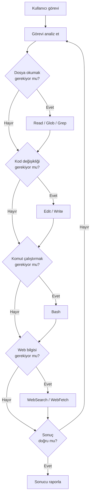
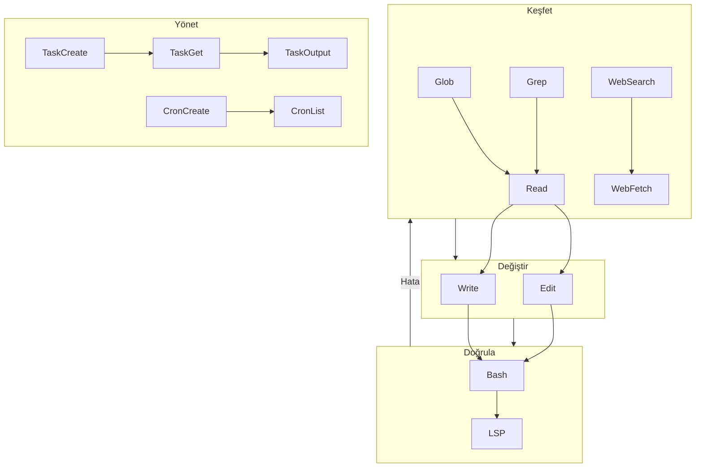

# Araçlara Genel Bakış

Claude Code, görevleri yerine getirmek için **30'dan fazla dahili araç** (tool) kullanır. Her araç belirli bir işlevi yerine getirir — dosya okuma, kod çalıştırma, web'de arama yapma gibi. Claude Code, kullanıcının verdiği göreve göre hangi araçları hangi sırayla kullanacağını **otomatik olarak** belirler.

## Ön Koşullar

| Konu | Bölüm |
|------|-------|
| Claude Code nedir ve nasıl çalışır | [Bölüm 06](../06-claude-code-tanitim/README.md) |
| Agentic loop kavramı | [Claude Code Nasıl Çalışır?](../06-claude-code-tanitim/02-claude-code-nasil-calisir.md) |

---

## Araç Kategorileri

Claude Code'un araçları altı ana kategoride gruplanır:



---

## Kategori Detayları

### 1. Dosya İşlemleri (File Operations)

Projedeki dosyalarla etkileşim kurmak için kullanılan temel araçlardır.

| Araç | Açıklama | İzin Gerekli mi? |
|------|----------|:-:|
| **Read** | Dosya okuma (metin, görsel, PDF), satır aralığı belirtebilme | ❌ |
| **Write** | Yeni dosya oluşturma veya mevcut dosyanın üzerine yazma | ✅ |
| **Edit** | Dosyada hedefli metin değiştirme (`old_string` → `new_string`) | ✅ |
| **Glob** | Dosya adı desenine göre dosya bulma (`*.ts`, `**/*.test.js`) | ❌ |
| **Grep** | Regex ile dosya içeriği arama (ripgrep tabanlı) | ❌ |



### 2. Çalıştırma (Execution)

Komut ve kod çalıştırma araçlarıdır.

| Araç | Açıklama | İzin Gerekli mi? |
|------|----------|:-:|
| **Bash** | Shell komutları çalıştırma (build, test, git vb.) | ✅ |
| **Agent** | Alt görevler için bağımsız bir agent (ajan) başlatma | ❌ |
| **Skill** | Önceden tanımlanmış beceri dosyalarını yükleme ve çalıştırma | ✅ |

### 3. Web Araçları (Web Tools)

İnternet erişimi sağlayan araçlardır.

| Araç | Açıklama | İzin Gerekli mi? |
|------|----------|:-:|
| **WebSearch** | Web'de gerçek zamanlı arama yapma | ✅ |
| **WebFetch** | Belirtilen URL'nin içeriğini markdown olarak çekme | ✅ |

### 4. Görev Yönetimi (Task Management)

Paralel ve arka plan görevleri oluşturup yönetmek için kullanılır.

| Araç | Açıklama | İzin Gerekli mi? |
|------|----------|:-:|
| **TaskCreate** | Yeni bir görev/alt ajan oluşturma | ❌ |
| **TaskGet** | Görevin durumunu sorgulama | ❌ |
| **TaskList** | Tüm görevleri listeleme | ❌ |
| **TaskUpdate** | Mevcut bir görevi güncelleme veya silme | ❌ |
| **TaskStop** | Çalışan bir görevi durdurma | ❌ |
| **TaskOutput** | Arka plan görevinin çıktısını alma | ❌ |

### 5. Zamanlama ve Planlama (Scheduling & Planning)

Zamanlanmış görevler ve planlama modu araçlarıdır.

| Araç | Açıklama | İzin Gerekli mi? |
|------|----------|:-:|
| **CronCreate** | Tekrarlayan veya tek seferlik zamanlanmış görev oluşturma | ❌ |
| **CronDelete** | Zamanlanmış görevi silme | ❌ |
| **CronList** | Zamanlanmış görevleri listeleme | ❌ |
| **EnterPlanMode** | Planlama moduna geçiş (salt okunur) | ❌ |
| **ExitPlanMode** | Planlama modundan çıkış | ✅ |
| **EnterWorktree** | Git worktree izolasyonuna giriş | ❌ |
| **ExitWorktree** | Git worktree izolasyonundan çıkış | ❌ |

### 6. Yardımcı Araçlar (Utilities)

Özel amaçlı yardımcı araçlardır.

| Araç | Açıklama | İzin Gerekli mi? |
|------|----------|:-:|
| **AskUserQuestion** | Kullanıcıya çoktan seçmeli soru sorma | ❌ |
| **LSP** | Kod zekası: tip hataları, tanıma gitme, referans bulma | ❌ |
| **NotebookEdit** | Jupyter notebook hücrelerini düzenleme | ✅ |
| **TodoWrite** | Oturum içi yapılacaklar listesi oluşturma | ❌ |
| **ToolSearch** | Ertelenmiş MCP araçlarını arama ve yükleme | ❌ |
| **ListMcpResourcesTool** | MCP kaynaklarını listeleme | ❌ |
| **ReadMcpResourceTool** | MCP kaynağını okuma | ❌ |

---

## Tam İzin Matrisi



---

## Araç Seçim Akışı

Claude Code bir görevi aldığında, hangi araçları kullanacağına şu mantıkla karar verir:



---

## Pratik Örnekler

### Örnek 1: Basit Dosya Okuma

```bash
> src/index.ts dosyasının içeriğini göster
```

Claude Code'un kullandığı araç zinciri:

```
Read("src/index.ts") → Sonucu göster
```

### Örnek 2: Bug Düzeltme

```bash
> calculateTotal fonksiyonundaki yuvarlama hatasını düzelt
```

Araç zinciri:

```
Grep("calculateTotal") → Read(bulunan dosya) → Edit(hata düzeltme) → Bash("npm test")
```

### Örnek 3: Yeni Özellik Ekleme

```bash
> Kullanıcı profil sayfası için bir API endpoint'i oluştur ve testini yaz
```

Araç zinciri:

```
Glob("**/*.route.*") → Read(mevcut route yapısı) → Write(yeni route) → 
Write(test dosyası) → Bash("npm test") → Edit(hata varsa düzelt)
```

### Örnek 4: Web'den Bilgi Alıp Uygulama

```bash
> React 19'daki yeni hook'ları araştır ve projemize uygun olanları ekle
```

Araç zinciri:

```
WebSearch("React 19 new hooks") → WebFetch(docs URL) → 
Read(mevcut komponentler) → Edit(hook'ları ekle)
```

---

## Araçlar Arası İlişki Haritası



---

## Özet

| Kategori | Araç Sayısı | Temel İşlev |
|----------|:-----------:|-------------|
| Dosya İşlemleri | 5 | Dosya okuma, yazma, düzenleme, arama |
| Çalıştırma | 3 | Shell komutları, alt ajan, beceri dosyaları |
| Web | 2 | Web arama ve içerik çekme |
| Görev Yönetimi | 6 | Paralel görev oluşturma ve yönetme |
| Zamanlama ve Planlama | 7 | Cron görevler, plan modu, worktree |
| Yardımcılar | 7 | LSP, notebook, MCP, soru sorma |
| **Toplam** | **30+** | |

---

## Sonraki Adım

Araçlara genel bir bakış yaptık. Şimdi en sık kullanılan araç grubuna — dosya işlemlerine — detaylı bakalım:

→ [Dosya İşlemleri](./02-dosya-islemleri.md)
