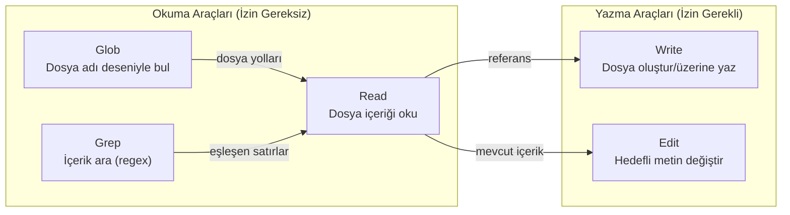
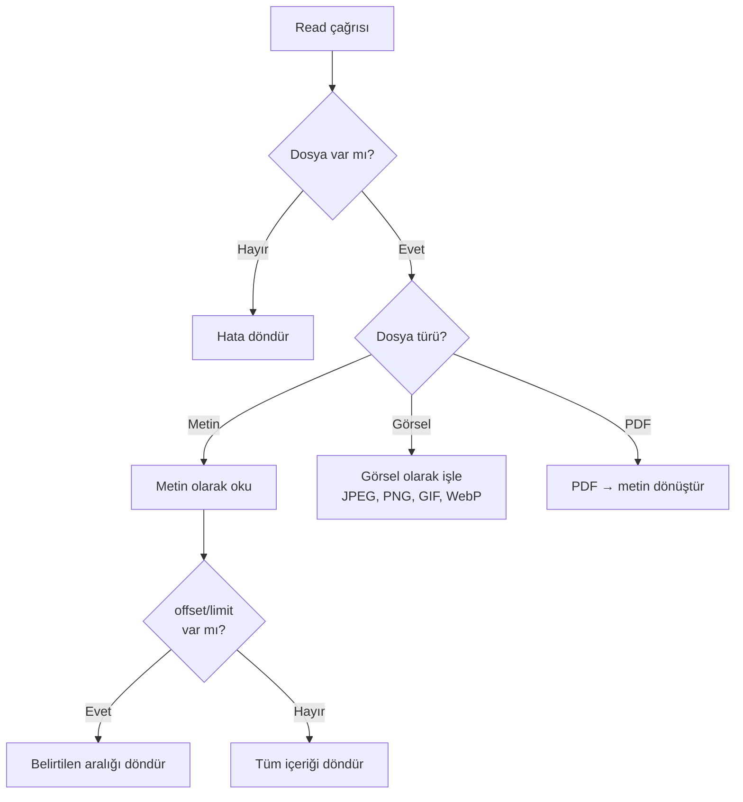
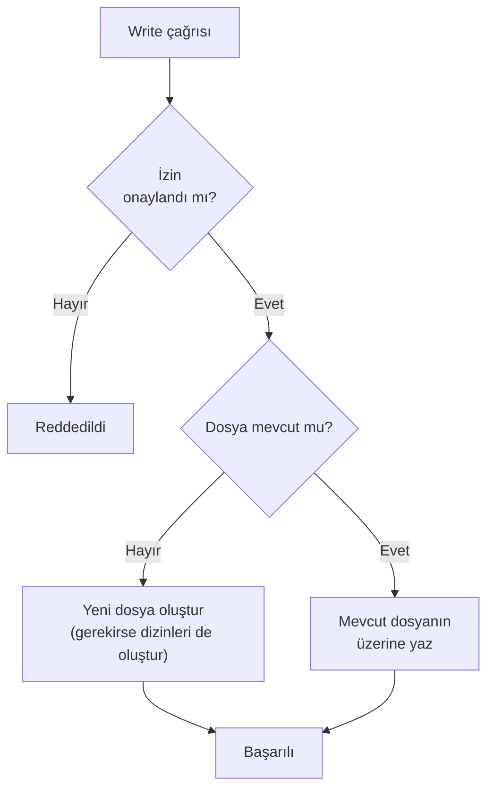
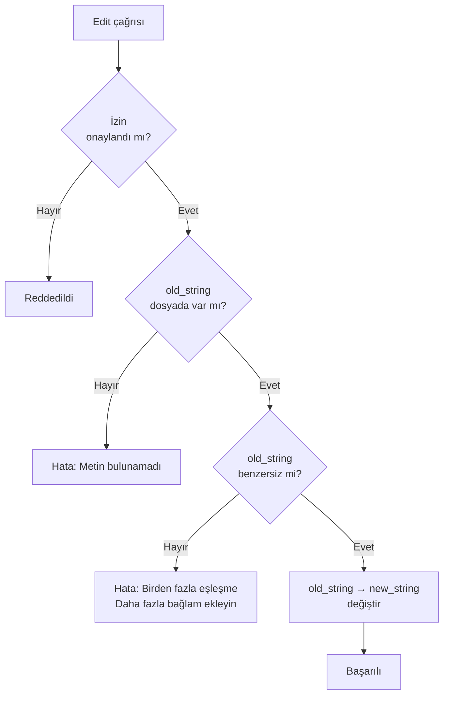
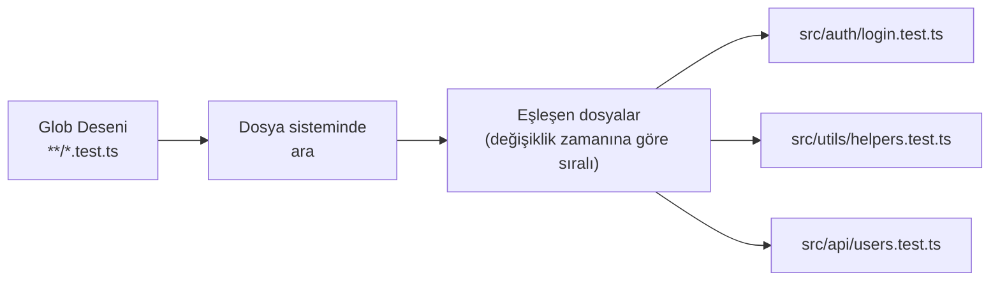
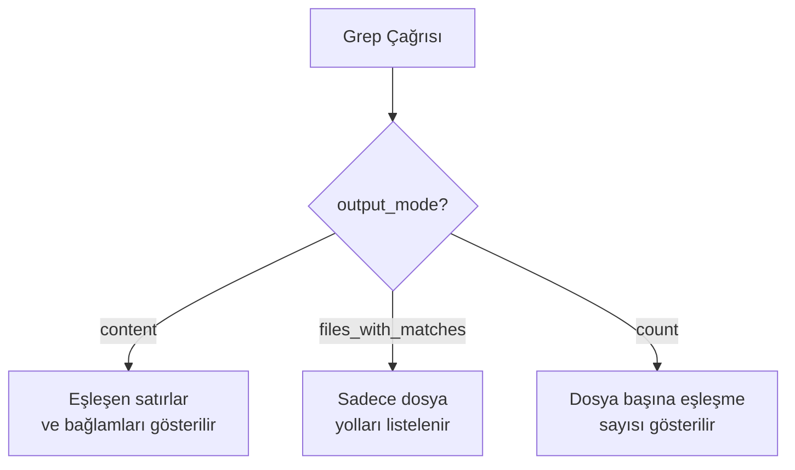
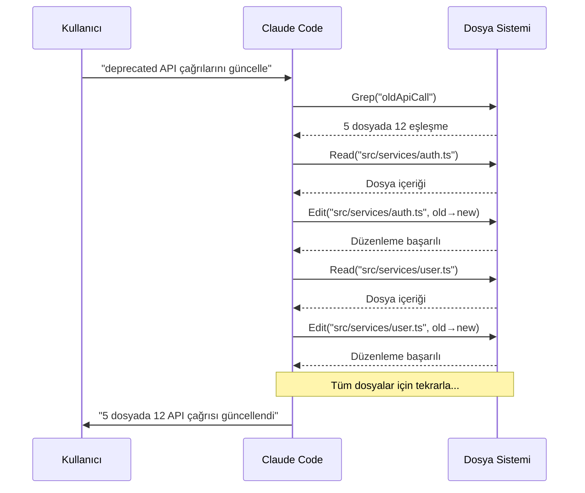

# Dosya İşlemleri

Claude Code'un en sık kullandığı araç grubu **dosya işlemleri**dir (file operations). Bu araçlar dosya okuma, yazma, düzenleme ve arama işlevlerini kapsar. Her biri farklı bir ihtiyaca yönelik optimize edilmiştir.

## Ön Koşullar

| Konu | Bölüm |
|------|-------|
| Araçlara genel bakış | [Araçlara Genel Bakış](./01-araclara-genel-bakis.md) |
| Temel terminal kullanımı | Harici kaynak |

---

## Dosya İşlem Araçları



---

## 1. Read — Dosya Okuma

**Read** aracı dosya içeriğini okur. Metin dosyalarının yanı sıra görselleri (JPEG, PNG, GIF, WebP) ve PDF'leri de destekler.

### Parametreler

| Parametre | Zorunlu | Açıklama |
|-----------|:-------:|----------|
| `file_path` | ✅ | Okunacak dosyanın yolu |
| `offset` | ❌ | Başlangıç satır numarası (1'den başlar, negatif değerler sondan sayar) |
| `limit` | ❌ | Okunacak satır sayısı |

### Read Akışı



### Pratik Örnekler

**Dosyanın tamamını okuma:**
```bash
> src/utils/helpers.ts dosyasını oku
```
```
# Claude Code dahili olarak şunu çağırır:
Read(file_path="src/utils/helpers.ts")
```

**Belirli satır aralığını okuma:**
```bash
> package.json dosyasının ilk 20 satırını göster
```
```
Read(file_path="package.json", offset=1, limit=20)
```

**Dosyanın son satırlarını okuma:**
```bash
> error.log dosyasının son 50 satırını göster
```
```
Read(file_path="error.log", offset=-50)
```

**Görsel dosyayı analiz etme:**
```bash
> screenshots/login-page.png dosyasını incele ve UI sorunlarını belirle
```
```
Read(file_path="screenshots/login-page.png")
# Claude görseli analiz eder ve yorumlar
```

**PDF okuma:**
```bash
> docs/api-spec.pdf dosyasındaki endpoint'leri listele
```
```
Read(file_path="docs/api-spec.pdf")
# PDF otomatik olarak metne dönüştürülür
```

---

## 2. Write — Dosya Yazma

**Write** aracı yeni dosya oluşturur veya mevcut bir dosyanın **tüm içeriğini** üzerine yazar. Kısmi düzenleme için Edit aracı tercih edilmelidir.

### Parametreler

| Parametre | Zorunlu | Açıklama |
|-----------|:-------:|----------|
| `file_path` | ✅ | Yazılacak dosyanın yolu |
| `content` | ✅ | Dosyaya yazılacak içerik |

> ⚠️ **Dikkat:** Write mevcut dosyayı tamamen üzerine yazar. Mevcut dosyada küçük değişiklikler için **Edit** aracını kullanın.

### Write Akışı



### Pratik Örnekler

**Yeni dosya oluşturma:**
```bash
> src/models/user.ts dosyasını oluştur, User interface'i ve temel CRUD fonksiyonlarını içersin
```
```
Write(file_path="src/models/user.ts", content="export interface User { ... }")
```

**Yapılandırma dosyası oluşturma:**
```bash
> .prettierrc dosyası oluştur: 2 space indent, semicolon yok, single quote
```
```
Write(file_path=".prettierrc", content='{ "tabWidth": 2, ... }')
```

**Test dosyası oluşturma:**
```bash
> src/utils/helpers.test.ts dosyasını oluştur ve helpers.ts'deki fonksiyonlar için testler yaz
```
```
Read("src/utils/helpers.ts") → Write("src/utils/helpers.test.ts", content="...")
```

---

## 3. Edit — Dosya Düzenleme

**Edit** aracı, dosyada hedefli metin değiştirme (targeted string replacement) yapar. Tüm dosyayı yeniden yazmak yerine sadece değişen kısmı günceller. `old_string` → `new_string` mantığıyla çalışır.

### Parametreler

| Parametre | Zorunlu | Açıklama |
|-----------|:-------:|----------|
| `file_path` | ✅ | Düzenlenecek dosyanın yolu |
| `old_string` | ✅ | Değiştirilecek mevcut metin (dosyada **benzersiz** olmalı) |
| `new_string` | ✅ | Yerine konacak yeni metin |

### Edit Kuralları



> 💡 **İpucu:** `old_string` benzersiz değilse, çevresine daha fazla bağlam satırı ekleyerek benzersiz hale getirin.

### Pratik Örnekler

**Fonksiyon adı değiştirme:**
```bash
> calculateTotal fonksiyonunun adını calculateOrderTotal olarak değiştir
```
```
Edit(
  file_path="src/utils/pricing.ts",
  old_string="function calculateTotal(items: Item[])",
  new_string="function calculateOrderTotal(items: Item[])"
)
```

**Hata düzeltme:**
```bash
> API URL'sindeki typo'yu düzelt
```
```
Edit(
  file_path="src/config.ts",
  old_string='const API_URL = "https://api.exmple.com"',
  new_string='const API_URL = "https://api.example.com"'
)
```

**İmport ekleme:**
```bash
> React Router'dan useNavigate hook'unu import et
```
```
Edit(
  file_path="src/pages/Login.tsx",
  old_string="import { useState } from 'react';",
  new_string="import { useState } from 'react';\nimport { useNavigate } from 'react-router-dom';"
)
```

**Kod bloğu değiştirme:**
```bash
> if-else yapısını early return pattern'ine çevir
```
```
Edit(
  file_path="src/auth/validate.ts",
  old_string="if (user) {\n  if (user.isActive) {\n    return true;\n  } else {\n    return false;\n  }\n} else {\n  return false;\n}",
  new_string="if (!user) return false;\nif (!user.isActive) return false;\nreturn true;"
)
```

---

## 4. Glob — Dosya Bulma

**Glob** aracı, dosya adı desenlerine (glob pattern) göre dosya arar. Proje yapısını keşfetmek ve belirli türdeki dosyaları bulmak için kullanılır.

### Parametreler

| Parametre | Zorunlu | Açıklama |
|-----------|:-------:|----------|
| `pattern` | ✅ | Glob deseni (`*.ts`, `**/*.test.js` vb.) |
| `path` | ❌ | Arama yapılacak dizin (varsayılan: proje kökü) |

### Glob Desenleri

| Desen | Eşleşme |
|-------|---------|
| `*.ts` | Kök dizindeki tüm `.ts` dosyaları |
| `**/*.ts` | Tüm alt dizinlerdeki `.ts` dosyaları |
| `src/**/*.test.ts` | `src/` altındaki tüm test dosyaları |
| `**/*.{js,ts}` | Tüm `.js` ve `.ts` dosyaları |
| `src/**/index.*` | `src/` altındaki tüm `index` dosyaları |
| `!**/node_modules/**` | `node_modules` hariç |



### Pratik Örnekler

**Tüm TypeScript dosyalarını bulma:**
```bash
> Projedeki tüm TypeScript dosyalarını listele
```
```
Glob(pattern="**/*.ts")
```

**Test dosyalarını bulma:**
```bash
> Tüm test dosyalarını bul
```
```
Glob(pattern="**/*.{test,spec}.{ts,tsx,js,jsx}")
```

**Belirli dizindeki dosyalar:**
```bash
> src/components altındaki tüm React komponentlerini bul
```
```
Glob(pattern="src/components/**/*.tsx")
```

**Yapılandırma dosyalarını bulma:**
```bash
> Projenin kök dizinindeki config dosyalarını listele
```
```
Glob(pattern="*.{json,yml,yaml,toml,ini,env}")
```

---

## 5. Grep — İçerik Arama

**Grep** aracı, dosya içeriklerinde regex (düzenli ifade) ile arama yapar. Arka planda **ripgrep** (`rg`) kullanır ve üç farklı çıktı modu destekler.

### Parametreler

| Parametre | Zorunlu | Açıklama |
|-----------|:-------:|----------|
| `pattern` | ✅ | Regex arama deseni |
| `path` | ❌ | Arama yapılacak dosya veya dizin |
| `include` | ❌ | Dosya filtresi (`*.ts`, `*.py` vb.) |
| `output_mode` | ❌ | `content` (varsayılan), `files_with_matches`, `count` |

### Çıktı Modları



| Mod | Açıklama | Kullanım Senaryosu |
|-----|----------|--------------------|
| `content` | Eşleşen satırlar + bağlam | Kod inceleme, belirli bir kullanımı anlama |
| `files_with_matches` | Sadece dosya yolları | Hangi dosyaların etkilendiğini bulma |
| `count` | Dosya başına eşleşme sayısı | Kullanım sıklığı analizi |

### Pratik Örnekler

**Fonksiyon kullanımını arama:**
```bash
> calculateTotal fonksiyonunun nerelerde kullanıldığını bul
```
```
Grep(pattern="calculateTotal", include="*.ts", output_mode="files_with_matches")
```

**Regex ile karmaşık arama:**
```bash
> console.log veya console.error içeren satırları bul
```
```
Grep(pattern="console\.(log|error)", include="*.{ts,tsx}")
```

**Belirli dizinde arama:**
```bash
> src/api dizininde "Authorization" header kullanan yerleri bul
```
```
Grep(pattern="Authorization", path="src/api", output_mode="content")
```

**Kullanım sayısı analizi:**
```bash
> useState hook'u hangi dosyalarda kaç kez kullanılıyor?
```
```
Grep(pattern="useState", include="*.tsx", output_mode="count")
```

**Çok satırlı arama:**
```bash
> async fonksiyonları ve içeriklerini bul
```
```
Grep(pattern="async function \\w+", include="*.ts", output_mode="content")
```

---

## Araçları Birlikte Kullanma

Gerçek dünyada bu araçlar genellikle bir zincir halinde birlikte kullanılır:



### Kombine Kullanım Örneği

```bash
> Projede kullanılmayan import'ları bul ve temizle
```

Araç zinciri:
```
1. Glob("**/*.ts") → TypeScript dosyalarını bul
2. Grep("^import", include="*.ts") → İmport satırlarını bul
3. Her dosya için:
   a. Read(dosya) → Tüm içeriği oku
   b. Kullanılmayan import'ları tespit et
   c. Edit(dosya, old→new) → Kullanılmayanları kaldır
```

---

## Özet

| Araç | İşlev | İzin | En İyi Kullanım |
|------|-------|:----:|-----------------|
| **Read** | Dosya oku | ❌ | Dosya içeriğini anlama, görsel/PDF analizi |
| **Write** | Dosya yaz | ✅ | Yeni dosya oluşturma, tam yeniden yazma |
| **Edit** | Metin değiştir | ✅ | Mevcut dosyada hedefli değişiklik |
| **Glob** | Dosya bul | ❌ | Proje yapısını keşfetme, dosya deseni arama |
| **Grep** | İçerik ara | ❌ | Kod içinde metin/regex arama |

---

## Sonraki Adım

Dosya işlemlerini öğrendik. Şimdi Claude Code'un komut çalıştırma aracı olan Bash'e geçelim:

→ [Kod Çalıştırma — Bash](./03-kod-calistirma-bash.md)
