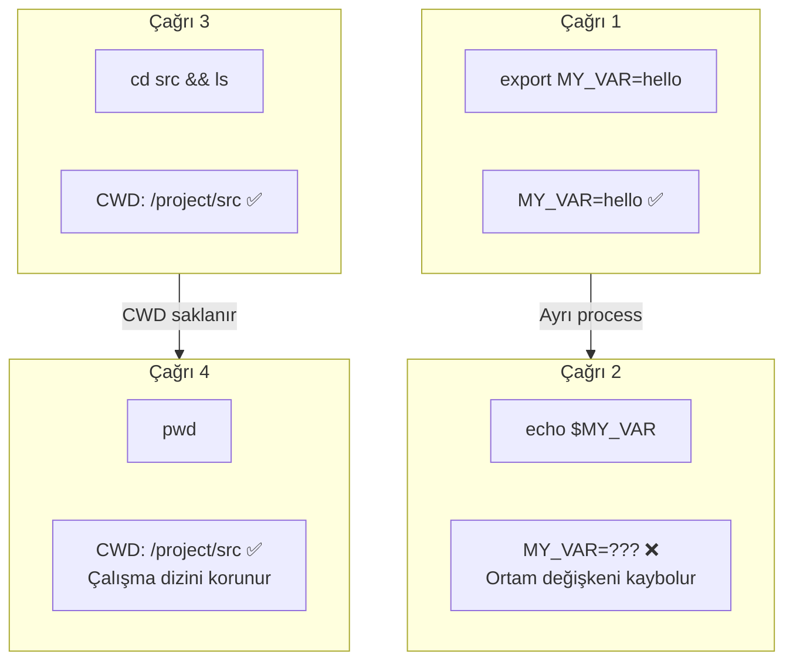
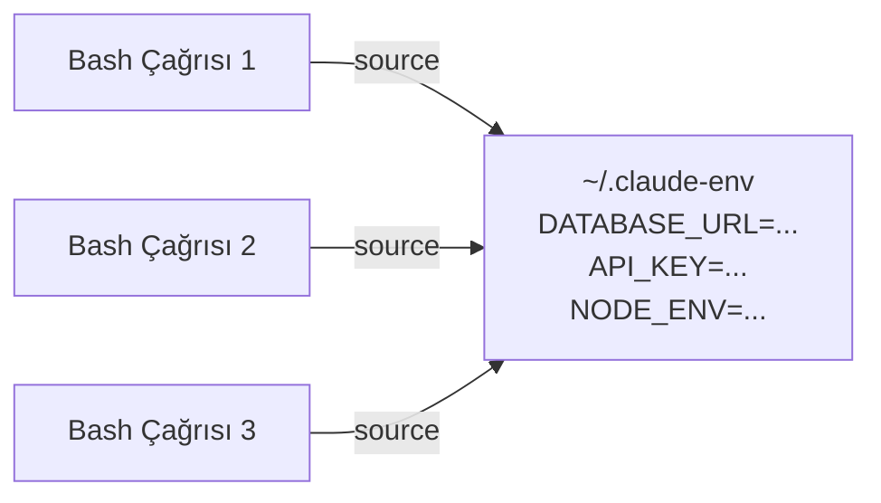
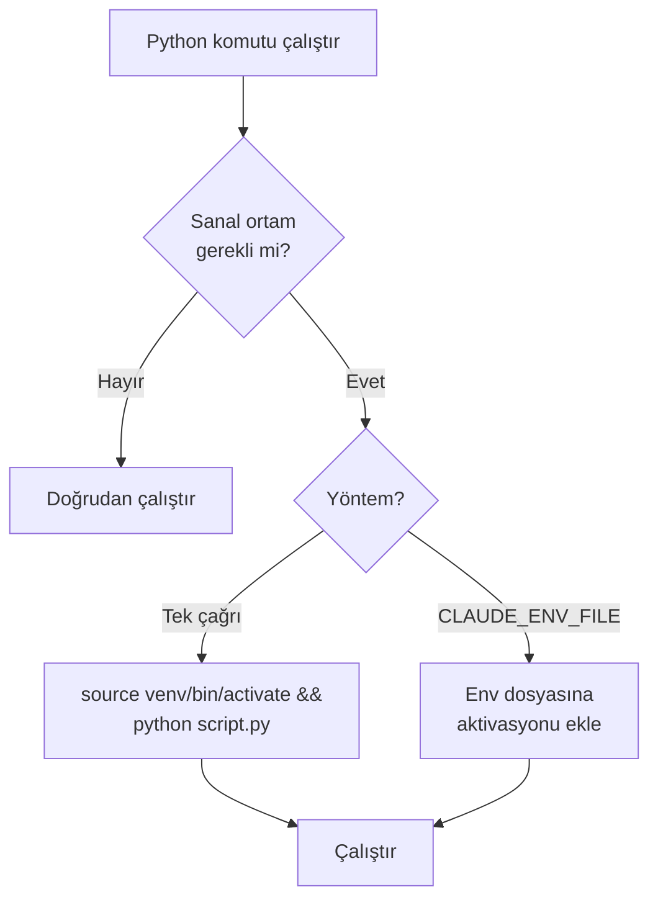
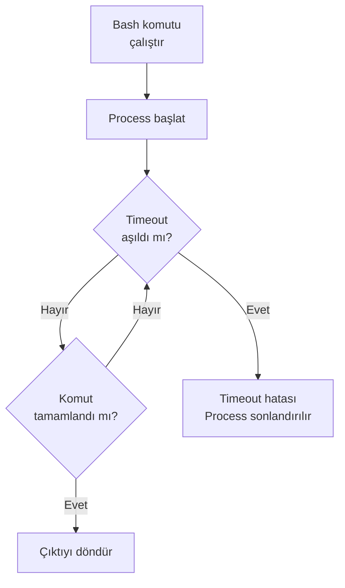

# Kod Çalıştırma — Bash

**Bash** aracı, Claude Code'un shell komutları çalıştırmasını sağlayan temel araçtır. Build işlemleri, test çalıştırma, git komutları, paket yönetimi ve diğer tüm terminal operasyonları bu araç üzerinden gerçekleştirilir.

## Ön Koşullar

| Konu | Bölüm |
|------|-------|
| Araçlara genel bakış | [Araçlara Genel Bakış](./01-araclara-genel-bakis.md) |
| Terminal / shell temel bilgisi | Harici kaynak |

---

## Bash Aracı Nasıl Çalışır?

Bash aracı her komut çağrısında **ayrı bir process** (süreç) oluşturur. Bu davranışın bazı önemli sonuçları vardır:



### Temel Davranışlar

| Davranış | Açıklama |
|----------|----------|
| **Process izolasyonu** | Her komut ayrı bir process'te çalışır |
| **Ortam değişkenleri** | Çağrılar arasında **kalıcı değildir** (`export` kaybedilir) |
| **Çalışma dizini** | Çağrılar arasında **kalıcıdır** (`cd` korunur) |
| **Timeout** | Uzun süren komutlar için timeout uygulanabilir |
| **İzin** | Her Bash çağrısı kullanıcı izni gerektirir |

---

## Ortam Değişkenleri ve Kalıcılık

Bash aracında ortam değişkenleri çağrılar arasında kaybolur. Bu sorunu çözmek için birkaç yöntem mevcuttur:

### Tek Çağrıda Birden Fazla Komut

```bash
# ✅ Doğru: Tek çağrıda zincirleme
export NODE_ENV=test && npm test

# ❌ Yanlış: Ayrı çağrılarda
# Çağrı 1: export NODE_ENV=test
# Çağrı 2: npm test  ← NODE_ENV burada tanımsız
```

### CLAUDE_ENV_FILE

`CLAUDE_ENV_FILE` ortam değişkeni, Claude Code'un her Bash çağrısından önce **source** yapacağı bir dosya belirtir:

```bash
# Terminal'de Claude Code başlatmadan önce:
export CLAUDE_ENV_FILE=~/.claude-env

# ~/.claude-env dosyası:
export DATABASE_URL="postgresql://localhost:5432/mydb"
export API_KEY="YOUR_API_KEY_HERE"
export NODE_ENV="development"
```



### CLAUDE_BASH_MAINTAIN_PROJECT_WORKING_DIR

Bu ortam değişkeni `1` olarak ayarlandığında, her Bash çağrısı proje kök dizininde başlar (varsayılan olarak son `cd` komutuyla değiştirilen dizini kullanır):

```bash
# Terminal'de Claude Code başlatmadan önce:
export CLAUDE_BASH_MAINTAIN_PROJECT_WORKING_DIR=1

# Artık her Bash çağrısı proje kök dizininde başlar
```

---

## Virtualenv ve Conda Aktivasyonu

Python projelerinde sanal ortam (virtual environment) aktivasyonu özel dikkat gerektirir:

### Virtualenv

```bash
# ✅ Doğru: Tek çağrıda aktivasyon + komut
source venv/bin/activate && python manage.py migrate

# ❌ Yanlış: Ayrı çağrılarda
# Çağrı 1: source venv/bin/activate
# Çağrı 2: python manage.py migrate  ← venv aktif değil
```

### Conda

```bash
# ✅ Doğru: Tek çağrıda
eval "$(conda shell.bash hook)" && conda activate myenv && python train.py

# Veya CLAUDE_ENV_FILE kullanarak:
# ~/.claude-env içinde:
eval "$(conda shell.bash hook)"
conda activate myenv
```



---

## Pratik Örnekler

### Örnek 1: Proje Kurulumu

```bash
> Bu Node.js projesini kur ve çalıştır
```

Claude Code'un çalıştırdığı komutlar:

```bash
# Bağımlılıkları yükle
npm install

# Ortam dosyasını kontrol et
cp .env.example .env

# Veritabanı migration'ları çalıştır
npx prisma migrate dev

# Geliştirme sunucusunu başlat
npm run dev
```

### Örnek 2: Test Çalıştırma ve Hata Düzeltme

```bash
> Testleri çalıştır, başarısız olanları düzelt
```

```bash
# Testleri çalıştır
npm test

# Çıktı: 3 test başarısız
# Claude Code hataları analiz eder, dosyaları düzenler, tekrar çalıştırır

npm test
# Çıktı: Tüm testler başarılı ✅
```

### Örnek 3: Git İşlemleri

```bash
> Yaptığım değişiklikleri commit'le ve push'la
```

```bash
# Değişiklikleri kontrol et
git status

# Değişiklikleri stage'le
git add -A

# Anlamlı commit mesajıyla commit et
git commit -m "feat: kullanıcı profil sayfası eklendi"

# Push et
git push origin feature/user-profile
```

### Örnek 4: Docker Operasyonları

```bash
> Docker container'ları oluştur ve çalıştır
```

```bash
# Container'ları oluştur
docker-compose build

# Arka planda çalıştır
docker-compose up -d

# Durumu kontrol et
docker-compose ps

# Log'ları kontrol et
docker-compose logs --tail=50 api
```

### Örnek 5: Performans Profilleme

```bash
> Bu Node.js uygulamasının başlangıç süresini ölç
```

```bash
# Başlangıç süresini ölç
time node -e "require('./dist/index.js')"

# Bundle boyutunu kontrol et
du -sh dist/

# Bağımlılık ağacını incele
npm ls --depth=0
```

---

## Timeout ve Uzun Süren Komutlar

Bash aracı, uzun süren komutlar için timeout mekanizması içerir:



### Uzun Süren Komutlar İçin İpuçları

```bash
# Arka planda çalıştırma
npm run build &

# Timeout ile çalıştırma
timeout 120 npm test

# İlerleme bilgisi olmayan komutlar için verbose mod
npm install --verbose
```

---

## Güvenlik Notları

| Konu | Açıklama |
|------|----------|
| **İzin sistemi** | Her Bash çağrısı kullanıcıdan onay gerektirir |
| **Tehlikeli komutlar** | `rm -rf /`, `sudo` gibi komutlar ekstra dikkat gerektirir |
| **Gizli bilgiler** | `CLAUDE_ENV_FILE` ile API key'leri güvenli şekilde yönetin |
| **Ağ erişimi** | Bash üzerinden yapılan ağ istekleri (`curl`, `wget`) izne tabidir |
| **Allowlist** | Sık kullanılan güvenli komutlar `settings.json`'da allowlist'e eklenebilir |

```bash
# settings.json'da güvenli komut allowlist örneği
# Bu komutlar izin istemeden çalışır:
# "allowedTools": ["Bash(npm test)", "Bash(npm run lint)", "Bash(git status)"]
```

---

## Özet

| Kavram | Açıklama |
|--------|----------|
| **Process izolasyonu** | Her çağrı ayrı process'te çalışır |
| **Env vars** | Çağrılar arası kalıcı değil; `CLAUDE_ENV_FILE` ile çözüm |
| **CWD** | Çalışma dizini çağrılar arası korunur |
| **Virtualenv/Conda** | Tek çağrıda aktivasyon + komut zinciri kullanın |
| **Timeout** | Uzun komutlar için timeout mekanizması mevcut |
| **İzin** | Her çağrı kullanıcı izni gerektirir |

---

## Sonraki Adım

Bash aracını öğrendik. Şimdi Claude Code'un web erişim araçlarına geçelim:

→ [Web Erişimi](./04-web-erisimi.md)
