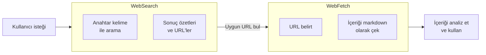
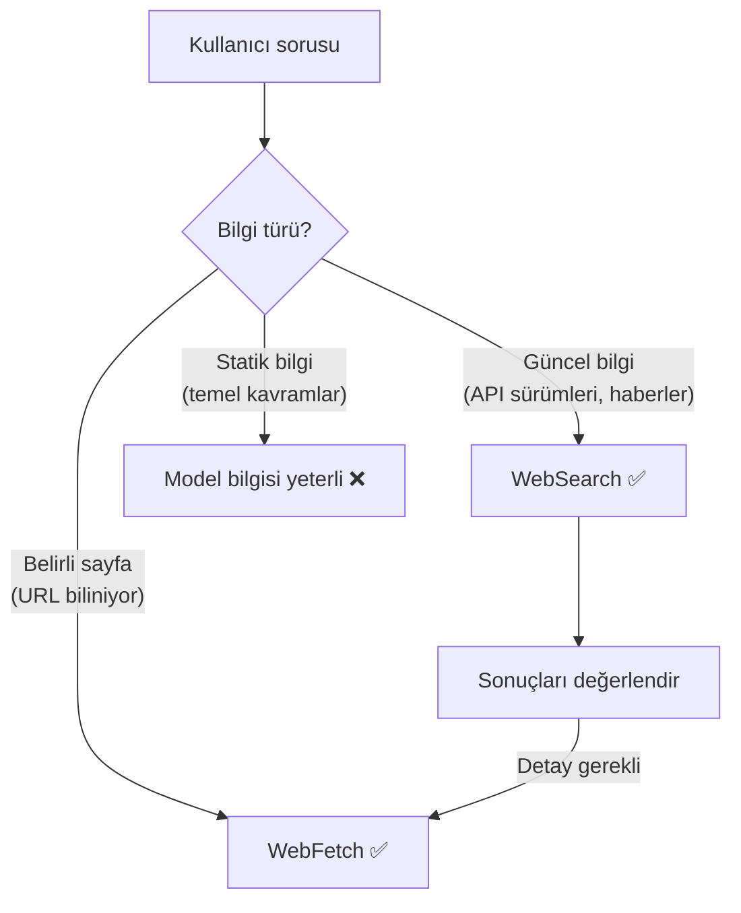
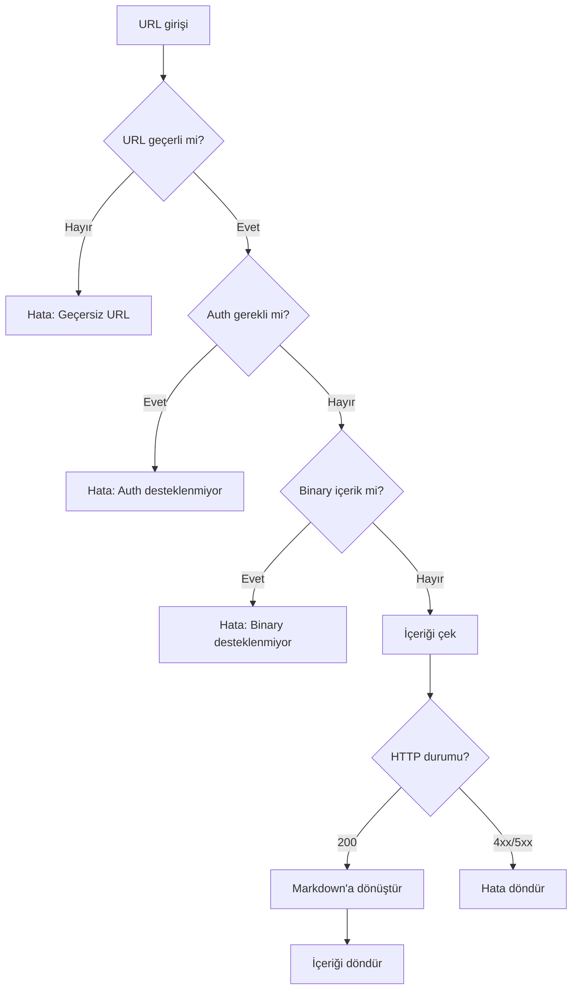
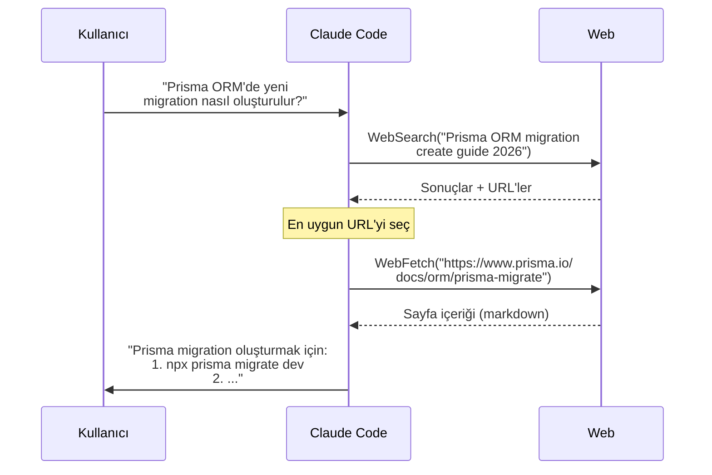

# Web Erişimi

Claude Code, **WebSearch** ve **WebFetch** araçlarıyla web'den gerçek zamanlı bilgi alabilir. Bu araçlar güncel dokümantasyonu kontrol etmek, API referanslarını okumak ve teknoloji haberlerini araştırmak için kullanılır.

## Ön Koşullar

| Konu | Bölüm |
|------|-------|
| Araçlara genel bakış | [Araçlara Genel Bakış](./01-araclara-genel-bakis.md) |
| Bash aracı | [Kod Çalıştırma — Bash](./03-kod-calistirma-bash.md) |

---

## Web Araçlarına Genel Bakış



| Araç | İşlev | İzin |
|------|-------|:----:|
| **WebSearch** | Web'de arama yaparak sonuç özetleri ve URL'ler döndürür | ✅ |
| **WebFetch** | Belirtilen URL'nin içeriğini markdown formatında çeker | ✅ |

---

## WebSearch — Web Araması

**WebSearch** aracı, web'de gerçek zamanlı arama yaparak özetlenmiş sonuçlar ve ilgili URL'ler döndürür.

### Parametreler

| Parametre | Zorunlu | Açıklama |
|-----------|:-------:|----------|
| `search_term` | ✅ | Arama terimi (spesifik ve anahtar kelime içerikli olmalı) |

### Ne Zaman Kullanılır?



### Pratik Örnekler

**Kütüphane dokümantasyonu arama:**
```bash
> Next.js 15'te Server Actions nasıl kullanılıyor?
```
```
WebSearch(search_term="Next.js 15 Server Actions usage guide 2026")
```

**Hata çözümü arama:**
```bash
> "TypeError: Cannot read properties of undefined" hatası React useEffect'te neden oluşuyor?
```
```
WebSearch(search_term="React useEffect TypeError Cannot read properties of undefined fix")
```

**Teknoloji karşılaştırması:**
```bash
> Bun vs Deno vs Node.js performans karşılaştırması
```
```
WebSearch(search_term="Bun vs Deno vs Node.js performance benchmark 2026")
```

**En güncel sürüm bilgisi:**
```bash
> TypeScript'in en son sürümü nedir ve yeni özellikler neler?
```
```
WebSearch(search_term="TypeScript latest version new features 2026")
```

**Paket arama:**
```bash
> React için en iyi form validation kütüphanesi hangisi?
```
```
WebSearch(search_term="best React form validation library 2026 comparison")
```

---

## WebFetch — URL İçeriği Çekme

**WebFetch** aracı, belirtilen bir URL'nin içeriğini alır ve okunabilir markdown formatına dönüştürür.

### Parametreler

| Parametre | Zorunlu | Açıklama |
|-----------|:-------:|----------|
| `url` | ✅ | Çekilecek URL (tam ve geçerli olmalı) |

### Sınırlamalar

| Sınırlama | Açıklama |
|-----------|----------|
| **Kimlik doğrulama yok** | Auth gerektiren sayfaları çekemez |
| **Binary desteklenmez** | Görsel, video, PDF gibi binary içerikler çekilemez |
| **localhost erişim yok** | `localhost` veya özel IP adreslerine erişemez |
| **Non-200 hata** | 404, 500 gibi hata döndüren URL'ler içerik getirmez |
| **Önbellek** | Canlı sonuç dönmeye çalışır ancak önbellek kullanabilir |



### Pratik Örnekler

**API dokümantasyonu okuma:**
```bash
> Stripe API'nin payment intents dokümantasyonunu oku
```
```
WebFetch(url="https://docs.stripe.com/api/payment_intents")
```

**GitHub README okuma:**
```bash
> shadcn/ui projesinin README dosyasını oku
```
```
WebFetch(url="https://github.com/shadcn-ui/ui/blob/main/README.md")
```

**Paket detaylarını kontrol etme:**
```bash
> zod kütüphanesinin npm sayfasını kontrol et
```
```
WebFetch(url="https://www.npmjs.com/package/zod")
```

**Blog yazısı/makale okuma:**
```bash
> Bu makaledeki best practice'leri özetle
```
```
WebFetch(url="https://blog.example.com/react-performance-tips")
```

---

## WebSearch + WebFetch Birlikte Kullanımı

En güçlü kullanım, iki aracın birlikte zincirlenmesidir:



### Kombine Kullanım Örnekleri

**Örnek 1: Güncel sürüm bilgisiyle proje güncelleme**
```bash
> React Router'ın en son sürümüne güncelle ve breaking change'leri uygula
```
```
1. WebSearch("React Router latest version breaking changes 2026")
2. WebFetch("https://reactrouter.com/upgrading/v6-to-v7")  
3. Read("package.json")
4. Bash("npm install react-router@latest")
5. Grep("react-router") → etkilenen dosyaları bul
6. Edit(her dosyada gerekli değişiklikleri yap)
```

**Örnek 2: Bilinmeyen hata çözümü**
```bash
> "ENOSPC: System limit for number of file watchers reached" hatasını çöz
```
```
1. WebSearch("ENOSPC System limit file watchers reached fix Linux")
2. WebFetch(çözüm sayfası URL'si)
3. Bash("cat /proc/sys/fs/inotify/max_user_watches")
4. Bash("echo 'fs.inotify.max_user_watches=524288' | sudo tee -a /etc/sysctl.conf")
5. Bash("sudo sysctl -p")
```

**Örnek 3: API entegrasyonu**
```bash
> Projemize OpenWeatherMap API entegrasyonu ekle
```
```
1. WebSearch("OpenWeatherMap API documentation current weather")
2. WebFetch("https://openweathermap.org/current")
3. Write("src/services/weather.ts", API client kodu)
4. Write("src/services/weather.test.ts", test dosyası)
5. Bash("npm test")
```

---

## En İyi Uygulamalar

| Uygulama | Açıklama |
|----------|----------|
| **Spesifik arama** | `"React hook"` yerine `"React useCallback memoization guide 2026"` |
| **Yıl ekleyin** | Güncel sonuçlar için arama terimine yılı ekleyin |
| **Sürüm belirtin** | `"Next.js 15 app router"` gibi sürüm numarası ekleyin |
| **İngilizce arama** | Teknik konularda İngilizce arama terimi daha iyi sonuç verir |
| **Resmi kaynakları tercih edin** | WebFetch ile resmi dokümantasyon URL'lerini tercih edin |
| **Önce arama, sonra fetch** | Doğru URL'yi bulmak için önce WebSearch kullanın |

---

## Özet

| Araç | İşlev | Giriş | Çıkış |
|------|-------|-------|-------|
| **WebSearch** | Web araması | Arama terimi | Özetler + URL'ler |
| **WebFetch** | URL içerik çekme | Tam URL | Markdown içerik |

---

## Sonraki Adım

Web araçlarını öğrendik. Şimdi Claude Code'un paralel görev yönetimi sistemine geçelim:

→ [Görev Yönetimi](./05-gorev-yonetimi.md)
