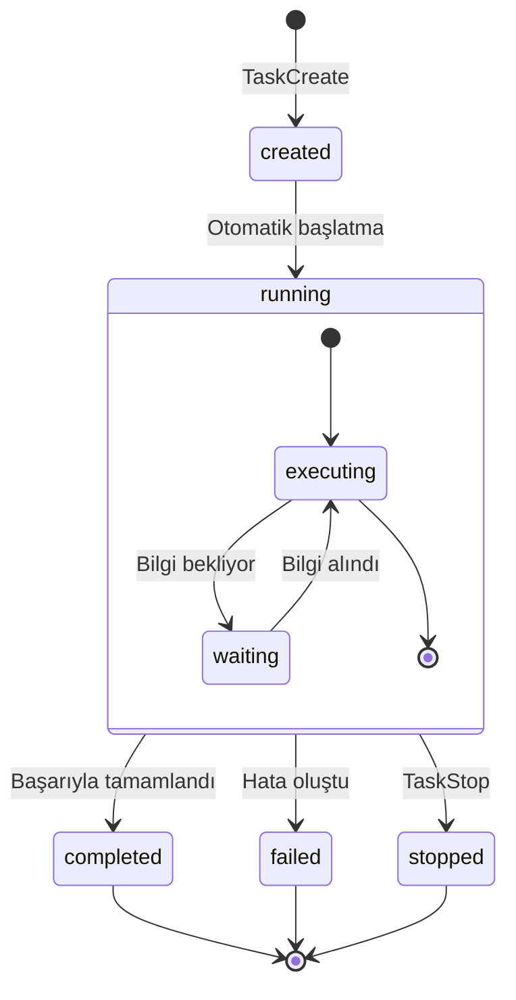
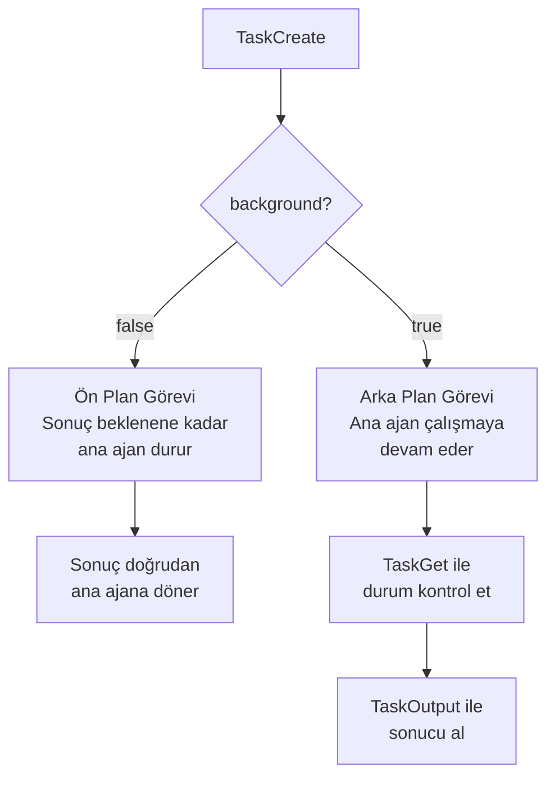
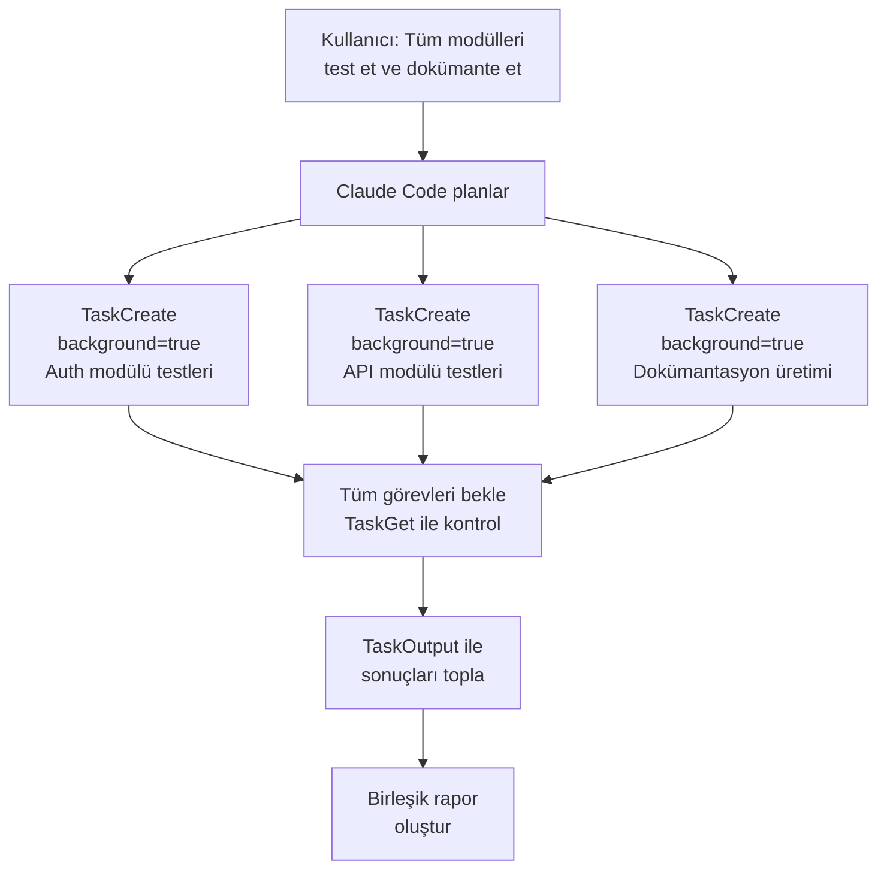
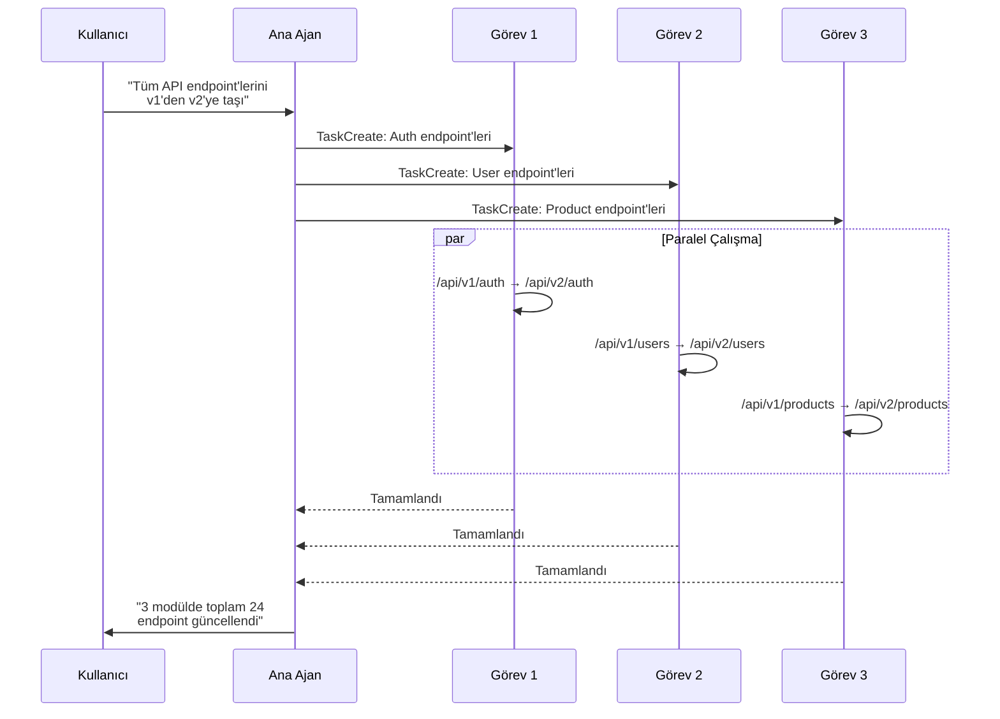

# Görev Yönetimi

Claude Code, karmaşık işleri paralel olarak yürütmek için **Task** (görev) araçlarını sunar. Bu araçlarla birden fazla alt ajan (sub-agent) oluşturabilir, arka planda çalıştırabilir, durumlarını izleyebilir ve sonuçlarını toplayabilirsiniz.

## Ön Koşullar

| Konu | Bölüm |
|------|-------|
| Araçlara genel bakış | [Araçlara Genel Bakış](./01-araclara-genel-bakis.md) |
| Agentic loop kavramı | [Claude Code Nasıl Çalışır?](../06-claude-code-tanitim/02-claude-code-nasil-calisir.md) |

---

## Task Araçları

Claude Code altı adet görev yönetimi aracı sunar:

| Araç | İşlev | İzin |
|------|-------|:----:|
| **TaskCreate** | Yeni görev/alt ajan oluşturma | ❌ |
| **TaskGet** | Görev durumunu sorgulama | ❌ |
| **TaskList** | Tüm görevleri listeleme | ❌ |
| **TaskUpdate** | Mevcut görevi güncelleme/silme | ❌ |
| **TaskStop** | Çalışan görevi durdurma | ❌ |
| **TaskOutput** | Arka plan görevinin çıktısını alma | ❌ |

> 💡 Tüm Task araçları izin gerektirmez — bunlar Claude Code'un kendi iç koordinasyon mekanizmasıdır.

---

## Görev Yaşam Döngüsü



---

## TaskCreate — Görev Oluşturma

**TaskCreate** yeni bir alt ajan başlatır. Bu alt ajan, ana ajandan bağımsız olarak çalışabilir.

### Parametreler

| Parametre | Zorunlu | Açıklama |
|-----------|:-------:|----------|
| `prompt` | ✅ | Görevin açıklaması (ne yapılacağı) |
| `background` | ❌ | `true` ise görev arka planda çalışır |

### Ön Plan vs Arka Plan



### Pratik Örnekler

**Ön plan görevi:**
```bash
> src/utils dizinindeki tüm fonksiyonlar için JSDoc yorumu ekle
```
```
TaskCreate(
  prompt="src/utils dizinindeki tüm .ts dosyalarını oku ve 
          her exported fonksiyon için JSDoc yorumu ekle",
  background=false
)
```

**Arka plan görevi:**
```bash
> Testleri arka planda çalıştırırken ben kodlamaya devam edeyim
```
```
TaskCreate(
  prompt="npm test komutunu çalıştır ve sonuçları raporla",
  background=true
)
# → task_id: "task_abc123" döner
# Ana ajan çalışmaya devam eder
```

---

## TaskGet — Görev Durumu Sorgulama

Çalışan veya tamamlanmış bir görevin durumunu sorgular.

### Parametreler

| Parametre | Zorunlu | Açıklama |
|-----------|:-------:|----------|
| `task_id` | ✅ | Sorgulanacak görevin ID'si |

### Dönen Durumlar

| Durum | Açıklama |
|-------|----------|
| `running` | Görev hâlâ çalışıyor |
| `completed` | Görev başarıyla tamamlandı |
| `failed` | Görev hata ile sonlandı |
| `stopped` | Görev kullanıcı/sistem tarafından durduruldu |

```bash
# Görev durumunu kontrol et
TaskGet(task_id="task_abc123")
# → { status: "running", progress: "3/5 dosya işlendi" }
```

---

## TaskList — Tüm Görevleri Listeleme

Oturumdaki tüm görevlerin listesini döndürür.

```bash
TaskList()
# → [
#   { id: "task_abc123", status: "running", prompt: "testleri çalıştır..." },
#   { id: "task_def456", status: "completed", prompt: "dokümantasyon oluştur..." },
#   { id: "task_ghi789", status: "failed", prompt: "migration çalıştır..." }
# ]
```

---

## TaskUpdate — Görev Güncelleme

Mevcut bir görevin prompt'unu veya parametrelerini günceller ya da görevi siler.

### Parametreler

| Parametre | Zorunlu | Açıklama |
|-----------|:-------:|----------|
| `task_id` | ✅ | Güncellenecek görevin ID'si |
| `prompt` | ❌ | Yeni görev açıklaması |
| `delete` | ❌ | `true` ise görevi siler |

---

## TaskStop — Görevi Durdurma

Çalışan bir görevi zorla durdurur.

### Parametreler

| Parametre | Zorunlu | Açıklama |
|-----------|:-------:|----------|
| `task_id` | ✅ | Durdurulacak görevin ID'si |

```bash
# Uzun süren görevi durdur
TaskStop(task_id="task_abc123")
# → { status: "stopped" }
```

---

## TaskOutput — Görev Çıktısı Alma

Arka planda tamamlanmış bir görevin çıktısını alır.

### Parametreler

| Parametre | Zorunlu | Açıklama |
|-----------|:-------:|----------|
| `task_id` | ✅ | Çıktısı alınacak görevin ID'si |

```bash
# Tamamlanan görevin sonucunu al
TaskOutput(task_id="task_abc123")
# → "Tüm testler başarıyla çalıştı. 45 test, 0 hata."
```

---

## Paralel Görev Yürütme

Task araçlarının en güçlü özelliği **paralel yürütme** (parallel execution) desteğidir. Birden fazla bağımsız görevi aynı anda çalıştırabilirsiniz:



### Paralel Görev Örneği

```bash
> Backend'deki 3 servis modülünü aynı anda test et
```

Claude Code'un iç akışı:
```
# 3 arka plan görevi oluştur
task1 = TaskCreate(prompt="auth servisini test et: npm test -- --grep auth", background=true)
task2 = TaskCreate(prompt="user servisini test et: npm test -- --grep user", background=true)
task3 = TaskCreate(prompt="payment servisini test et: npm test -- --grep payment", background=true)

# Durumları kontrol et
TaskGet(task1.id)  → running
TaskGet(task2.id)  → completed
TaskGet(task3.id)  → running

# Tamamlananların sonuçlarını al
TaskOutput(task2.id) → "User servisi: 12 test başarılı"

# Tümü tamamlandığında birleştir
TaskOutput(task1.id) → "Auth servisi: 8 test başarılı"
TaskOutput(task3.id) → "Payment servisi: 5 test başarılı, 1 başarısız"
```

---

## Gerçek Dünya Kullanım Senaryoları

### Senaryo 1: Büyük Ölçekli Refactoring



### Senaryo 2: Multi-Platform Build

```bash
> Projeyi tüm platformlar için derle ve her birinin durumunu raporla
```
```
task_web = TaskCreate(prompt="npm run build:web çalıştır", background=true)
task_ios = TaskCreate(prompt="npm run build:ios çalıştır", background=true)
task_android = TaskCreate(prompt="npm run build:android çalıştır", background=true)

# Sonuçları topla ve raporla
```

### Senaryo 3: Kod Analizi

```bash
> Projenin güvenlik, performans ve erişilebilirlik analizini yap
```
```
task_sec = TaskCreate(prompt="güvenlik açıklarını tara", background=true)
task_perf = TaskCreate(prompt="performans sorunlarını analiz et", background=true)
task_a11y = TaskCreate(prompt="erişilebilirlik sorunlarını kontrol et", background=true)

# Her biri bağımsız olarak çalışır, sonuçlar birleştirilir
```

---

## Özet

| Araç | İşlev | Kullanım |
|------|-------|----------|
| **TaskCreate** | Yeni görev başlat | Paralel iş, arka plan görevi |
| **TaskGet** | Durum sorgula | Görev izleme |
| **TaskList** | Tüm görevleri listele | Genel bakış |
| **TaskUpdate** | Görev güncelle/sil | Değişiklik, temizlik |
| **TaskStop** | Görevi durdur | İptal, timeout |
| **TaskOutput** | Çıktı al | Sonuç toplama |

---

## Sonraki Adım

Görev yönetimini öğrendik. Şimdi zamanlanmış görevler ve tekrarlayan işlem araçlarına geçelim:

→ [Zamanlanmış Görevler](./06-zamanlanmis-gorevler.md)
