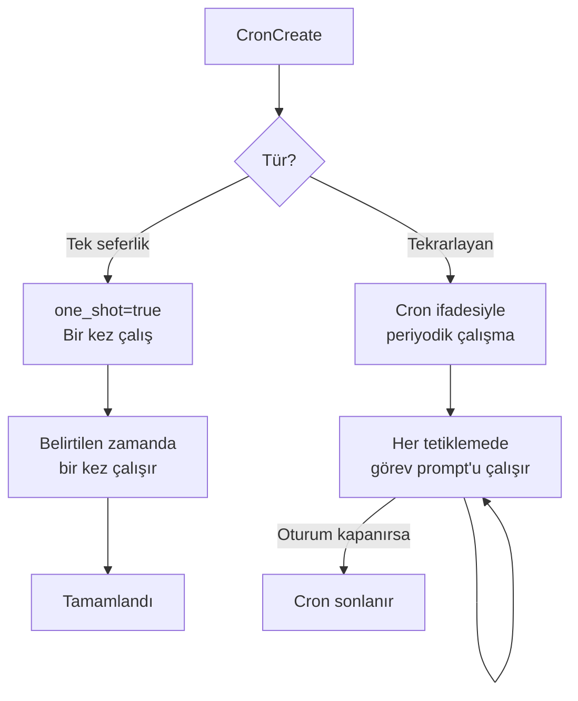
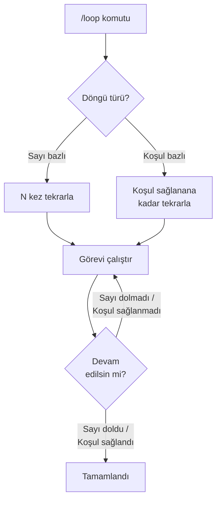
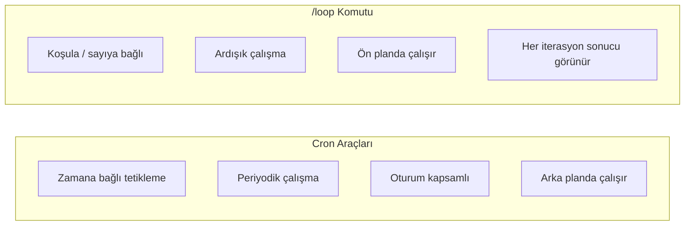

# Zamanlanmış Görevler

Claude Code, belirli aralıklarla veya tek seferlik olarak çalışacak görevler tanımlamanızı sağlayan **Cron** araçlarını ve tekrarlayan işlemler için **/loop** skill'ini sunar. Bu mekanizmalar durum izleme, periyodik kontroller ve otomatik hatırlatmalar için kullanılır.

> **Önemli Ayrım — Cron (araç) vs /loop (skill):**
>
> - **Cron araçları** (CronCreate, CronDelete, CronList) birer **dahili araçtır.** Terminalde `/cron` veya `/CronCreate` şeklinde yazarak kullanamazsınız. Bu araçları Claude Code, siz doğal dilde "her 10 dakikada testleri çalıştır" gibi bir görev verdiğinizde **kendi kararıyla arka planda** çağırır.
> - **/loop** ise bir **skill**'dir ve doğrudan `/loop` yazarak çağırabilirsiniz. Skill'ler, kullanıcının `/` ile tetikleyebildiği komutlardır; araçlar ise Claude Code'un otomatik olarak kullandığı dahili mekanizmalardır.

## Ön Koşullar

| Konu | Bölüm |
|------|-------|
| Araçlara genel bakış | [Araçlara Genel Bakış](./01-araclara-genel-bakis.md) |
| Görev yönetimi | [Görev Yönetimi](./05-gorev-yonetimi.md) |

---

## Cron Araçları

Claude Code üç adet Cron aracı sunar:

| Araç | İşlev | İzin |
|------|-------|:----:|
| **CronCreate** | Zamanlanmış görev oluşturma (tekrarlayan veya tek seferlik) | ❌ |
| **CronDelete** | Zamanlanmış görevi silme | ❌ |
| **CronList** | Mevcut zamanlanmış görevleri listeleme | ❌ |

> ⚠️ **Önemli:** Cron görevleri **session-scoped**'tır (oturum kapsamlı) — Claude Code oturumu kapandığında tüm zamanlanmış görevler de sona erer.

---

## CronCreate — Zamanlanmış Görev Oluşturma

### Parametreler

| Parametre | Zorunlu | Açıklama |
|-----------|:-------:|----------|
| `schedule` | ✅ | Cron ifadesi (`*/5 * * * *`) veya tek seferlik zaman |
| `prompt` | ✅ | Çalıştırılacak görevin açıklaması |
| `one_shot` | ❌ | `true` ise sadece bir kez çalışır |

### Cron İfade Sözdizimi

```
┌───────────── dakika (0 - 59)
│ ┌───────────── saat (0 - 23)
│ │ ┌───────────── ayın günü (1 - 31)
│ │ │ ┌───────────── ay (1 - 12)
│ │ │ │ ┌───────────── haftanın günü (0 - 7, 0 ve 7 = Pazar)
│ │ │ │ │
* * * * *
```

### Yaygın Cron İfadeleri

| İfade | Açıklama |
|-------|----------|
| `*/5 * * * *` | Her 5 dakikada bir |
| `*/15 * * * *` | Her 15 dakikada bir |
| `0 * * * *` | Her saat başı |
| `0 */2 * * *` | Her 2 saatte bir |
| `30 9 * * *` | Her gün saat 09:30'da |
| `0 9 * * 1-5` | Hafta içi her gün saat 09:00'da |



### Pratik Örnekler

**Her 10 dakikada test durumu kontrolü:**
```bash
> Her 10 dakikada testleri çalıştır ve başarısız olanları raporla
```
```
CronCreate(
  schedule="*/10 * * * *",
  prompt="npm test komutunu çalıştır. Başarısız testler varsa 
          hangi dosyada hangi test'in neden başarısız olduğunu raporla."
)
```

**Periyodik build kontrolü:**
```bash
> Her 30 dakikada projenin derlenip derlenmediğini kontrol et
```
```
CronCreate(
  schedule="*/30 * * * *",
  prompt="npm run build çalıştır. Hata varsa detaylı raporla."
)
```

**Tek seferlik hatırlatma:**
```bash
> 15 dakika sonra bana PR review yapmam gerektiğini hatırlat
```
```
CronCreate(
  schedule="15 dakika sonra",
  prompt="Kullanıcıya PR #42'yi review etmesi gerektiğini hatırlat.",
  one_shot=true
)
```

---

## CronDelete — Zamanlanmış Görevi Silme

### Parametreler

| Parametre | Zorunlu | Açıklama |
|-----------|:-------:|----------|
| `cron_id` | ✅ | Silinecek cron görevinin ID'si |

```bash
# Zamanlanmış görevi sil
CronDelete(cron_id="cron_abc123")
```

---

## CronList — Zamanlanmış Görevleri Listeleme

Mevcut oturumdaki tüm aktif cron görevlerini listeler.

```bash
CronList()
# → [
#   { id: "cron_abc", schedule: "*/10 * * * *", prompt: "testleri çalıştır...", 
#     next_run: "2026-03-15T14:30:00Z" },
#   { id: "cron_def", schedule: "*/30 * * * *", prompt: "build kontrol...",
#     next_run: "2026-03-15T14:30:00Z" }
# ]
```

---

## /loop Komutu — Tekrarlayan Yürütme

**/loop** komutu, belirli bir koşul sağlanana kadar veya belirli sayıda tekrar için bir işlemi döngüsel olarak çalıştırır. Cron'dan farklı olarak zamana değil **koşula** veya **sayıya** bağlıdır.



### /loop Kullanım Örnekleri

**Hata düzelene kadar tekrarla:**
```bash
> /loop testler geçene kadar: lint hatalarını düzelt ve testleri çalıştır
```

**Belirli sayıda tekrarlama:**
```bash
> /loop 5: her iterasyonda bir sonraki TODO item'ı tamamla
```

**Dosya izleme:**
```bash
> /loop dist/bundle.js 500KB'ın altına düşene kadar: gereksiz import'ları temizle ve build et
```

---

## Cron vs /loop Karşılaştırması



| Özellik | Cron | /loop |
|---------|------|-------|
| **Tetikleme** | Zaman bazlı | Koşul/sayı bazlı |
| **Çalışma modu** | Arka plan | Ön plan |
| **Kullanım** | Periyodik kontroller | İteratif düzeltme |
| **Süre sınırı** | Oturum boyunca | Koşul sağlanana kadar |
| **İptal** | CronDelete | `Ctrl+C` |

---

## Gerçek Dünya Senaryoları

### Senaryo 1: CI/CD İzleme

```bash
> GitHub Actions'daki deploy pipeline'ını izle, başarısız olursa haber ver
```
```
CronCreate(
  schedule="*/5 * * * *",
  prompt="gh run list --limit 1 komutunu çalıştır. 
          En son workflow run başarısız olduysa detaylarını raporla."
)
```

### Senaryo 2: Dosya Değişikliği İzleme

```bash
> Her 15 dakikada config dosyalarında değişiklik olup olmadığını kontrol et
```
```
CronCreate(
  schedule="*/15 * * * *",
  prompt="git diff --name-only HEAD~1 çalıştır. 
          *.config.* veya *.env* dosyalarında değişiklik varsa raporla."
)
```

### Senaryo 3: Sağlık Kontrolü

```bash
> Her 5 dakikada API sağlık kontrolü yap
```
```
CronCreate(
  schedule="*/5 * * * *",
  prompt="curl -s http://localhost:3000/health çalıştır.
          HTTP 200 dönmezse veya yanıt süresi 2 saniyeyi aşarsa uyar."
)
```

### Senaryo 4: İteratif Hata Düzeltme (/loop)

```bash
> Tüm TypeScript hataları düzelene kadar çalış
```
```
/loop npx tsc --noEmit hata vermeyene kadar: 
  tip hatalarını oku, düzelt, tekrar kontrol et
```

---

## Özet

| Araç/Komut | İşlev | Tetikleme | Kapsam |
|------------|-------|-----------|--------|
| **CronCreate** | Zamanlanmış görev oluştur | Zaman (cron ifadesi) | Oturum |
| **CronDelete** | Zamanlanmış görevi sil | Manuel | — |
| **CronList** | Görevleri listele | Manuel | — |
| **/loop** | Tekrarlayan yürütme | Koşul/sayı | Ön plan |

---

## Sonraki Adım

Zamanlanmış görevleri öğrendik. Şimdi Claude Code'un kod zekası aracı olan LSP'ye geçelim:

→ [Kod Zekası — LSP](./07-kod-zekasi-lsp.md)
