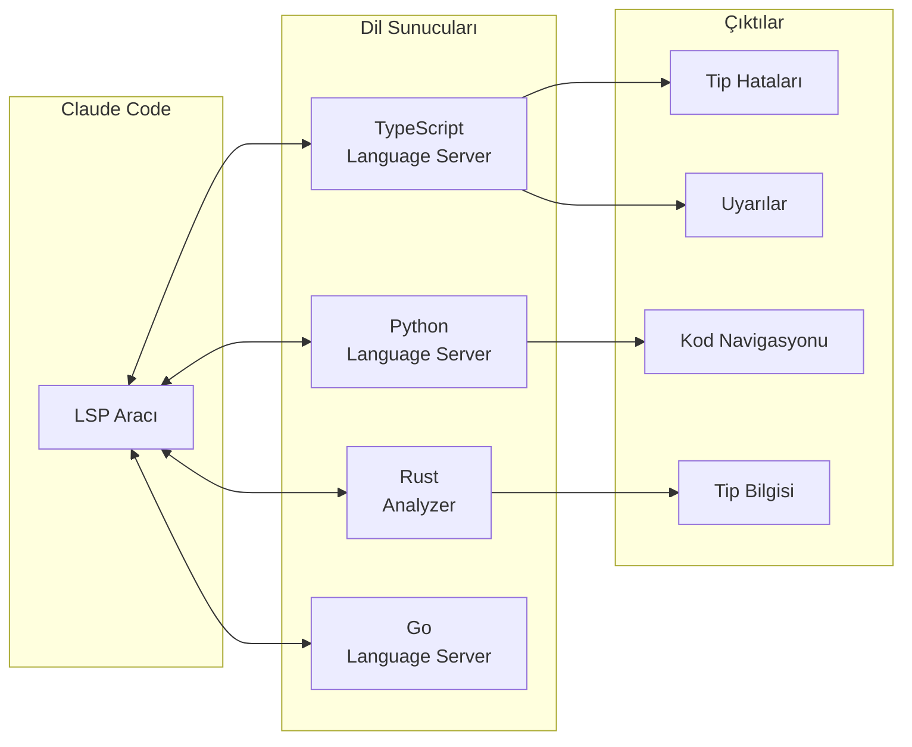
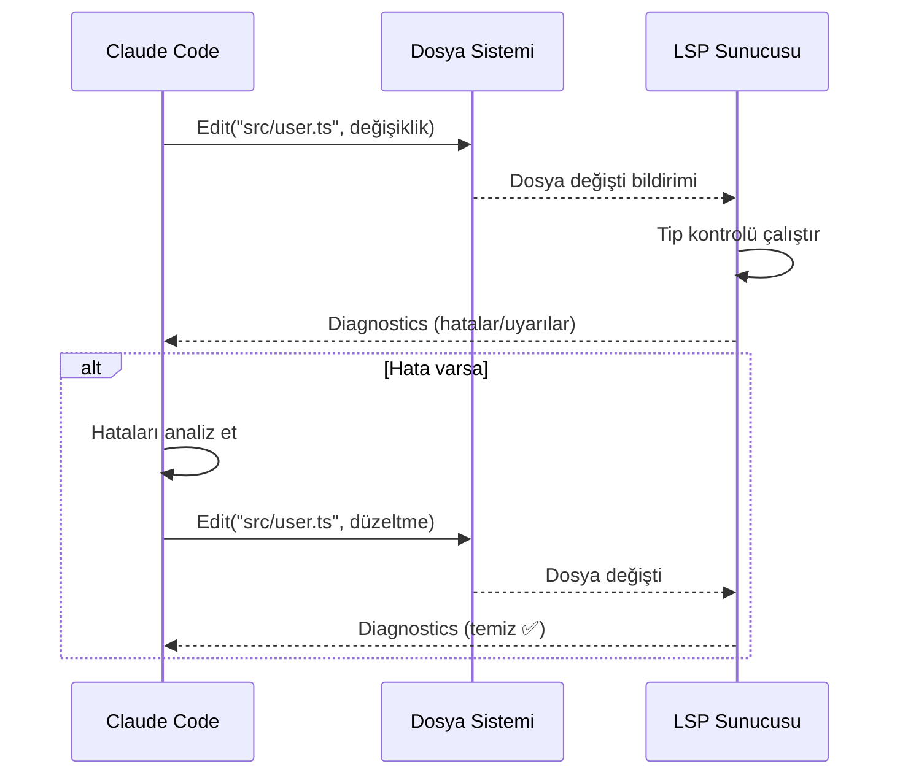
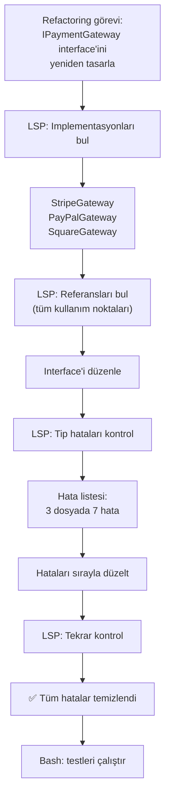

# Kod Zekası — LSP

**LSP** (Language Server Protocol) aracı, Claude Code'a dil sunucusu yetenekleri kazandırır. Dosya düzenlemelerinden sonra otomatik olarak tip hatalarını ve uyarıları raporlar; tanıma gitme, referans bulma, sembol listeleme gibi kod navigasyonu işlevlerini sunar.

## Ön Koşullar

| Konu | Bölüm |
|------|-------|
| Araçlara genel bakış | [Araçlara Genel Bakış](./01-araclara-genel-bakis.md) |
| Dosya işlemleri | [Dosya İşlemleri](./02-dosya-islemleri.md) |
| Code intelligence plugin kurulu olmalıdır | Harici kaynak |

---

## LSP Nedir?

**Language Server Protocol** (Dil Sunucusu Protokolü), editörler ile dil sunucuları arasında standart bir iletişim protokolüdür. Claude Code, bu protokolü kullanarak kodunuz hakkında **anlamsal bilgi** (semantic information) elde eder.



> ⚠️ **Not:** LSP aracının çalışması için ilgili dilin **code intelligence plugin**'inin (kod zekası eklentisi) kurulu ve aktif olması gerekir.

---

## LSP Yetenekleri

| Yetenek | Açıklama | İzin |
|---------|----------|:----:|
| **Otomatik hata raporlama** | Dosya düzenlemesinden sonra tip hatalarını/uyarılarını gösterir | ❌ |
| **Tanıma gitme** | Bir sembolün tanımlandığı yere atlama (Jump to Definition) | ❌ |
| **Referans bulma** | Bir sembolün kullanıldığı tüm yerleri listeleme (Find References) | ❌ |
| **Tip bilgisi** | Bir değişken veya ifadenin tipini gösterme (Get Type Info) | ❌ |
| **Sembol listeleme** | Dosya veya projedeki tüm sembolleri listeleme (List Symbols) | ❌ |
| **Implementasyon bulma** | Bir interface/abstract class'ın uygulamalarını bulma | ❌ |
| **Çağrı hiyerarşisi** | Bir fonksiyonu kimin çağırdığını gösterme (Call Hierarchy) | ❌ |

---

## Otomatik Hata Raporlama

Claude Code bir dosyayı Edit veya Write aracıyla değiştirdiğinde, LSP otomatik olarak devreye girer ve tip hatalarını/uyarılarını raporlar:



### Örnek: Otomatik Hata Tespiti ve Düzeltme

```bash
> User interface'ine email alanı ekle
```

Claude Code akışı:
```
1. Edit("src/types/user.ts"):
   interface User {
     name: string;
     email: string;    // ← yeni alan eklendi
   }

2. LSP otomatik kontrol:
   ⚠ src/services/user.ts:15 - Property 'email' is missing in type...
   ⚠ src/controllers/user.ts:23 - Argument of type... is not assignable

3. Claude Code hataları görür ve otomatik düzeltir:
   Edit("src/services/user.ts", email alanını ekle)
   Edit("src/controllers/user.ts", email alanını ekle)

4. LSP tekrar kontrol: ✅ Hata yok
```

---

## Kod Navigasyonu

### Tanıma Gitme (Jump to Definition)

Bir sembolün (fonksiyon, sınıf, değişken vb.) tanımlandığı yere atlar:

```bash
> handleSubmit fonksiyonunun tanımını bul
```

```
LSP.jumpToDefinition("handleSubmit")
# → src/hooks/useForm.ts:45
#   export function handleSubmit(data: FormData) { ... }
```

### Referans Bulma (Find References)

Bir sembolün projede kullanıldığı tüm yerleri listeler:

```bash
> UserService sınıfı nerelerde kullanılıyor?
```

```
LSP.findReferences("UserService")
# → src/controllers/user.ts:3   import { UserService } from ...
# → src/controllers/user.ts:12  const service = new UserService()
# → src/routes/user.ts:8        import { UserService } from ...
# → src/tests/user.test.ts:5    import { UserService } from ...
# → src/app.ts:15               container.register(UserService)
```

### Tip Bilgisi (Get Type Info)

Bir değişken veya ifadenin tipini gösterir:

```bash
> response değişkeninin tipi nedir?
```

```
LSP.getTypeInfo("response", file="src/api/client.ts", line=23)
# → AxiosResponse<{ data: User[]; total: number }>
```

### Sembol Listeleme (List Symbols)

Dosyadaki veya projedeki tüm sembolleri listeler:

```bash
> src/services/auth.ts dosyasındaki tüm export'ları listele
```

```
LSP.listSymbols(file="src/services/auth.ts")
# → class AuthService (exported)
# →   method login(credentials: Credentials): Promise<Token>
# →   method logout(userId: string): Promise<void>
# →   method refreshToken(token: string): Promise<Token>
# →   private method validateCredentials(creds: Credentials): boolean
# → interface AuthConfig (exported)
# → const DEFAULT_TOKEN_EXPIRY (exported)
```

### Implementasyon Bulma (Find Implementations)

Bir interface veya abstract class'ın somut uygulamalarını bulur:

```bash
> Repository interface'inin implementasyonlarını bul
```

```
LSP.findImplementations("Repository")
# → src/repositories/user.ts:8     class UserRepository implements Repository
# → src/repositories/product.ts:5  class ProductRepository implements Repository
# → src/repositories/order.ts:12   class OrderRepository implements Repository
```

### Çağrı Hiyerarşisi (Call Hierarchy)

Bir fonksiyonun kimler tarafından çağrıldığını gösterir:

```bash
> validateToken fonksiyonunu kim çağırıyor?
```

```
LSP.callHierarchy("validateToken")
# → validateToken
#   ├── authMiddleware (src/middleware/auth.ts:15)
#   │   ├── router.use (src/routes/protected.ts:8)
#   │   └── router.use (src/routes/admin.ts:5)
#   ├── refreshToken (src/services/auth.ts:34)
#   │   └── tokenController.refresh (src/controllers/token.ts:22)
#   └── login (src/services/auth.ts:12)
#       └── authController.login (src/controllers/auth.ts:18)
```

---

## Örnek İş Akışı: LSP ile Refactoring



### Adım Adım

```bash
> IPaymentGateway interface'ine currency parametresi ekle ve tüm implementasyonları güncelle
```

```
# 1. Interface'in tanımını bul
LSP.jumpToDefinition("IPaymentGateway")
# → src/interfaces/payment.ts:5

# 2. Implementasyonları bul
LSP.findImplementations("IPaymentGateway")
# → StripeGateway, PayPalGateway, SquareGateway

# 3. Interface'i düzenle
Edit("src/interfaces/payment.ts", 
  old: "charge(amount: number): Promise<Result>",
  new: "charge(amount: number, currency: string): Promise<Result>")

# 4. LSP otomatik hata tespiti:
#    ⚠ StripeGateway: charge() parametresi eksik
#    ⚠ PayPalGateway: charge() parametresi eksik
#    ⚠ SquareGateway: charge() parametresi eksik

# 5. Her implementasyonu düzelt
Edit("src/gateways/stripe.ts", ...)
Edit("src/gateways/paypal.ts", ...)
Edit("src/gateways/square.ts", ...)

# 6. LSP tekrar kontrol: ✅ Hata yok

# 7. Referans noktalarını güncelle
LSP.findReferences("charge")
# → 12 kullanım noktası
# Her birini currency parametresiyle güncelle

# 8. Test çalıştır
Bash("npm test")
```

---

## Desteklenen Diller

LSP aracı, uygun dil sunucusu kurulu olduğunda aşağıdaki dillerle çalışır:

| Dil | Dil Sunucusu | Özellikler |
|-----|-------------|------------|
| TypeScript/JavaScript | `typescript-language-server` | Tam destek |
| Python | `pyright` / `pylsp` | Tam destek |
| Rust | `rust-analyzer` | Tam destek |
| Go | `gopls` | Tam destek |
| Java | `eclipse.jdt.ls` | Tam destek |
| C/C++ | `clangd` | Tam destek |
| C# | `omnisharp` | Tam destek |

---

## Özet

| Yetenek | Açıklama | Otomatik mi? |
|---------|----------|:------------:|
| **Hata raporlama** | Edit/Write sonrası tip hataları | ✅ |
| **Tanıma gitme** | Sembolün tanımlandığı yer | İstek üzerine |
| **Referans bulma** | Sembolün kullanım noktaları | İstek üzerine |
| **Tip bilgisi** | Değişken/ifade tipi | İstek üzerine |
| **Sembol listeleme** | Dosyadaki tüm semboller | İstek üzerine |
| **Implementasyon** | Interface uygulamaları | İstek üzerine |
| **Çağrı hiyerarşisi** | Fonksiyon çağrı zinciri | İstek üzerine |

---

## Sonraki Adım

LSP aracını öğrendik. Şimdi Jupyter notebook düzenleme aracına geçelim:

→ [Notebook İşlemleri](./08-notebook-islemleri.md)
