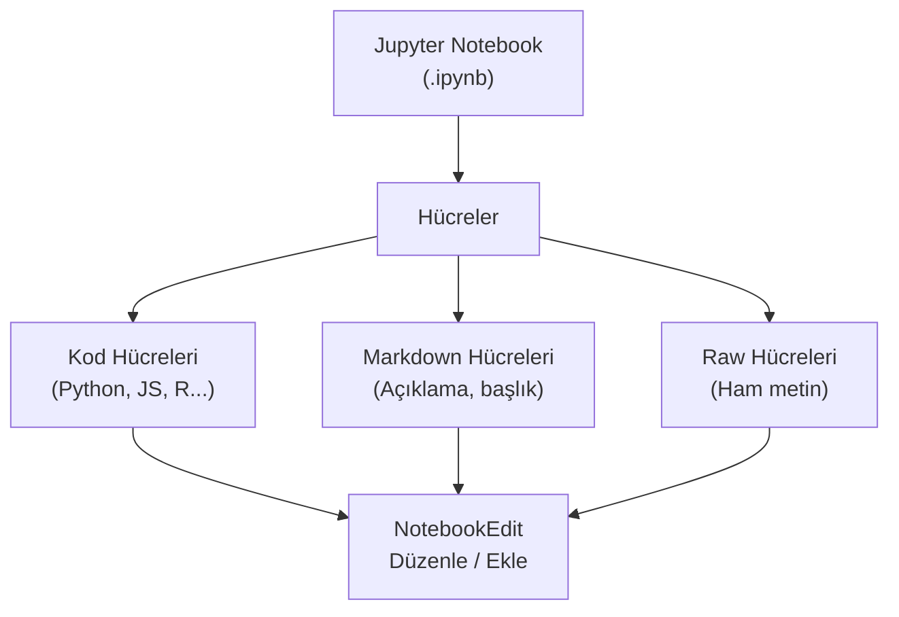
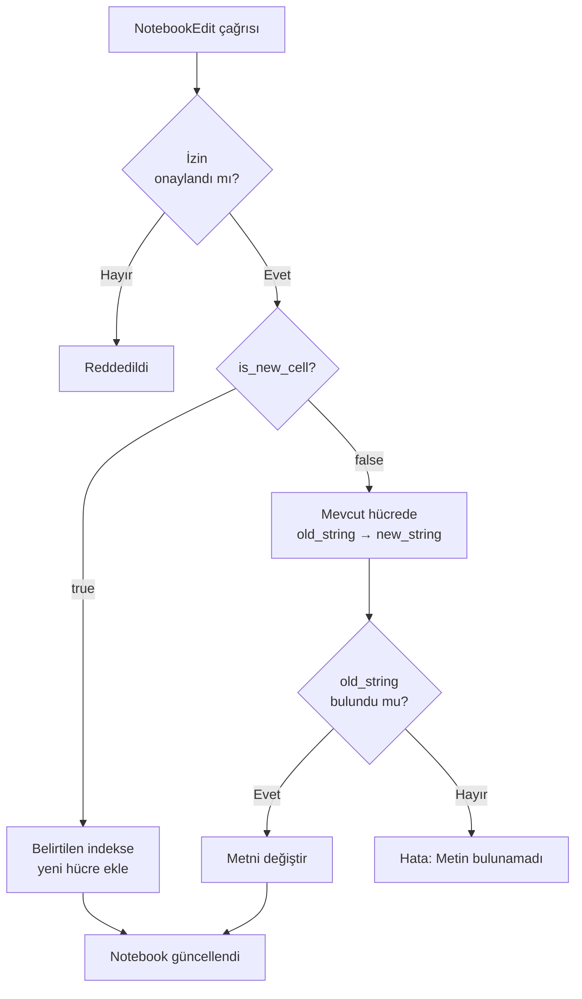
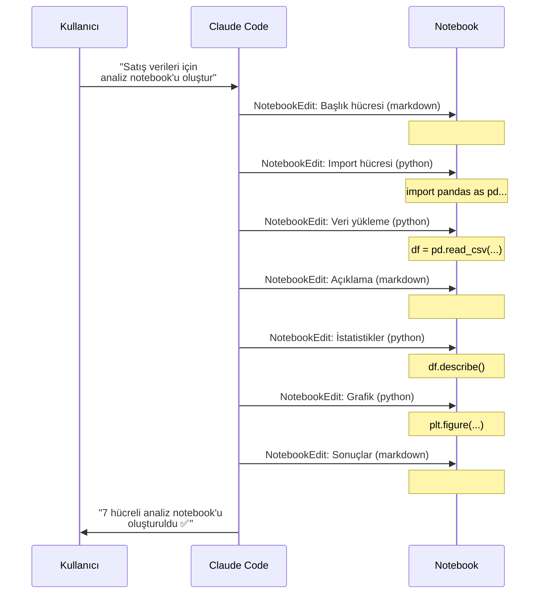

# Notebook İşlemleri

**NotebookEdit** aracı, Claude Code'un Jupyter Notebook (`.ipynb`) dosyalarındaki hücreleri (cell) düzenlemesini, yeni hücreler eklemesini ve hücre içeriğini değiştirmesini sağlar. Veri bilimi, makine öğrenimi ve interaktif geliştirme iş akışları için kullanılır.

## Ön Koşullar

| Konu | Bölüm |
|------|-------|
| Araçlara genel bakış | [Araçlara Genel Bakış](./01-araclara-genel-bakis.md) |
| Dosya işlemleri | [Dosya İşlemleri](./02-dosya-islemleri.md) |
| Jupyter Notebook temel bilgisi | Harici kaynak |

---

## NotebookEdit Aracı

| Özellik | Değer |
|---------|-------|
| **İşlev** | Jupyter notebook hücrelerini düzenleme |
| **İzin** | ✅ Gerekli |
| **Desteklenen formatlar** | `.ipynb` (Jupyter Notebook) |
| **Desteklenen diller** | Python, Markdown, JavaScript, TypeScript, R, SQL, Shell, Raw |



---

## Parametreler

| Parametre | Zorunlu | Açıklama |
|-----------|:-------:|----------|
| `notebook` | ✅ | Notebook dosyasının yolu |
| `cell_index` | ✅ | Düzenlenecek hücrenin indeksi (0 tabanlı) |
| `is_new_cell` | ✅ | `true`: yeni hücre oluştur, `false`: mevcut hücreyi düzenle |
| `cell_type` | ✅ | Hücre dili: `python`, `markdown`, `javascript`, `r`, `sql`, `shell`, `raw` |
| `old_string` | Düzenleme için | Değiştirilecek mevcut metin (mevcut hücreyi düzenlerken) |
| `new_string` | ✅ | Yeni hücre içeriği veya yerine konacak metin |

### İşlem Akışı



---

## Pratik Örnekler

### Örnek 1: Yeni Kod Hücresi Ekleme

```bash
> analysis.ipynb notebook'una veri yükleme hücresi ekle
```

```
NotebookEdit(
  notebook="analysis.ipynb",
  cell_index=0,
  is_new_cell=true,
  cell_type="python",
  new_string="import pandas as pd\nimport numpy as np\nimport matplotlib.pyplot as plt\n\ndf = pd.read_csv('data/sales.csv')\nprint(f'Satır sayısı: {len(df)}')\ndf.head()"
)
```

### Örnek 2: Markdown Açıklama Hücresi Ekleme

```bash
> Notebook'un başına başlık ve açıklama ekle
```

```
NotebookEdit(
  notebook="analysis.ipynb",
  cell_index=0,
  is_new_cell=true,
  cell_type="markdown",
  new_string="# Satış Veri Analizi\n\nBu notebook, 2025 yılı satış verilerinin analizi ve görselleştirmesini içerir.\n\n## İçerik\n1. Veri Yükleme\n2. Keşifsel Analiz\n3. Görselleştirme\n4. Sonuçlar"
)
```

### Örnek 3: Mevcut Hücreyi Düzenleme

```bash
> 3. hücredeki grafik kodunu düzelt: başlığı Türkçe yap
```

```
NotebookEdit(
  notebook="analysis.ipynb",
  cell_index=3,
  is_new_cell=false,
  cell_type="python",
  old_string="plt.title('Monthly Sales')\nplt.xlabel('Month')\nplt.ylabel('Revenue ($)')",
  new_string="plt.title('Aylık Satışlar')\nplt.xlabel('Ay')\nplt.ylabel('Gelir (₺)')"
)
```

### Örnek 4: SQL Hücresi Ekleme

```bash
> Notebook'a veritabanı sorgusu hücresi ekle
```

```
NotebookEdit(
  notebook="analysis.ipynb",
  cell_index=2,
  is_new_cell=true,
  cell_type="sql",
  new_string="%%sql\nSELECT \n    category,\n    COUNT(*) as product_count,\n    AVG(price) as avg_price\nFROM products\nGROUP BY category\nORDER BY product_count DESC\nLIMIT 10;"
)
```

### Örnek 5: Hücre İçeriğini Tamamen Değiştirme

```bash
> 5. hücredeki veri temizleme kodunu optimize et
```

```
NotebookEdit(
  notebook="analysis.ipynb",
  cell_index=5,
  is_new_cell=false,
  cell_type="python",
  old_string="# Veri temizleme\nfor i in range(len(df)):\n    if df.iloc[i]['price'] < 0:\n        df.iloc[i, df.columns.get_loc('price')] = 0\n    if pd.isna(df.iloc[i]['name']):\n        df.iloc[i, df.columns.get_loc('name')] = 'Unknown'",
  new_string="# Veri temizleme (vektörize edilmiş)\ndf['price'] = df['price'].clip(lower=0)\ndf['name'] = df['name'].fillna('Unknown')"
)
```

---

## Notebook İş Akışı Senaryosu

Aşağıdaki senaryo, Claude Code'un bir veri analizi notebook'unu nasıl oluşturabileceğini gösterir:



---

## Dikkat Edilmesi Gerekenler

| Konu | Açıklama |
|------|----------|
| **Hücre indeksi** | 0'dan başlar; yanlış indeks beklenmedik sonuçlara yol açar |
| **Benzersiz old_string** | Edit aracında olduğu gibi, `old_string` hücre içinde benzersiz olmalı |
| **Hücre silme** | Doğrudan silme desteklenmez; `new_string=""` ile içerik temizlenebilir |
| **Markdown → Raw** | Markdown hücreleri bazen `raw` olarak kaydedilebilir (normal davranış) |
| **Yeni notebook** | `is_new_cell=true` ve `cell_index=0` ile boş notebook oluşturulabilir |
| **Çıktılar** | NotebookEdit hücre çıktılarını (output) çalıştırmaz, sadece kaynak kodu düzenler |

---

## Özet

| İşlem | Yöntem | Gerekli Parametreler |
|-------|--------|---------------------|
| **Yeni hücre ekle** | `is_new_cell=true` | `notebook`, `cell_index`, `cell_type`, `new_string` |
| **Hücre düzenle** | `is_new_cell=false` | `notebook`, `cell_index`, `cell_type`, `old_string`, `new_string` |
| **Hücre temizle** | `is_new_cell=false` | `new_string=""` |
| **Yeni notebook** | `is_new_cell=true`, `cell_index=0` | İlk hücre içeriği |

---

## Sonraki Adım

Notebook işlemlerini öğrendik. Şimdi Claude Code'un diğer yardımcı araçlarına geçelim:

→ [Diğer Araçlar](./09-diger-araclar.md)
