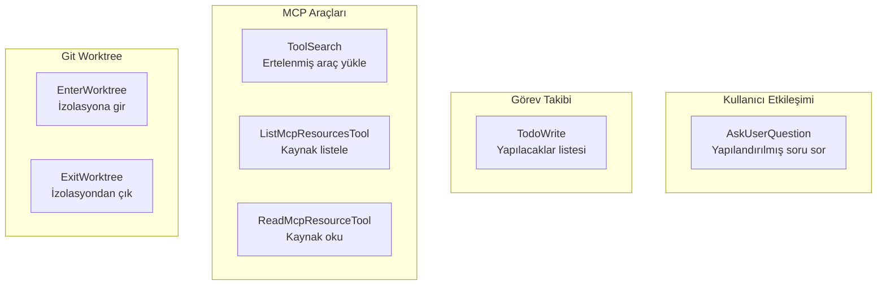
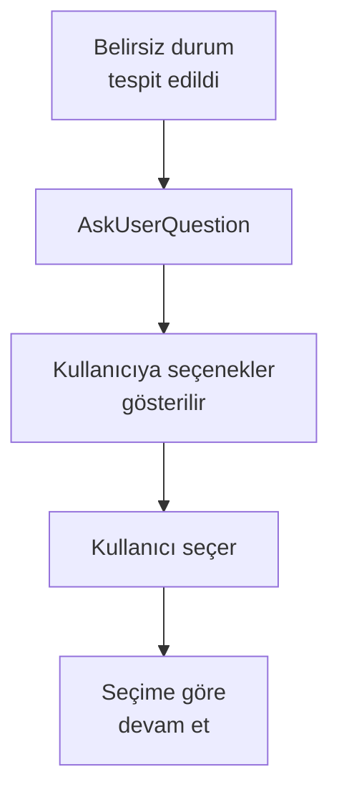
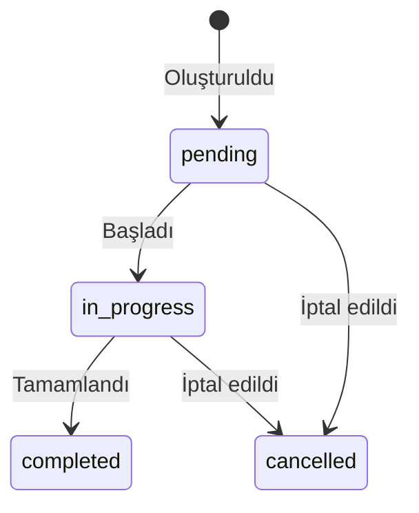
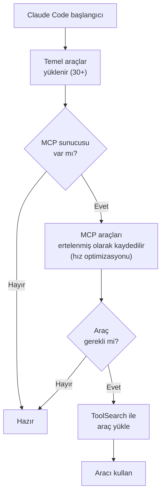
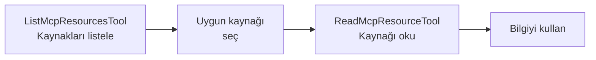
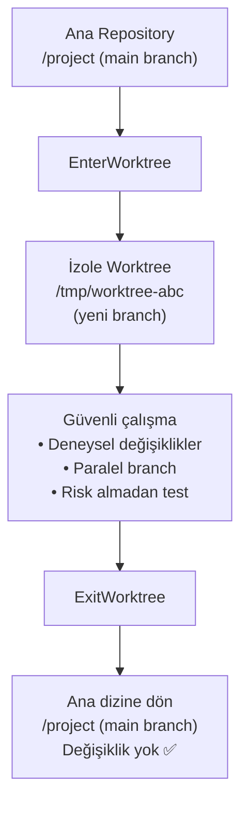
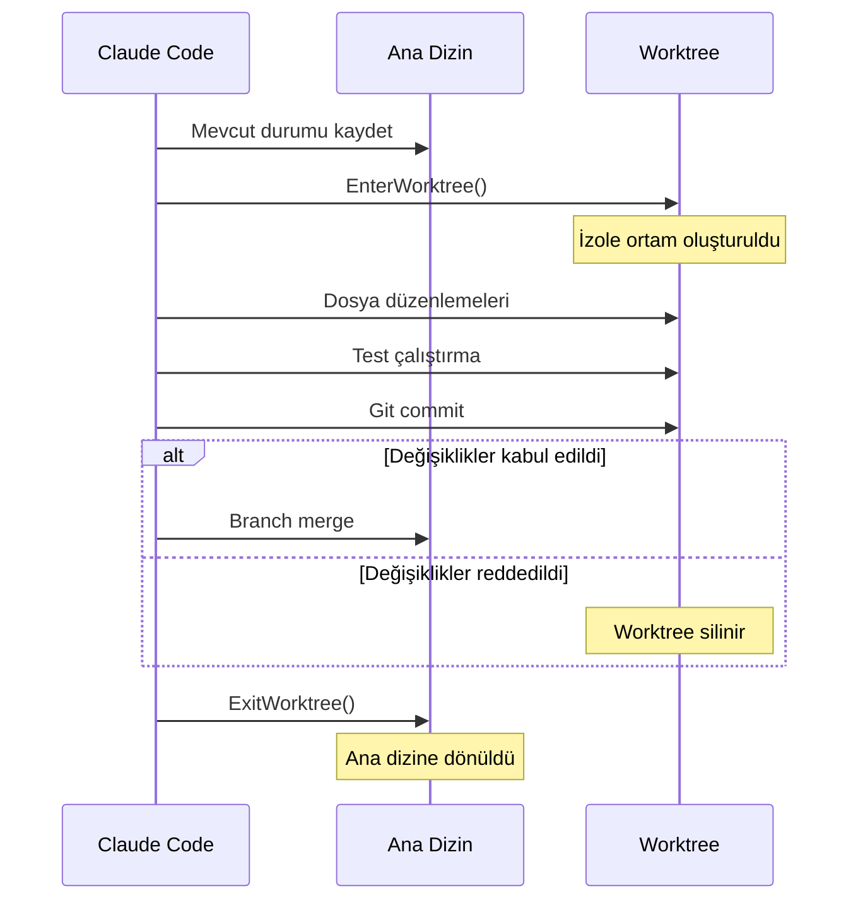

# Diğer Araçlar

Bu bölüm, Claude Code'un önceki sayfalarda detaylı ele alınmayan yardımcı araçlarını kapsar: kullanıcıyla etkileşim, oturum içi görev takibi, MCP kaynak erişimi ve git worktree izolasyonu.

## Ön Koşullar

| Konu | Bölüm |
|------|-------|
| Araçlara genel bakış | [Araçlara Genel Bakış](./01-araclara-genel-bakis.md) |
| Dosya işlemleri | [Dosya İşlemleri](./02-dosya-islemleri.md) |

---

## Araç Listesi



---

## AskUserQuestion — Kullanıcıya Soru Sorma

**AskUserQuestion**, Claude Code'un kullanıcıya yapılandırılmış çoktan seçmeli sorular sormasını sağlar. Belirsiz durumlarda doğru kararı vermek için kullanılır.

### Parametreler

| Parametre | Zorunlu | Açıklama |
|-----------|:-------:|----------|
| `question` | ✅ | Sorunun metni |
| `options` | ✅ | Seçenek listesi (en az 2 seçenek) |
| `allow_multiple` | ❌ | `true` ise birden fazla seçenek işaretlenebilir |

### Akış



### Pratik Örnekler

**Veritabanı seçimi:**
```bash
> Bu proje için veritabanı kur
```
```
AskUserQuestion(
  question="Hangi veritabanını kullanmak istiyorsunuz?",
  options=["PostgreSQL", "MySQL", "SQLite", "MongoDB"],
  allow_multiple=false
)
# Kullanıcı: "PostgreSQL"
# → PostgreSQL kurulumu başlar
```

**Çoklu seçim örneği:**
```bash
> Linting kurallarını yapılandır
```
```
AskUserQuestion(
  question="Hangi linting kurallarını aktifleştirmek istiyorsunuz?",
  options=[
    "no-unused-vars",
    "no-console",
    "prefer-const",
    "strict-equality",
    "no-any"
  ],
  allow_multiple=true
)
# Kullanıcı: ["no-unused-vars", "prefer-const", "no-any"]
```

**Karar noktası:**
```bash
> Bu fonksiyonu optimize et
```
```
AskUserQuestion(
  question="Optimizasyon önceliğiniz nedir?",
  options=[
    "Performans (hız)",
    "Bellek kullanımı",
    "Okunabilirlik",
    "Hepsini dengele"
  ]
)
```

---

## TodoWrite — Oturum İçi Yapılacaklar Listesi

**TodoWrite**, Claude Code'un karmaşık görevleri planlaması ve ilerlemesini takip etmesi için oturum içi bir yapılacaklar listesi (checklist) oluşturur.

### Parametreler

| Parametre | Zorunlu | Açıklama |
|-----------|:-------:|----------|
| `todos` | ✅ | Yapılacak öğeler listesi |

### Todo Durumları



| Durum | Açıklama |
|-------|----------|
| `pending` | Henüz başlanmadı |
| `in_progress` | Üzerinde çalışılıyor |
| `completed` | Tamamlandı |
| `cancelled` | İptal edildi |

### Pratik Örnek

```bash
> Kullanıcı kimlik doğrulama sistemi oluştur
```

Claude Code'un oluşturduğu todo listesi:
```
TodoWrite([
  { id: "1", content: "User modeli oluştur", status: "completed" },
  { id: "2", content: "Auth service yaz", status: "in_progress" },
  { id: "3", content: "JWT token yönetimi ekle", status: "pending" },
  { id: "4", content: "Login/register endpoint'leri", status: "pending" },
  { id: "5", content: "Middleware oluştur", status: "pending" },
  { id: "6", content: "Testleri yaz", status: "pending" }
])
```

---

## ToolSearch — Ertelenmiş MCP Araçlarını Yükleme

**ToolSearch**, MCP (Model Context Protocol) sunucularında tanımlanmış ancak henüz yüklenmemiş (deferred) araçları arar ve yükler.

### Parametreler

| Parametre | Zorunlu | Açıklama |
|-----------|:-------:|----------|
| `query` | ✅ | Aranacak araç adı veya açıklaması |

### Neden Ertelenmiş Araçlar?



### Pratik Örnek

```bash
> Jira'da yeni bir issue oluştur
```
```
# Claude Code, Jira aracının yüklü olmadığını fark eder
ToolSearch(query="jira create issue")
# → MCP sunucusundan "jira_create_issue" aracı yüklenir
# → Araç kullanılabilir hale gelir
```

---

## ListMcpResourcesTool & ReadMcpResourceTool — MCP Kaynak Erişimi

Bu araçlar, MCP sunucuları tarafından sunulan **kaynaklara** (resources) erişim sağlar.

### ListMcpResourcesTool

MCP sunucularının sunduğu kaynakları listeler:

```bash
ListMcpResourcesTool()
# → [
#   { uri: "database://users", name: "Kullanıcı tablosu" },
#   { uri: "database://products", name: "Ürün kataloğu" },
#   { uri: "config://app-settings", name: "Uygulama ayarları" }
# ]
```

### ReadMcpResourceTool

Belirli bir MCP kaynağını okur:

| Parametre | Zorunlu | Açıklama |
|-----------|:-------:|----------|
| `uri` | ✅ | Okunacak kaynağın URI'si |

```bash
ReadMcpResourceTool(uri="database://users")
# → Kullanıcı tablosunun şeması ve örnek veriler
```



---

## EnterWorktree & ExitWorktree — Git Worktree İzolasyonu

**Worktree** araçları, Claude Code'un mevcut çalışma dizinini etkilemeden **izole bir git worktree** (çalışma ağacı) içinde çalışmasını sağlar. Deneysel değişiklikler veya paralel branch çalışmaları için idealdir.

### Worktree Nedir?

Git worktree, aynı repository'nin farklı bir branch'ini ayrı bir dizinde checkout etmenizi sağlayan bir git özelliğidir.



### Kullanım Senaryoları

**Deneysel refactoring:**
```bash
> Bu modülü yeniden yapılandırmayı dene, beğenmezsem geri al
```
```
EnterWorktree()
# → İzole worktree oluşturuldu: /tmp/worktree-xyz

# Claude Code burada güvenle çalışır...
# Dosyaları düzenler, test eder

ExitWorktree()
# → Ana dizine dönüldü, değişiklikler worktree'de kaldı
```

**Paralel branch geliştirme:**
```bash
> Feature branch'inde çalışırken hotfix branch'i oluştur
```
```
EnterWorktree()
# → Ana projeden bağımsız dizinde çalışma başlar
# → Hotfix değişiklikleri burada yapılır
ExitWorktree()
# → Feature branch'ine dönülür
```

### Worktree Yaşam Döngüsü



---

## Özet Tablosu

| Araç | İşlev | İzin | Kullanım Senaryosu |
|------|-------|:----:|---------------------|
| **AskUserQuestion** | Çoktan seçmeli soru | ❌ | Belirsiz durumlarda karar alma |
| **TodoWrite** | Yapılacaklar listesi | ❌ | Karmaşık görev takibi |
| **ToolSearch** | MCP araç yükleme | ❌ | Ertelenmiş araçları bulma |
| **ListMcpResourcesTool** | MCP kaynak listeleme | ❌ | Mevcut kaynakları görme |
| **ReadMcpResourceTool** | MCP kaynak okuma | ❌ | Kaynak verilerine erişim |
| **EnterWorktree** | Worktree'ye giriş | ❌ | İzole çalışma ortamı |
| **ExitWorktree** | Worktree'den çıkış | ❌ | Ana dizine dönüş |

---

## Sonraki Adım

Tüm yardımcı araçları öğrendik. Şimdi araç izin sistemi ve kurallarını detaylı inceleyelim:

→ [Araç İzinleri ve Kurallar](./10-arac-izinleri-ve-kurallar.md)
