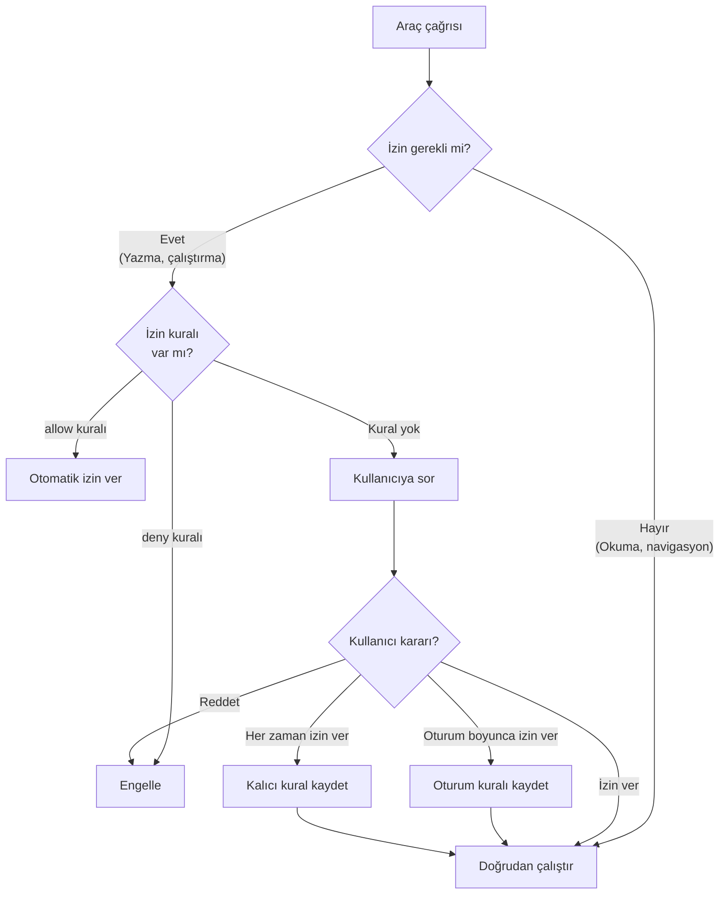
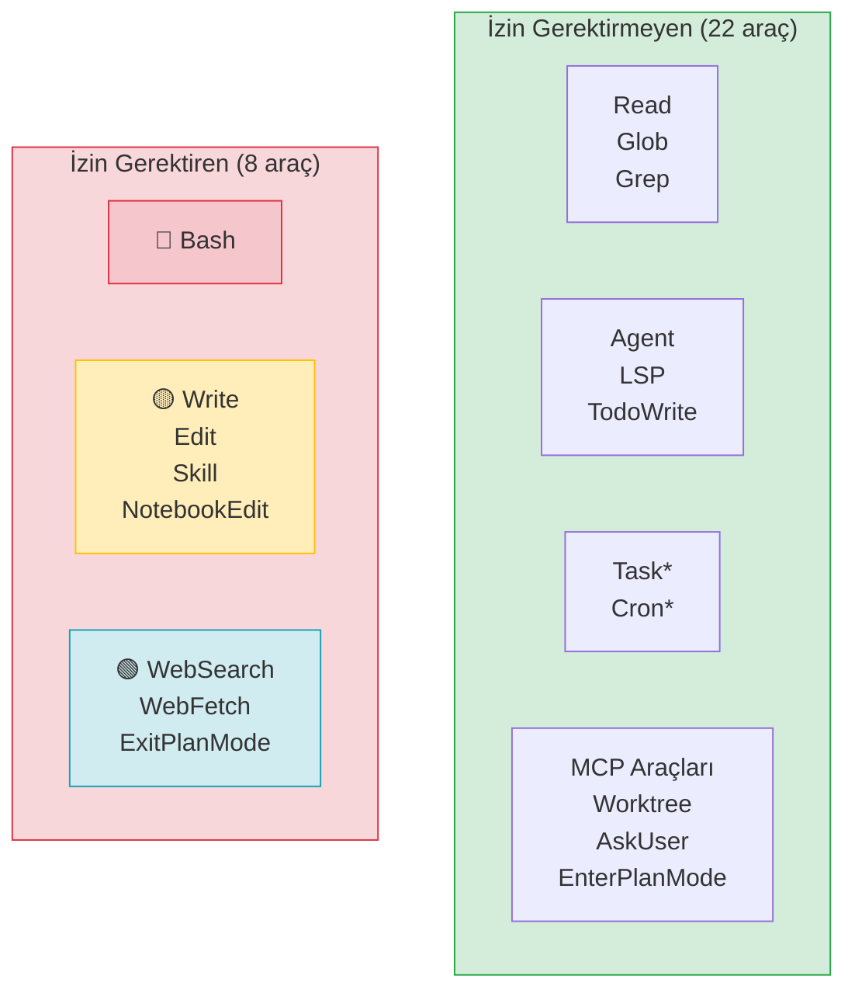
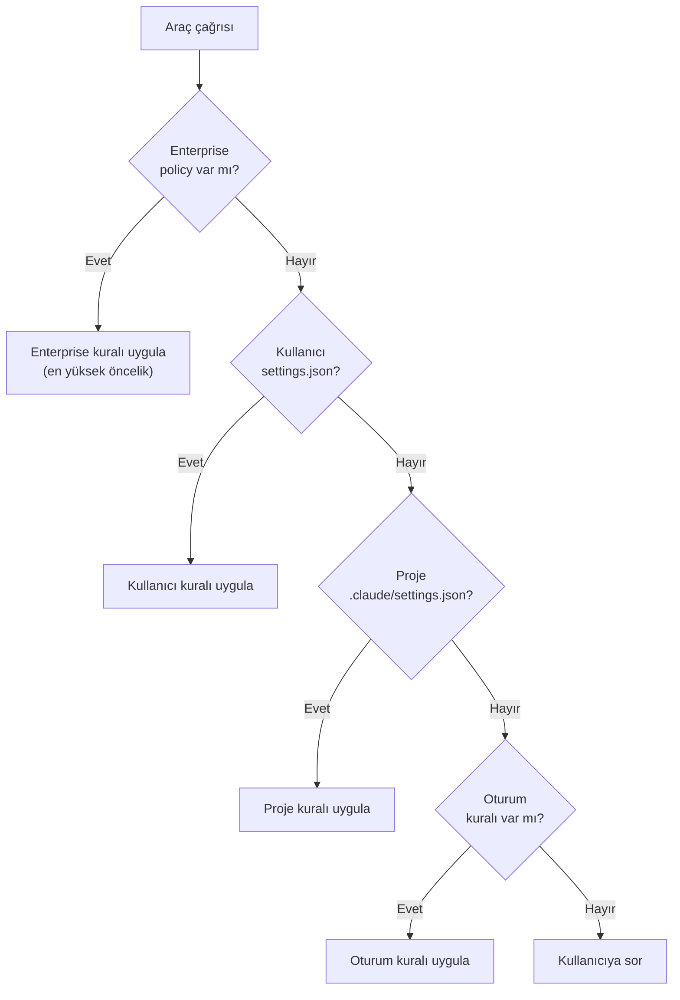
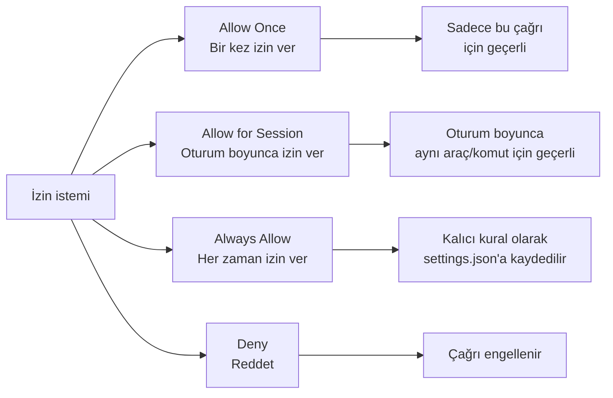
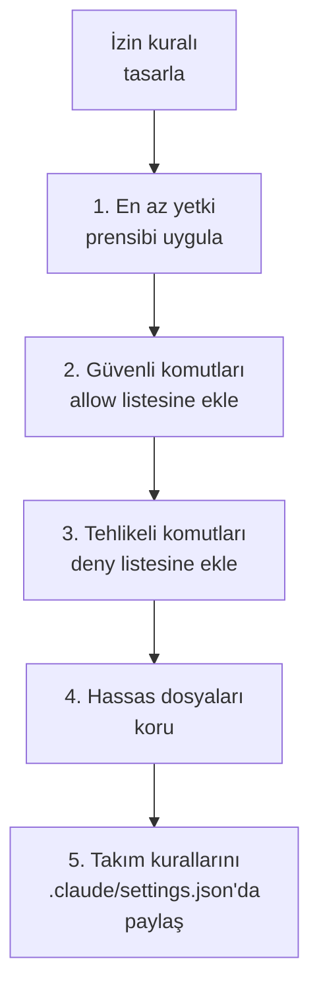

# Araç İzinleri ve Kurallar

Claude Code'un güvenlik modelinin temel taşı **izin sistemi**dir (permission system). Her araç, kullanıcı izni gerektirip gerektirmemesine göre sınıflandırılır. Ayrıca **permission rules** (izin kuralları) ile araç bazında ince ayar yapılabilir.

## Ön Koşullar

| Konu | Bölüm |
|------|-------|
| Araçlara genel bakış | [Araçlara Genel Bakış](./01-araclara-genel-bakis.md) |
| Claude Code nasıl çalışır | [Claude Code Nasıl Çalışır?](../06-claude-code-tanitim/02-claude-code-nasil-calisir.md) |

---

## İzin Sistemi Genel Bakış

Claude Code araçları iki kategoriye ayrılır:



---

## İzin Matrisi

### İzin Gerektirmeyen Araçlar (Salt Okunur / Dahili)

Bu araçlar sistemi değiştirmez veya Claude Code'un iç mekanizmalarıdır:

| Araç | Kategori | Açıklama |
|------|----------|----------|
| **Read** | Dosya | Dosya okuma |
| **Glob** | Dosya | Dosya adı deseniyle arama |
| **Grep** | Dosya | İçerik arama |
| **Agent** | Çalıştırma | Alt ajan başlatma |
| **TaskCreate** | Görev | Görev oluşturma |
| **TaskGet** | Görev | Görev durumu sorgulama |
| **TaskList** | Görev | Görev listeleme |
| **TaskUpdate** | Görev | Görev güncelleme |
| **TaskStop** | Görev | Görev durdurma |
| **TaskOutput** | Görev | Görev çıktısı alma |
| **CronCreate** | Zamanlama | Cron görevi oluşturma |
| **CronDelete** | Zamanlama | Cron görevi silme |
| **CronList** | Zamanlama | Cron görevlerini listeleme |
| **EnterPlanMode** | Planlama | Plan moduna giriş |
| **EnterWorktree** | Worktree | Worktree'ye giriş |
| **ExitWorktree** | Worktree | Worktree'den çıkış |
| **AskUserQuestion** | Yardımcı | Kullanıcıya soru sorma |
| **LSP** | Yardımcı | Kod zekası |
| **TodoWrite** | Yardımcı | Yapılacaklar listesi |
| **ToolSearch** | MCP | Araç arama |
| **ListMcpResourcesTool** | MCP | Kaynak listeleme |
| **ReadMcpResourceTool** | MCP | Kaynak okuma |

### İzin Gerektiren Araçlar (Değişiklik Yapan)

Bu araçlar dosya sistemi, ağ veya sistem durumunu değiştirebilir:

| Araç | Kategori | Risk Seviyesi | Açıklama |
|------|----------|:-------------:|----------|
| **Bash** | Çalıştırma | 🔴 Yüksek | Shell komutları (rm, sudo vb.) |
| **Write** | Dosya | 🟡 Orta | Dosya oluşturma/üzerine yazma |
| **Edit** | Dosya | 🟡 Orta | Dosya düzenleme |
| **WebSearch** | Web | 🟢 Düşük | Web araması |
| **WebFetch** | Web | 🟢 Düşük | URL içerik çekme |
| **Skill** | Çalıştırma | 🟡 Orta | Beceri dosyası çalıştırma |
| **NotebookEdit** | Dosya | 🟡 Orta | Notebook düzenleme |
| **ExitPlanMode** | Planlama | 🟢 Düşük | Plan modundan çıkış |



---

## Permission Rules (İzin Kuralları) Sözdizimi

İzin kuralları, araçların otomatik olarak izin almasını veya engellenmesini sağlar. Bu kurallar `settings.json` veya `.claude/settings.json` dosyasında tanımlanır.

### Temel Sözdizimi

```json
{
  "permissions": {
    "allow": [
      "Tool",
      "Tool(specifier)"
    ],
    "deny": [
      "Tool",
      "Tool(specifier)"
    ]
  }
}
```

### Kural Formatları

| Format | Açıklama | Örnek |
|--------|----------|-------|
| `Tool` | Aracın tüm kullanımlarını kapsar | `"Edit"` |
| `Tool(specifier)` | Aracın belirli bir kullanımını kapsar | `"Bash(npm test)"` |
| `Tool(prefix*)` | Wildcard ile eşleşme | `"Bash(npm *)"` |
| `Tool(path/*)` | Dizin bazlı wildcard | `"Edit(src/*)"` |

### Wildcard Kuralları

```mermaid
flowchart TD
    RULE["İzin Kuralı"] --> TYPE{"Kural türü?"}

    TYPE -->|'Bash'| ALL["Tüm Bash komutları"]
    TYPE -->|'Bash(npm test)'| EXACT["Sadece 'npm test'"]
    TYPE -->|'Bash(npm *)'| PREFIX["npm ile başlayan\ntüm komutlar"]
    TYPE -->|'Edit(src/*)'| PATH["src/ altındaki\ntüm dosyalar"]

    ALL --> MATCH["Eşleşme kontrolü"]
    EXACT --> MATCH
    PREFIX --> MATCH
    PATH --> MATCH

    MATCH -->|"allow listesinde"| ALLOW["✅ Otomatik izin"]
    MATCH -->|"deny listesinde"| DENY["❌ Engelle"]
```

---

## Pratik Kural Örnekleri

### Örnek 1: Güvenli Komutları Otomatik İzinle

```json
{
  "permissions": {
    "allow": [
      "Bash(npm test)",
      "Bash(npm run lint)",
      "Bash(npm run build)",
      "Bash(git status)",
      "Bash(git diff *)",
      "Bash(git log *)",
      "Bash(npx tsc --noEmit)",
      "Bash(npx prettier --check *)"
    ]
  }
}
```

### Örnek 2: Belirli Dizinlerde Düzenlemeye İzin Ver

```json
{
  "permissions": {
    "allow": [
      "Edit(src/*)",
      "Write(src/*)",
      "Edit(tests/*)",
      "Write(tests/*)"
    ],
    "deny": [
      "Edit(.env*)",
      "Write(.env*)",
      "Edit(*.secret*)",
      "Write(*.secret*)"
    ]
  }
}
```

### Örnek 3: Web Araçlarını Serbest Bırak

```json
{
  "permissions": {
    "allow": [
      "WebSearch",
      "WebFetch"
    ]
  }
}
```

### Örnek 4: Tehlikeli Komutları Engelle

```json
{
  "permissions": {
    "deny": [
      "Bash(rm -rf *)",
      "Bash(sudo *)",
      "Bash(chmod 777 *)",
      "Bash(curl * | bash)",
      "Bash(wget * | bash)"
    ]
  }
}
```

---

## İzin Katmanları

İzin kuralları birden fazla katmanda tanımlanabilir. Öncelik sırası:



| Katman | Dosya | Kapsam | Öncelik |
|--------|-------|--------|:-------:|
| **Enterprise** | Merkezi politika | Tüm kullanıcılar | 1 (en yüksek) |
| **Kullanıcı** | `~/.claude/settings.json` | Tüm projeler | 2 |
| **Proje** | `.claude/settings.json` | Tek proje | 3 |
| **Oturum** | Geçici (bellekte) | Tek oturum | 4 (en düşük) |

---

## İzin İstemi Davranışları

Kullanıcıya izin sorulduğunda üç seçenek sunulur:



| Seçenek | Kapsam | Kaydedilir mi? |
|---------|--------|:--------------:|
| **Allow Once** | Sadece bu çağrı | ❌ |
| **Allow for Session** | Oturum boyunca | Bellekte |
| **Always Allow** | Kalıcı | `settings.json` |
| **Deny** | Bu çağrı | ❌ |

---

## Araç-Specifier Eşleşme Mantığı

İzin kurallarında `Tool(specifier)` formatı kullanıldığında eşleşme şu şekilde çalışır:

### Bash Aracı İçin

Specifier, komutun **tamamı veya başlangıcı** ile eşleşir:

| Kural | Komut | Eşleşme |
|-------|-------|:-------:|
| `Bash(npm test)` | `npm test` | ✅ |
| `Bash(npm test)` | `npm test -- --coverage` | ❌ |
| `Bash(npm *)` | `npm test` | ✅ |
| `Bash(npm *)` | `npm run build` | ✅ |
| `Bash(npm *)` | `npx prisma migrate` | ❌ |
| `Bash` | herhangi bir komut | ✅ |

### Edit/Write Araçları İçin

Specifier, **dosya yolu** ile eşleşir:

| Kural | Dosya | Eşleşme |
|-------|-------|:-------:|
| `Edit(src/*)` | `src/index.ts` | ✅ |
| `Edit(src/*)` | `src/utils/helpers.ts` | ✅ |
| `Edit(src/*)` | `tests/index.test.ts` | ❌ |
| `Write(*.md)` | `README.md` | ✅ |
| `Write(*.md)` | `docs/guide.md` | ✅ |
| `Edit` | herhangi bir dosya | ✅ |

---

## Gerçek Dünya Yapılandırmaları

### Geliştirme Ortamı (Rahat)

```json
{
  "permissions": {
    "allow": [
      "Edit",
      "Write",
      "Bash(npm *)",
      "Bash(npx *)",
      "Bash(git *)",
      "Bash(docker *)",
      "WebSearch",
      "WebFetch",
      "NotebookEdit"
    ],
    "deny": [
      "Bash(rm -rf /)",
      "Bash(sudo rm *)"
    ]
  }
}
```

### Üretim Ortamı (Kısıtlı)

```json
{
  "permissions": {
    "allow": [
      "Bash(git status)",
      "Bash(git log *)",
      "Bash(git diff *)",
      "Bash(npm test)",
      "Bash(npm run lint)"
    ],
    "deny": [
      "Bash(npm publish *)",
      "Bash(git push *)",
      "Bash(docker *)",
      "Edit(.env*)",
      "Write(.env*)",
      "Bash(sudo *)"
    ]
  }
}
```

### Takım Projesi (.claude/settings.json)

```json
{
  "permissions": {
    "allow": [
      "Bash(npm test)",
      "Bash(npm run lint)",
      "Bash(npm run build)",
      "Bash(npx prisma *)",
      "Edit(src/*)",
      "Write(src/*)",
      "Edit(tests/*)",
      "Write(tests/*)",
      "WebSearch",
      "WebFetch"
    ],
    "deny": [
      "Edit(*.lock)",
      "Write(*.lock)",
      "Edit(.github/*)",
      "Edit(infrastructure/*)",
      "Bash(npm publish *)",
      "Bash(git push --force *)"
    ]
  }
}
```

---

## İzin Kuralı Oluşturma En İyi Uygulamaları



| Uygulama | Açıklama |
|----------|----------|
| **En az yetki** | Sadece gerekli araçlara izin verin |
| **Deny öncelikli** | Kritik dosya/komutları açıkça engelleyin |
| **Wildcard dikkatli** | `Bash(*)` gibi geniş wildcard'lardan kaçının |
| **Hassas dosyalar** | `.env`, credential dosyalarını deny listesine ekleyin |
| **Takım paylaşımı** | Proje kurallarını `.claude/settings.json`'da version control'e alın |
| **Katmanlı yaklaşım** | Kullanıcı seviyesinde genel, proje seviyesinde özel kurallar |

---

## Özet

| Kavram | Açıklama |
|--------|----------|
| **İzinsiz araçlar** | 22 araç — okuma ve dahili operasyonlar |
| **İzinli araçlar** | 8 araç — yazma, çalıştırma, ağ erişimi |
| **Permission rules** | `allow` / `deny` listeleriyle otomatik izin yönetimi |
| **Specifier** | `Tool(pattern)` ile ince ayarlı eşleşme |
| **Wildcard** | `*` ile prefix eşleşme |
| **Katmanlar** | Enterprise > Kullanıcı > Proje > Oturum |

---

## Sonraki Adım

Araç izin sistemini detaylı öğrendik. Bu bölümü tamamladınız! Şimdi Claude Code'un bellek ve bağlam yönetimine geçelim:

→ [Bölüm 09: Bellek ve Bağlam Yönetimi](../09-bellek-ve-baglam/README.md)
