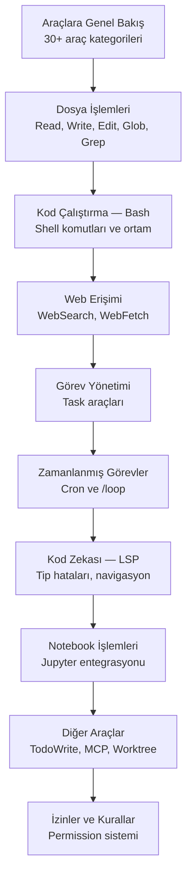

# Bölüm 08: Claude Code — Araçlar (Tools)

Claude Code, 30'dan fazla dahili araçla (tool) donatılmış güçlü bir otonom kodlama ajanıdır. Bu bölüm, her bir aracın ne yaptığını, nasıl kullanıldığını ve izin gereksinimlerini kapsamlı şekilde ele alır.

## Bu Bölümde Neler Öğreneceksiniz?

## İçerik

| # | Dosya | Konu | Süre |
|---|-------|------|------|
| 01 | [Araçlara Genel Bakış](./01-araclara-genel-bakis.md) | 30+ aracın kategorileri, izin gereksinimleri tablosu | ~12 dk |
| 02 | [Dosya İşlemleri](./02-dosya-islemleri.md) | Read, Write, Edit, Glob, Grep araçları | ~15 dk |
| 03 | [Kod Çalıştırma — Bash](./03-kod-calistirma-bash.md) | Bash aracı, ortam değişkenleri, virtualenv | ~12 dk |
| 04 | [Web Erişimi](./04-web-erisimi.md) | WebSearch, WebFetch araçları | ~10 dk |
| 05 | [Görev Yönetimi](./05-gorev-yonetimi.md) | TaskCreate, TaskGet, TaskList, TaskUpdate, TaskStop, TaskOutput | ~12 dk |
| 06 | [Zamanlanmış Görevler](./06-zamanlanmis-gorevler.md) | CronCreate, CronDelete, CronList ve /loop komutu | ~10 dk |
| 07 | [Kod Zekası — LSP](./07-kod-zekasi-lsp.md) | LSP aracı, tip hataları, kod navigasyonu | ~10 dk |
| 08 | [Notebook İşlemleri](./08-notebook-islemleri.md) | NotebookEdit ile Jupyter notebook düzenleme | ~8 dk |
| 09 | [Diğer Araçlar](./09-diger-araclar.md) | AskUserQuestion, TodoWrite, MCP araçları, Worktree | ~10 dk |
| 10 | [Araç İzinleri ve Kurallar](./10-arac-izinleri-ve-kurallar.md) | İzin sistemi, permission rule sözdizimi, matris | ~12 dk |

## Ön Koşullar

Bu bölümü okumadan önce aşağıdaki konulara aşina olmanız önerilir:

| Konu | Bölüm |
|------|-------|
| Claude Code nedir ve nasıl çalışır | [Bölüm 06](../06-claude-code-tanitim/README.md) |
| Arayüz ve komutlar | [Bölüm 07](../07-arayuz-ve-komutlar/README.md) |
| Terminal / komut satırı temel kullanımı | Harici kaynak |

## Sonraki Adım

Bu bölümü tamamladıktan sonra → [09 - Bellek ve Bağlam Yönetimi](../09-bellek-ve-baglam/README.md)
