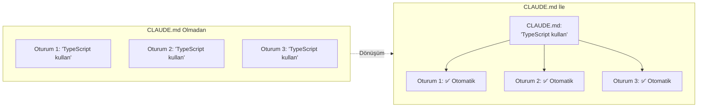
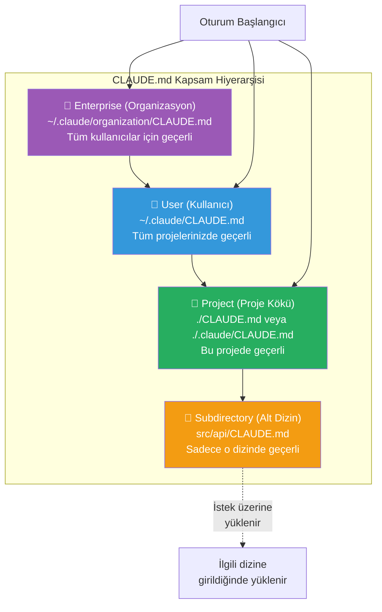
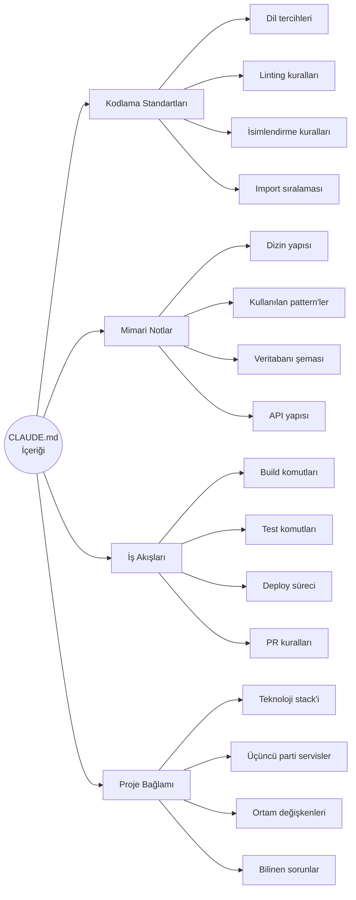
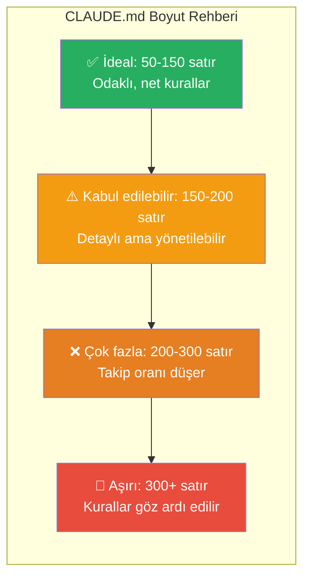

# CLAUDE.md Dosyası

**CLAUDE.md**, Claude Code'un birincil **memory file** (bellek dosyası) olarak kullandığı özel bir Markdown dosyasıdır. Her oturum başlangıcında otomatik olarak yüklenir ve Claude'a projenizin kurallarını, mimarisini ve tercihlerinizi anlatır.

## Ön Koşullar

| Konu | Bölüm |
|------|-------|
| Claude Code nasıl çalışır | [Claude Code Nasıl Çalışır?](../06-claude-code-tanitim/02-claude-code-nasil-calisir.md) |
| Agentic loop kavramı | [Bölüm 06](../06-claude-code-tanitim/README.md) |

---

## CLAUDE.md Nedir?

CLAUDE.md, Claude Code'a verdiğiniz **kalıcı talimatlar** dosyasıdır. Her oturumda tekrar tekrar aynı şeyleri söylemenize gerek kalmaz — kurallarınızı bir kez yazarsınız, Claude her seferinde bunlara uyar.



---

## Yerleşim ve Kapsam Hiyerarşisi

CLAUDE.md dosyası birden fazla konuma yerleştirilebilir. Her konum farklı bir **scope** (kapsam) belirler:



### Yerleşim Detayları

| Konum | Yol | Kapsam | Yükleme Zamanı |
|-------|-----|--------|----------------|
| **Enterprise** | `~/.claude/organization/CLAUDE.md` | Tüm kullanıcılar, tüm projeler | Oturum başlangıcı |
| **User** | `~/.claude/CLAUDE.md` | Tüm projeleriniz | Oturum başlangıcı |
| **Project root** | `./CLAUDE.md` veya `./.claude/CLAUDE.md` | Bu proje | Oturum başlangıcı |
| **Subdirectory** | `src/api/CLAUDE.md` | Sadece o dizin ve alt dizinleri | İstek üzerine (on-demand) |

> **Not:** Proje kökünde hem `./CLAUDE.md` hem `./.claude/CLAUDE.md` varsa, ikisi de yüklenir ve birleştirilir.

---

## CLAUDE.md İçeriği Ne Olmalı?

Etkili bir CLAUDE.md dosyası şu kategorilerden bilgiler içerir:



---

## Pratik Örnek 1: Temel CLAUDE.md

Bir TypeScript + React projesi için örnek CLAUDE.md:

```markdown
# CLAUDE.md

## Proje Hakkında
Bu proje bir e-ticaret platformunun frontend'idir.
- **Stack:** React 19, TypeScript, Tailwind CSS, Zustand
- **Paket yöneticisi:** pnpm (npm veya yarn kullanma)
- **Node versiyonu:** 20 LTS

## Kodlama Standartları
- Tüm dosyalar TypeScript olmalı (.ts / .tsx), asla .js kullanma
- Fonksiyon bileşenleri kullan, class bileşen yazma
- State yönetimi için Zustand kullan, Context API kullanma
- CSS için Tailwind utility class'ları kullan, inline style yazma
- Import sıralaması: React > Üçüncü parti > Yerel modüller > Tipler

## Sık Kullanılan Komutlar
- Build: `pnpm build`
- Test: `pnpm test`
- Lint: `pnpm lint`
- Dev server: `pnpm dev`
- Tek dosya testi: `pnpm test -- --grep "test adı"`

## Mimari
- `src/components/` — Yeniden kullanılabilir UI bileşenleri
- `src/features/` — Özellik bazlı modüller (auth, cart, product)
- `src/hooks/` — Custom hook'lar
- `src/stores/` — Zustand store'ları
- `src/api/` — API istemci fonksiyonları
- `src/types/` — Paylaşılan TypeScript tipleri

## Kurallar
- Commit mesajları Conventional Commits formatında olmalı
- Her yeni bileşen için test dosyası oluştur
- API çağrılarında hata yönetimi (error handling) zorunlu
- Console.log'ları commit'leme
```

---

## Pratik Örnek 2: Backend Projesi CLAUDE.md

```markdown
# CLAUDE.md

## Proje
Go ile yazılmış bir REST API servisi. PostgreSQL veritabanı kullanır.

## Komutlar
- Build: `go build -o bin/server ./cmd/server`
- Test: `go test ./...`
- Lint: `golangci-lint run`
- Migration: `goose -dir migrations postgres "$DATABASE_URL" up`
- Tek paket testi: `go test -v -run TestFunctionName ./internal/auth/`

## Kurallar
- Error wrapping için `fmt.Errorf("context: %w", err)` kullan
- Her public fonksiyonun GoDoc yorumu olmalı
- SQL sorgularında parameterized query kullan, string concatenation yapma
- Context'i her zaman ilk parametre olarak geçir
- Tablolar snake_case, Go struct'ları PascalCase

## Mimari
- `cmd/server/` — Uygulama giriş noktası
- `internal/` — Dışa kapalı iç paketler
- `internal/handler/` — HTTP handler'lar
- `internal/service/` — İş mantığı katmanı
- `internal/repository/` — Veritabanı erişim katmanı
- `internal/model/` — Veri modelleri
- `migrations/` — Veritabanı migration dosyaları

## Bilinen Sorunlar
- Redis bağlantısı localhost:6379'da, .env dosyasından REDIS_URL okur
- Rate limiting middleware henüz testlerden geçmiyor (#142)
```

---

## Pratik Örnek 3: Kullanıcı Seviyesi CLAUDE.md

`~/.claude/CLAUDE.md` dosyasına kişisel tercihlerinizi yazabilirsiniz:

```markdown
# Kişisel Tercihlerim

## Genel
- Türkçe yanıt ver
- Commit mesajlarını İngilizce yaz
- Kodu açıklarken kısa ve öz ol

## Kod Stili
- 2 boşluk indent kullan (tab değil)
- Tek tırnak (single quote) tercih et
- Trailing comma kullan
- Semicolon kullanma (JavaScript/TypeScript)

## Git
- Commit mesajları Conventional Commits formatında
- Branch adları: feature/kisa-aciklama, fix/kisa-aciklama
- Her commit atomik olsun (tek bir mantıksal değişiklik)
```

---

## Pratik Örnek 4: Alt Dizin CLAUDE.md

`src/api/CLAUDE.md` — API dizinine özel kurallar:

```markdown
# API Dizini Kuralları

## Bu dizindeki dosyalar
- REST API istemci fonksiyonları
- Her dosya bir domain'e karşılık gelir (auth.ts, products.ts, orders.ts)

## Kurallar
- Tüm API fonksiyonları async olmalı
- Dönüş tipi her zaman açıkça belirtilmeli
- Hata durumlarında özel ApiError sınıfı fırlatılmalı
- Base URL `src/api/client.ts` içinde tanımlı, hardcode yapma
- Her yeni endpoint için `src/api/types/` altında tip tanımla
```

---

## Boyut ve Performans Önerileri

CLAUDE.md boyutu doğrudan performansı etkiler:



| Metrik | Önerilen |
|--------|----------|
| **Toplam satır** | 300 satır altında tutun |
| **Güvenilir takip** | 150-200 talimat optimal |
| **Madde başına uzunluk** | 1-2 cümle, kısa ve net |
| **Kategori sayısı** | 4-6 ana başlık |

> **İpucu:** CLAUDE.md'yi bir "onboarding dokümanı" gibi düşünün — yeni bir geliştiriciye projeyi anlatıyormuş gibi yazın, ama gereksiz detaya girmeyin.

---

## CLAUDE.md Oluşturma Yöntemleri

### Yöntem 1: Claude Code'a Yazdırma

```bash
$ claude
> Bu proje için bir CLAUDE.md dosyası oluştur
```

Claude Code projeyi analiz eder ve otomatik bir CLAUDE.md üretir.

### Yöntem 2: /init Komutu

```bash
$ claude
> /init
```

`/init` komutu projeyi tarar ve temel bir CLAUDE.md oluşturur. Sonra ihtiyaca göre düzenleyebilirsiniz.

### Yöntem 3: Manuel Yazma

Kendi kurallarınızı yukarıdaki örnekleri temel alarak yazabilirsiniz.

---

## CLAUDE.md İçinde Kullanılabilecek Özel Kalıplar

CLAUDE.md içinde bazı özel direktifler kullanabilirsiniz:

```markdown
# Komutlar (Claude bunları bash komutları olarak tanır)
- Build: `npm run build`
- Test: `npm test`

# Dosya referansları (Claude bu dosyaları otomatik okuyabilir)
Mimari detaylar için bkz: docs/architecture.md
API şeması için bkz: openapi.yaml

# Koşullu kurallar
- TypeScript dosyalarında strict mode kullan
- Test dosyalarında (.test.ts) describe/it pattern'i kullan
- Migration dosyalarında geri alınabilir (reversible) migration yaz
```

---

## Sık Yapılan Hatalar

| Hata | Doğrusu |
|------|---------|
| CLAUDE.md'yi çok uzun yazmak (500+ satır) | 150-200 satır civarında tutun |
| Belirsiz talimatlar ("iyi kod yaz") | Spesifik olun ("fonksiyonlar 30 satırı aşmasın") |
| Çelişen kurallar yazmak | Kuralları gözden geçirip tutarlı tutun |
| CLAUDE.md'yi hiç güncellememek | Proje evrildiğinde güncelleyin |
| Her şeyi tek CLAUDE.md'ye koymak | Alt dizin CLAUDE.md'leri ve `.claude/rules/` kullanın |
| Gizli bilgi yazmak (API key, şifre) | Asla gizli bilgi yazmayın |

---

## Özet

| Kavram | Açıklama |
|--------|----------|
| **CLAUDE.md** | Claude Code'un birincil bellek dosyası |
| **Kapsam hiyerarşisi** | Enterprise → User → Project → Subdirectory |
| **Otomatik yükleme** | Oturum başlangıcında user + project seviyesi yüklenir |
| **On-demand yükleme** | Alt dizin CLAUDE.md'leri ilgili dizine girildiğinde yüklenir |
| **Optimal boyut** | 150-200 talimat, 300 satır altı |
| **İçerik** | Kodlama standartları, mimari, iş akışları, proje bağlamı |

---

## Sonraki Adım

CLAUDE.md'nin yanı sıra farklı araçlarla uyumlu çalışan diğer config dosyalarını inceleyelim:

→ [AGENTS.md ve Diğer Config Dosyaları](./02-agents-md-ve-diger-config.md)
