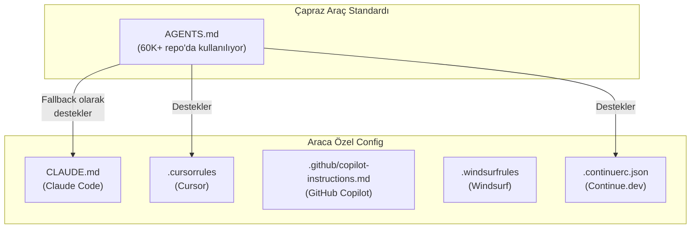
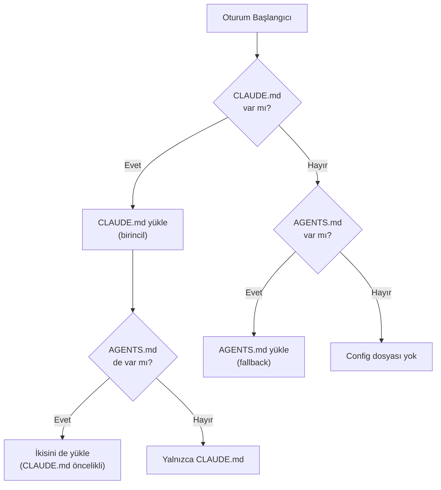
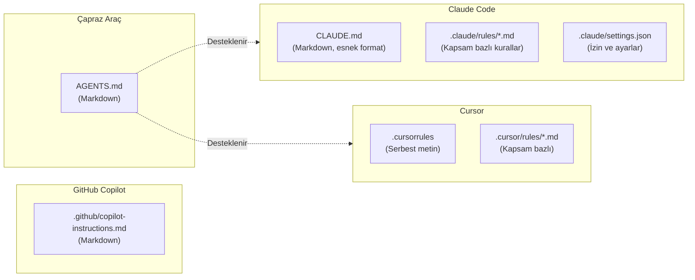
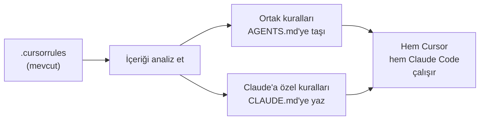
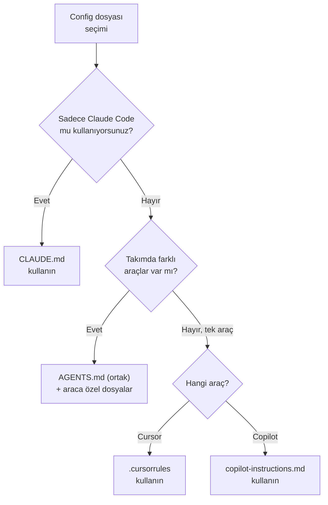

# AGENTS.md ve Diğer Config Dosyaları

**AGENTS.md**, birden fazla AI coding aracının ortak olarak desteklediği bir **cross-tool standard** (çapraz araç standardı) dosyasıdır. Claude Code bu dosyayı CLAUDE.md'ye **fallback** (yedek) olarak destekler. Bu bölümde AGENTS.md, `.cursorrules`, `.github/copilot-instructions.md` ve diğer config dosyalarını karşılaştıracağız.

## Ön Koşullar

| Konu | Bölüm |
|------|-------|
| CLAUDE.md dosyası | [CLAUDE.md Dosyası](./01-claude-md-dosyasi.md) |
| Claude Code temel kullanım | [Bölüm 06](../06-claude-code-tanitim/README.md) |

---

## Config Dosyası Ekosistemi

AI destekli geliştirme araçlarının her biri kendi config dosya formatını kullanır, ancak sektörde ortak bir standart oluşmaya başlamıştır:



---

## AGENTS.md Nedir?

AGENTS.md, projenin kök dizinine yerleştirilen ve **birden fazla AI aracı** tarafından okunan bir talimat dosyasıdır. 60.000'den fazla GitHub deposunda kullanılmaktadır.

### Claude Code'da AGENTS.md Davranışı



> **Önemli:** Hem CLAUDE.md hem AGENTS.md varsa, ikisi de yüklenir. Çelişen kurallar olursa CLAUDE.md öncelik kazanır.

---

## Uyumluluk Matrisi

Hangi araç hangi config dosyasını destekler:

| Config Dosyası | Claude Code | Cursor | GitHub Copilot | Windsurf | Continue.dev |
|---------------|:-----------:|:------:|:--------------:|:--------:|:------------:|
| **CLAUDE.md** | ✅ Birincil | ❌ | ❌ | ❌ | ❌ |
| **AGENTS.md** | ✅ Fallback | ✅ | ❌ | ❌ | ✅ |
| **.cursorrules** | ❌ | ✅ Birincil | ❌ | ❌ | ❌ |
| **.github/copilot-instructions.md** | ❌ | ❌ | ✅ Birincil | ❌ | ❌ |
| **.windsurfrules** | ❌ | ❌ | ❌ | ✅ Birincil | ❌ |
| **.continuerc.json** | ❌ | ❌ | ❌ | ❌ | ✅ Birincil |
| **.cursor/rules/*.md** | ❌ | ✅ | ❌ | ❌ | ❌ |
| **.claude/rules/*.md** | ✅ | ❌ | ❌ | ❌ | ❌ |

---

## Config Dosyalarının Karşılaştırması



### Detaylı Karşılaştırma

| Özellik | CLAUDE.md | AGENTS.md | .cursorrules | copilot-instructions.md |
|---------|-----------|-----------|--------------|------------------------|
| **Format** | Markdown | Markdown | Serbest metin | Markdown |
| **Konum** | Proje kökü | Proje kökü | Proje kökü | `.github/` dizini |
| **Hiyerarşi** | User + Project + Sub | Sadece proje kökü | Sadece proje kökü | Sadece `.github/` |
| **Alt dizin desteği** | ✅ Evet | ❌ Hayır | ❌ Hayır | ❌ Hayır |
| **Kural dosyaları** | `.claude/rules/` | ❌ | `.cursor/rules/` | ❌ |
| **Araç sayısı** | 1 (Claude Code) | 3+ araç | 1 (Cursor) | 1 (Copilot) |
| **Topluluk kullanımı** | Artıyor | 60K+ repo | Yaygın | Yaygın |

---

## Pratik Örnek 1: Çoklu Araç Projesi

Takımınızda farklı araçlar kullanan geliştiriciler varsa, birden fazla config dosyası tutabilirsiniz:

```
my-project/
├── CLAUDE.md              # Claude Code kullanıcıları için
├── AGENTS.md              # Tüm araçlar için ortak kurallar
├── .cursorrules           # Cursor kullanıcıları için
├── .github/
│   └── copilot-instructions.md  # Copilot kullanıcıları için
└── src/
    └── ...
```

### AGENTS.md (Ortak kurallar)

```markdown
# AGENTS.md — Proje Geliştirme Kuralları

## Kodlama Standartları
- TypeScript strict mode kullanılmalı
- Fonksiyon isimleri camelCase, sınıf isimleri PascalCase
- Dosya isimleri kebab-case
- Maximum satır uzunluğu: 100 karakter

## Test Kuralları
- Her yeni fonksiyon için birim testi yaz
- Test dosyaları `__tests__/` dizininde
- Test isimlendirmesi: `should [action] when [condition]`

## Git
- Conventional Commits formatı kullan
- PR'lar squash merge ile birleştirilir
```

### CLAUDE.md (Claude Code'a özel eklemeler)

```markdown
# CLAUDE.md

# Ortak kurallar AGENTS.md'de tanımlı, burası Claude'a özel

## Komutlar
- Build: `pnpm build`
- Test: `pnpm test`
- Lint: `pnpm lint:fix`

## Claude'a Özel Talimatlar
- Türkçe yanıt ver
- Dosya oluşturmadan önce mevcut yapıyı kontrol et
- Testleri çalıştırdıktan sonra sonuçları raporla
```

---

## Pratik Örnek 2: Yalnızca AGENTS.md Kullanan Proje

Eğer takımda birden fazla araç kullanılıyorsa ve ortak bir standart isteniyorsa:

```markdown
# AGENTS.md

## Proje: Müşteri Yönetim Sistemi
- **Stack:** Next.js 15, Prisma, PostgreSQL
- **Monorepo:** Turborepo ile yönetiliyor

## Paketler
- `apps/web` — Next.js frontend
- `apps/api` — Express API
- `packages/shared` — Ortak tipler ve yardımcı fonksiyonlar
- `packages/ui` — Paylaşılan UI bileşenleri

## Kurallar
- Her paket kendi `tsconfig.json` dosyasına sahip
- Paylaşılan tipler `packages/shared/types/` altında
- API endpoint'leri RESTful konvansiyona uymalı
- Veritabanı migration'ları `apps/api/prisma/migrations/` altında

## Yasaklar
- `any` tipi kullanma
- `console.log` commit'leme
- Doğrudan veritabanı sorgusu yazma (Prisma client kullan)
- Relative import yerine alias kullan (@shared/, @ui/)
```

---

## Pratik Örnek 3: .cursorrules'dan CLAUDE.md'ye Geçiş

Mevcut `.cursorrules` dosyanız varsa, Claude Code için CLAUDE.md'ye dönüştürmeniz önerilir:



**Dönüştürme adımları:**

1. `.cursorrules` dosyasını okuyun
2. Araçtan bağımsız kuralları `AGENTS.md`'ye taşıyın
3. Claude Code'a özel komutlar ve talimatları `CLAUDE.md`'ye yazın
4. `.cursorrules`'ı olduğu gibi bırakın (Cursor kullanıcıları için)

---

## Hangi Dosyayı Ne Zaman Kullanmalı?



| Senaryo | Önerilen Dosya(lar) |
|---------|-------------------|
| Yalnızca Claude Code | `CLAUDE.md` |
| Yalnızca Cursor | `.cursorrules` veya `.cursor/rules/` |
| Yalnızca Copilot | `.github/copilot-instructions.md` |
| Claude Code + Cursor | `AGENTS.md` + `CLAUDE.md` + `.cursorrules` |
| Tüm araçlar | `AGENTS.md` (ortak) + araca özel dosyalar |

---

## Özet

| Kavram | Açıklama |
|--------|----------|
| **AGENTS.md** | 60K+ repo'da kullanılan çapraz araç standardı |
| **Fallback** | Claude Code, CLAUDE.md yoksa AGENTS.md'yi okur |
| **Öncelik** | CLAUDE.md > AGENTS.md (ikisi de varsa) |
| **.cursorrules** | Cursor'a özel config dosyası |
| **copilot-instructions.md** | GitHub Copilot'a özel config dosyası |
| **Çoklu araç stratejisi** | AGENTS.md ortak + araca özel dosyalar |

---

## Sonraki Adım

Config dosyalarının ötesinde, belirli dosya tiplerine ve dizinlere özel kurallar tanımlamak için kurallar dizinini inceleyelim:

→ [Kurallar Dizini (.claude/rules/)](./03-kurallar-dizini.md)
