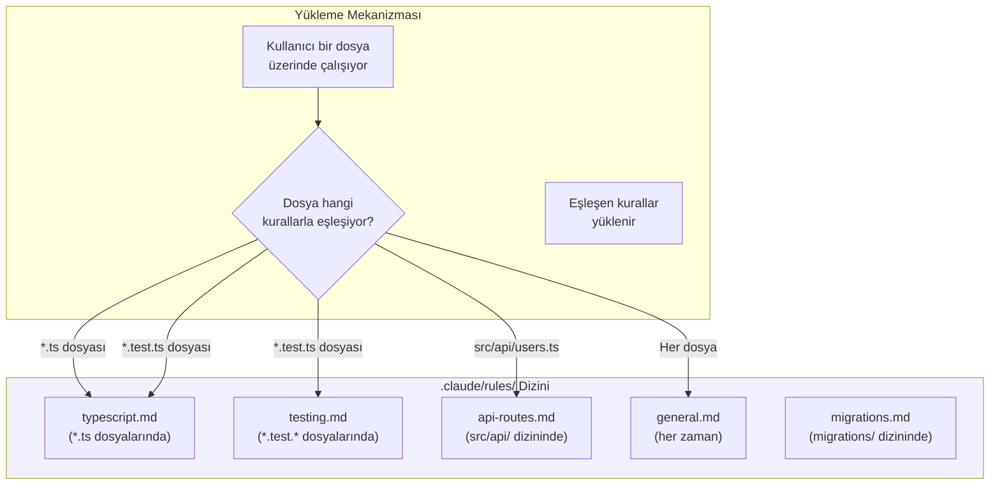
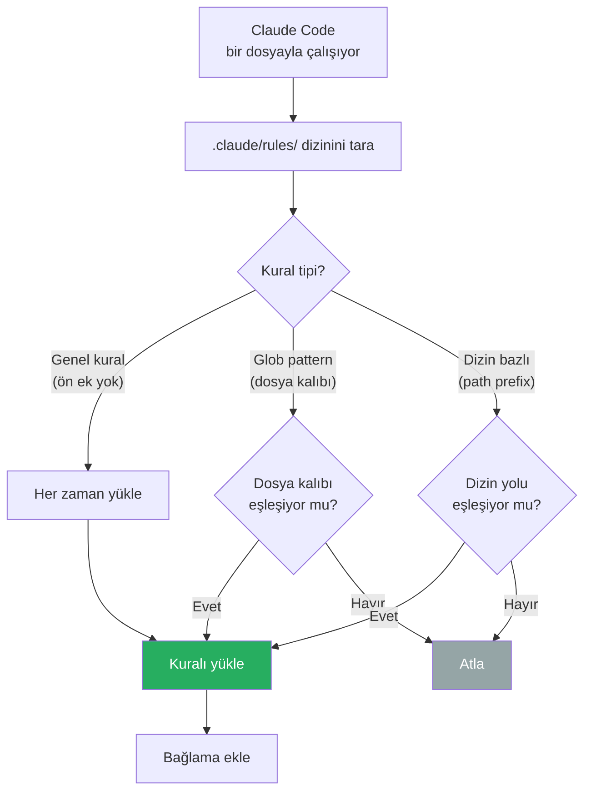
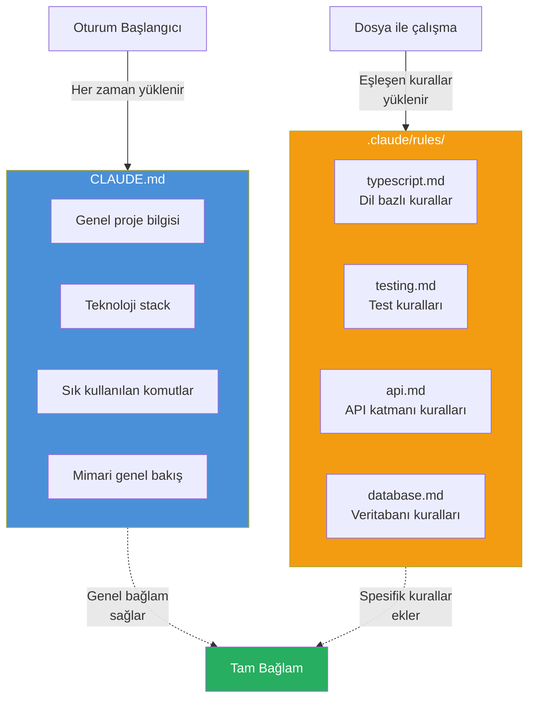

# Kurallar Dizini (.claude/rules/)

`.claude/rules/` dizini, kurallarınızı dosya tipine veya alt dizine göre **scope** (kapsam) bazlı organize etmenizi sağlar. CLAUDE.md'ye her şeyi yığmak yerine, kuralları mantıksal parçalara bölebilirsiniz.

## Ön Koşullar

| Konu | Bölüm |
|------|-------|
| CLAUDE.md dosyası | [CLAUDE.md Dosyası](./01-claude-md-dosyasi.md) |
| AGENTS.md ve diğer config'ler | [AGENTS.md ve Diğer Config](./02-agents-md-ve-diger-config.md) |

---

## Kurallar Dizini Nedir?

`.claude/rules/` içindeki her `.md` dosyası, belirli koşullar altında otomatik olarak yüklenen bir kural setidir. Dosya adındaki önek, kuralın ne zaman aktif olacağını belirler.



---

## Kural Yükleme Mekanizması

Kurallar, dosya adındaki kalıba (pattern) göre yüklenir:



---

## Dizin Yapısı Örneği

Bir tam teşekküllü proje için `.claude/rules/` yapısı:

```
my-project/
├── .claude/
│   ├── CLAUDE.md              # Genel proje kuralları (opsiyonel konum)
│   ├── settings.json          # İzin ayarları
│   └── rules/
│       ├── general.md         # Her zaman yüklenir
│       ├── typescript.md      # *.ts, *.tsx dosyalarında
│       ├── testing.md         # *.test.*, *.spec.* dosyalarında
│       ├── api.md             # src/api/ dizininde
│       ├── components.md      # src/components/ dizininde
│       ├── database.md        # src/database/, migrations/ dizinlerinde
│       └── docs.md            # docs/ dizininde, *.md dosyalarında
├── CLAUDE.md                  # Proje kök CLAUDE.md
├── src/
│   ├── api/
│   ├── components/
│   └── database/
└── ...
```

---

## Pratik Örnek 1: TypeScript Kuralları

`.claude/rules/typescript.md`:

```markdown
# TypeScript Kuralları

Bu kurallar *.ts ve *.tsx dosyalarında geçerlidir.

## Tip Güvenliği
- `any` tipi kullanma, yerine `unknown` kullan ve tip daraltması (type narrowing) yap
- Fonksiyon dönüş tiplerini açıkça belirt
- Interface yerine type kullan (basit tipler için), interface kullan (extend edilecek yapılar için)
- Generic tip parametrelerine açıklayıcı isimler ver (T yerine TItem, TResponse gibi)

## Import Kuralları
- Barrel export (index.ts) kullan
- Side-effect import'ları en üstte grupla
- Type-only import için `import type { ... }` kullan

## Hata Yönetimi
- Try-catch bloklarında hata tipini kontrol et
- Custom error sınıfları `src/errors/` altında tanımlı
- Asla hatayı sessizce yutma (empty catch block)
```

---

## Pratik Örnek 2: Test Dosyaları Kuralları

`.claude/rules/testing.md`:

```markdown
# Test Kuralları

Bu kurallar *.test.ts, *.test.tsx, *.spec.ts dosyalarında geçerlidir.

## Yapı
- describe bloğu: test edilen birim (fonksiyon/bileşen adı)
- it/test bloğu: "should [beklenen davranış] when [koşul]" formatında
- Arrange-Act-Assert (AAA) pattern'ini kullan

## Mock Kuralları
- Harici servisleri mock'la, iç modülleri mock'lama
- Mock veriler `__fixtures__/` dizininde
- API mock'ları için msw (Mock Service Worker) kullan

## Kapsam
- Her public fonksiyon için en az 1 happy path, 1 error case testi
- Edge case'leri test et: null, undefined, boş string, boş array
- Async fonksiyonlarda timeout senaryolarını test et

## Örnek Yapı
```typescript
describe('calculateTotal', () => {
  it('should return sum of item prices when items exist', () => {
    // Arrange
    const items = [{ price: 10 }, { price: 20 }];
    // Act
    const result = calculateTotal(items);
    // Assert
    expect(result).toBe(30);
  });

  it('should return 0 when items array is empty', () => {
    expect(calculateTotal([])).toBe(0);
  });
});
```
```

---

## Pratik Örnek 3: API Dizini Kuralları

`.claude/rules/api.md`:

```markdown
# API Katmanı Kuralları

Bu kurallar src/api/ dizinindeki dosyalarda geçerlidir.

## Endpoint Yapısı
- Her endpoint dosyası tek bir resource'u temsil eder
- HTTP metotları: GET (liste/detay), POST (oluştur), PUT (güncelle), DELETE (sil)
- Route parametreleri için Zod validasyonu zorunlu

## Yanıt Formatı
- Başarılı: `{ data: T, meta?: { page, total } }`
- Hata: `{ error: { code: string, message: string, details?: unknown } }`
- HTTP durum kodlarını doğru kullan (201 create, 204 delete, 404 not found)

## Güvenlik
- Tüm endpoint'ler auth middleware'den geçmeli
- Rate limiting middleware aktif
- Input validasyonu controller seviyesinde, business logic service seviyesinde

## Veritabanı
- Doğrudan SQL/Prisma sorgusu yazma, repository katmanını kullan
- Transaction gerektiren işlemlerde service katmanında transaction başlat
```

---

## Pratik Örnek 4: Veritabanı ve Migration Kuralları

`.claude/rules/database.md`:

```markdown
# Veritabanı Kuralları

Bu kurallar src/database/ ve migrations/ dizinlerinde geçerlidir.

## Migration Kuralları
- Her migration geri alınabilir (reversible) olmalı — up() ve down() tanımla
- Tablo ve kolon isimleri snake_case
- Foreign key'ler: [tablo_adi]_id formatında
- Index isimleri: idx_[tablo]_[kolonlar] formatında
- Büyük tablolarda migration'ı batch'lere böl

## Model Kuralları
- Her model dosyası tek bir entity tanımlar
- İlişkiler (relations) açıkça belirtilmeli
- Soft delete için deleted_at kolonu kullan
- Timestamp'ler: created_at, updated_at otomatik

## Seed Data
- Seed dosyaları idempotent olmalı (tekrar çalıştırılabilir)
- Test verileri `seeds/test/`, prod verileri `seeds/prod/` altında
```

---

## CLAUDE.md ile rules/ Dizininin İlişkisi



| Nereye Yazmalı? | CLAUDE.md | .claude/rules/*.md |
|-----------------|-----------|-------------------|
| Proje genel bilgisi | ✅ | ❌ |
| Build/test komutları | ✅ | ❌ |
| Dil bazlı kodlama kuralları | ❌ | ✅ |
| Dosya tipi bazlı kurallar | ❌ | ✅ |
| Dizin bazlı kurallar | ❌ | ✅ |
| Mimari genel bakış | ✅ | ❌ |
| Modüle özel mimari detaylar | ❌ | ✅ |

---

## Kural Dosyası Oluşturma İpuçları

1. **Dosya adı = kapsam:** Dosya adını kuralın uygulanacağı alanı yansıtacak şekilde seçin
2. **Kısa ve net:** Her kural dosyası 30-50 satır arasında olsun
3. **Çelişme kontrolü:** Farklı kural dosyalarındaki kuralların birbiriyle çelişmediğinden emin olun
4. **Örnekler ekleyin:** Soyut kurallar yerine somut örnekler verin
5. **Negatif kurallar:** "Yapma" listesi de ekleyin (anti-pattern'ler)

---

## Özet

| Kavram | Açıklama |
|--------|----------|
| **.claude/rules/** | Kapsam bazlı kural dosyaları dizini |
| **Glob pattern** | Dosya uzantısına göre eşleşme (*.ts, *.test.*) |
| **Dizin bazlı** | Belirli dizinlerde çalışırken yüklenen kurallar |
| **Genel kurallar** | Ön ek olmadan her zaman yüklenen kurallar |
| **CLAUDE.md ile ilişki** | CLAUDE.md genel, rules/ spesifik kurallar içerir |

---

## Sonraki Adım

Sizin yazdığınız kuralların yanı sıra, Claude Code da kendi öğrendiklerini otomatik olarak kaydeder. Otomatik bellek mekanizmasını inceleyelim:

→ [Otomatik Bellek (Auto Memory)](./04-otomatik-bellek.md)
