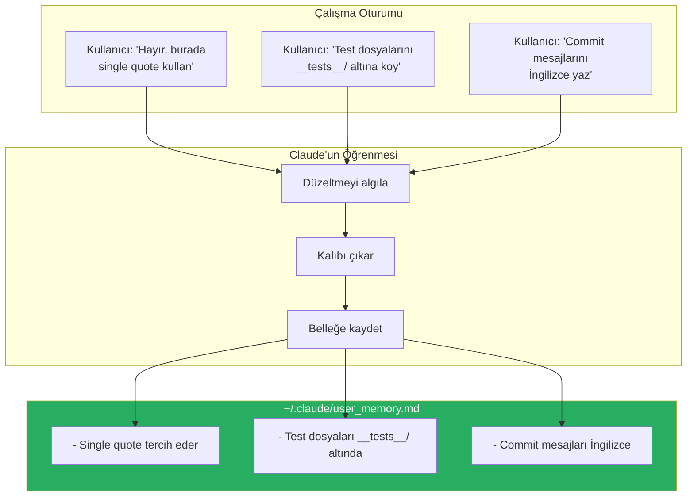
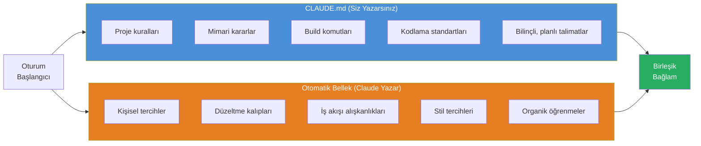
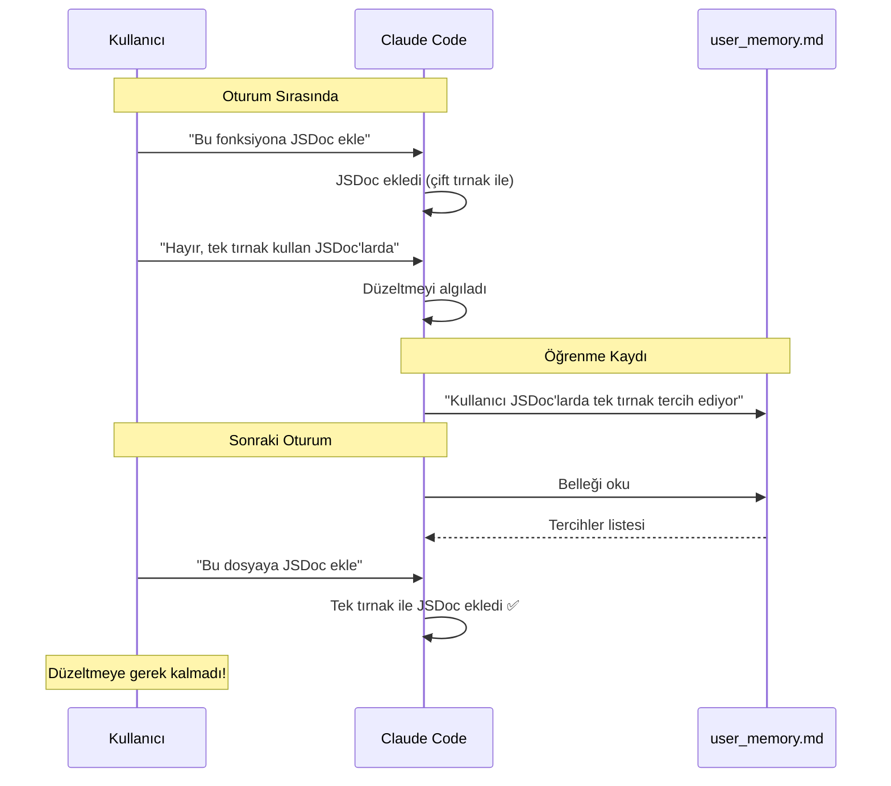
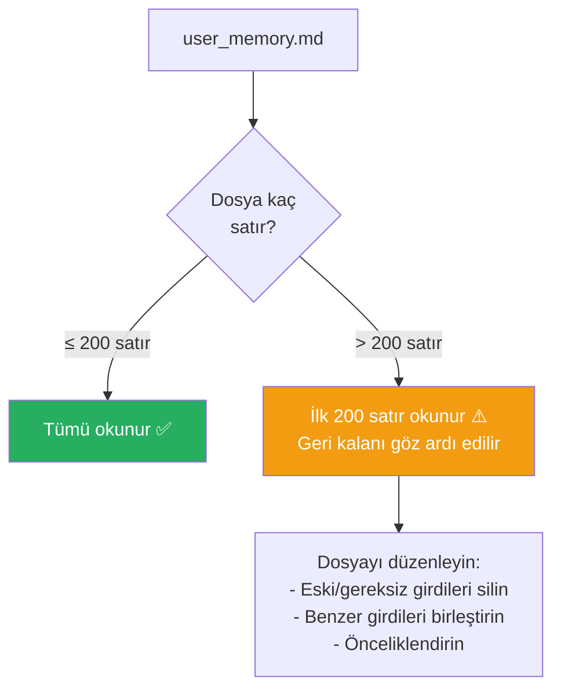
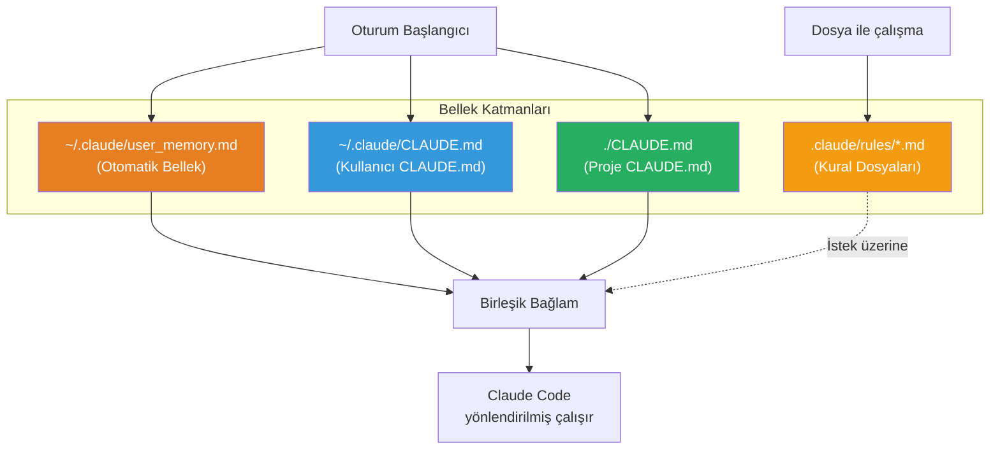

# Otomatik Bellek (Auto Memory)

Claude Code, sizin düzeltmelerinizden ve tercihlerinizden öğrendiklerini otomatik olarak kaydeden bir **auto memory** (otomatik bellek) mekanizmasına sahiptir. Bu dosya, CLAUDE.md'nin tamamlayıcısıdır — siz CLAUDE.md'yi yazarsınız, Claude otomatik belleği yazar.

## Ön Koşullar

| Konu | Bölüm |
|------|-------|
| CLAUDE.md dosyası | [CLAUDE.md Dosyası](./01-claude-md-dosyasi.md) |
| Kurallar dizini | [Kurallar Dizini](./03-kurallar-dizini.md) |

---

## Otomatik Bellek Nedir?

Claude Code, çalışma sırasında yaptığınız düzeltmeleri ve verdiğiniz geri bildirimleri fark eder. Bu öğrenmeleri `~/.claude/user_memory.md` dosyasına kaydeder ve sonraki oturumlarda bu bilgileri kullanır.



---

## CLAUDE.md vs Otomatik Bellek

İki bellek mekanizması birbirini tamamlar:



### Detaylı Karşılaştırma

| Özellik | CLAUDE.md | Otomatik Bellek |
|---------|-----------|-----------------|
| **Kim yazar** | Siz (geliştirici) | Claude Code |
| **Konum** | Proje kökü / user dizini | `~/.claude/user_memory.md` |
| **Kapsam** | Proje bazlı veya kullanıcı bazlı | Kullanıcı bazlı (tüm projeler) |
| **İçerik türü** | Bilinçli kurallar ve talimatlar | Öğrenilmiş tercihler ve kalıplar |
| **Boyut limiti** | Önerilen: 300 satır altı | İlk 200 satır ile sınırlı |
| **Versiyon kontrolü** | Evet (git ile) | Hayır (yerel dosya) |
| **Yükleme zamanı** | Oturum başlangıcı | Oturum başlangıcı |
| **Düzenlenebilir** | Evet | Evet (elle düzenleyebilirsiniz) |

---

## Otomatik Bellek Nasıl Çalışır?



### Öğrenme Tetikleyicileri

Claude Code şu durumlarda öğrenme kaydeder:

| Tetikleyici | Örnek | Kaydedilen Bilgi |
|-------------|-------|-----------------|
| **Düzeltme** | "Hayır, snake_case kullan" | İsimlendirme tercihi |
| **Tercih belirtme** | "Ben her zaman async/await kullanırım" | Kod stili tercihi |
| **Ret** | "Bu yaklaşımı istemiyorum, X yap" | Anti-pattern bilgisi |
| **Onay** | "Evet, tam böyle yap her seferinde" | Pozitif kalıp |

---

## Otomatik Bellek Dosyası Örneği

`~/.claude/user_memory.md` dosyasının tipik içeriği:

```markdown
- Kullanıcı Türkçe yanıt tercih ediyor
- Commit mesajları İngilizce ve Conventional Commits formatında
- TypeScript'te single quote kullanılıyor
- Import sıralaması: React > üçüncü parti > yerel > tipler
- Test dosyaları __tests__/ dizinine konuluyor
- Fonksiyon bileşenleri tercih ediliyor, class bileşen kullanılmıyor
- Hata mesajlarında kullanıcıya yönelik açıklama eklenmeli
- Console.log yerine proper logger kullanılmalı
- 2 boşluk indent tercih ediliyor
- Trailing comma kullanılıyor
- API yanıtlarında her zaman try-catch bloğu kullanılıyor
- Git branch isimlendirmesi: feature/kisa-aciklama formatında
```

---

## 200 Satır Limiti

Otomatik bellek dosyası **ilk 200 satır** ile sınırlıdır. Claude Code yalnızca bu satırları okur:



### Limit Yönetimi İpuçları

1. **Periyodik temizlik:** Ayda bir `~/.claude/user_memory.md`'yi gözden geçirin
2. **Eski girdileri silin:** Artık geçerli olmayan tercihleri kaldırın
3. **Birleştirin:** Benzer girdileri tek satırda birleştirin
4. **Projeye özel olanları taşıyın:** Proje bazlı kuralları CLAUDE.md'ye taşıyın

---

## Pratik Örnek 1: Otomatik Belleği İnceleme

```bash
# Otomatik bellek dosyasını görüntüleyin
$ cat ~/.claude/user_memory.md

# Satır sayısını kontrol edin
$ wc -l ~/.claude/user_memory.md

# Belirli bir tercihi arayın
$ grep -i "typescript" ~/.claude/user_memory.md
```

---

## Pratik Örnek 2: Otomatik Belleği Düzenleme

Otomatik bellek dosyasını elle düzenleyebilirsiniz:

```bash
# Editörle açın
$ code ~/.claude/user_memory.md    # VS Code
$ nano ~/.claude/user_memory.md    # Terminal editör
```

**Düzenleme önerileri:**

```markdown
# ÖNCE (dağınık, tekrarlı)
- Kullanıcı tek tırnak seviyor
- TypeScript'te single quote kullan
- Tırnak işareti olarak ' kullanılmalı
- Her zaman fonksiyon bileşeni yaz
- Class component kullanma
- Functional component tercih ediliyor

# SONRA (temiz, birleştirilmiş)
- Tırnak işareti: single quote (tek tırnak)
- Bileşen tipi: fonksiyon bileşenleri (class bileşen kullanma)
```

---

## Pratik Örnek 3: Bellek Katmanlarının Etkileşimi

Bir oturum başlangıcında tüm bellek katmanları birlikte yüklenir:



---

## Ne Zaman Hangisini Kullanmalı?

| Bilgi Türü | Otomatik Belleğe Bırak | CLAUDE.md'ye Yaz |
|-------------|:----------------------:|:----------------:|
| Kişisel stil tercihleri | ✅ | ❌ |
| Proje build komutları | ❌ | ✅ |
| Dil tercihi (Türkçe/İngilizce) | ✅ | ✅ |
| Mimari kararlar | ❌ | ✅ |
| İsimlendirme kuralları | Claude öğrenebilir | ✅ (güvenilir olması için) |
| Import sıralaması | Claude öğrenebilir | ✅ (güvenilir olması için) |
| Takım genelinde kurallar | ❌ | ✅ |

> **İpucu:** Kritik ve takım genelinde uyulması gereken kuralları her zaman CLAUDE.md'ye yazın. Otomatik belleğe güvenmek, bu kuralların kaybolma veya göz ardı edilme riski taşır.

---

## Özet

| Kavram | Açıklama |
|--------|----------|
| **Auto Memory** | Claude'un düzeltmelerden ve tercihlerden öğrendiği bilgileri kaydetmesi |
| **Dosya konumu** | `~/.claude/user_memory.md` |
| **200 satır limiti** | Yalnızca ilk 200 satır okunur |
| **Tamamlayıcı** | CLAUDE.md'nin yerine değil, yanına çalışır |
| **Düzenlenebilir** | Elle düzenleme, birleştirme ve temizlik yapılabilir |
| **Kapsam** | Kullanıcı bazlı, tüm projelerde geçerli |

---

## Sonraki Adım

Bellek mekanizmalarını öğrendik. Şimdi en kritik beceri olan context window yönetimini inceleyelim:

→ [Context Window Yönetimi](./05-context-window-yonetimi.md)
