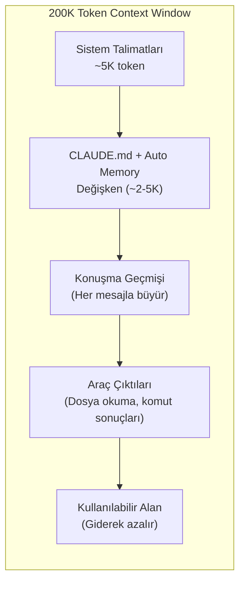
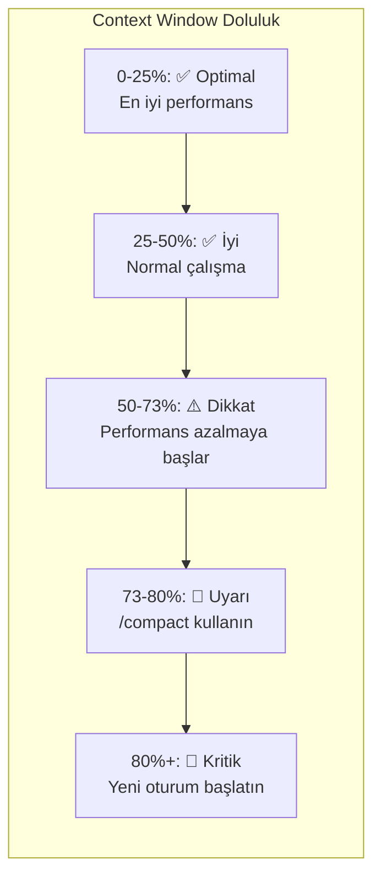
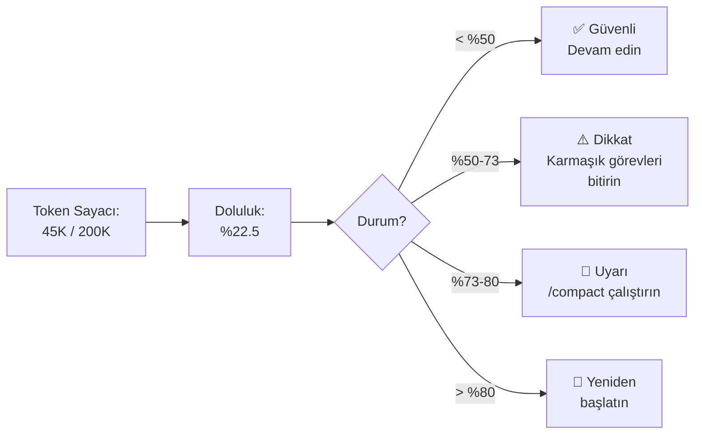
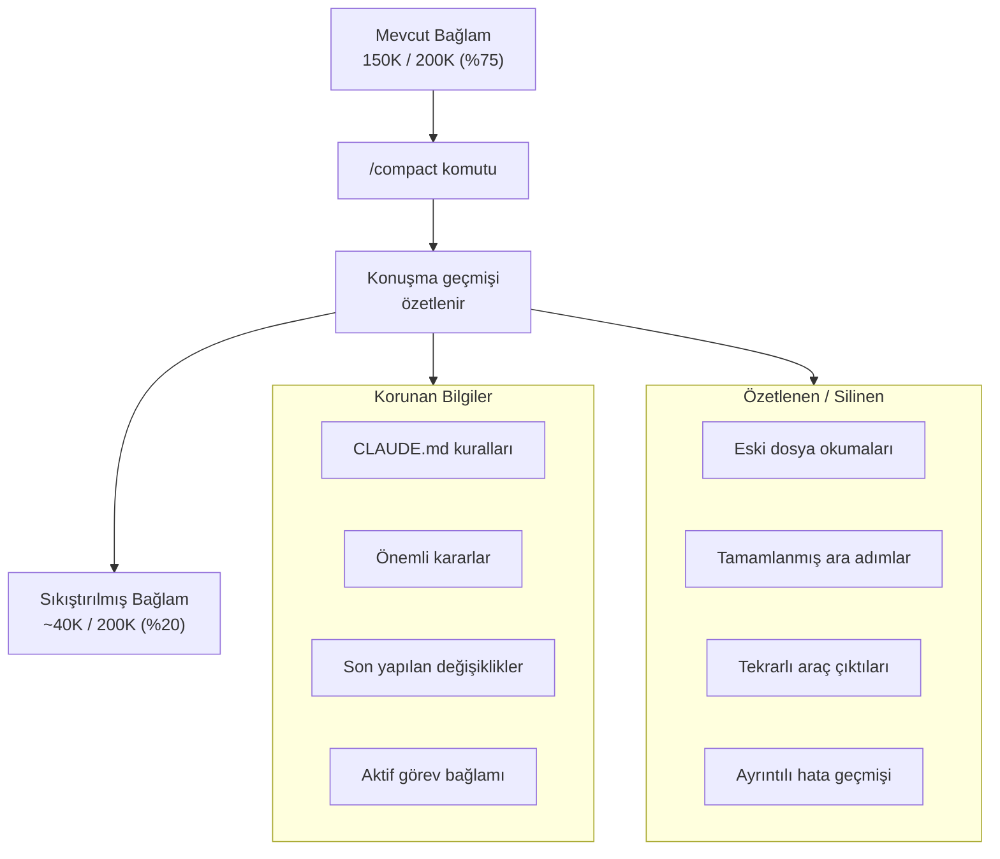
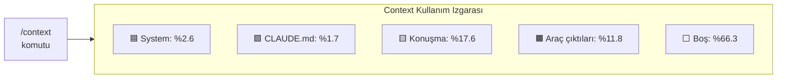
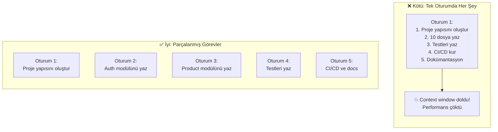
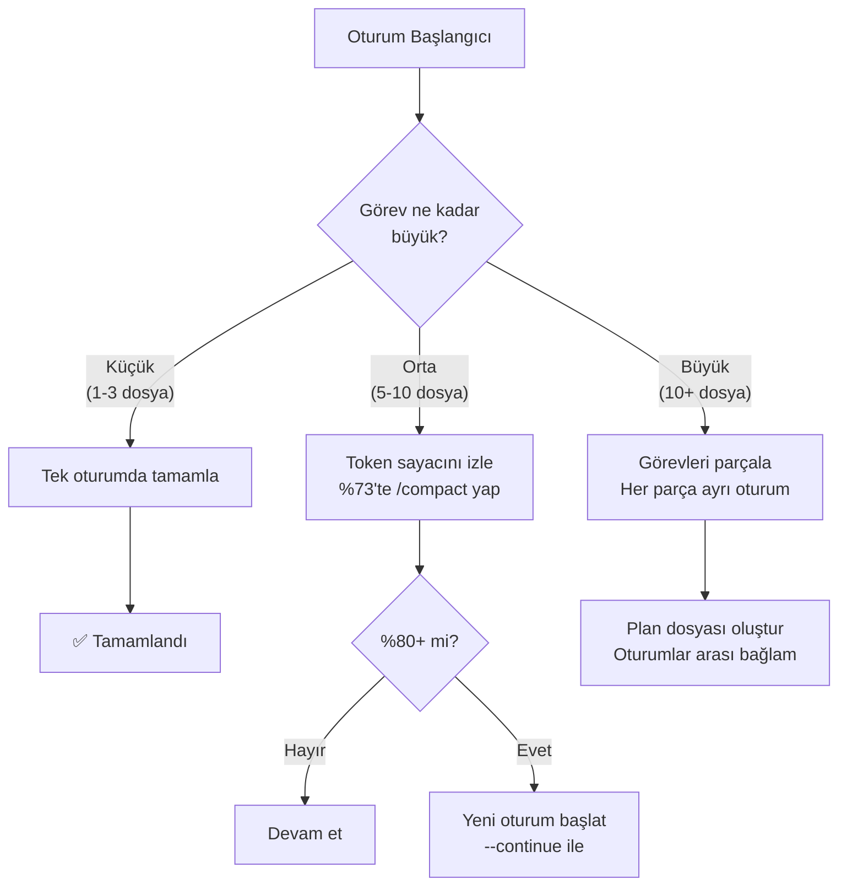

# Context Window Yönetimi

**Context window** (bağlam penceresi) yönetimi, Claude Code kullanımında edinmeniz gereken **en kritik beceri**dir. Context window dolmaya başladığında performans düşer, talimatlar göz ardı edilir ve hatalar artar. Bu bölümde token yönetimini, performans eğrisini ve pratik stratejileri öğreneceksiniz.

## Ön Koşullar

| Konu | Bölüm |
|------|-------|
| Claude Code nasıl çalışır | [Claude Code Nasıl Çalışır?](../06-claude-code-tanitim/02-claude-code-nasil-calisir.md) |
| CLAUDE.md dosyası | [CLAUDE.md Dosyası](./01-claude-md-dosyasi.md) |

---

## Context Window Nedir?

Context window, Claude'un bir oturumda aynı anda "görebildiği" bilgi miktarıdır. Claude Code 200.000 token (~150.000 kelime) kapasiteye sahiptir. Bu kapasite sabit olup, oturum boyunca şunlarla dolar:



---

## %80 Kuralı

Context window %80'e ulaştığında oturumu yeniden başlatmanız önerilir. Bu, performans düşüşünü önlemenin en basit kuralıdır.



---

## Performans Degradasyon Eğrisi

Context window doluluk oranı ile Claude Code performansı arasında doğrudan bir ilişki vardır:

```
Performans (%)
100 ┤ ■■■■
 95 ┤■■■■■■■■■■■■
 90 ┤            ■■■■■
 85 ┤                 ■■■■
 80 ┤                     ■■■
 75 ┤                        ■■■
 70 ┤                           ■■
 65 ┤                             ■■
 60 ┤                               ■■
 55 ┤                                 ■
 50 ┤                                  ■
 45 ┤                                   ■■
 40 ┤                                     ■
 35 ┤                                      ■
 30 ┤                                       ■
 25 ┤                                        ■
 20 ┤                                         ■
 15 ┤                                          ■
    └──────────────────────────────────────────────
     0   10   20   30   40   50   60   70   80  90  100
                        Doluluk (%)

     ■■■■ Optimal    ■■■■ İyi    ■■■■ Dikkat    ■■■■ Uyarı    ■■ Kritik
     (0-25%)         (25-50%)    (50-73%)        (73-80%)      (80%+)
```

### Performans Aşamaları

| Doluluk Aralığı | Performans | Belirtiler | Eylem |
|-----------------|-----------|------------|-------|
| **0-25%** | ⭐ Pik performans | Talimatlar eksiksiz takip edilir, yaratıcı çözümler | Normal çalışma |
| **25-50%** | ✅ İyi | Hafif sapma olabilir ama genel kalite yüksek | Normal çalışma |
| **50-73%** | ⚠️ Azalan | CLAUDE.md kuralları ara sıra göz ardı edilebilir | `/compact` kullanmayı düşünün |
| **73-80%** | 🔶 Düşük | Talimat takibi belirgin şekilde azalır, tekrarlar artar | `/compact` kullanın |
| **80%+** | 🔴 Kritik | Kurallar sıkça göz ardı edilir, hatalar artar, döngüler oluşur | Yeni oturum başlatın |

---

## Token Sayacını İzleme

Claude Code, **status bar** (durum çubuğu) üzerinde token kullanımını gösterir:

```
> claude
╭──────────────────────────────────────────╮
│ Claude Code                    ◼ 45K/200K│
╰──────────────────────────────────────────╯
```

### Token Sayacı Okuma Rehberi



---

## /compact Komutu

`/compact` komutu, konuşma geçmişini özetleyerek context window'da yer açar:

```bash
# Temel kullanım
> /compact

# Özel odak noktasıyla compact
> /compact auth modülündeki değişikliklere odaklan
```

### /compact Nasıl Çalışır?



### /compact Ne Zaman Kullanılmalı?

| Durum | /compact Önerisi |
|-------|------------------|
| Token sayacı %73+ | ✅ Hemen kullanın |
| Uzun oturumda ara verirken | ✅ Bağlamı temizleyin |
| Farklı bir göreve geçerken | ✅ Önceki bağlamı özetletin |
| Kısa, odaklı bir oturumdaysanız | ❌ Gerek yok |
| Kritik bir görevin ortasındaysanız | ⚠️ Dikkatli olun, görev bağlamı kaybolabilir |

---

## /context Komutu

`/context` komutu, context window kullanımını renkli bir ızgara olarak görselleştirir:

```bash
> /context
```

### Örnek Çıktı

```
Context usage: 67,340 / 200,000 tokens (33.7%)

████████████████████████████████████░░░░░░░░░░░░░░░░░░░░░░░░░░░░░░░░░░

  System:       ██ 5,200 (2.6%)
  CLAUDE.md:    ██ 3,400 (1.7%)
  Conversation: ████████████ 35,200 (17.6%)
  Tool outputs: ████████ 23,540 (11.8%)
  Available:    ░░░░░░░░░░░░░░░░░░░░░░░░ 132,660 (66.3%)
```



---

## Görev Parçalama (Task Chunking) Stratejileri

Büyük görevleri tek bir oturumda yapmaya çalışmak context window'u hızla doldurur. Bunun yerine görevleri parçalayın:



### Parçalama Stratejileri

| Strateji | Açıklama | Örnek |
|----------|----------|-------|
| **Modül bazlı** | Her modülü ayrı oturumda | Auth → Products → Orders |
| **Katman bazlı** | Her katmanı ayrı oturumda | Database → Service → API → UI |
| **İşlem bazlı** | Her işlem türünü ayrı oturumda | Oluştur → Test → Refactor |
| **Dosya bazlı** | Büyük dosyaları ayrı oturumda | Her 5-10 dosya için yeni oturum |

---

## Pratik Örnek 1: Context Window İzleme Akışı

```bash
# 1. Oturumu başlatın
$ claude

# 2. Token durumunu kontrol edin
> /context

# 3. Görevinizi verin
> Auth modülü için rate limiting middleware yaz

# 4. Görev uzadığında tekrar kontrol edin
> /context

# 5. %73+ ise compact yapın
> /compact auth göreviyle ilgili bağlamı koru

# 6. %80+ ise yeni oturum başlatın
> /exit
$ claude
> Auth modülünde kaldığım yerden devam et, rate limiting middleware'i tamamla
```

---

## Pratik Örnek 2: Verimli Token Kullanımı

Token tüketimini azaltmak için yapılabilecekler:

```bash
# ❌ Kötü: Tüm dosyaları okutma
> Projedeki tüm dosyaları oku ve analiz et

# ✅ İyi: Spesifik dosya iste
> src/auth/middleware.ts dosyasını oku

# ❌ Kötü: Belirsiz görev
> Bu projeyi iyileştir

# ✅ İyi: Odaklı görev
> src/auth/middleware.ts'deki rate limiting fonksiyonuna
> Redis cache desteği ekle

# ❌ Kötü: Çıktıyı gereksiz yere büyütme
> Tüm test sonuçlarını göster

# ✅ İyi: Özetli çıktı
> Testleri çalıştır, sadece başarısız olanları göster
```

---

## Pratik Örnek 3: Büyük Proje Stratejisi

50+ dosyalık bir projeyi refactor etmeniz gerekiyorsa:

```bash
# Oturum 1: Analiz ve plan
$ claude
> Bu projenin yapısını analiz et ve refactoring planı oluştur.
> Planı REFACTORING-PLAN.md dosyasına kaydet.

# Oturum 2: İlk modül
$ claude
> REFACTORING-PLAN.md'yi oku. Adım 1'i uygula: auth modülü refactoring.

# Oturum 3: İkinci modül
$ claude
> REFACTORING-PLAN.md'yi oku. Adım 2'yi uygula: product modülü refactoring.

# Her oturum temiz bağlamla başlar!
```

Bu yaklaşımın avantajı, her oturumun temiz bir context window ile başlamasıdır. Plan dosyası, oturumlar arasında bağlam aktarımını sağlar.

---

## Context Window Yönetim Kontrol Listesi



---

## Özet

| Kavram | Açıklama |
|--------|----------|
| **Context Window** | Claude'un aynı anda görebildiği 200K token'lık bilgi penceresi |
| **%80 Kuralı** | %80 dolulukta yeni oturum başlatın |
| **Performans eğrisi** | 0-25% optimal → 73%+ ciddi düşüş |
| **/compact** | Konuşma geçmişini özetleyerek yer açar |
| **/context** | Token kullanımını görselleştirir |
| **Task chunking** | Büyük görevleri parçalayarak context overflow'u önleme |

---

## Sonraki Adım

Context window dolduysa veya farklı bir göreve geçecekseniz oturumu yönetmeniz gerekir. Oturum yönetimi mekanizmalarını inceleyelim:

→ [Oturum Yönetimi](./06-oturum-yonetimi.md)
