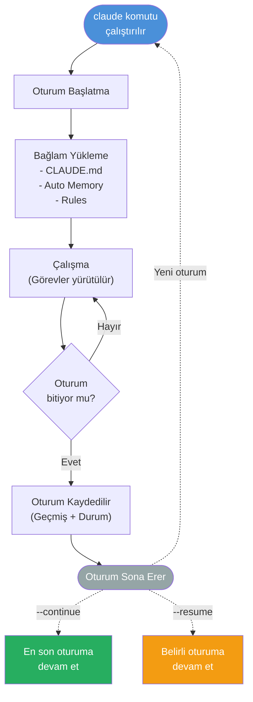
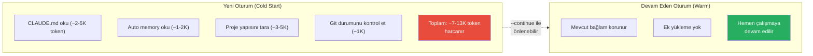
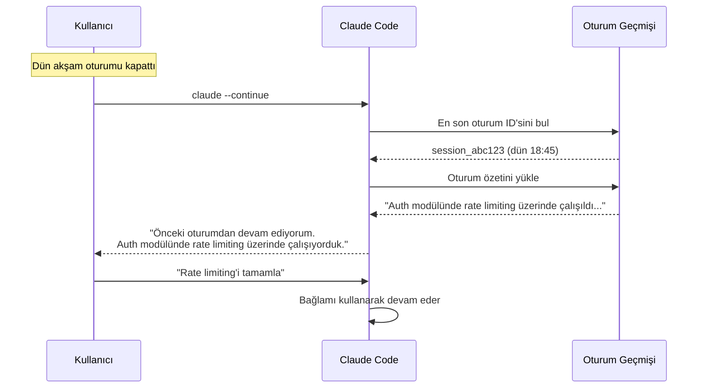
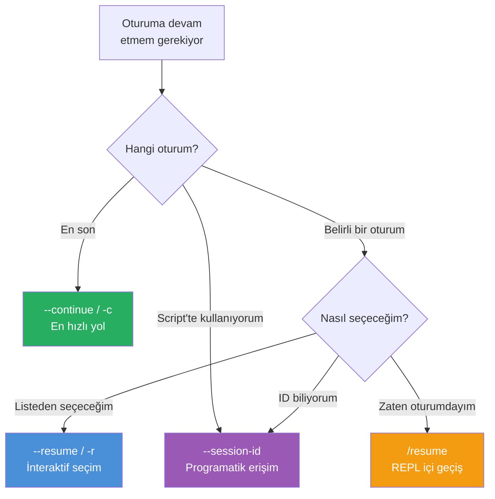
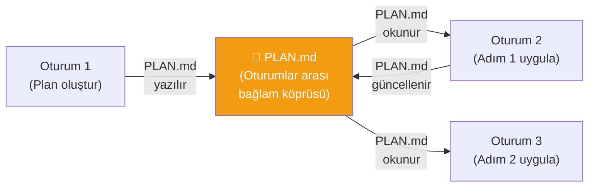

# Oturum Yönetimi (Session Management)

Claude Code her çalıştırıldığında bir **session** (oturum) oluşturur. Oturumlar arasında geçiş yapmak, önceki oturuma devam etmek ve oturum geçmişini yönetmek günlük iş akışınızın önemli bir parçasıdır. Bu bölümde `--continue`, `--resume`, `--session-id` ve `/resume` mekanizmalarını öğreneceksiniz.

## Ön Koşullar

| Konu | Bölüm |
|------|-------|
| Context window yönetimi | [Context Window Yönetimi](./05-context-window-yonetimi.md) |
| Claude Code temel kullanım | [Bölüm 06](../06-claude-code-tanitim/README.md) |

---

## Oturum Yaşam Döngüsü

Her Claude Code oturumu bir yaşam döngüsüne sahiptir:



---

## Cold Start Tax (Soğuk Başlangıç Maliyeti)

Her yeni oturum başlatıldığında, Claude Code'un bağlamı yeniden oluşturması gerekir. Bu, token harcaması anlamına gelir:



| Senaryo | Token Maliyeti | Açıklama |
|---------|---------------|----------|
| **Yeni oturum** | ~7-13K token | CLAUDE.md, memory, proje taraması |
| **--continue** | ~2-3K token | Sadece oturum özeti yüklenir |
| **--resume** | ~2-3K token | Belirli oturum bağlamı yüklenir |
| **Aynı oturumda devam** | 0 token | Bağlam zaten mevcut |

---

## Oturum Devam Yöntemleri

### 1. --continue / -c (En Son Oturuma Devam)

En son oturumdan kaldığınız yerden devam etmek için:

```bash
# En son oturuma devam et
$ claude --continue

# Kısa form
$ claude -c

# Devam ederken yeni bir görev verin
$ claude -c "Dün kaldığım auth modülündeki rate limiting'i tamamla"
```



### 2. --resume / -r (Belirli Oturumu Seç)

Birden fazla oturum arasından seçim yapmak için:

```bash
# Oturum listesinden seçim yap (interaktif)
$ claude --resume

# Kısa form
$ claude -r
```

Komut çalıştırıldığında oturum listesi gösterilir:

```
Recent sessions:
  1. [2 saat önce] Auth modülü rate limiting
  2. [5 saat önce] Product sayfa tasarımı
  3. [dün] Veritabanı migration'ları
  4. [2 gün önce] CI/CD pipeline kurulumu

Select a session (1-4):
```

### 3. --session-id (Script'lerde Kullanım)

Otomasyon ve script'lerde belirli bir oturum ID'si ile devam etmek için:

```bash
# Belirli bir oturum ID'si ile devam et
$ claude --session-id "abc123def456"

# CI/CD pipeline'ında kullanım
$ claude --session-id "$SESSION_ID" "Pipeline hatalarını kontrol et"
```

### 4. /resume (REPL İçinde)

Aktif bir oturumdayken başka bir oturuma geçmek için:

```bash
$ claude
> /resume
# Oturum listesi gösterilir ve seçim yapılır
```

---

## Yöntem Karşılaştırması



| Yöntem | Kullanım | Senaryo |
|--------|----------|---------|
| `--continue` / `-c` | `claude -c` | Günlük kullanım, en son kaldığınız yer |
| `--resume` / `-r` | `claude -r` | Birkaç gün önceki oturuma dönmek |
| `--session-id` | `claude --session-id "id"` | CI/CD, otomasyon, script'ler |
| `/resume` | REPL içinde `/resume` | Oturum içinde başka oturuma geçiş |

---

## Pratik Örnek 1: Günlük İş Akışı

```bash
# Sabah: Dünkü oturuma devam et
$ claude -c
> Dün nerede kalmıştık?

# Claude önceki bağlamı hatırlar:
# "Dün auth modülünde rate limiting middleware'i üzerinde
#  çalışıyorduk. Redis cache entegrasyonu kalmıştı."

> Redis cache entegrasyonunu tamamla

# ... çalışma ...

# Öğleden sonra: Farklı bir görev
$ claude
> Product listesi için sayfalama ekle

# ... çalışma ...

# Akşam: Sabahki auth oturumuna dön
$ claude -r
# Listeden "Auth modülü rate limiting" oturumunu seç
```

---

## Pratik Örnek 2: Script'te Oturum Yönetimi

```bash
#!/bin/bash
# deploy-check.sh — Deployment öncesi kontrol script'i

SESSION_ID="deploy-check-$(date +%Y%m%d)"

# İlk çalıştırma veya devam
claude --session-id "$SESSION_ID" "
  1. Tüm testleri çalıştır
  2. Lint hatalarını kontrol et
  3. Build'in başarılı olduğunu doğrula
  4. Sonuçları DEPLOY-CHECK.md'ye yaz
"

# Sonucu kontrol et
if [ -f "DEPLOY-CHECK.md" ]; then
  echo "Kontrol tamamlandı, rapor hazır."
else
  echo "Kontrol başarısız."
  exit 1
fi
```

---

## Pratik Örnek 3: Oturum Arası Bağlam Aktarımı

Oturumlar arası bağlam aktarmak için dosya kullanma stratejisi:

```bash
# Oturum 1: Plan oluştur
$ claude
> Bu projenin refactoring planını oluştur ve REFACTORING-PLAN.md'ye kaydet
> /exit

# Oturum 2: Planı uygula (temiz context window ile)
$ claude
> REFACTORING-PLAN.md'yi oku ve Adım 1'i uygula
> Tamamladığın adımları REFACTORING-PLAN.md'de işaretle
> /exit

# Oturum 3: Devam et
$ claude
> REFACTORING-PLAN.md'yi oku ve bir sonraki tamamlanmamış adımı uygula
```



---

## Oturum Geçmişi

Claude Code tüm oturum geçmişini yerel olarak saklar:

```bash
# Oturum geçmişi konumu
~/.claude/sessions/

# Son oturumları listele (--resume ile)
$ claude --resume
```

### Oturum Geçmişinde Saklanan Bilgiler

| Bilgi | Açıklama |
|-------|----------|
| **Oturum ID** | Benzersiz tanımlayıcı |
| **Başlangıç zamanı** | Oturumun ne zaman başladığı |
| **Konuşma geçmişi** | Tüm mesajlar ve araç çıktıları |
| **Çalışma dizini** | Oturumun hangi projede çalıştığı |
| **Oturum özeti** | Compact sonrası oluşan özet |

---

## Özet

| Kavram | Açıklama |
|--------|----------|
| **Session** | Claude Code'un tek bir çalışma birimi |
| **Cold start tax** | Yeni oturumda bağlam yeniden oluşturma maliyeti (~7-13K token) |
| **--continue / -c** | En son oturuma devam etmenin en hızlı yolu |
| **--resume / -r** | Belirli bir oturumu seçerek devam etme |
| **--session-id** | Programatik erişim için oturum ID'si belirtme |
| **/resume** | REPL içinde oturum geçişi |
| **Dosya ile bağlam aktarımı** | Plan dosyaları aracılığıyla oturumlar arası bağlam köprüsü |

---

## Sonraki Adım

Oturumlar arası geçişin ötesinde, bir oturum içindeki değişiklikleri izlemek ve geri almak için checkpointing mekanizmasını inceleyelim:

→ [Checkpointing](./07-checkpointing.md)
