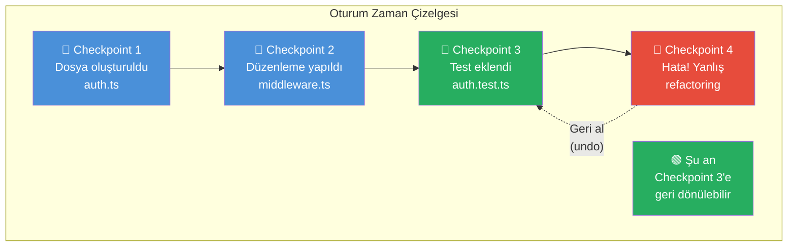
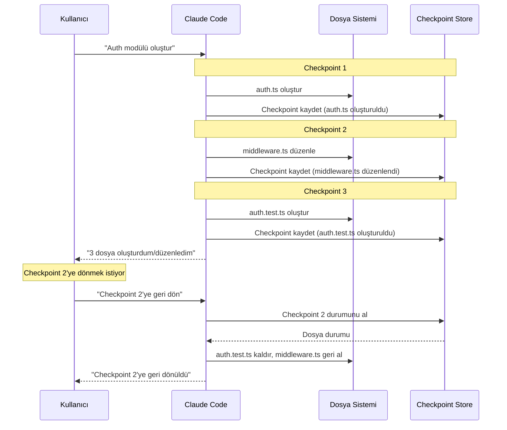
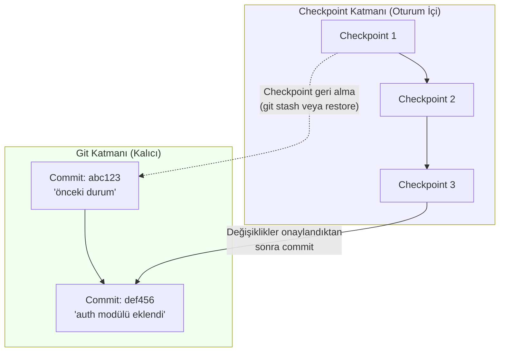
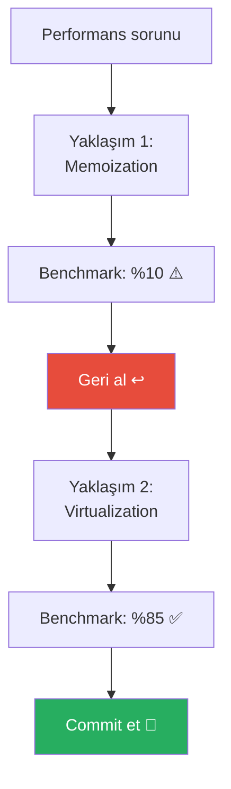
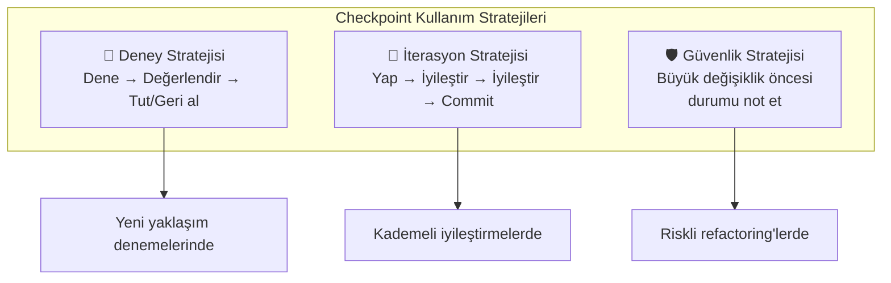

# Checkpointing

**Checkpointing** (kontrol noktası), Claude Code'un yaptığı değişiklikleri izlemenizi, belirli bir noktaya geri dönmenizi ve oturum durumunu yönetmenizi sağlayan bir mekanizmadır. Bir "geri al" (undo) sistemi gibi düşünebilirsiniz — ancak dosya bazında değil, oturum bazında çalışır.

## Ön Koşullar

| Konu | Bölüm |
|------|-------|
| Oturum yönetimi | [Oturum Yönetimi](./06-oturum-yonetimi.md) |
| Claude Code temel kullanım | [Bölüm 06](../06-claude-code-tanitim/README.md) |

---

## Checkpointing Nedir?

Claude Code her araç çağrısından sonra otomatik olarak bir **checkpoint** (kontrol noktası) oluşturur. Bu checkpoint, o anki dosya durumunun bir anlık görüntüsünü (snapshot) saklar. İstediğiniz zaman herhangi bir checkpoint'e geri dönebilirsiniz.



---

## Checkpoint Yaşam Döngüsü



---

## Checkpoint Kullanımı

### Değişiklikleri Görüntüleme

Claude Code oturum boyunca yaptığı tüm değişiklikleri izler. Değişiklikleri görmek için:

```bash
# Oturumdaki değişiklikleri sor
> Bu oturumda hangi dosyaları değiştirdin?

# Claude yanıtlar:
# Bu oturumda şu değişiklikleri yaptım:
# 1. ✏️ src/auth/auth.ts (oluşturuldu)
# 2. ✏️ src/auth/middleware.ts (düzenlendi, 15 satır değişti)
# 3. ✏️ src/auth/auth.test.ts (oluşturuldu)
```

### Geri Alma (Undo)

Yapılan değişiklikleri geri almak için:

```bash
# Son değişikliği geri al
> Son yaptığın değişikliği geri al

# Belirli bir dosyadaki değişikliği geri al
> middleware.ts'deki değişiklikleri geri al

# Belirli bir noktaya kadar geri al
> Auth modülü oluşturulmadan önceki duruma dön
```

---

## Checkpoint ile Git Entegrasyonu

Checkpointing, Git ile birlikte çalışarak güvenli bir geri alma mekanizması sağlar:



### Checkpoint vs Git Karşılaştırması

| Özellik | Checkpoint | Git Commit |
|---------|-----------|------------|
| **Oluşturma** | Otomatik (her araç çağrısında) | Manuel (`git commit`) |
| **Granülerlik** | Çok ince (her işlem) | Kullanıcı tanımlı |
| **Kalıcılık** | Oturum süresince | Kalıcı |
| **Geri alma** | Anında, Claude Code ile | `git revert`, `git reset` |
| **Paylaşılabilirlik** | Hayır (yerel) | Evet (push/pull) |
| **Kullanım amacı** | Deney, iterasyon | Kalıcı kayıt |

---

## Pratik Örnek 1: Güvenli Refactoring

```bash
$ claude
> UserService sınıfını küçük servislere böl

# Claude çalışıyor...
# Checkpoint 1: UserService analiz edildi
# Checkpoint 2: AuthService ayrıldı
# Checkpoint 3: ProfileService ayrıldı
# Checkpoint 4: NotificationService ayrıldı

# Sonuçları değerlendirin
> Testleri çalıştır

# Eğer testler başarısız olursa:
> NotificationService'deki değişiklikleri geri al,
> geri kalan değişiklikler kalsın

# Sadece Checkpoint 4 geri alınır
# Checkpoint 2 ve 3'teki değişiklikler korunur
```

---

## Pratik Örnek 2: Deneme-Yanılma Yaklaşımı

```bash
$ claude

# Yaklaşım 1'i deneyin
> Bu performans sorununu memoization ile çöz

# Sonucu değerlendirin
> Benchmark çalıştır
# Sonuç: %10 iyileşme (yetersiz)

# Geri alın
> Bu değişiklikleri geri al

# Yaklaşım 2'yi deneyin
> Aynı sorunu virtualization ile çöz

# Sonucu değerlendirin
> Benchmark çalıştır
# Sonuç: %85 iyileşme (mükemmel!)

# Bu yaklaşımı tutun
> Bu değişiklikleri commit et
```



---

## Pratik Örnek 3: Kısmi Geri Alma

Birden fazla dosya değiştiğinde yalnızca bazılarını geri alabilirsiniz:

```bash
$ claude
> Auth modülünü refactor et ve testlerini güncelle

# Claude 5 dosyayı değiştirdi:
# 1. src/auth/service.ts ✅ (iyi)
# 2. src/auth/handler.ts ✅ (iyi)
# 3. src/auth/types.ts ✅ (iyi)
# 4. src/auth/middleware.ts ❌ (istenmeyen değişiklik)
# 5. src/auth/auth.test.ts ✅ (iyi)

> Sadece middleware.ts'deki değişiklikleri geri al,
> diğer dosyalardaki değişiklikler kalsın
```

---

## Checkpoint Yönetim Stratejileri



| Strateji | Ne Zaman Kullanılır | Örnek |
|----------|--------------------|----|
| **Deney** | Farklı çözümleri karşılaştırırken | A/B yaklaşım testi |
| **İterasyon** | Kademeli iyileştirmeler yaparken | UI bileşeni geliştirme |
| **Güvenlik** | Büyük değişiklikler öncesinde | Veritabanı şeması değişikliği |

---

## İpuçları

1. **Büyük görevlerden önce commit yapın:** Checkpointing oturum içi bir mekanizmadır; güvenli bir geri dönüş noktası için git commit kullanın
2. **Checkpoint durumunu sorun:** Claude'a "bu oturumda ne değiştirdin?" diye sorarak mevcut durumu görün
3. **Kısmi geri alma:** Tüm değişiklikleri geri almak zorunda değilsiniz; belirli dosyaları hedefleyebilirsiniz
4. **Deneme-yanılma:** Checkpointing sayesinde farklı yaklaşımları güvenle deneyebilirsiniz

---

## Özet

| Kavram | Açıklama |
|--------|----------|
| **Checkpoint** | Claude Code'un her araç çağrısından sonra oluşturduğu anlık görüntü |
| **Undo** | Belirli bir checkpoint'e geri dönme yeteneği |
| **Granülerlik** | Dosya bazında veya işlem bazında geri alma |
| **Git ile ilişki** | Checkpoint oturum içi; git commit kalıcı kayıt |
| **Deney güvenliği** | Farklı yaklaşımları risk almadan deneme imkanı |

---

## Sonraki Adım

Tek oturum yönetiminin ötesinde, birden fazla görevi paralel olarak yürütmek için Git worktree mekanizmasını inceleyelim:

→ [Worktree ile Paralel Çalışma](./08-worktree-ile-paralel-calisma.md)
