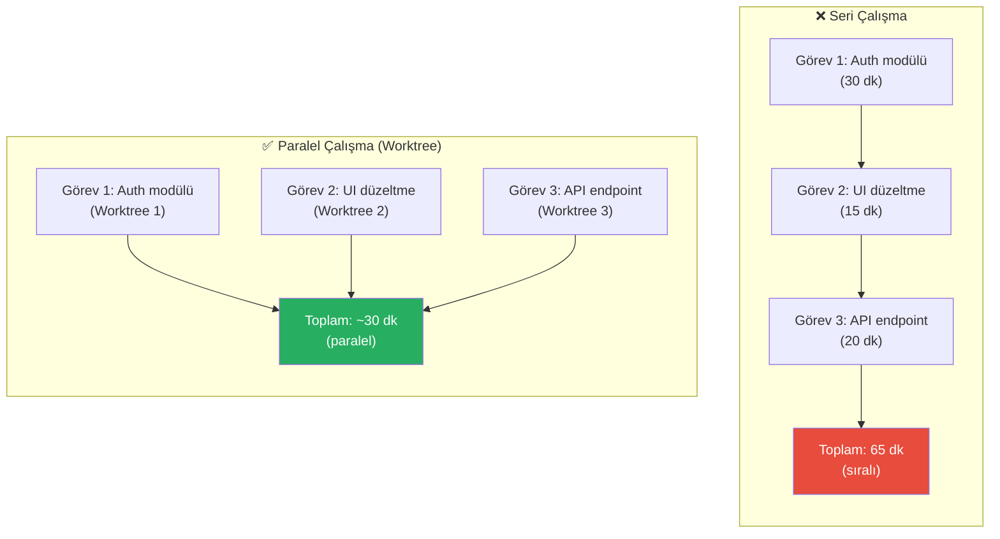
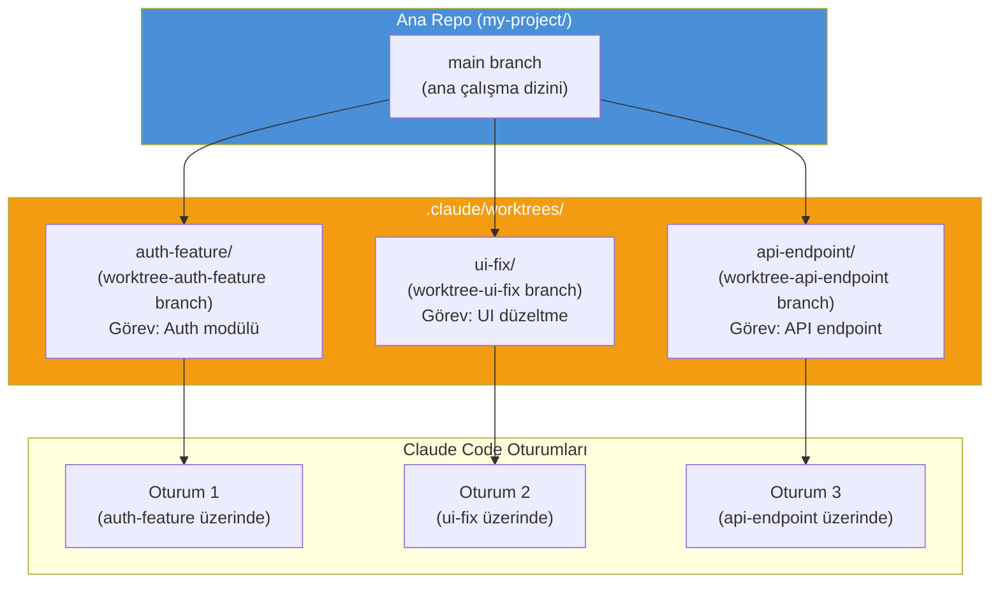
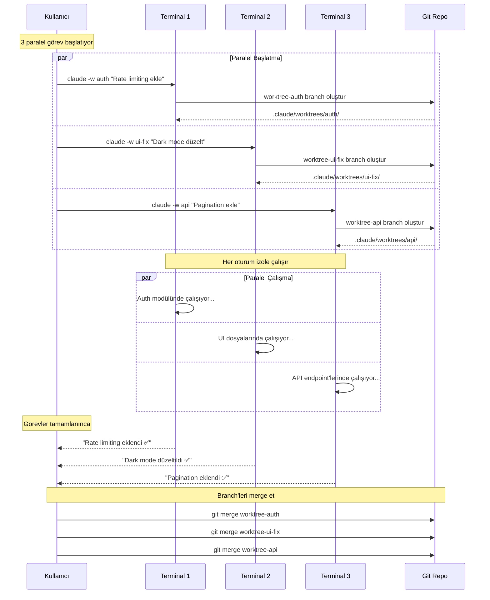
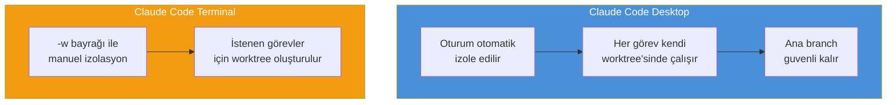
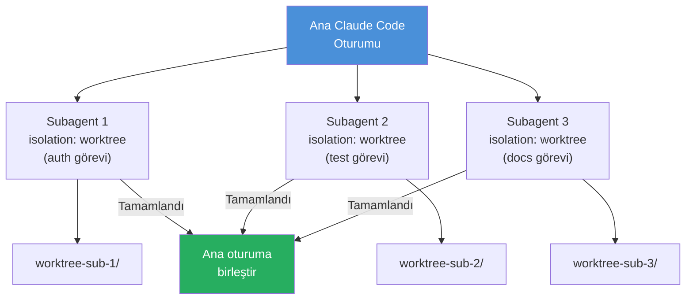
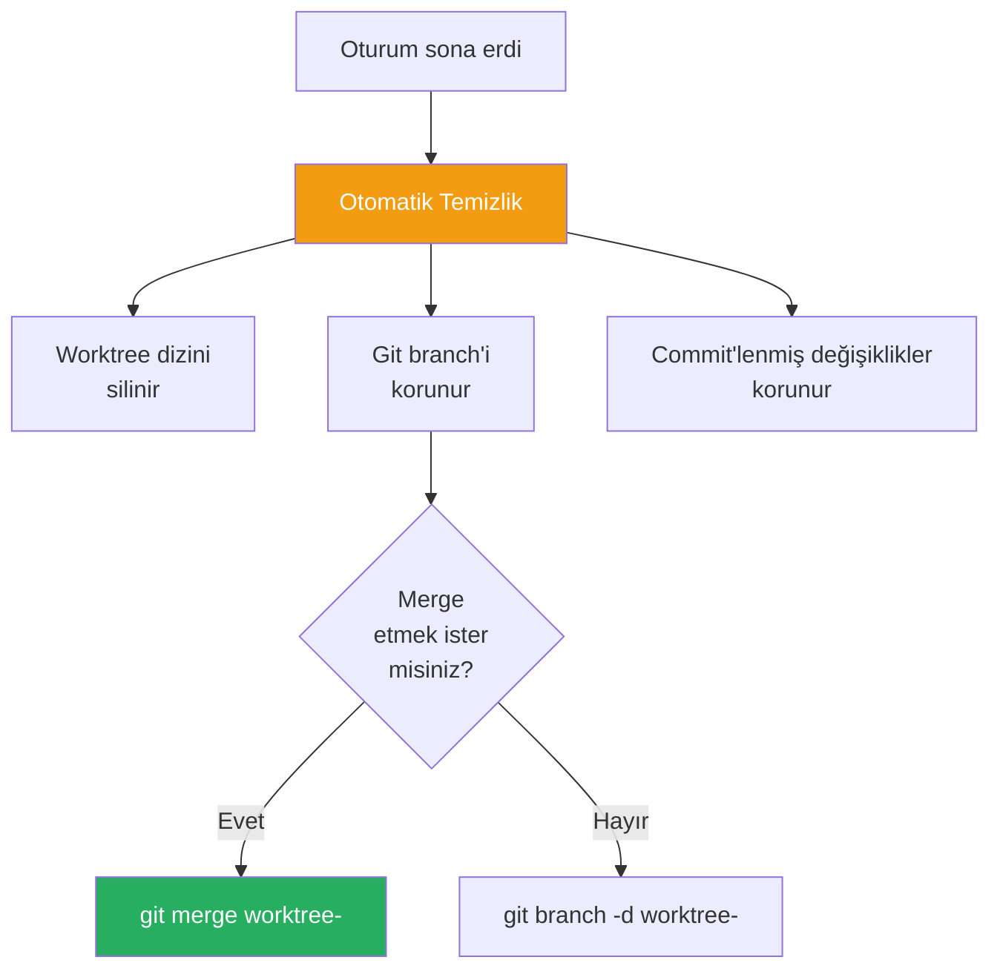
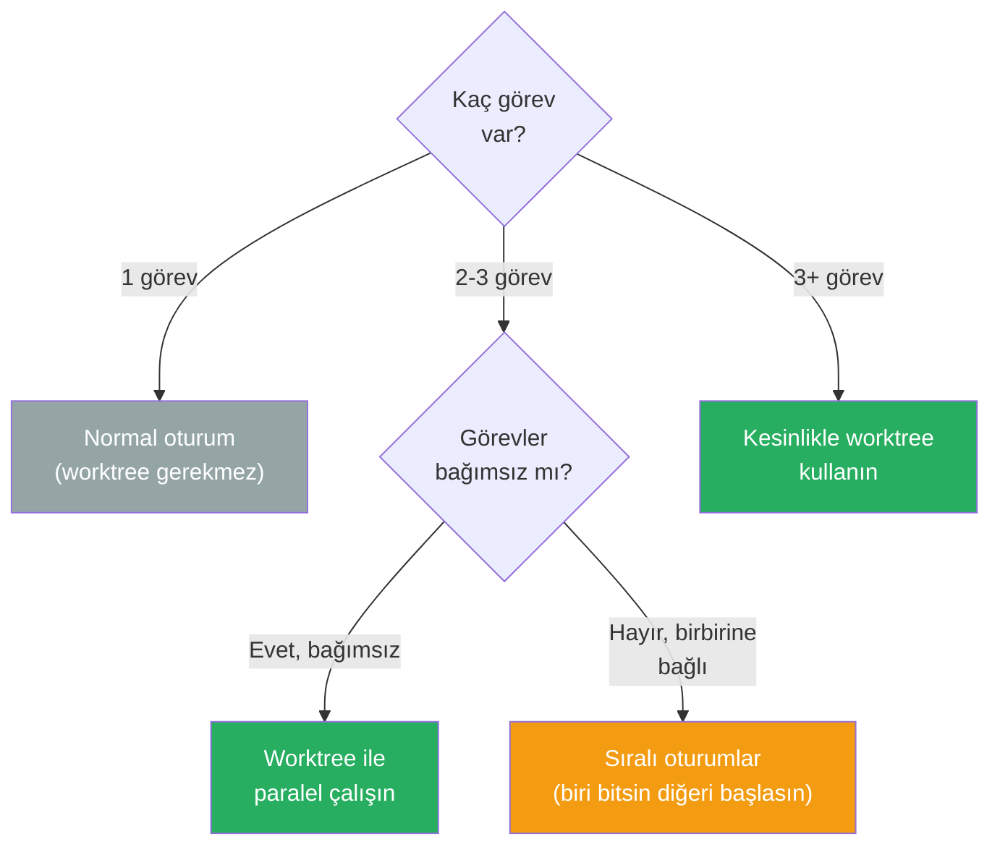

# Worktree ile Paralel Çalışma

**Git worktree** (çalışma ağacı), aynı Git deposunun birden fazla çalışma kopyasını oluşturmanızı sağlayan bir Git özelliğidir. Claude Code bu özelliği `--worktree` / `-w` bayrağıyla entegre ederek, birden fazla görevi **paralel** ve **izole** şekilde yürütmenize olanak tanır.

## Ön Koşullar

| Konu | Bölüm |
|------|-------|
| Oturum yönetimi | [Oturum Yönetimi](./06-oturum-yonetimi.md) |
| Checkpointing | [Checkpointing](./07-checkpointing.md) |
| Git temel bilgisi | Harici kaynak |

---

## Neden Paralel Çalışma?

Geleneksel iş akışında, bir görev bitmeden diğerine geçmek **branch switching** (dal değiştirme) gerektirir ve bu risklidir:



---

## Worktree Nasıl Çalışır?

Claude Code `--worktree` bayrağı kullanıldığında:

1. `.claude/worktrees/<isim>/` altında izole bir dizin oluşturur
2. `worktree-<isim>` adında yeni bir Git branch'i oluşturur
3. Claude Code bu izole dizinde çalışır
4. Oturum bittiğinde otomatik temizlik yapılır



---

## Temel Kullanım

### Worktree ile Oturum Başlatma

```bash
# Yeni bir worktree ile Claude Code başlat
$ claude --worktree auth-feature "Auth modülüne rate limiting ekle"

# Kısa form
$ claude -w auth-feature "Auth modülüne rate limiting ekle"

# İsim vermeden (otomatik isim atanır)
$ claude -w "Login sayfasındaki hatayı düzelt"
```

### Oluşturulan Yapı

```
my-project/
├── .claude/
│   └── worktrees/
│       └── auth-feature/        # İzole çalışma dizini
│           ├── src/
│           ├── package.json
│           └── ...              # Ana repo'nun kopyası
├── src/                         # Ana çalışma dizini (dokunulmaz)
├── package.json
└── ...
```

---

## Paralel Oturum Diyagramı

3-5+ paralel oturumu aynı anda çalıştırabilirsiniz:



---

## Desktop App ile Otomatik İzolasyon

Claude Code **Desktop** uygulaması kullanıldığında, her oturum otomatik olarak izole edilir:



---

## Subagent İzolasyonu

Claude Code'un **subagent** (alt ajan) sistemi de worktree ile izole çalışabilir:



Subagent oluştururken izolasyon modunu belirtebilirsiniz:

```bash
# CLAUDE.md veya oturum içinde subagent izolasyonu
> Bu 3 görevi paralel subagent'lar ile yap,
> her biri kendi worktree'sinde çalışsın
```

---

## Pratik Örnek 1: Feature Geliştirme

3 farklı feature'ı paralel olarak geliştirme:

```bash
# Terminal 1: Kullanıcı profil sayfası
$ claude -w user-profile "Kullanıcı profil sayfası oluştur:
  - Avatar yükleme
  - Bilgi düzenleme formu
  - Aktivite geçmişi"

# Terminal 2: Bildirim sistemi
$ claude -w notifications "Bildirim sistemi kur:
  - WebSocket ile gerçek zamanlı bildirimler
  - Bildirim tercihleri sayfası
  - Email bildirimleri"

# Terminal 3: Arama özelliği
$ claude -w search "Tam metin arama özelliği ekle:
  - Elasticsearch entegrasyonu
  - Arama sonuç sayfası
  - Otomatik tamamlama"
```

Her terminal bağımsız çalışır, birbirini etkilemez.

---

## Pratik Örnek 2: Bug Fix + Feature Paralel

Acil bir bug fix ile planlı bir feature'ı aynı anda çalıştırma:

```bash
# Terminal 1: Acil bug fix (ana branch'ten)
$ claude -w hotfix "Login sayfasında 500 hatası var,
  acil düzelt ve test et"

# Terminal 2: Planlı feature (devam eden iş)
$ claude -w feature-dashboard "Dashboard sayfasını geliştirmeye
  devam et, grafikleri ekle"
```

```
main          ●───────────────────●── merge hotfix ──●── merge feature ──●
               \                 /                  /
worktree-      ●── fix: login ──●                  /
hotfix              500                           /
               \                                 /
worktree-      ●── feat: chart ──●── feat: ─────●
feature-           component        dashboard
dashboard                           layout
```

---

## Pratik Örnek 3: Kod İnceleme ve Refactoring

Birden fazla modülü paralel olarak refactor etme:

```bash
# Görev dosyası oluşturun
$ cat > refactor-tasks.md << 'EOF'
1. auth modülü: SOLID prensiplere göre yeniden yapılandır
2. database katmanı: Repository pattern uygula
3. API handler'lar: Middleware chain'i optimize et
EOF

# 3 paralel worktree başlatın
$ claude -w refactor-auth "auth modülünü SOLID prensiplere göre yeniden yapılandır"
$ claude -w refactor-db "database katmanına repository pattern uygula"
$ claude -w refactor-api "API handler'ları için middleware chain'i optimize et"
```

---

## Otomatik Temizlik

Worktree oturumları sona erdiğinde otomatik temizlik yapılır:



### Manuel Temizlik

Gerekirse worktree'leri manuel olarak temizleyebilirsiniz:

```bash
# Aktif worktree'leri listele
$ git worktree list

# Belirli bir worktree'yi kaldır
$ git worktree remove .claude/worktrees/auth-feature

# Tüm ölü worktree referanslarını temizle
$ git worktree prune
```

---

## Worktree Kullanım Rehberi



| Senaryo | Worktree Gerekli mi? | Neden |
|---------|:--------------------:|-------|
| Tek bir bug fix | ❌ | Tek oturum yeterli |
| 3 bağımsız feature | ✅ | Zaman kazanır |
| Acil hotfix + feature | ✅ | Ana iş akışını bozmaz |
| Sıralı migration adımları | ❌ | Adımlar birbirine bağlı |
| Paralel refactoring | ✅ | Farklı modüller izole çalışır |
| Kod inceleme + geliştirme | ✅ | Biri okuma, diğeri yazma |

---

## Sınırlamalar ve Dikkat Edilecekler

| Konu | Açıklama |
|------|----------|
| **Aynı dosya çakışması** | İki worktree aynı dosyayı değiştirirse merge conflict oluşur |
| **Disk alanı** | Her worktree projenin bir kopyasını oluşturur |
| **node_modules** | Her worktree kendi `node_modules`'ını kurmalıdır |
| **Bağımlı görevler** | Sıralı bağımlılığı olan görevler worktree'ye uygun değildir |
| **CPU/RAM** | Paralel oturumlar sistem kaynaklarını tüketir |

---

## Özet

| Kavram | Açıklama |
|--------|----------|
| **Git Worktree** | Aynı repo'nun birden fazla çalışma kopyasını oluşturma |
| **--worktree / -w** | Claude Code'da worktree ile izole oturum başlatma |
| **İzolasyon** | Her worktree kendi branch'inde bağımsız çalışır |
| **Paralel oturumlar** | 3-5+ görevi aynı anda yürütme |
| **Subagent isolation** | Alt ajanların worktree ile izole çalışması |
| **Otomatik temizlik** | Oturum bittiğinde worktree dizini otomatik silinir |
| **Desktop uygulaması** | Oturumlar otomatik olarak izole edilir |

---

## Bölüm Sonu

Bu, "Bellek ve Bağlam Yönetimi" bölümünün son konusuydu. CLAUDE.md'den context window yönetimine, oturum yönetiminden paralel çalışmaya kadar Claude Code'un bellek ve bağlam mekanizmalarını kapsamlı şekilde inceledik.

→ Sonraki bölüm: [10 - İzinler ve Güvenlik](../10-izinler-ve-guvenlik/README.md)
