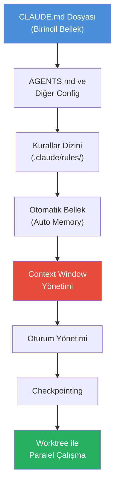
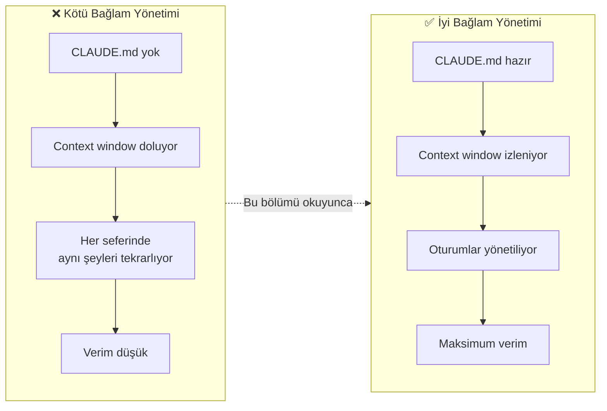

# Bölüm 09: Bellek ve Bağlam Yönetimi

Claude Code'un gücü, bağlamı ne kadar iyi yönettiğinize bağlıdır. Bu bölüm, CLAUDE.md dosyasından context window stratejilerine, oturum yönetiminden paralel çalışmaya kadar tüm bellek ve bağlam mekanizmalarını kapsar.

## Bu Bölümde Neler Öğreneceksiniz?

## İçerik

| # | Dosya | Konu | Süre |
|---|-------|------|------|
| 01 | [CLAUDE.md Dosyası](./01-claude-md-dosyasi.md) | Birincil bellek dosyası, yerleşim, kapsam hiyerarşisi | ~12 dk |
| 02 | [AGENTS.md ve Diğer Config](./02-agents-md-ve-diger-config.md) | Çapraz araç uyumluluğu, .cursorrules, copilot-instructions | ~10 dk |
| 03 | [Kurallar Dizini](./03-kurallar-dizini.md) | .claude/rules/*.md ile kapsam bazlı kural dosyaları | ~10 dk |
| 04 | [Otomatik Bellek](./04-otomatik-bellek.md) | Claude'un kendi öğrendiklerini kaydetmesi | ~8 dk |
| 05 | [Context Window Yönetimi](./05-context-window-yonetimi.md) | Token yönetimi, %80 kuralı, /compact, /context | ~15 dk |
| 06 | [Oturum Yönetimi](./06-oturum-yonetimi.md) | --continue, --resume, oturum geçmişi | ~10 dk |
| 07 | [Checkpointing](./07-checkpointing.md) | Değişiklikleri izleme, geri alma, durum yönetimi | ~8 dk |
| 08 | [Worktree ile Paralel Çalışma](./08-worktree-ile-paralel-calisma.md) | Git worktree, paralel oturumlar, izolasyon | ~12 dk |

## Neden Bu Kadar Önemli?

## Ön Koşullar

| Konu | Bölüm |
|------|-------|
| Claude Code nedir ve nasıl çalışır | [Bölüm 06](../06-claude-code-tanitim/README.md) |
| Araçlar ve komutlar | [Bölüm 08](../08-araclar/README.md) |
| Terminal / komut satırı kullanımı | Harici kaynak |
| Git temel bilgisi (worktree bölümü için) | Harici kaynak |

## Sonraki Adım

Bu bölümü tamamladıktan sonra → [10 - İzinler ve Güvenlik](../10-izinler-ve-guvenlik/README.md)
