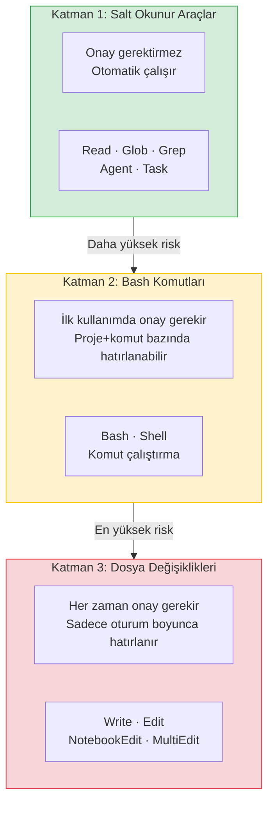
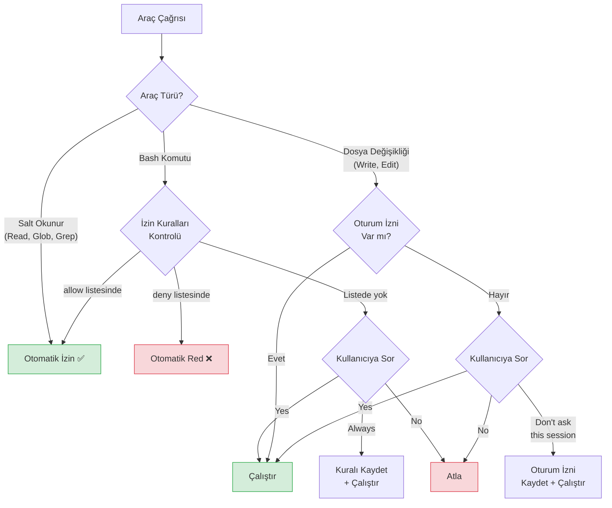

# İzin Sistemi

Claude Code, araçlarını üç katmanlı bir **permission system** (izin sistemi) ile yönetir. Bu katmanlı yapı, güvenlik ile üretkenlik arasında denge kurar: düşük riskli işlemler otomatik çalışırken, potansiyel olarak tehlikeli işlemler kullanıcı onayı gerektirir.

## Ön Koşullar

| Konu | Bölüm |
|------|-------|
| Claude Code araçları (Tools) | [Bölüm 08](../08-araclar/README.md) |
| Claude Code nasıl çalışır | [Bölüm 06](../06-claude-code-tanitim/02-claude-code-nasil-calisir.md) |

---

## Üç Katmanlı İzin Yapısı

Claude Code'un araçları, risk düzeyine göre üç katmana ayrılır:



---

## Katman Detayları

### Katman 1: Salt Okunur Araçlar (Onaysız)

Bu araçlar sisteme hiçbir değişiklik yapmaz, bu nedenle otomatik olarak çalışır:

| Araç | Açıklama |
|------|----------|
| **Read** | Dosya okuma |
| **Glob** | Dosya adı eşleştirme ile arama |
| **Grep** | Dosya içeriğinde metin arama |
| **Agent** / **Task** | Alt görev oluşturma (subagent) |

```bash
# Katman 1 araçları — onay sormadan çalışır
> Bu projedeki tüm .ts dosyalarını listele
# Claude Code → Glob("**/*.ts") → otomatik çalışır ✅

> package.json dosyasını oku
# Claude Code → Read("package.json") → otomatik çalışır ✅
```

### Katman 2: Bash Komutları (Onay Gerekli, Hatırlanabilir)

Shell komutları potansiyel olarak sisteme değişiklik yapabilir. Bu nedenle ilk çalıştırmada onay istenir:

| Davranış | Açıklama |
|----------|----------|
| **İlk kullanım** | Kullanıcıdan onay istenir |
| **Hatırlama kapsamı** | Proje + komut bazında hatırlanır |
| **Hatırlama süresi** | Kalıcı (`settings.json`'a yazılır) |
| **İptal** | `/permissions` komutuyla yönetilir |

```bash
# İlk kez çalıştırıldığında:
> Testleri çalıştır

# Claude Code sorar:
# ┌─────────────────────────────────────────────────────┐
# │ Claude Code wants to run:                           │
# │ npm test                                            │
# │                                                     │
# │ Allow?                                              │
# │ (Y)es / (N)o / Yes, (A)lways for this project      │
# └─────────────────────────────────────────────────────┘

# "A" seçerseniz: Bu projede "npm test" artık onaysız çalışır
# "Y" seçerseniz: Sadece bu seferlik izin verilir
# "N" seçerseniz: Komut çalıştırılmaz
```

**Hatırlanan izinler `settings.json`'da saklanır:**

```jsonc
// ~/.claude/settings.json (global) veya .claude/settings.json (proje)
{
  "permissions": {
    "allow": [
      "Bash(npm test)",
      "Bash(npm run build)",
      "Bash(git status)",
      "Bash(git diff *)"
    ],
    "deny": [
      "Bash(rm -rf *)",
      "Bash(sudo *)"
    ]
  }
}
```

### Katman 3: Dosya Değişiklikleri (Onay Gerekli, Geçici Hatırlama)

Dosya yazma ve düzenleme işlemleri en yüksek risk seviyesindedir:

| Davranış | Açıklama |
|----------|----------|
| **Her değişiklik** | Kullanıcıdan onay istenir |
| **Hatırlama kapsamı** | Araç bazında (tüm Write işlemleri gibi) |
| **Hatırlama süresi** | Yalnızca oturum sonuna kadar |
| **Oturum sonrası** | Tekrar onay gerekir |

```bash
# Dosya düzenleme isteği:
> src/utils/auth.ts dosyasındaki hash fonksiyonunu bcrypt ile değiştir

# Claude Code gösterir:
# ┌─────────────────────────────────────────────────────┐
# │ Claude Code wants to edit:                          │
# │ src/utils/auth.ts                                   │
# │                                                     │
# │  - const hash = md5(password);                      │
# │  + const hash = await bcrypt.hash(password, 10);    │
# │                                                     │
# │ Allow?                                              │
# │ (Y)es / (N)o / Yes, don't ask again this session    │
# └─────────────────────────────────────────────────────┘

# Oturum sonuna kadar hatırla seçeneği → yeni oturumda sıfırlanır
```

---

## İzin Akış Diyagramı

Bir araç çağrıldığında izin sistemi şu şekilde çalışır:



---

## `/permissions` Komutu

Aktif izinleri yönetmek için oturum içinde `/permissions` slash komutunu kullanabilirsiniz:

```bash
# Oturum sırasında izin yönetimi
> /permissions

# Gösterir:
# ┌─────────────────────────────────────────────────────┐
# │ Current Permissions                                 │
# │                                                     │
# │ Allowed:                                            │
# │   ✅ Bash(npm test)                                 │
# │   ✅ Bash(npm run build)                            │
# │   ✅ Bash(git status)                               │
# │                                                     │
# │ Denied:                                             │
# │   ❌ Bash(rm -rf *)                                 │
# │                                                     │
# │ Session (temporary):                                │
# │   ✅ Write (all files)                              │
# │                                                     │
# │ [R]eset / [E]dit / [C]ancel                         │
# └─────────────────────────────────────────────────────┘
```

---

## Pratik Örnekler

### Örnek 1: Yeni Projeye Başlarken Tipik İzin Akışı

```bash
# 1. Proje keşfi — onay gerekmez
> Bu projenin yapısını açıkla
# ✅ Read, Glob, Grep otomatik çalışır

# 2. Testleri çalıştırma — ilk seferde onay gerekir
> Testleri çalıştır
# 🔒 "npm test" için onay istenir
# → "Always" seçerseniz bir daha sormaz

# 3. Kod düzenleme — onay gerekir
> Login fonksiyonuna rate limiting ekle
# 🔒 Dosya değişikliği için onay istenir
# → "Don't ask this session" seçerseniz oturum boyunca sormaz
```

### Örnek 2: Güvenli CI/CD Pipeline Kurulumu

```jsonc
// .claude/settings.json — CI/CD ortamı için proje ayarları
{
  "permissions": {
    "allow": [
      "Bash(npm ci)",
      "Bash(npm run build)",
      "Bash(npm test)",
      "Bash(npm run lint)",
      "Bash(git status)",
      "Bash(git diff *)"
    ],
    "deny": [
      "Bash(npm publish *)",
      "Bash(rm -rf *)",
      "Bash(sudo *)",
      "Bash(curl *)",
      "Bash(wget *)"
    ]
  }
}
```

### Örnek 3: İzin Kapsamlarının Farkı

```bash
# Bash izinleri KALICI — settings.json'a yazılır
# Proje kapanıp açılsa bile hatırlanır
$ claude
> git status göster
# → "Always" → kalıcı olarak kaydedilir

# Dosya düzenleme izinleri GEÇİCİ — sadece oturum boyunca
# Yeni oturumda tekrar sorulur
$ claude
> auth.ts dosyasını düzenle
# → "Don't ask this session" → oturum bitince sıfırlanır

# Yeni oturum başladığında:
$ claude
> auth.ts dosyasını düzenle
# → Tekrar onay istenir
```

---

## Özet

| Kavram | Açıklama |
|--------|----------|
| **Katman 1** | Salt okunur araçlar — otomatik çalışır |
| **Katman 2** | Bash komutları — onay gerekir, kalıcı hatırlanabilir |
| **Katman 3** | Dosya değişiklikleri — onay gerekir, oturum boyunca hatırlanır |
| **`/permissions`** | Aktif izinleri görüntüle ve yönet |
| **`settings.json`** | Kalıcı izin kurallarının saklandığı dosya |

---

## Sonraki Adım

İzin sisteminin temellerini öğrendik. Şimdi izin kurallarının sözdizimini ve eşleştirme mantığını inceleyelim:

→ [İzin Kuralları ve Syntax](./02-izin-kurallari-syntax.md)
