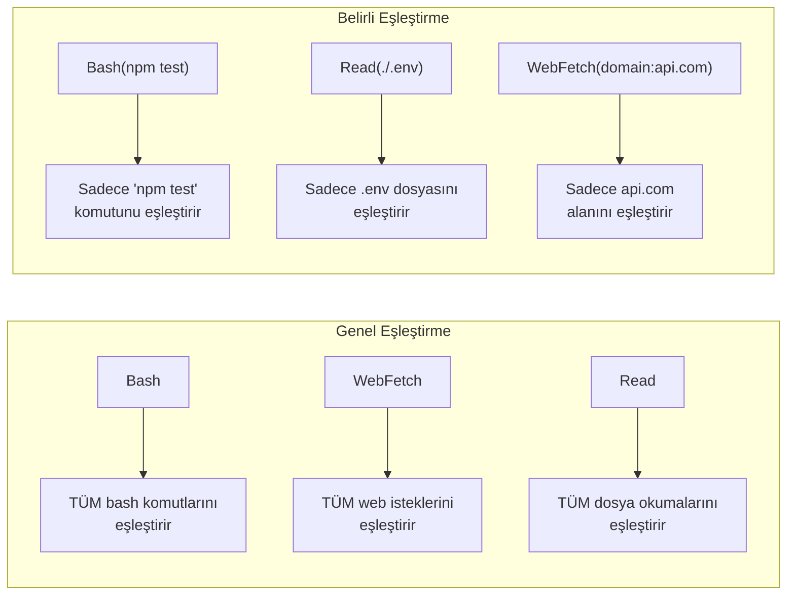
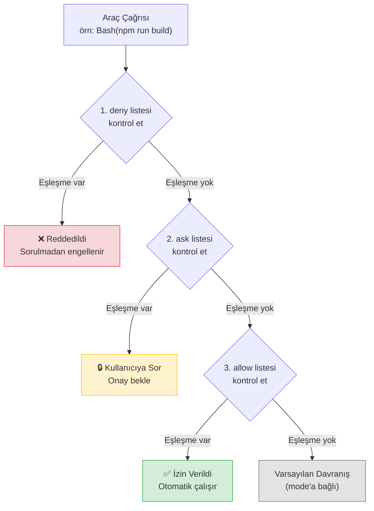
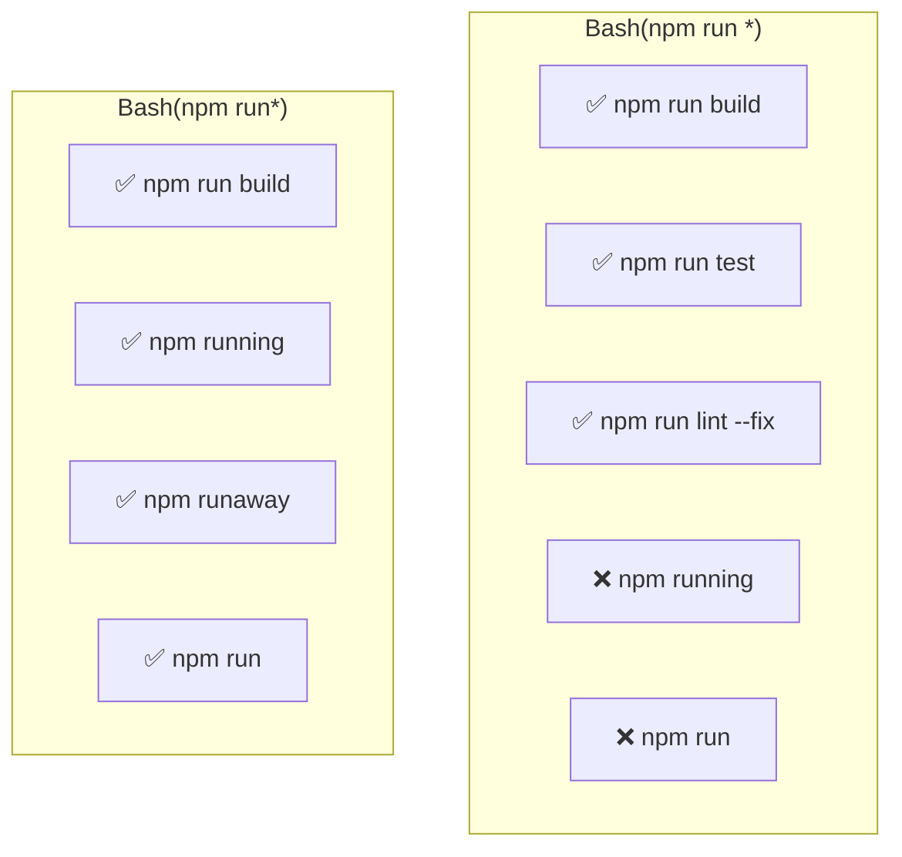
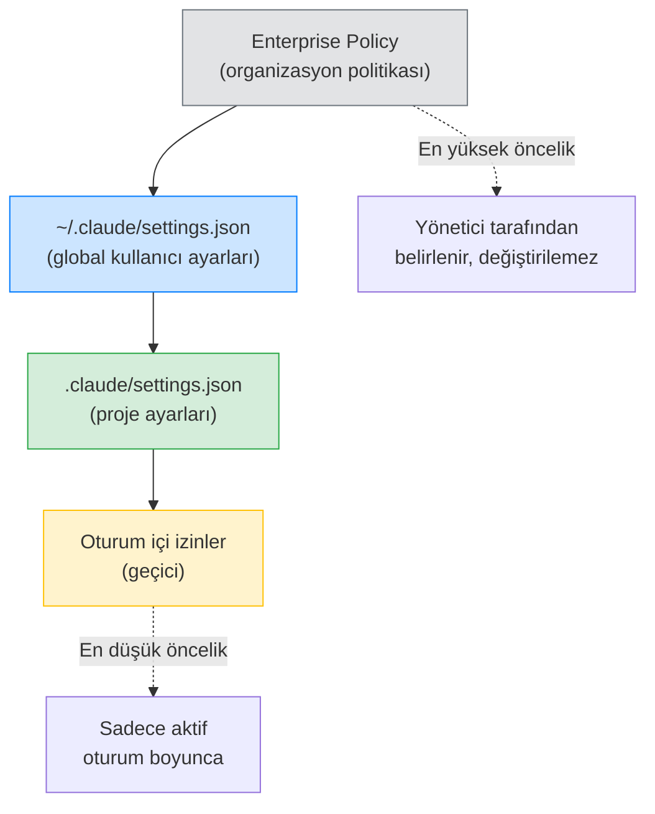

# İzin Kuralları ve Syntax

İzin kuralları, Claude Code'un hangi araçları onaysız çalıştırabileceğini veya tamamen engelleyeceğini belirler. Bu dosya, kural formatını, değerlendirme sırasını ve **wildcard** (joker karakter) kullanımını detaylı olarak açıklar.

## Ön Koşullar

| Konu | Bölüm |
|------|-------|
| İzin sistemi temelleri | [İzin Sistemi](./01-izin-sistemi.md) |
| Claude Code araçları | [Bölüm 08](../08-araclar/README.md) |

---

## Kural Formatı

İzin kuralları iki formatta yazılır:

```
Tool                    → Aracın tüm kullanımlarını eşleştirir
Tool(specifier)         → Aracın belirli bir kullanımını eşleştirir
```



---

## Değerlendirme Sırası

İzin kuralları şu sırayla değerlendirilir: **deny → ask → allow**. Her kategoride **ilk eşleşen kural** kazanır:



> **Kritik:** `deny` her zaman önce değerlendirilir. Bir komut hem `allow` hem `deny` listesindeyse, **deny kazanır**.

---

## Araç Eşleştirme Türleri

### 1. Tüm Kullanımları Eşleştirme

Araç adını tek başına yazarak tüm kullanımlarını eşleştirebilirsiniz:

```jsonc
{
  "permissions": {
    "allow": [
      "Bash",          // TÜM bash komutları izinli
      "WebFetch",      // TÜM web istekleri izinli
      "Read"           // TÜM dosya okumaları izinli (zaten varsayılan)
    ],
    "deny": [
      "Bash"           // TÜM bash komutları engelli
    ]
  }
}
```

> **Uyarı:** `"allow": ["Bash"]` tehlikelidir — her komutu onaysız çalıştırır. Üretim ortamında kullanmayın.

### 2. Tam Eşleştirme (Exact Match)

Belirli bir komutu veya dosyayı tam olarak eşleştirmek için `Tool(specifier)` formatını kullanın:

```jsonc
{
  "permissions": {
    "allow": [
      "Bash(npm test)",              // Sadece "npm test" komutu
      "Bash(npm run build)",         // Sadece "npm run build" komutu
      "Bash(git status)",            // Sadece "git status" komutu
      "Bash(git log --oneline)",     // Sadece bu spesifik git log komutu
      "Read(./.env.example)",        // Sadece .env.example dosyası
      "WebFetch(domain:example.com)" // Sadece example.com alanı
    ]
  }
}
```

### 3. Wildcard Eşleştirme

**Yıldız (`*`)** karakteri ile esnek eşleştirmeler yapabilirsiniz:

```jsonc
{
  "permissions": {
    "allow": [
      "Bash(npm run *)",         // npm run ile başlayan tüm komutlar
      "Bash(git commit *)",      // git commit ile başlayan tüm komutlar
      "Bash(git diff *)",        // git diff ile başlayan tüm komutlar
      "Bash(python -m pytest *)" // pytest ile başlayan tüm komutlar
    ]
  }
}
```

---

## Wildcard Kuralları Detay

### Boşluk + Yıldız (`_*`) vs Sadece Yıldız (`*`)

Wildcard'dan önceki boşluk önemlidir:



| Pattern | Eşleşir | Eşleşmez |
|---------|---------|----------|
| `Bash(npm run *)` | `npm run build`, `npm run test` | `npm run` (argümansız), `npm running` |
| `Bash(npm run*)` | `npm run`, `npm running`, `npm run build` | — |
| `Bash(git *)` | `git status`, `git diff HEAD` | `git` (tek başına) |
| `Bash(git*)` | `git`, `git status`, `github-cli` | — |

> **En İyi Uygulama:** Güvenlik için **boşluk + yıldız** (`npm run *`) tercih edin. Bu, yalnızca argüman alan kullanımları eşleştirir ve yanlışlıkla benzer adlı komutları yakalamaz.

### Wildcard Örnekleri

```jsonc
{
  "permissions": {
    "allow": [
      // Git işlemleri — güvenli olanlar
      "Bash(git status)",
      "Bash(git diff *)",
      "Bash(git log *)",
      "Bash(git branch *)",
      "Bash(git checkout *)",
      "Bash(git stash *)",

      // Build ve test
      "Bash(npm run *)",
      "Bash(npx jest *)",
      "Bash(dotnet test *)",

      // Dosya görüntüleme
      "Bash(ls *)",
      "Bash(wc *)"
    ],
    "deny": [
      // Tehlikeli git işlemleri
      "Bash(git push --force *)",
      "Bash(git reset --hard *)",
      "Bash(git clean -fd *)",

      // Silme işlemleri
      "Bash(rm -rf *)",
      "Bash(rm -r *)",

      // Yetki yükseltme
      "Bash(sudo *)",
      "Bash(chmod 777 *)",

      // Ağ indirme
      "Bash(curl *)",
      "Bash(wget *)"
    ]
  }
}
```

---

## WebFetch Kuralları

`WebFetch` aracı için alan adı bazlı kısıtlamalar yapabilirsiniz:

```jsonc
{
  "permissions": {
    "allow": [
      "WebFetch(domain:docs.python.org)",       // Python dokümanları
      "WebFetch(domain:developer.mozilla.org)",  // MDN
      "WebFetch(domain:learn.microsoft.com)",    // Microsoft Docs
      "WebFetch(domain:api.github.com)"          // GitHub API
    ],
    "deny": [
      "WebFetch(domain:evil-site.com)",          // Bilinen zararlı site
      "WebFetch"                                  // Diğer tüm siteler engelli
    ]
  }
}
```

> **Not:** `deny` listesindeki `"WebFetch"` (genel) kuralı, `allow` listesindeki spesifik kurallardan **sonra** değerlendirilmez. `deny` her zaman önce gelir! Bu nedenle yukarıdaki yapılandırma beklendiği gibi çalışmaz. Doğru yaklaşım:

```jsonc
{
  "permissions": {
    "allow": [
      "WebFetch(domain:docs.python.org)",
      "WebFetch(domain:developer.mozilla.org)"
    ]
    // deny'da WebFetch belirtmeyin — allow'da olmayanlar zaten sorulur
  }
}
```

---

## Read Kuralları

Salt okunur araçlar normalde onay gerektirmese de, hassas dosyalara erişimi kısıtlamak için `deny` kuralları kullanabilirsiniz:

```jsonc
{
  "permissions": {
    "deny": [
      "Read(./.env)",
      "Read(./.env.local)",
      "Read(./.env.production)",
      "Read(./secrets/*)",
      "Read(./credentials/*)",
      "Read(./**/serviceAccountKey.json)"
    ]
  }
}
```

---

## Konfigürasyon Dosyaları ve Hiyerarşi

İzin kuralları birden fazla dosyada tanımlanabilir. Değerlendirme sırası:



| Dosya | Kapsam | Kullanım |
|-------|--------|----------|
| **Enterprise Policy** | Tüm organizasyon | Kurumsal güvenlik politikaları |
| **`~/.claude/settings.json`** | Tüm projeler | Kişisel varsayılan izinler |
| **`.claude/settings.json`** | Tek proje | Projeye özel izinler |
| **Oturum izinleri** | Tek oturum | Geçici dosya düzenleme izinleri |

---

## Pratik Örnekler

### Örnek 1: Frontend Geliştirici Ayarları

```jsonc
// .claude/settings.json — React/Next.js projesi
{
  "permissions": {
    "allow": [
      // Geliştirme sunucusu
      "Bash(npm run dev)",
      "Bash(npm start)",

      // Build ve test
      "Bash(npm run build)",
      "Bash(npm test *)",
      "Bash(npx jest *)",
      "Bash(npm run lint *)",

      // Paket yönetimi
      "Bash(npm install *)",
      "Bash(npm uninstall *)",

      // Git — güvenli komutlar
      "Bash(git status)",
      "Bash(git diff *)",
      "Bash(git log *)",
      "Bash(git add *)",
      "Bash(git commit *)",
      "Bash(git checkout *)",
      "Bash(git branch *)",
      "Bash(git stash *)"
    ],
    "deny": [
      // Tehlikeli komutlar
      "Bash(git push --force *)",
      "Bash(rm -rf *)",
      "Bash(sudo *)",

      // Hassas dosyalar
      "Read(./.env.production)",
      "Read(./.env.local)"
    ]
  }
}
```

### Örnek 2: Backend Geliştirici Ayarları

```jsonc
// .claude/settings.json — .NET/C# projesi
{
  "permissions": {
    "allow": [
      // Build ve test
      "Bash(dotnet build *)",
      "Bash(dotnet test *)",
      "Bash(dotnet run *)",
      "Bash(dotnet restore)",

      // Entity Framework
      "Bash(dotnet ef migrations *)",
      "Bash(dotnet ef database update)",

      // Docker
      "Bash(docker compose up *)",
      "Bash(docker compose down)",
      "Bash(docker ps *)",
      "Bash(docker logs *)",

      // Git
      "Bash(git status)",
      "Bash(git diff *)",
      "Bash(git log *)",
      "Bash(git add *)",
      "Bash(git commit *)"
    ],
    "deny": [
      // Üretim veritabanına erişim
      "Bash(dotnet ef database update --connection *prod*)",

      // Hassas dosyalar
      "Read(./appsettings.Production.json)",
      "Read(./**/secrets.json)",
      "Read(./.env)",

      // Tehlikeli
      "Bash(sudo *)",
      "Bash(rm -rf *)"
    ]
  }
}
```

### Örnek 3: Kısıtlı Ortam (Minimum İzin)

```jsonc
// .claude/settings.json — yalnızca okuma ve analiz
{
  "permissions": {
    "allow": [
      "Bash(git status)",
      "Bash(git log *)",
      "Bash(git diff *)",
      "Bash(wc *)",
      "Bash(ls *)"
    ],
    "deny": [
      "Bash(rm *)",
      "Bash(mv *)",
      "Bash(cp *)",
      "Bash(sudo *)",
      "Bash(chmod *)",
      "Bash(chown *)",
      "Bash(npm install *)",
      "Bash(npm publish *)",
      "Bash(git push *)",
      "Bash(git reset *)",
      "Bash(curl *)",
      "Bash(wget *)"
    ]
  }
}
```

### Örnek 4: Değerlendirme Sırası Pratikte

```jsonc
{
  "permissions": {
    "allow": [
      "Bash(git push *)"          // 3. sırada değerlendirilir
    ],
    "deny": [
      "Bash(git push --force *)"  // 1. sırada değerlendirilir
    ]
  }
}
```

```bash
# Senaryo 1: git push origin main
# 1. deny kontrolü: "git push --force *" → eşleşmez
# 2. allow kontrolü: "git push *" → eşleşir ✅
# Sonuç: Otomatik izin verilir

# Senaryo 2: git push --force origin main
# 1. deny kontrolü: "git push --force *" → eşleşir ❌
# Sonuç: Otomatik reddedilir (allow kontrol edilmez)

# Senaryo 3: git pull origin main
# 1. deny kontrolü: eşleşme yok
# 2. allow kontrolü: "git push *" → eşleşmez
# 3. Varsayılan: Kullanıcıya sorulur
```

---

## Özet

| Kavram | Açıklama |
|--------|----------|
| **Kural formatı** | `Tool` veya `Tool(specifier)` |
| **Değerlendirme sırası** | deny → ask → allow (ilk eşleşme kazanır) |
| **Tam eşleştirme** | `Bash(npm test)` — tam komut eşleşmesi |
| **Wildcard** | `Bash(npm run *)` — boşluktan sonra her şey |
| **Boşluk önemi** | `npm run *` ≠ `npm run*` |
| **WebFetch** | `WebFetch(domain:example.com)` formatı |
| **Read kısıtlama** | `deny` listesinde `Read(./.env)` ile |
| **Hiyerarşi** | Enterprise → Global → Proje → Oturum |

---

## Sonraki Adım

Kural sözdizimini öğrendik. Şimdi Claude Code'un beş farklı izin modunu ve ne zaman hangisini kullanacağımızı inceleyelim:

→ [İzin Modları](./03-izin-modlari.md)
