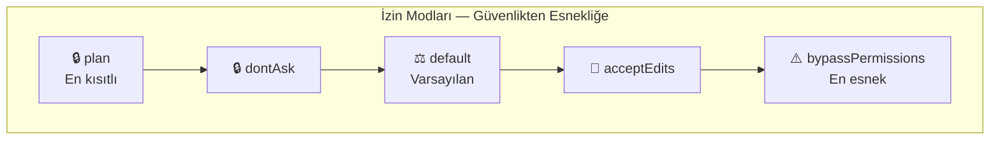
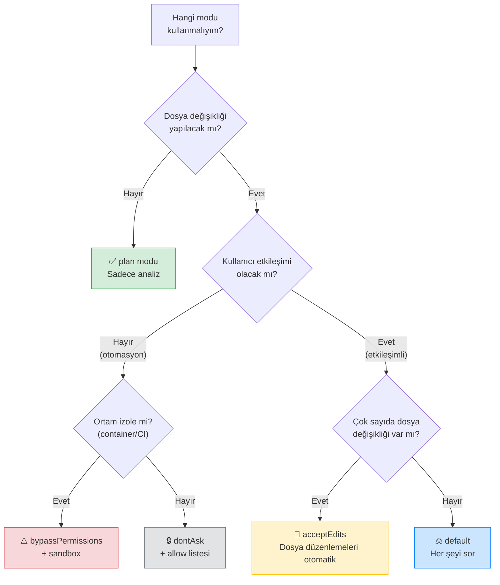

# İzin Modları

Claude Code, beş farklı **permission mode** (izin modu) sunar. Her mod, farklı bir güvenlik-üretkenlik dengesini temsil eder. Bu dosya, her modun davranışını, ne zaman kullanılması gerektiğini ve konfigürasyon yöntemlerini açıklar.

## Ön Koşullar

| Konu | Bölüm |
|------|-------|
| İzin sistemi temelleri | [İzin Sistemi](./01-izin-sistemi.md) |
| İzin kuralları | [İzin Kuralları ve Syntax](./02-izin-kurallari-syntax.md) |

---

## Beş İzin Modu



| Mod | Açıklama | Dosya Düzenleme | Bash Komutları | Risk |
|-----|----------|-----------------|----------------|------|
| **`plan`** | Yalnızca analiz, değişiklik yapamaz | ❌ Engelli | ❌ Engelli | En düşük |
| **`dontAsk`** | Önceden onaylanmış işlemler dışında otomatik red | Önceden izin verilmişse | Önceden izin verilmişse | Düşük |
| **`default`** | İlk kullanımda sor | 🔒 Onay gerekli | 🔒 Onay gerekli | Orta |
| **`acceptEdits`** | Dosya düzenlemelerini otomatik kabul et | ✅ Otomatik | 🔒 Onay gerekli | Yüksek |
| **`bypassPermissions`** | Tüm izin kontrollerini atla | ✅ Otomatik | ✅ Otomatik | En yüksek |

---

## Mod Detayları

### 1. `plan` Modu — Yalnızca Analiz

En kısıtlı mod. Claude Code yalnızca okuma ve analiz yapabilir, hiçbir değişiklik uygulayamaz.

```jsonc
// settings.json
{
  "defaultMode": "plan"
}
```

```bash
# Veya CLI'dan başlatırken:
$ claude --mode plan
```

**Ne yapabilir:**
- Dosya okuma (Read, Glob, Grep)
- Kod analizi ve açıklama
- Refactoring planı önerme
- Mimari inceleme

**Ne yapamaz:**
- Dosya oluşturma veya düzenleme
- Shell komutu çalıştırma
- Git işlemleri

```bash
# plan modunda tipik kullanım
$ claude --mode plan
> Bu projede güvenlik açıkları var mı analiz et

# Claude Code:
# ✅ Dosyaları okur
# ✅ Analiz sonuçlarını raporlar
# ❌ Düzeltme uygulamaz — sadece önerir
```

**Ne zaman kullanılır:**
- Kod inceleme (code review) yaparken
- Bir projeyi tanımaya çalışırken
- Güvenlik denetimi yaparken
- Değişiklik yapmadan analiz istediğinizde

---

### 2. `dontAsk` Modu — Sessiz Red

Bu modda Claude Code, izin kurallarında **önceden tanımlanmış** işlemleri otomatik yapar. Tanımlanmamış her şeyi **sormadan reddeder**.

```jsonc
// settings.json
{
  "defaultMode": "dontAsk",
  "permissions": {
    "allow": [
      "Bash(npm test)",
      "Bash(npm run build)",
      "Bash(git status)",
      "Bash(git diff *)"
    ]
  }
}
```

```bash
$ claude --mode dontAsk
> Testleri çalıştır ve ardından uygulamayı build et

# ✅ npm test → allow listesinde, çalışır
# ✅ npm run build → allow listesinde, çalışır

> Sonra deploy et
# ❌ npm run deploy → allow listesinde yok, sessizce reddedilir
# Claude Code kullanıcıya sormaz, sadece yapamadığını belirtir
```

**Ne zaman kullanılır:**
- Otomasyon scriptlerinde
- CI/CD pipeline'larında
- Toplu işlemlerde
- Kullanıcı etkileşimi istenmeyen senaryolarda

---

### 3. `default` Modu — Varsayılan

Standart davranış. Dosya değişiklikleri ve yeni bash komutları için kullanıcıdan onay ister.

```jsonc
// settings.json — genellikle belirtmeye gerek yok (varsayılan)
{
  "defaultMode": "default"
}
```

```bash
$ claude  # veya: claude --mode default
> Login fonksiyonunu refactor et

# 1. Dosyaları okur ✅ (otomatik)
# 2. Değişiklik planı yapar ✅ (otomatik)
# 3. Dosya düzenleme ister 🔒 (onay bekler)
# 4. Kullanıcı onaylar → değişiklik uygulanır
# 5. Test çalıştırmak ister 🔒 (onay bekler)
```

**Ne zaman kullanılır:**
- Günlük geliştirme çalışmalarında
- İlk kez kullanılan projelerde
- Güvenli bir ortamda etkileşimli çalışırken

---

### 4. `acceptEdits` Modu — Otomatik Düzenleme

Dosya düzenlemelerini otomatik kabul eder, ancak bash komutları için hâlâ onay ister.

```jsonc
// settings.json
{
  "defaultMode": "acceptEdits"
}
```

```bash
$ claude --mode acceptEdits
> Tüm fonksiyonlara TypeScript tip tanımlamaları ekle

# 1. Dosyaları okur ✅ (otomatik)
# 2. Her dosyayı düzenler ✅ (otomatik — onay sormaz)
# 3. "npm run build" çalıştırmak ister 🔒 (onay bekler)
```

**Ne zaman kullanılır:**
- Büyük ölçekli refactoring yaparken
- Toplu dosya düzenlemelerinde
- Güvendiğiniz projelerde hız kazanmak istediğinizde

> **Uyarı:** Bu modda Claude Code'un yaptığı tüm değişiklikleri **git diff** ile kontrol etmeniz önerilir. Değişiklikleri geri almak için `git checkout -- .` kullanabilirsiniz.

---

### 5. `bypassPermissions` Modu — Tüm İzinleri Atla

Tüm izin kontrollerini devre dışı bırakır. Dosya düzenleme ve bash komutları dahil her şey onaysız çalışır.

```jsonc
// settings.json
{
  "defaultMode": "bypassPermissions"
}
```

```bash
$ claude --mode bypassPermissions
> Tüm testleri çalıştır, hataları düzelt, tekrar çalıştır

# 1. npm test ✅ (otomatik)
# 2. Hatalı dosyaları düzenler ✅ (otomatik)
# 3. npm test ✅ (otomatik)
# Tüm döngü onaysız çalışır
```

> **⚠️ DİKKAT:** Bu mod yalnızca **izole ortamlarda** kullanılmalıdır:
> - Docker container'lar
> - CI/CD pipeline'ları (sandbox ile birlikte)
> - Geçici sanal makineler
> - DevContainer ortamları

**Asla şu ortamlarda kullanmayın:**
- Kişisel bilgisayarınızda
- Üretim sunucularında
- Hassas verilerin bulunduğu sistemlerde

---

## Mod Karar Ağacı



---

## Mod Konfigürasyonu

### CLI ile Mod Belirleme

```bash
# Tek seferlik mod seçimi
$ claude --mode plan
$ claude --mode default
$ claude --mode acceptEdits
$ claude --mode dontAsk
$ claude --mode bypassPermissions

# Pipe ile kullanım (stdin'den girdi)
$ echo "Bu projeyi analiz et" | claude --mode plan

# JSON çıktı ile
$ claude --mode plan --output-format json -p "Proje yapısını özetle"
```

### settings.json ile Kalıcı Mod

```jsonc
// ~/.claude/settings.json — tüm projeler için varsayılan
{
  "defaultMode": "default"
}

// .claude/settings.json — bu proje için
{
  "defaultMode": "acceptEdits"
}
```

### Ortam Değişkeni ile

```bash
# Ortam değişkeni ile mod belirleme
$ CLAUDE_MODE=plan claude

# CI/CD ortamında
$ CLAUDE_MODE=bypassPermissions claude -p "Testleri çalıştır"
```

---

## Pratik Örnekler

### Örnek 1: Kod İnceleme Oturumu

```bash
# Sadece analiz — hiçbir değişiklik yapılmaz
$ claude --mode plan

> Bu PR'daki değişiklikleri incele ve potansiyel sorunları listele

# Claude Code:
# - Değiştirilen dosyaları okur
# - Potansiyel bug'ları tespit eder
# - Performans sorunlarını belirler
# - Rapor sunar
# - Hiçbir dosyaya dokunmaz
```

### Örnek 2: Toplu Refactoring

```bash
# Dosya düzenlemeleri otomatik, komutlar onaylı
$ claude --mode acceptEdits

> Tüm JavaScript dosyalarını TypeScript'e dönüştür

# Claude Code:
# - .js dosyalarını bulur ✅
# - Her dosyayı .ts olarak yeniden yazar ✅ (onay sormaz)
# - Tip tanımlamaları ekler ✅ (onay sormaz)
# - "npx tsc --noEmit" çalıştırmak ister 🔒 (onay bekler)
# - Tip hatalarını düzeltir ✅ (onay sormaz)
```

### Örnek 3: CI/CD Pipeline

```yaml
# GitHub Actions — izole container'da tam yetki
name: AI Code Review
on: [pull_request]

jobs:
  review:
    runs-on: ubuntu-latest
    container:
      image: node:20
    steps:
      - uses: actions/checkout@v4

      - name: Install Claude Code
        run: npm install -g @anthropic-ai/claude-code

      - name: Run Analysis
        env:
          ANTHROPIC_API_KEY: ${{ secrets.ANTHROPIC_API_KEY }}
        run: |
          claude --mode bypassPermissions \
            -p "Testleri çalıştır ve sonuçları raporla" \
            --output-format json > report.json
```

### Örnek 4: dontAsk ile Güvenli Otomasyon

```jsonc
// .claude/settings.json
{
  "defaultMode": "dontAsk",
  "permissions": {
    "allow": [
      "Bash(npm run lint)",
      "Bash(npm run lint:fix)",
      "Bash(npm test)",
      "Bash(git diff *)",
      "Bash(git status)"
    ]
  }
}
```

```bash
# Script içinde kullanım
$ claude -p "Lint hatalarını düzelt ve testleri çalıştır"

# Claude Code:
# ✅ npm run lint → çalışır (allow listesinde)
# ✅ Dosya düzenlemeleri → dontAsk modunda da deny
# ❌ Düzenleme yapamaz — sadece lint:fix çalıştırabilir
# ✅ npm run lint:fix → çalışır (allow listesinde)
# ✅ npm test → çalışır (allow listesinde)
```

---

## Mod Karşılaştırma Tablosu

| Özellik | `plan` | `dontAsk` | `default` | `acceptEdits` | `bypassPermissions` |
|---------|--------|-----------|-----------|---------------|---------------------|
| Dosya okuma | ✅ | ✅ | ✅ | ✅ | ✅ |
| Kod analizi | ✅ | ✅ | ✅ | ✅ | ✅ |
| Dosya düzenleme | ❌ | İzin varsa | 🔒 Sor | ✅ Otomatik | ✅ Otomatik |
| Bash komutu | ❌ | İzin varsa | 🔒 Sor | 🔒 Sor | ✅ Otomatik |
| Kullanıcı etkileşimi | Minimal | Minimal | Sık | Orta | Yok |
| Uygun ortam | Her yer | Otomasyon | Geliştirme | Güvenilen proje | İzole ortam |
| Risk seviyesi | ⭐ | ⭐⭐ | ⭐⭐⭐ | ⭐⭐⭐⭐ | ⭐⭐⭐⭐⭐ |

---

## Özet

| Kavram | Açıklama |
|--------|----------|
| **`plan`** | Sadece analiz, hiçbir değişiklik yapamaz |
| **`dontAsk`** | Önceden izin verilmemiş işlemleri sessizce reddeder |
| **`default`** | İlk kullanımda kullanıcıya sorar (varsayılan) |
| **`acceptEdits`** | Dosya düzenlemelerini otomatik kabul eder |
| **`bypassPermissions`** | Tüm izin kontrollerini atlar (yalnızca izole ortam) |
| **`defaultMode`** | `settings.json`'da varsayılan modu belirler |

---

## Sonraki Adım

İzin modlarını öğrendik. Şimdi Claude Code'un bash komutlarını güvenli bir şekilde çalıştırmak için kullandığı sandbox mekanizmasını inceleyelim:

→ [Sandboxing](./04-sandboxing.md)
