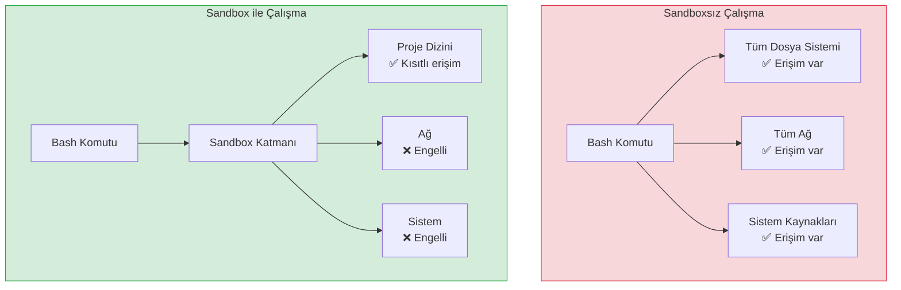
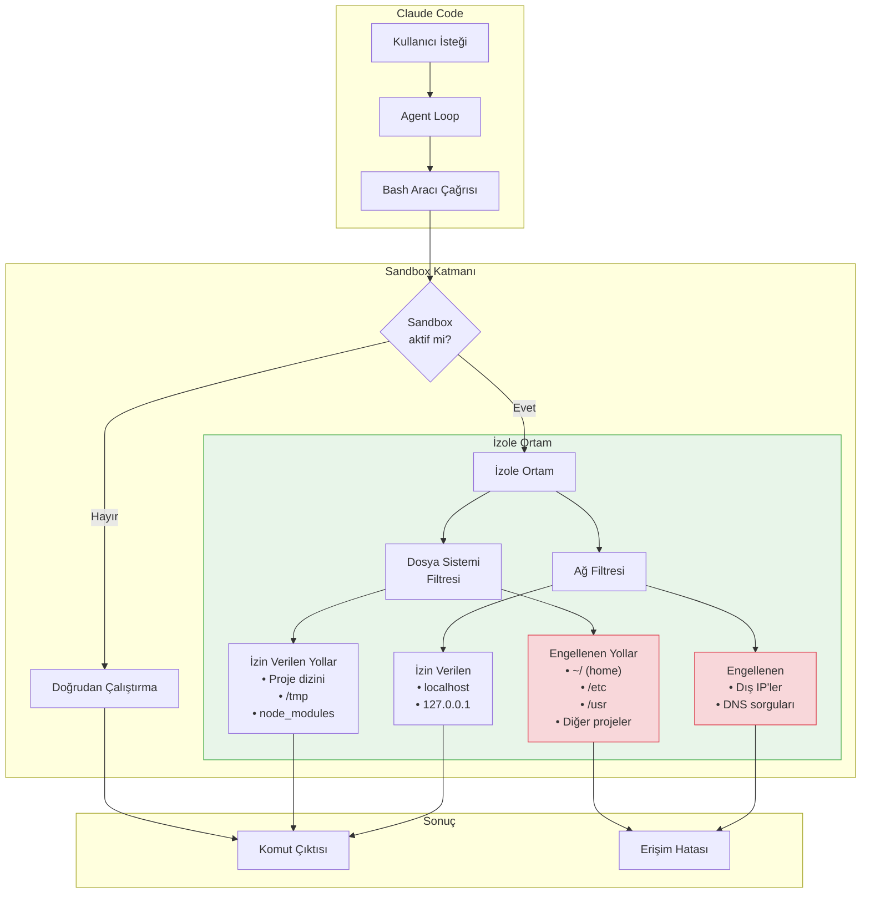
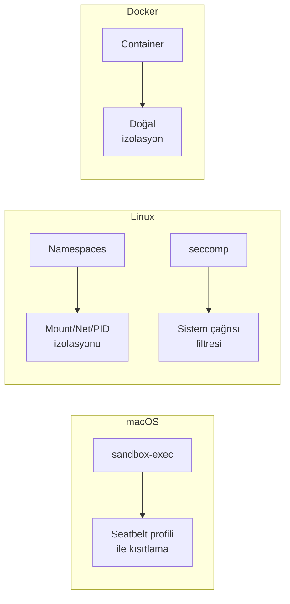
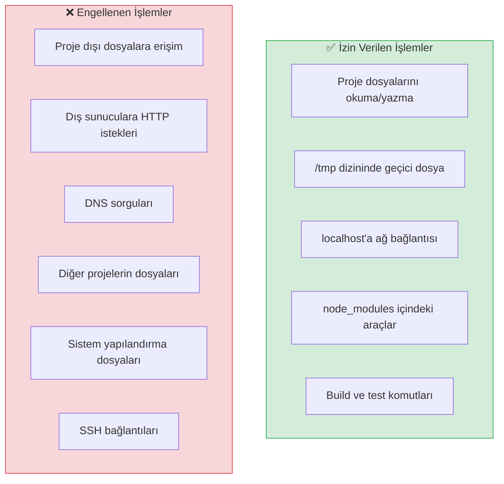
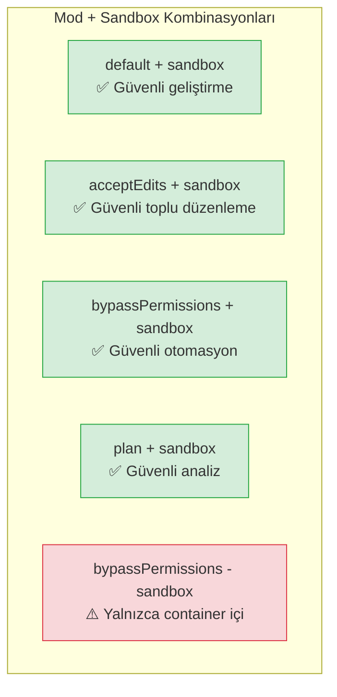

# Sandboxing

Claude Code, bash komutlarını güvenli bir şekilde çalıştırmak için **sandboxing** (korumalı alan) mekanizması sunar. Sandbox, dosya sistemi ve ağ erişimini izole ederek otonom çalışma sırasında oluşabilecek riskleri minimize eder.

## Ön Koşullar

| Konu | Bölüm |
|------|-------|
| İzin sistemi | [İzin Sistemi](./01-izin-sistemi.md) |
| İzin modları | [İzin Modları](./03-izin-modlari.md) |
| Bash aracı | [Bölüm 08](../08-araclar/README.md) |

---

## Sandbox Nedir?

Sandbox, Claude Code'un bash komutlarını **izole bir ortamda** çalıştırmasını sağlayan bir güvenlik katmanıdır. Sandbox aktifken, çalıştırılan komutlar:

- **Dosya sistemi erişimi kısıtlanır** — yalnızca proje dizini ve geçici dosyalara erişebilir
- **Ağ erişimi kısıtlanır** — dış ağa bağlantı engellenir veya sınırlanır
- **Sistem kaynaklarına erişim sınırlıdır** — işletim sistemi düzeyinde izolasyon



---

## Sandbox Mimarisi



---

## Platformlara Göre Sandbox Uygulaması

Claude Code, farklı işletim sistemlerinde farklı sandbox teknolojileri kullanır:

| Platform | Teknoloji | Dosya Sistemi İzolasyonu | Ağ İzolasyonu |
|----------|-----------|-------------------------|---------------|
| **macOS** | Apple Seatbelt (`sandbox-exec`) | ✅ Tam | ✅ Tam |
| **Linux** | Linux Namespaces + seccomp | ✅ Tam | ✅ Tam |
| **Docker** | Container izolasyonu | ✅ Container sınırları | ✅ Ağ politikası |
| **Windows (WSL)** | WSL içinde Linux sandbox | ✅ WSL sınırları | ✅ Kısmen |



---

## Sandbox Konfigürasyonu

### Sandbox'ı Etkinleştirme

```jsonc
// settings.json
{
  "sandboxMode": "enabled",

  "sandbox": {
    "allowNetworking": false,
    "additionalPaths": [
      "/usr/local/bin",
      "/opt/homebrew/bin"
    ]
  }
}
```

### CLI ile Sandbox

```bash
# Sandbox aktif olarak başlat
$ claude --sandbox

# bypassPermissions + sandbox (CI/CD için ideal)
$ claude --mode bypassPermissions --sandbox \
    -p "Tüm testleri çalıştır"
```

### Sandbox ile İzin Verilen/Engellenen İşlemler



---

## Sandbox Kullanım Senaryoları

### Senaryo 1: CI/CD Pipeline

CI/CD ortamlarında sandbox, güvenli otonom çalışma sağlar:

```yaml
# GitHub Actions — sandbox ile tam otonom çalışma
name: AI-Powered Tests
on: [push]

jobs:
  test:
    runs-on: ubuntu-latest
    steps:
      - uses: actions/checkout@v4

      - name: Setup Node.js
        uses: actions/setup-node@v4
        with:
          node-version: '20'

      - name: Install Dependencies
        run: |
          npm ci
          npm install -g @anthropic-ai/claude-code

      - name: Run AI Tests
        env:
          ANTHROPIC_API_KEY: ${{ secrets.ANTHROPIC_API_KEY }}
        run: |
          claude --mode bypassPermissions \
                 --sandbox \
                 -p "Testleri çalıştır. Başarısız olanları analiz et ve düzelt. Tekrar çalıştır." \
                 --output-format json > test-report.json

      - name: Upload Report
        uses: actions/upload-artifact@v4
        with:
          name: test-report
          path: test-report.json
```

### Senaryo 2: Güvenilmeyen Kod Analizi

Üçüncü taraf veya bilinmeyen kaynaklı kodu analiz ederken:

```bash
# Bilinmeyen bir repo'yu klonlayıp analiz etme
$ git clone https://github.com/unknown/project.git
$ cd project

# Sandbox ile güvenli analiz
$ claude --mode plan --sandbox \
    -p "Bu projenin güvenlik açıklarını analiz et"

# Sandbox sayesinde:
# ✅ Proje dosyaları okunabilir
# ❌ Kötü amaçlı scriptler sisteme zarar veremez
# ❌ Ağ üzerinden veri sızdırılamaz
```

### Senaryo 3: Eğitim ve Demo Ortamı

```bash
# Yeni ekip üyeleri için güvenli deneme ortamı
$ claude --sandbox --mode default

> Bu projenin nasıl çalıştığını öğrenmek istiyorum. Testleri çalıştır.

# Sandbox aktif olduğundan:
# ✅ Testler çalışır (proje içinde)
# ❌ Yanlışlıkla sistem dosyaları değiştirilemez
# ❌ Dış servislere istek atılamaz
```

---

## Sandbox ve İzin Modları Birlikte Kullanımı



| Kombinasyon | Güvenlik | Üretkenlik | Kullanım Alanı |
|-------------|----------|------------|----------------|
| `plan` + sandbox | ⭐⭐⭐⭐⭐ | ⭐⭐ | Güvenlik denetimi |
| `default` + sandbox | ⭐⭐⭐⭐ | ⭐⭐⭐ | Günlük geliştirme |
| `acceptEdits` + sandbox | ⭐⭐⭐ | ⭐⭐⭐⭐ | Toplu düzenleme |
| `dontAsk` + sandbox | ⭐⭐⭐⭐ | ⭐⭐⭐ | Kontrollü otomasyon |
| `bypassPermissions` + sandbox | ⭐⭐⭐ | ⭐⭐⭐⭐⭐ | CI/CD pipeline |
| `bypassPermissions` - sandbox | ⭐ | ⭐⭐⭐⭐⭐ | İzole container |

---

## Sandbox Sınırlamaları

Sandbox bazı senaryolarda kısıtlayıcı olabilir:

| Durum | Sorun | Çözüm |
|-------|-------|-------|
| Dış API çağrısı gerekli | Ağ engeli | `allowNetworking: true` veya sandbox'ı devre dışı bırak |
| Global araç kurulumu | Dosya sistemi engeli | `additionalPaths` ile izin ver |
| Veritabanı bağlantısı | Ağ engeli | localhost erişimi zaten izinli |
| Docker komutları | Soket erişimi | Docker socket'ı `additionalPaths`'e ekle |

```jsonc
// Ağ erişimi gereken sandbox konfigürasyonu
{
  "sandboxMode": "enabled",
  "sandbox": {
    "allowNetworking": true,
    "additionalPaths": [
      "/var/run/docker.sock",
      "/usr/local/bin"
    ]
  }
}
```

---

## Özet

| Kavram | Açıklama |
|--------|----------|
| **Sandbox** | Bash komutları için dosya sistemi ve ağ izolasyonu |
| **Dosya izolasyonu** | Yalnızca proje dizini ve /tmp erişilebilir |
| **Ağ izolasyonu** | Yalnızca localhost erişilebilir (varsayılan) |
| **macOS** | Apple Seatbelt (`sandbox-exec`) teknolojisi |
| **Linux** | Namespaces + seccomp teknolojisi |
| **CI/CD** | `bypassPermissions` + `sandbox` ideal kombinasyon |
| **`--sandbox`** | CLI flag ile sandbox etkinleştirme |

---

## Sonraki Adım

Sandbox mekanizmasını öğrendik. Şimdi tüm güvenlik konularını kapsayan en iyi uygulamaları inceleyelim:

→ [Güvenlik En İyi Uygulamalar](./05-guvenlik-en-iyi-uygulamalar.md)
