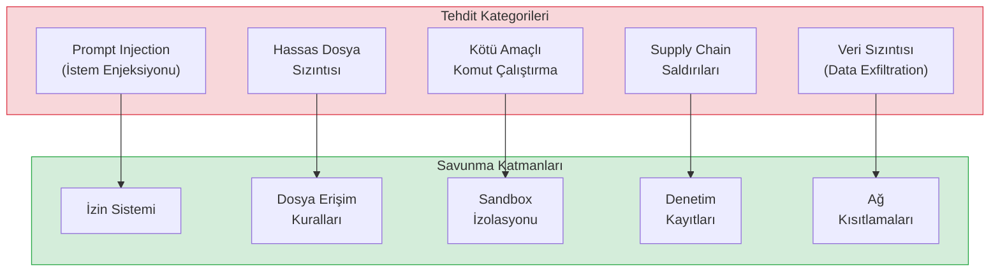
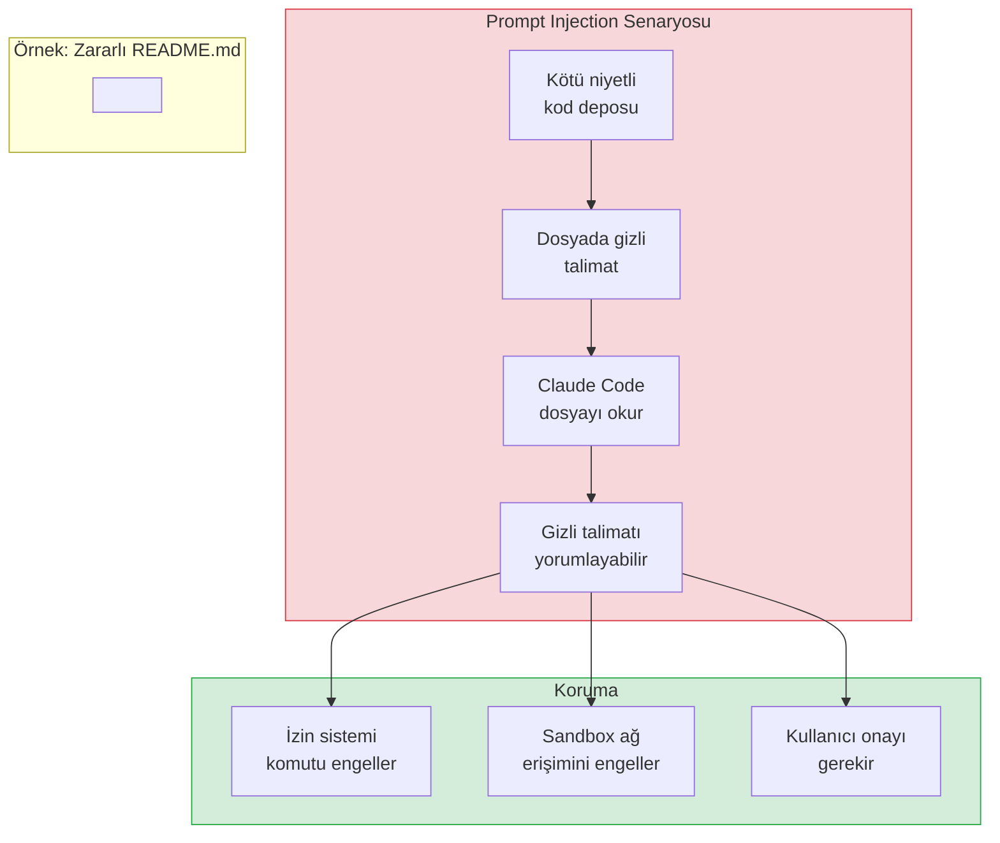
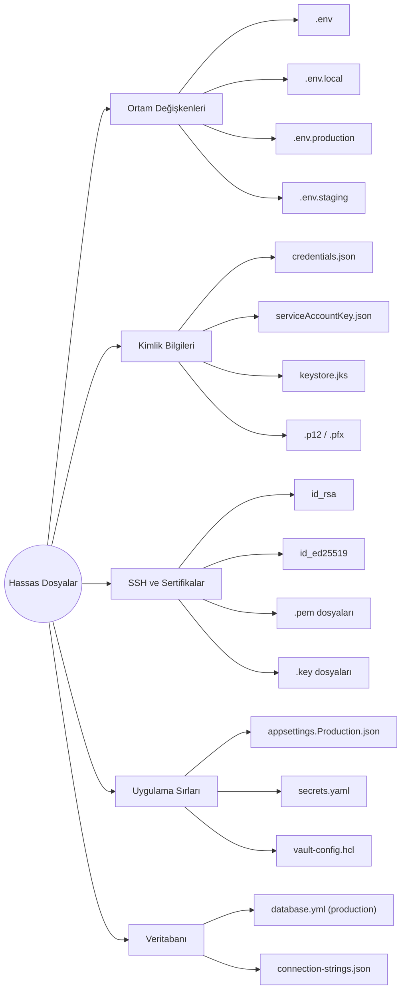
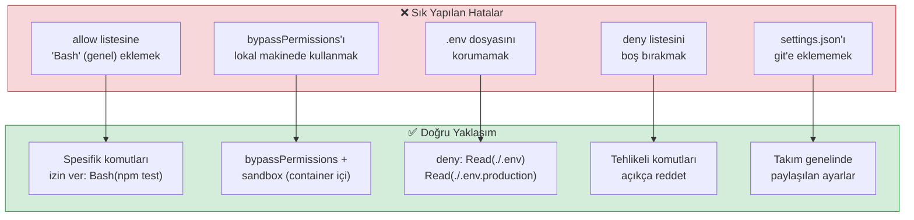

# Güvenlik En İyi Uygulamalar

Bu dosya, Claude Code kullanırken güvenliği maksimize etmek için **prompt injection** (istem enjeksiyonu) korumasını, hassas dosya yönetimini, takım ortamı güvenliğini, denetim izlerini ve ortama özel konfigürasyon önerilerini kapsar.

## Ön Koşullar

| Konu | Bölüm |
|------|-------|
| İzin sistemi | [İzin Sistemi](./01-izin-sistemi.md) |
| İzin kuralları | [İzin Kuralları ve Syntax](./02-izin-kurallari-syntax.md) |
| İzin modları | [İzin Modları](./03-izin-modlari.md) |
| Sandboxing | [Sandboxing](./04-sandboxing.md) |

---

## Güvenlik Tehdit Modeli

Claude Code kullanırken karşılaşılabilecek güvenlik tehditleri:



---

## 1. Prompt Injection Koruması

**Prompt injection** (istem enjeksiyonu), kötü niyetli talimatların Claude Code'a dolaylı yollarla verilmesidir. Örneğin bir dosyanın içine gizlenmiş talimatlar.

### Nasıl Gerçekleşir?



### Korunma Yöntemleri

```jsonc
// .claude/settings.json — prompt injection'a karşı savunma
{
  "permissions": {
    "deny": [
      // Dış bağlantı yapabilecek komutlar
      "Bash(curl *)",
      "Bash(wget *)",
      "Bash(nc *)",
      "Bash(ncat *)",

      // Veri kodlama/gönderme
      "Bash(base64 *)",
      "Bash(xxd *)",

      // Ağ araçları
      "Bash(ssh *)",
      "Bash(scp *)",
      "Bash(rsync *)",
      "Bash(ftp *)",

      // Script indirme ve çalıştırma
      "Bash(bash -c *)",
      "Bash(sh -c *)",
      "Bash(eval *)"
    ]
  }
}
```

**Ek önlemler:**
- Bilinmeyen projeleri ilk kez açarken `--mode plan` kullanın
- Üçüncü parti kodu analiz ederken `--sandbox` aktif edin
- `deny` listesine ağ erişim komutlarını ekleyin
- `bypassPermissions` modunu yalnızca güvenilen ve izole ortamlarda kullanın

---

## 2. Hassas Dosya Erişim Kontrolü

Projelerinizde hassas bilgiler içeren dosyaların Claude Code tarafından okunmasını engelleyin:

### Korunması Gereken Dosyalar



### Hassas Dosya Koruma Konfigürasyonu

```jsonc
// .claude/settings.json — hassas dosya koruması
{
  "permissions": {
    "deny": [
      // Ortam değişkenleri
      "Read(./.env)",
      "Read(./.env.local)",
      "Read(./.env.production)",
      "Read(./.env.staging)",
      "Read(./.env.*.local)",

      // Kimlik bilgileri
      "Read(./**/credentials.json)",
      "Read(./**/serviceAccountKey.json)",
      "Read(./**/service-account*.json)",

      // SSH anahtarları
      "Read(./**/id_rsa)",
      "Read(./**/id_ed25519)",
      "Read(./**/*.pem)",
      "Read(./**/*.key)",

      // .NET sırları
      "Read(./**/appsettings.Production.json)",
      "Read(./**/secrets.json)",
      "Read(./**/usersecrets/*)",

      // Docker ve Kubernetes sırları
      "Read(./**/*secret*.yaml)",
      "Read(./**/*secret*.yml)",

      // Sertifikalar
      "Read(./**/*.p12)",
      "Read(./**/*.pfx)",
      "Read(./**/*.keystore)"
    ]
  }
}
```

> **İpucu:** `.env.example` gibi şablon dosyalarını `allow` listesine ekleyebilirsiniz — bunlar genellikle gerçek sır içermez.

```jsonc
{
  "permissions": {
    "allow": [
      "Read(./.env.example)",
      "Read(./.env.template)"
    ]
  }
}
```

---

## 3. Takım Ortamı Güvenliği

Birden fazla geliştirici Claude Code kullanıyorsa, tutarlı güvenlik politikaları uygulamak önemlidir:

### Proje Düzeyinde Güvenlik Politikası

```jsonc
// .claude/settings.json — takım genelinde paylaşılan ayarlar
// Bu dosya git'e commit edilir
{
  "permissions": {
    "allow": [
      // Takım standartları — herkes kullanabilir
      "Bash(npm run lint)",
      "Bash(npm run lint:fix)",
      "Bash(npm test *)",
      "Bash(npm run build)",
      "Bash(git status)",
      "Bash(git diff *)",
      "Bash(git log *)"
    ],
    "deny": [
      // Takım standartları — hiç kimse yapmamalı
      "Bash(git push --force *)",
      "Bash(git reset --hard *)",
      "Bash(rm -rf *)",
      "Bash(sudo *)",

      // Hassas dosyalar
      "Read(./.env)",
      "Read(./.env.production)",
      "Read(./**/credentials*)",
      "Read(./**/secret*)"
    ]
  }
}
```

### CLAUDE.md ile Güvenlik Talimatları

```markdown
<!-- CLAUDE.md — proje kök dizininde -->
# Güvenlik Kuralları

## Yapılmamalı
- `.env` veya `credentials` dosyalarını ASLA okuma
- `sudo` ile komut çalıştırma
- `--force` ile git push yapma
- Üretim veritabanına doğrudan bağlanma
- Hassas bilgileri log'lara veya commit mesajlarına yazma

## Yapılmalı
- Yeni bağımlılık eklerken güvenlik taraması yap
- Dosya izinlerini değiştirmeden önce mevcut izinleri kontrol et
- Test verilerinde gerçek kullanıcı bilgisi kullanma
```

---

## 4. Denetim İzleri (Audit Trails)

Claude Code'un yaptığı işlemleri takip etmek için denetim mekanizmalarını kullanın:

### Oturum Geçmişi

```bash
# Geçmiş oturumları listeleme
$ claude sessions list

# Belirli bir oturumun detaylarını görme
$ claude sessions view <session-id>

# JSON formatında dışa aktarma
$ claude sessions export <session-id> --format json > audit.json
```

### Git ile Denetim

```bash
# Claude Code'un yaptığı değişiklikleri inceleme
$ git log --author="Claude" --oneline

# Belirli bir dosyadaki değişiklikleri takip etme
$ git log --follow -p -- src/auth/login.ts

# Değişiklikleri geri alma
$ git revert <commit-hash>
```

### Hooks ile Otomatik Denetim

```jsonc
// .claude/settings.json — denetim hook'u
{
  "hooks": {
    "afterToolUse": [
      {
        "tool": "Bash",
        "command": "echo \"$(date) | Bash: $TOOL_INPUT\" >> .claude/audit.log"
      },
      {
        "tool": "Write",
        "command": "echo \"$(date) | Write: $TOOL_INPUT\" >> .claude/audit.log"
      }
    ]
  }
}
```

---

## 5. Ortam Bazlı Güvenlik Konfigürasyonları

Her ortam için farklı güvenlik seviyeleri uygulayın:

```mermaid
flowchart TD
    subgraph dev ["Geliştirme Ortamı"]
        direction TB
        DEV_MODE["defaultMode: default"]
        DEV_SANDBOX["sandbox: opsiyonel"]
        DEV_PERM["İzinler: esnek"]
    end

    subgraph staging ["Staging Ortamı"]
        direction TB
        STG_MODE["defaultMode: acceptEdits"]
        STG_SANDBOX["sandbox: önerilen"]
        STG_PERM["İzinler: kısıtlı"]
    end

    subgraph prod ["Üretim Ortamı"]
        direction TB
        PRD_MODE["defaultMode: plan"]
        PRD_SANDBOX["sandbox: zorunlu"]
        PRD_PERM["İzinler: minimum"]
    end

    subgraph cicd ["CI/CD Ortamı"]
        direction TB
        CI_MODE["defaultMode: bypassPermissions"]
        CI_SANDBOX["sandbox: zorunlu"]
        CI_PERM["İzinler: görev bazlı"]
    end

    style dev fill:#d4edda,stroke:#28a745
    style staging fill:#fff3cd,stroke:#ffc107
    style prod fill:#f8d7da,stroke:#dc3545
    style cicd fill:#cce5ff,stroke:#007bff
```



### Geliştirme Ortamı

```jsonc
// .claude/settings.development.json
{
  "defaultMode": "default",
  "permissions": {
    "allow": [
      // Geniş geliştirme izinleri
      "Bash(npm *)",
      "Bash(git *)",
      "Bash(docker compose *)",
      "Bash(code *)",
      "Bash(ls *)",
      "Bash(cat *)"
    ],
    "deny": [
      "Bash(sudo *)",
      "Bash(rm -rf /)",
      "Read(./.env.production)"
    ]
  }
}
```

### Staging Ortamı

```jsonc
// .claude/settings.staging.json
{
  "defaultMode": "acceptEdits",
  "sandboxMode": "enabled",
  "permissions": {
    "allow": [
      "Bash(npm test *)",
      "Bash(npm run build)",
      "Bash(npm run lint *)",
      "Bash(git status)",
      "Bash(git diff *)",
      "Bash(git log *)"
    ],
    "deny": [
      "Bash(npm publish *)",
      "Bash(git push *)",
      "Bash(docker push *)",
      "Bash(sudo *)",
      "Bash(rm -rf *)",
      "Bash(curl *)",
      "Bash(wget *)",
      "Read(./.env)",
      "Read(./.env.production)",
      "Read(./**/credentials*)"
    ]
  }
}
```

### Üretim Ortamı

```jsonc
// .claude/settings.production.json
{
  "defaultMode": "plan",
  "sandboxMode": "enabled",
  "permissions": {
    "allow": [
      // Yalnızca okuma ve analiz
      "Bash(git status)",
      "Bash(git log *)",
      "Bash(git diff *)",
      "Bash(ls *)",
      "Bash(wc *)"
    ],
    "deny": [
      // Tüm değişiklik yapabilecek komutlar engelli
      "Bash(npm *)",
      "Bash(git push *)",
      "Bash(git commit *)",
      "Bash(git reset *)",
      "Bash(docker *)",
      "Bash(rm *)",
      "Bash(mv *)",
      "Bash(cp *)",
      "Bash(sudo *)",
      "Bash(chmod *)",
      "Bash(chown *)",
      "Bash(curl *)",
      "Bash(wget *)",
      "Bash(ssh *)",
      "Read(./.env*)",
      "Read(./**/credentials*)",
      "Read(./**/secret*)",
      "Read(./**/*.pem)",
      "Read(./**/*.key)"
    ]
  }
}
```

### CI/CD Ortamı

```jsonc
// .claude/settings.ci.json
{
  "defaultMode": "bypassPermissions",
  "sandboxMode": "enabled",
  "sandbox": {
    "allowNetworking": false
  },
  "permissions": {
    "allow": [
      "Bash(npm ci)",
      "Bash(npm run build)",
      "Bash(npm test *)",
      "Bash(npm run lint *)",
      "Bash(git status)",
      "Bash(git diff *)"
    ],
    "deny": [
      "Bash(npm publish *)",
      "Bash(git push *)",
      "Bash(sudo *)",
      "Bash(curl *)",
      "Bash(wget *)",
      "Bash(ssh *)",
      "Read(./.env*)",
      "Read(./**/credentials*)"
    ]
  }
}
```

---

## Güvenlik Kontrol Listesi

Projenizde Claude Code güvenliğini değerlendirmek için bu kontrol listesini kullanın:

### Temel Güvenlik

```
☐ .env ve credentials dosyaları deny listesinde mi?
☐ rm -rf, sudo gibi tehlikeli komutlar deny listesinde mi?
☐ git push --force engellenmiş mi?
☐ CLAUDE.md dosyasında güvenlik kuralları tanımlı mı?
☐ .claude/settings.json git'e commit ediliyor mu?
```

### Ağ Güvenliği

```
☐ curl, wget gibi indirme komutları kısıtlı mı?
☐ ssh, scp gibi uzak bağlantı komutları kısıtlı mı?
☐ CI/CD ortamında sandbox aktif mi?
☐ Ağ erişimi gereken komutlar whitelist'te mi?
☐ WebFetch için domain kısıtlaması var mı?
```

### Takım Güvenliği

```
☐ Tüm geliştiriciler aynı .claude/settings.json kullanıyor mu?
☐ Enterprise policy tanımlanmış mı?
☐ Yeni ekip üyeleri güvenlik kurallarından haberdar mı?
☐ Düzenli güvenlik denetimi yapılıyor mu?
☐ Denetim logları aktif mi?
```

### CI/CD Güvenliği

```
☐ bypassPermissions yalnızca izole container'da mı?
☐ Sandbox aktif mi?
☐ API key'ler secret manager'da mı?
☐ Pipeline çıktıları hassas bilgi içermiyor mu?
☐ Ağ erişimi kısıtlı mı?
```

---

## Sık Yapılan Güvenlik Hataları



---

## Acil Durum Prosedürleri

Claude Code'un beklenmeyen bir davranış gösterdiğinde:

### Hızlı Müdahale

```bash
# 1. Oturumu hemen sonlandırın
# Ctrl+C (veya Escape) tuşuna basın

# 2. Yapılan değişiklikleri inceleyin
$ git diff
$ git status

# 3. İstenmeyen değişiklikleri geri alın
$ git checkout -- .           # Tüm değişiklikleri geri al
$ git checkout -- src/auth/   # Belirli dizini geri al

# 4. Commit edilmiş değişiklikleri geri alın
$ git log --oneline -5        # Son commit'leri görün
$ git revert <commit-hash>    # Belirli commit'i geri alın
```

### Soruşturma

```bash
# Claude Code oturum geçmişini inceleyin
$ claude sessions list
$ claude sessions view <session-id>

# Hangi dosyalar değiştirildi?
$ git diff --name-only HEAD~5

# Çalıştırılan komutları inceleyin
$ cat .claude/audit.log       # Hook ile denetim aktifse
```

---

## Özet

| Kavram | Açıklama |
|--------|----------|
| **Prompt Injection** | Dosya içeriğine gizlenmiş kötü niyetli talimatlar |
| **Hassas dosyalar** | `.env`, credentials, SSH anahtarları — `deny` ile koruyun |
| **Takım güvenliği** | `.claude/settings.json`'ı git'e commit edin |
| **Denetim** | Oturum geçmişi ve hook'larla izleme |
| **Geliştirme** | `default` mod, esnek izinler |
| **Staging** | `acceptEdits` + sandbox, kısıtlı izinler |
| **Üretim** | `plan` + sandbox, minimum izin |
| **CI/CD** | `bypassPermissions` + sandbox, görev bazlı izin |

---

## Bölüm Sonu

Bu dosya ile "İzinler ve Güvenlik" bölümünü tamamladınız. Artık Claude Code'un izin sistemini, kural sözdizimini, modları, sandbox mekanizmasını ve güvenlik en iyi uygulamalarını biliyorsunuz.

**Sonraki bölüm:** Claude Code'un yeteneklerini genişleten MCP (Model Context Protocol) sistemini öğrenmek için:

→ [Bölüm 11 - MCP (Model Context Protocol)](../11-mcp/README.md)
