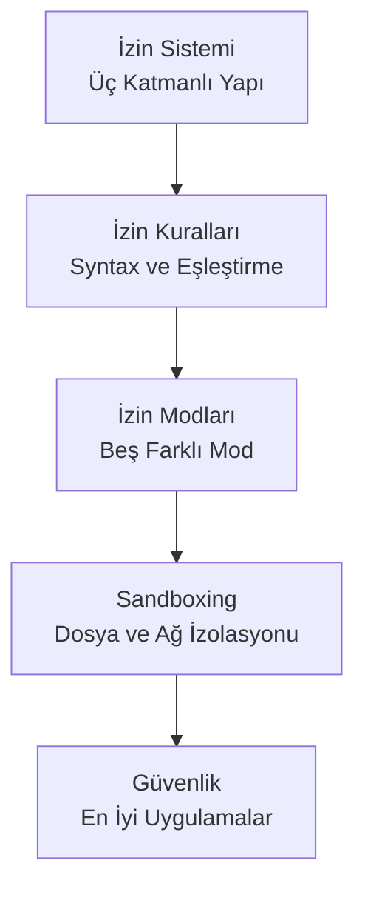
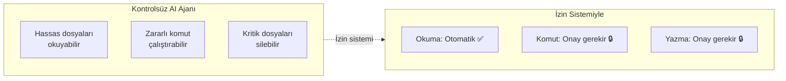

# Bölüm 10: Claude Code — İzinler ve Güvenlik

Claude Code, güçlü yeteneklerini kontrollü bir şekilde sunmak için katmanlı bir **permission system** (izin sistemi) kullanır. Bu bölüm, izin mekanizmasını, kural sözdizimini, çalışma modlarını, sandbox ortamını ve güvenlik en iyi uygulamalarını kapsar.

## Bu Bölümde Neler Öğreneceksiniz?

## İçerik

| # | Dosya | Konu | Süre |
|---|-------|------|------|
| 01 | [İzin Sistemi](./01-izin-sistemi.md) | Üç katmanlı izin yapısı, araç sınıfları, onay mekanizması | ~12 dk |
| 02 | [İzin Kuralları ve Syntax](./02-izin-kurallari-syntax.md) | Kural formatı, değerlendirme sırası, wildcard kullanımı | ~15 dk |
| 03 | [İzin Modları](./03-izin-modlari.md) | Beş izin modu, mod seçim rehberi, konfigürasyon | ~12 dk |
| 04 | [Sandboxing](./04-sandboxing.md) | Bash sandbox, dosya/ağ izolasyonu, CI/CD güvenliği | ~10 dk |
| 05 | [Güvenlik En İyi Uygulamalar](./05-guvenlik-en-iyi-uygulamalar.md) | Prompt injection koruması, hassas dosyalar, ortam bazlı güvenlik | ~15 dk |

## Ön Koşullar

Bu bölümü okumadan önce aşağıdaki konulara aşina olmanız önerilir:

| Konu | Bölüm |
|------|-------|
| Claude Code araçları (Tools) | [Bölüm 08](../08-araclar/README.md) |
| Bellek ve bağlam yönetimi | [Bölüm 09](../09-bellek-ve-baglam/README.md) |
| Terminal / komut satırı temel kullanımı | Harici kaynak |

## Neden Önemli?

> **Önemli:** Claude Code varsayılan olarak güvenli tarafta durur — dosya değişiklikleri ve shell komutları her zaman kullanıcı onayı gerektirir. Bu bölüm, bu güvenlik mekanizmasını nasıl yapılandıracağınızı ve optimize edeceğinizi öğretir.

## Sonraki Adım

Bu bölümü tamamladıktan sonra → [11 - MCP (Model Context Protocol)](../11-mcp/README.md)

---

**Önceki Bölüm:** [09 - Bellek ve Bağlam Yönetimi](../09-bellek-ve-baglam/README.md)
