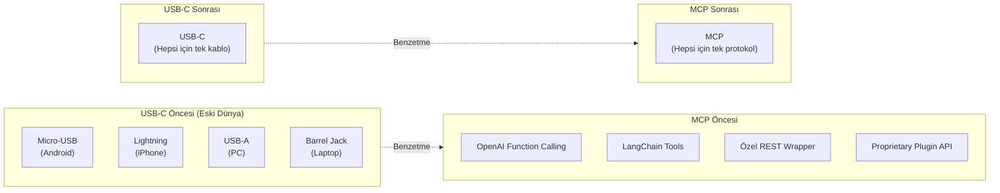
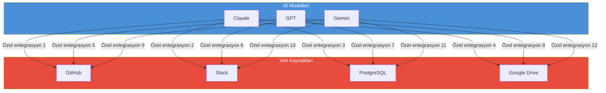
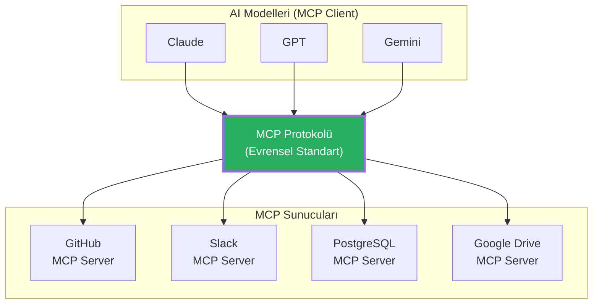
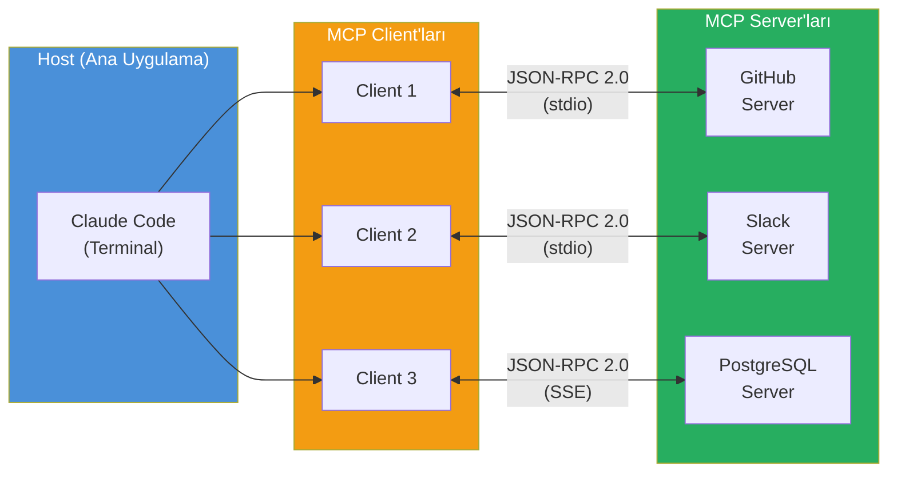
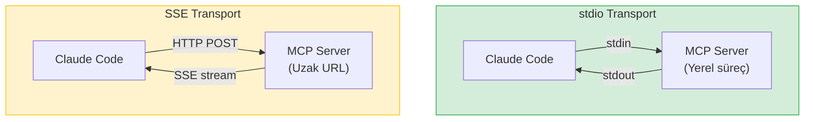
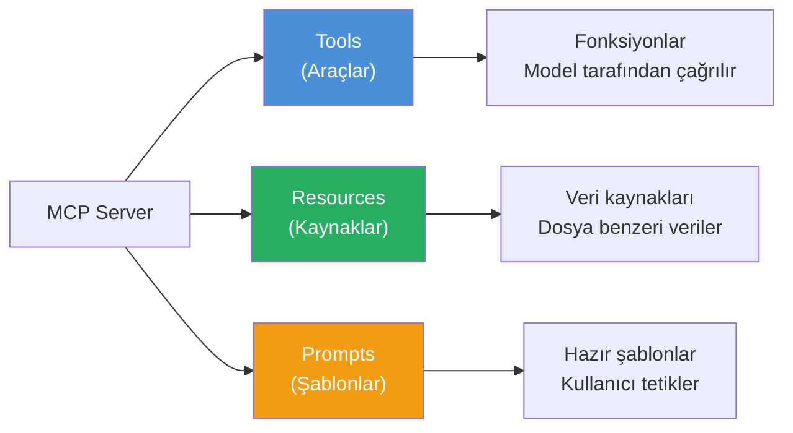
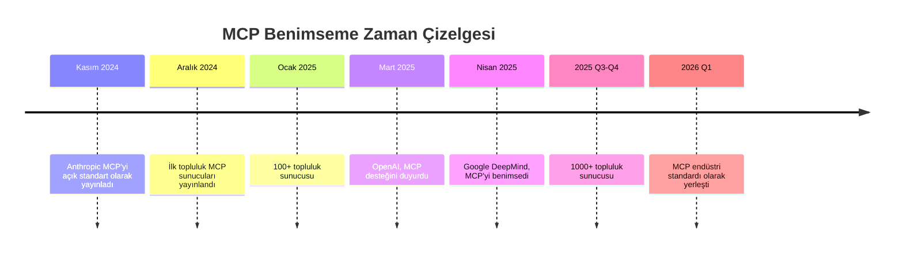
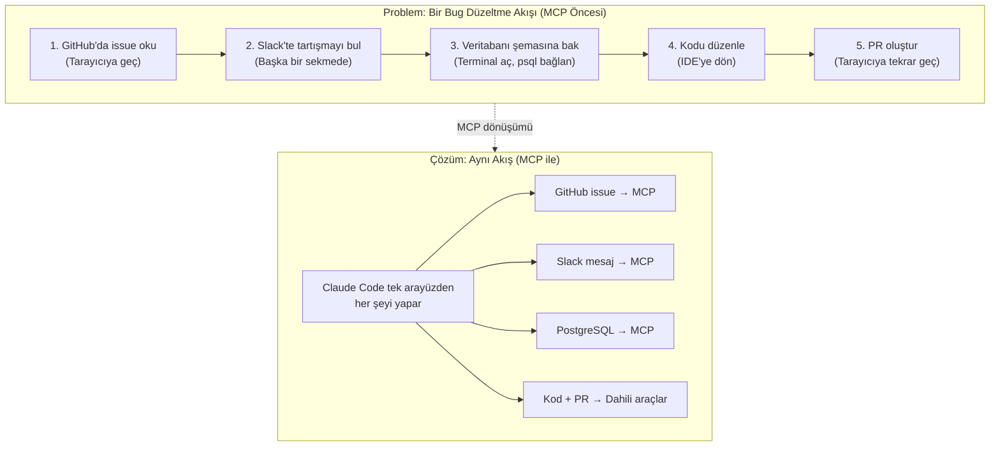

# MCP Nedir?

**Model Context Protocol (MCP)**, Anthropic tarafından Kasım 2024'te tanıtılan açık bir standarttır. Yapay zeka modellerini harici veri kaynakları ve araçlarla bağlamak için tasarlanmıştır. Sıklıkla **"AI'ın USB-C'si"** olarak tanımlanan MCP, farklı bağlantı noktaları yerine tek bir evrensel standart sunar.

## Ön Koşullar

| Konu | Bölüm |
|------|-------|
| Claude Code araçları (Tools) | [Bölüm 08](../08-araclar/README.md) |
| Claude Code nasıl çalışır | [Bölüm 06](../06-claude-code-tanitim/02-claude-code-nasil-calisir.md) |
| JSON-RPC temel bilgisi | Harici kaynak |

---

## USB-C Benzetmesi

Telefonlar, dizüstü bilgisayarlar ve tabletler bir dönemde farklı şarj ve veri kablolarına ihtiyaç duyuyordu. USB-C bu sorunu tek bir standart bağlantı noktasıyla çözdü. MCP de aynı şeyi yapay zeka dünyasında yapıyor:



---

## MCP Öncesi Dünya: Sorun Ne?

MCP'den önce her LLM sağlayıcısı ve her veri kaynağı için ayrı ayrı entegrasyon geliştirmek gerekiyordu:



**Sonuç:** 3 model × 4 kaynak = **12 ayrı entegrasyon** 😰

### MCP Sonrası Dünya



**Sonuç:** 3 model + 4 sunucu = **7 entegrasyon** 🚀

---

## Client-Server Mimarisi

MCP, klasik bir **client-server** (istemci-sunucu) mimarisi kullanır. Bu mimari üç ana bileşenden oluşur:



### Bileşenler

| Bileşen | Rol | Örnek |
|---------|-----|-------|
| **Host** | MCP client'larını barındıran ana uygulama | Claude Code, Claude Desktop, Cursor |
| **MCP Client** | Sunucuyla 1:1 bağlantı kuran protokol istemcisi | Her sunucu tanımı için otomatik oluşturulur |
| **MCP Server** | Belirli bir yeteneği açığa çıkaran hafif program | `@modelcontextprotocol/server-github` |

### İletişim Protokolü: JSON-RPC 2.0

MCP, **JSON-RPC 2.0** standardını kullanır. Bu, istemci ve sunucu arasındaki tüm mesajların JSON formatında olduğu anlamına gelir:

```json
// İstek (Client → Server)
{
  "jsonrpc": "2.0",
  "id": 1,
  "method": "tools/call",
  "params": {
    "name": "get_issue",
    "arguments": {
      "owner": "anthropics",
      "repo": "claude-code",
      "issue_number": 42
    }
  }
}

// Yanıt (Server → Client)
{
  "jsonrpc": "2.0",
  "id": 1,
  "result": {
    "content": [
      {
        "type": "text",
        "text": "Issue #42: Fix memory leak in context window..."
      }
    ]
  }
}
```

### Transport (Taşıma) Yöntemleri

MCP iki ana taşıma yöntemi destekler:

| Yöntem | Açıklama | Kullanım |
|--------|----------|----------|
| **stdio** | Standart giriş/çıkış üzerinden iletişim | Yerel sunucular (varsayılan) |
| **SSE** | Server-Sent Events üzerinden HTTP iletişimi | Uzak sunucular |



---

## MCP Sunucusunun Sunabileceği Yetenekler

Bir MCP sunucusu üç tür yetenek sunabilir:



| Yetenek | Açıklama | Örnek |
|---------|----------|-------|
| **Tools** (Araçlar) | Model tarafından çağrılabilen fonksiyonlar | `create_issue`, `run_query`, `send_message` |
| **Resources** (Kaynaklar) | Modelin okuyabileceği veri kaynakları | Dosya içerikleri, veritabanı şemaları |
| **Prompts** (Şablonlar) | Önceden tanımlanmış prompt şablonları | Kod inceleme şablonu, SQL oluşturma şablonu |

> **Not:** Claude Code şu anda öncelikli olarak MCP **Tools** yeteneğini kullanır. Resources ve Prompts desteği geliştirilmeye devam etmektedir.

---

## Endüstri Genelinde Benimseme

MCP, sadece Anthropic'in değil, tüm AI endüstrisinin benimsediği bir standart haline gelmiştir:



| Şirket | MCP Desteği |
|--------|-------------|
| **Anthropic** | Standart yaratıcısı — Claude Code, Claude Desktop |
| **OpenAI** | ChatGPT ve API'de MCP desteği |
| **Google** | Gemini entegrasyonlarında MCP desteği |
| **Microsoft** | Copilot ekosisteminde MCP uyumluluğu |
| **Topluluk** | 1000+ açık kaynak MCP sunucusu |

---

## Pratik Örnekler

### Örnek 1: MCP Olmadan GitHub Entegrasyonu

```python
# MCP öncesi: Her API için özel kod yazmanız gerekiyordu
import requests

def get_github_issue(owner, repo, issue_number):
    url = f"https://api.github.com/repos/{owner}/{repo}/issues/{issue_number}"
    headers = {"Authorization": f"token {GITHUB_TOKEN}"}
    response = requests.get(url, headers=headers)
    return response.json()

def create_github_issue(owner, repo, title, body):
    url = f"https://api.github.com/repos/{owner}/{repo}/issues"
    headers = {"Authorization": f"token {GITHUB_TOKEN}"}
    data = {"title": title, "body": body}
    response = requests.post(url, headers=headers, json=data)
    return response.json()

# Bu kodu her AI aracı için ayrı ayrı yazmanız gerekiyordu
# Claude Code için ayrı, Cursor için ayrı, Copilot için ayrı...
```

### Örnek 2: MCP ile GitHub Entegrasyonu

```jsonc
// .mcp.json — tek bir konfigürasyon dosyası yeterli
{
  "mcpServers": {
    "github": {
      "command": "npx",
      "args": ["-y", "@modelcontextprotocol/server-github"],
      "env": {
        "GITHUB_PERSONAL_ACCESS_TOKEN": "ghp_xxxxxxxxxxxx"
      }
    }
  }
}
```

```bash
# Artık doğal dille konuşarak GitHub işlemleri yapabilirsiniz:
> anthropics/claude-code reposundaki #42 numaralı issue'yu göster
# Claude Code → MCP GitHub Server → get_issue çağrısı → sonuç

> Bu bug için yeni bir issue oluştur, başlık: "Memory leak in context window"
# Claude Code → MCP GitHub Server → create_issue çağrısı → sonuç

> Son 5 PR'ı listele ve hangilerinin CI'dan geçtiğini göster
# Claude Code → MCP GitHub Server → list_pull_requests + get_checks → sonuç
```

### Örnek 3: MCP'nin Çözdüğü Gerçek Dünya Problemi



---

## Temel Kavramlar Özeti

| Kavram | Açıklama |
|--------|----------|
| **MCP** | Model Context Protocol — AI modellerini harici kaynaklarla bağlayan açık standart |
| **Host** | MCP client'larını barındıran uygulama (Claude Code) |
| **Client** | Sunucuyla 1:1 bağlantı kuran protokol istemcisi |
| **Server** | Belirli yetenekleri açığa çıkaran hafif program |
| **JSON-RPC 2.0** | İstemci-sunucu iletişim formatı |
| **stdio** | Yerel sunucular için standart giriş/çıkış taşıma yöntemi |
| **SSE** | Uzak sunucular için HTTP tabanlı taşıma yöntemi |
| **Tools** | Sunucunun açığa çıkardığı çağrılabilir fonksiyonlar |

---

## Sonraki Adım

MCP'nin ne olduğunu ve neden önemli olduğunu öğrendik. Şimdi Claude Code'da MCP sunucularını nasıl yapılandıracağımızı görelim:

→ [Kurulum ve Konfigürasyon](./02-mcp-kurulumu-ve-konfigurasyonu.md)
