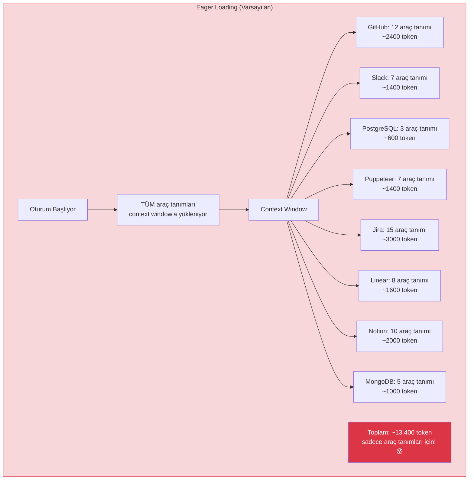
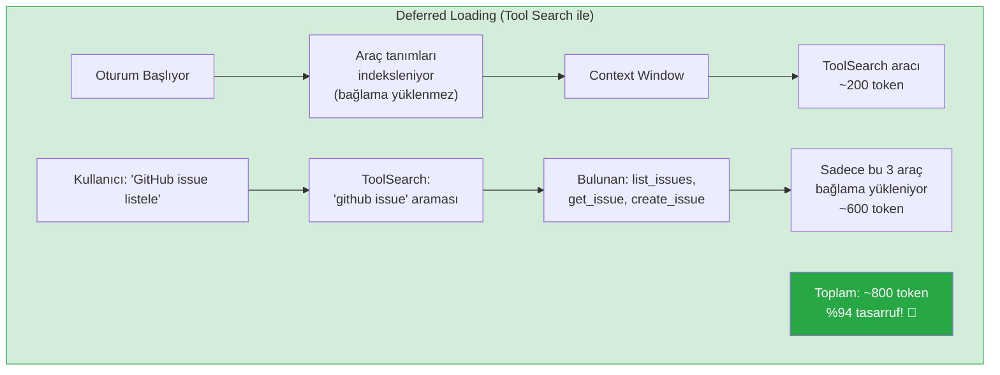
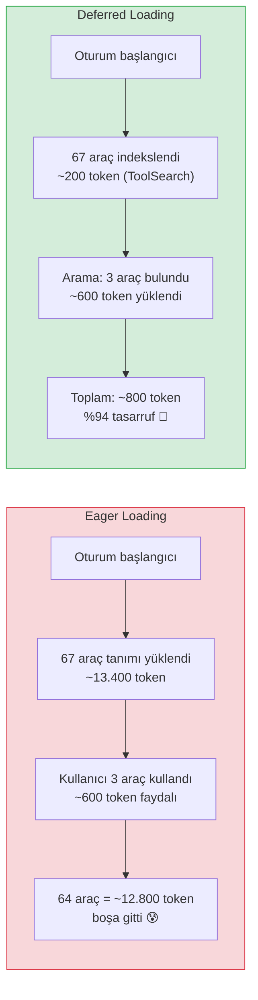
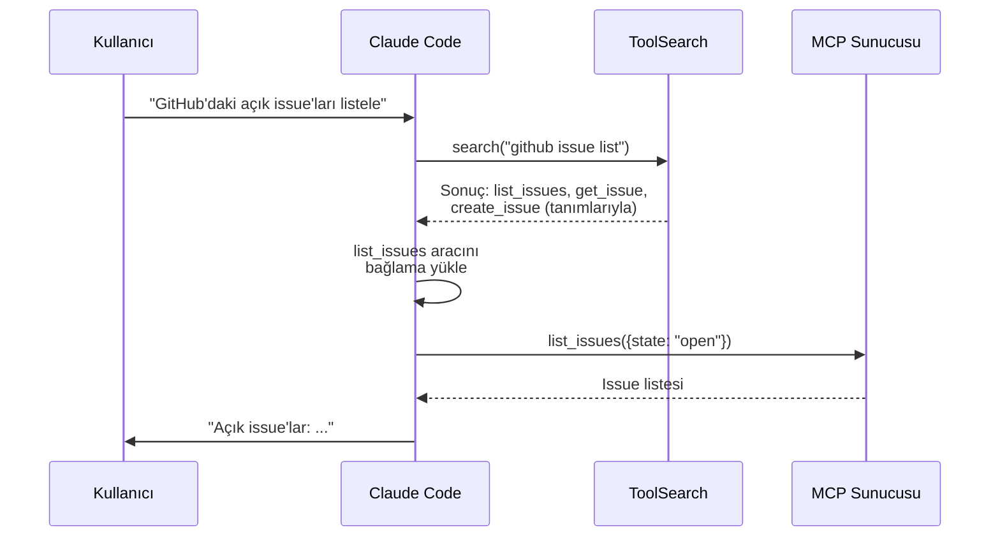
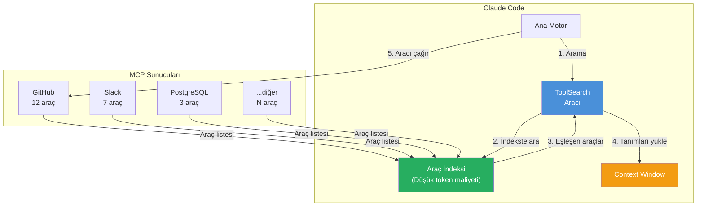

# MCP Tool Search

Birden fazla MCP sunucusu yapılandırdığınızda araç sayısı hızla artabilir. GitHub (12 araç) + Slack (7 araç) + PostgreSQL (3 araç) + Puppeteer (7 araç) = 29 araç. Bu sayı 100'ü aştığında tüm araç tanımlarını **context window** (bağlam penceresi) içine yüklemek hem token israfına hem de performans düşüşüne yol açar. **Tool Search** (Araç Arama) mekanizması bu sorunu çözer.

## Ön Koşullar

| Konu | Bölüm |
|------|-------|
| MCP sunucu konfigürasyonu | [Kurulum ve Konfigürasyon](./02-mcp-kurulumu-ve-konfigurasyonu.md) |
| Context window yönetimi | [Bölüm 09](../09-bellek-ve-baglam/05-context-window-yonetimi.md) |
| Claude Code araçları | [Bölüm 08](../08-araclar/README.md) |

---

## Problem: Eager Loading (İstekli Yükleme)

Varsayılan davranışta Claude Code, oturum başladığında tüm MCP sunucularının tüm araç tanımlarını context window'a yükler:



**Sorun:** Kullanıcı sadece "GitHub'daki issue'ları listele" dese bile, Puppeteer, Jira, MongoDB ve diğer tüm sunucuların araç tanımları gereksiz yere bağlamda yer kaplar.

---

## Çözüm: Deferred Loading (Ertelenmiş Yükleme)

Tool Search etkinleştirildiğinde, araç tanımları bağlama yüklenmez. Bunun yerine aranabilir bir **index** (dizin) oluşturulur ve araçlar yalnızca ihtiyaç duyulduğunda yüklenir:



---

## Eager vs Deferred Karşılaştırması



| Metrik | Eager Loading | Deferred Loading |
|--------|--------------|-----------------|
| **Başlangıç token maliyeti** | ~13.400 token | ~200 token |
| **Kullanılan araç token'ı** | ~600 token | ~600 token |
| **İsraf** | ~12.800 token | ~0 token |
| **Tasarruf** | — | **%94** |
| **İlk yanıt hızı** | Yavaş | Hızlı |
| **Araç keşfi** | Otomatik | Bir adım ek arama |

---

## Tool Search Nasıl Etkinleştirilir?

Tool Search, Claude Code ayarlarından etkinleştirilir:

```jsonc
// ~/.claude/settings.json
{
  "mcpToolSearch": true
}
```

Veya CLI üzerinden:

```bash
claude config set mcpToolSearch true
```

### Ne Zaman Etkinleştirmeli?

| Durum | Tavsiye |
|-------|---------|
| 1-2 MCP sunucusu, toplam <20 araç | Eager loading yeterli |
| 3-5 MCP sunucusu, toplam 20-50 araç | İsteğe bağlı |
| 5+ MCP sunucusu, toplam 50+ araç | **Tool Search şiddetle önerilir** |
| 100+ araç | **Tool Search zorunlu** |

---

## ToolSearch Aracı Nasıl Çalışır?

Tool Search etkinleştirildiğinde, Claude Code'a `ToolSearch` adında yeni bir dahili araç eklenir:



### ToolSearch Aracının Parametreleri

```json
{
  "name": "ToolSearch",
  "description": "Search for MCP tools by keyword or description",
  "parameters": {
    "query": {
      "type": "string",
      "description": "Search query to find relevant tools"
    },
    "server": {
      "type": "string",
      "description": "Optional: filter by server name"
    }
  }
}
```

### Örnek ToolSearch Çağrıları

```bash
# Claude Code arka planda şu çağrıları yapar:

# 1. Genel arama
ToolSearch(query: "send message slack")
# → post_message, reply_to_thread

# 2. Sunucu filtreli arama
ToolSearch(query: "create", server: "github")
# → create_issue, create_pull_request, create_branch

# 3. Açıklama bazlı arama
ToolSearch(query: "database table schema")
# → list_tables, describe_table, query
```

---

## Pratik Örnekler

### Örnek 1: Çok Sunuculu Proje — Token Tasarrufu

```jsonc
// .mcp.json — 7 sunucu, 67 araç
{
  "mcpServers": {
    "github": {
      "command": "npx",
      "args": ["-y", "@modelcontextprotocol/server-github"],
      "env": { "GITHUB_PERSONAL_ACCESS_TOKEN": "${GITHUB_TOKEN}" }
    },
    "slack": {
      "command": "npx",
      "args": ["-y", "@modelcontextprotocol/server-slack"],
      "env": { "SLACK_BOT_TOKEN": "${SLACK_BOT_TOKEN}", "SLACK_TEAM_ID": "${SLACK_TEAM_ID}" }
    },
    "postgres": {
      "command": "npx",
      "args": ["-y", "@modelcontextprotocol/server-postgres", "${DATABASE_URL}"]
    },
    "puppeteer": {
      "command": "npx",
      "args": ["-y", "@modelcontextprotocol/server-puppeteer"]
    },
    "brave-search": {
      "command": "npx",
      "args": ["-y", "@modelcontextprotocol/server-brave-search"],
      "env": { "BRAVE_API_KEY": "${BRAVE_API_KEY}" }
    },
    "filesystem": {
      "command": "npx",
      "args": ["-y", "@modelcontextprotocol/server-filesystem", "/home/yasin/docs"]
    },
    "linear": {
      "command": "npx",
      "args": ["-y", "@modelcontextprotocol/server-linear"],
      "env": { "LINEAR_API_KEY": "${LINEAR_API_KEY}" }
    }
  }
}
```

```bash
# Tool Search etkinleştirildiğinde:
claude config set mcpToolSearch true

$ claude
# Oturum başlangıcı:
#   Eager Loading olsaydı: ~13.400 token araç tanımı
#   Tool Search ile: ~200 token (sadece ToolSearch aracı)
#   Tasarruf: ~13.200 token = %98!

> Linear'daki aktif sprint görevlerimi göster
# ToolSearch("linear sprint tasks") → list_issues, get_cycle
# Sadece 2 araç yüklendi → ~400 token
```

### Örnek 2: Tool Search Olmadan ve İle Karşılaştırma

```bash
# --- Tool Search KAPALI ---
$ claude
# [13.400 token araç tanımı yüklendi]
# Context window: %12 dolu (sadece araçlardan!)

> Bu repodaki açık PR'ları listele
# Zaten yüklü olan list_pull_requests kullanılır
# Hızlı ama pahalı başlangıç

# --- Tool Search AÇIK ---
$ claude
# [200 token ToolSearch aracı yüklendi]
# Context window: %0.2 dolu

> Bu repodaki açık PR'ları listele
# ToolSearch("list pull requests github") → list_pull_requests
# [600 token yüklendi]
# 1 ekstra adım ama çok daha verimli
```

### Örnek 3: ToolSearch Tarafından Bulunamayan Araçlar

```bash
# Bazen ToolSearch doğru aracı bulamayabilir
> Veritabanındaki tabloları listele

# Eğer ToolSearch yanlış sonuç verirse:
# Claude Code otomatik olarak sorguyu yeniden düzenler
# ToolSearch("database tables") → list_tables ✅

# Manuel müdahale gerekirse:
> /mcp
# Tüm sunucuları ve araçları görüntüleyin
# İhtiyaç duyduğunuz aracı belirleyin
# Doğrudan araç adını kullanarak isteyin:
> postgres sunucusundaki list_tables aracını kullan
```

---

## Mimari Diyagram



---

## Özet

| Kavram | Açıklama |
|--------|----------|
| **Eager Loading** | Tüm araç tanımlarını baştan yükleme (varsayılan) |
| **Deferred Loading** | Araçları ihtiyaç anında yükleme (Tool Search ile) |
| **ToolSearch** | Araç indeksinde arama yapan dahili araç |
| **Araç İndeksi** | Tüm araçların düşük maliyetli aranabilir listesi |
| **`mcpToolSearch`** | Tool Search'ü etkinleştiren ayar |
| **Token tasarrufu** | Çok sunuculu ortamlarda %90+ tasarruf mümkün |

---

## Sonraki Adım

Tool Search'ün ne zaman kullanılacağını öğrendik. Şimdi MCP sunucuları ile Skill'ler arasındaki farkı ve hangisini ne zaman tercih etmeniz gerektiğini inceleyelim:

→ [MCP vs Skills: Ne Zaman Hangisi?](./05-mcp-vs-skills-ne-zaman-hangisi.md)
