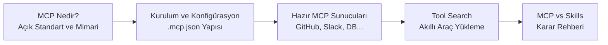
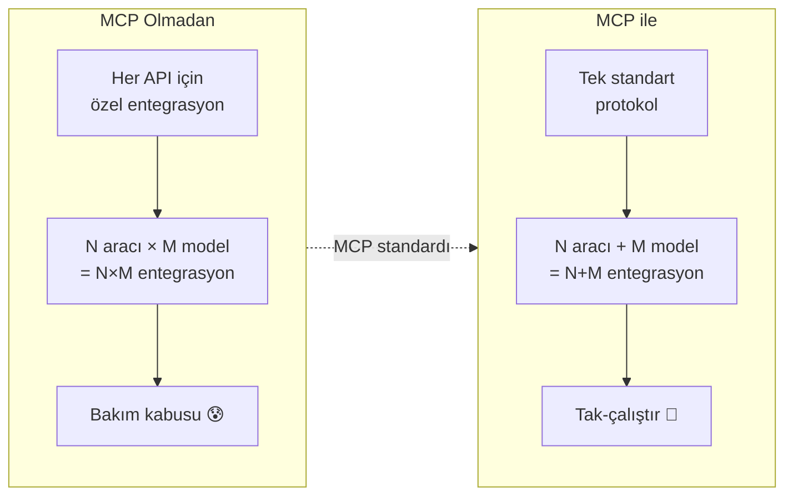

# Bölüm 11: MCP (Model Context Protocol)

Claude Code'un gücü sadece dahili araçlarıyla sınırlı değildir. **Model Context Protocol (MCP)**, Claude Code'u GitHub, Slack, veritabanları ve yüzlerce harici hizmetle entegre etmenizi sağlayan açık standarttır. Bu bölüm, MCP'nin ne olduğundan özel sunucu yapılandırmasına kadar tüm süreçleri kapsar.

## Bu Bölümde Neler Öğreneceksiniz?

## İçerik

| # | Dosya | Konu | Süre |
|---|-------|------|------|
| 01 | [MCP Nedir?](./01-mcp-nedir.md) | Açık standart, JSON-RPC 2.0, client-server mimari, neden gerekli | ~15 dk |
| 02 | [Kurulum ve Konfigürasyon](./02-mcp-kurulumu-ve-konfigurasyonu.md) | .mcp.json dosyası, proje/kullanıcı kapsamı, sunucu tanımlama | ~12 dk |
| 03 | [Hazır MCP Sunucuları](./03-hazir-mcp-sunuculari.md) | GitHub, Slack, PostgreSQL, Brave Search ve diğer sunucular | ~20 dk |
| 04 | [Tool Search](./04-mcp-tool-search.md) | Ertelenmiş araç yükleme, ToolSearch aracı, performans optimizasyonu | ~10 dk |
| 05 | [MCP vs Skills: Ne Zaman Hangisi?](./05-mcp-vs-skills-ne-zaman-hangisi.md) | Karar ağacı, bağlam maliyeti karşılaştırması, pratik örnekler | ~12 dk |

## Ön Koşullar

Bu bölümü okumadan önce aşağıdaki konulara aşina olmanız önerilir:

| Konu | Bölüm |
|------|-------|
| Claude Code araçları (Tools) | [Bölüm 08](../08-araclar/README.md) |
| Bellek ve bağlam yönetimi | [Bölüm 09](../09-bellek-ve-baglam/README.md) |
| İzinler ve güvenlik | [Bölüm 10](../10-izinler-ve-guvenlik/README.md) |
| JSON ve komut satırı temel bilgisi | Harici kaynak |

## Neden Önemli?

> **Önemli:** MCP, Claude Code'un harici dünya ile iletişim kurmasının birincil yoludur. GitHub'dan issue çekmek, veritabanından sorgu çalıştırmak veya Slack'e mesaj göndermek gibi tüm harici entegrasyonlar MCP sunucuları üzerinden gerçekleşir.

## Sonraki Adım

Bu bölümü tamamladıktan sonra → [12 - Skills ve Pluginler](../12-skills-ve-pluginler/README.md)

---

**Önceki Bölüm:** [10 - İzinler ve Güvenlik](../10-izinler-ve-guvenlik/README.md)
