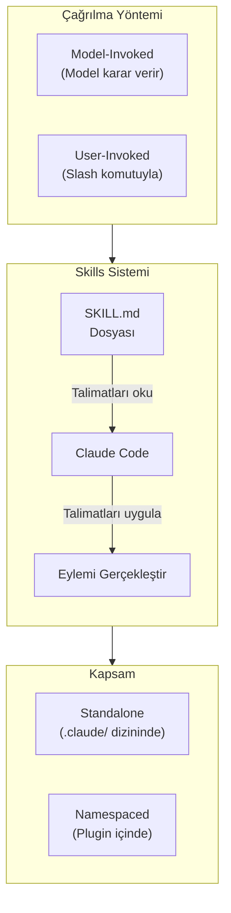
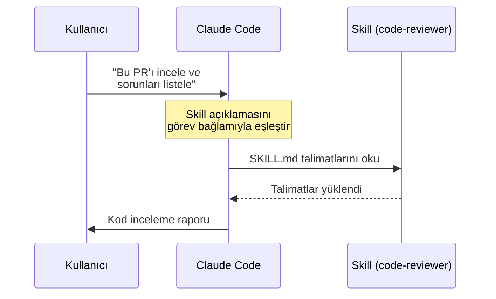
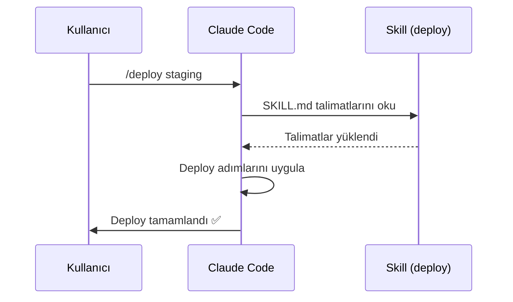
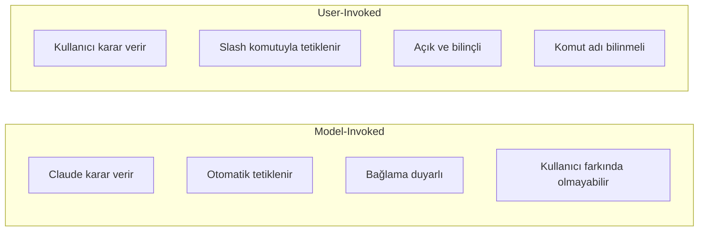
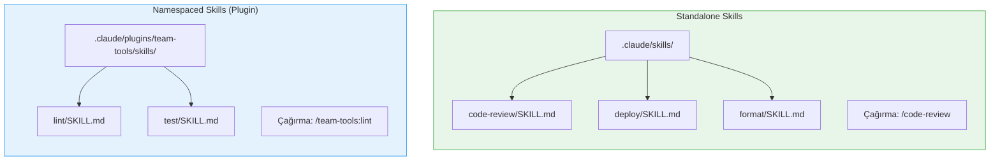
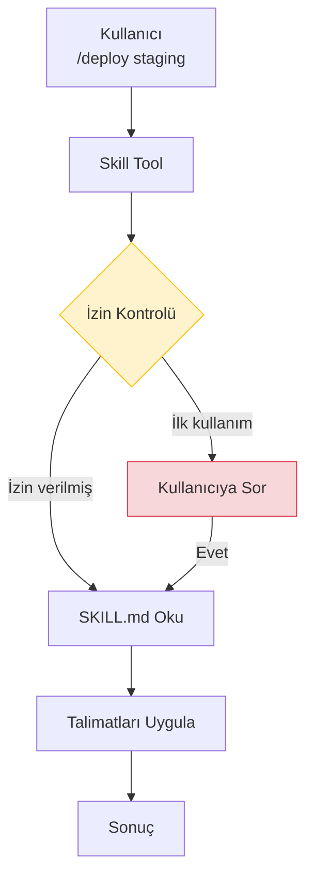

# Skills Nedir?

**Skills** (beceriler), Claude Code'un yeteneklerini genişleten özel araçlardır. Bir skill, Claude Code'a yeni bir davranış veya yetenek kazandıran `SKILL.md` dosyasından oluşur. Skills sistemi, Claude Code'u projenize ve iş akışınıza özel hale getirmenin en esnek yoludur.

## Ön Koşullar

| Konu | Bölüm |
|------|-------|
| Claude Code araçları (Tools) | [Bölüm 08](../08-araclar/README.md) |
| CLAUDE.md ve bellek sistemi | [Bölüm 09](../09-bellek-ve-baglam/README.md) |
| İzin sistemi | [Bölüm 10](../10-izinler-ve-guvenlik/README.md) |

---

## Skills Genel Bakış

Skills, Claude Code'un dahili araç setini genişleten **doğal dil tabanlı** eklentilerdir. Bir MCP sunucusu gibi harici bir süreç çalıştırmak yerine, SKILL.md dosyasındaki talimatları okuyarak çalışır.



---

## İki Çağırma Türü (Invocation Types)

Skills, çağrılma şekillerine göre iki türe ayrılır:

### 1. Model-Invoked Skills (Model Tarafından Çağrılan)

Claude, görevin bağlamına bakarak bu skill'i **otomatik olarak** kullanıp kullanmayacağına karar verir. Kullanıcının açıkça çağırmasına gerek yoktur.

```yaml
# SKILL.md içinde
---
invocation: model
name: code-reviewer
description: Kod değişikliklerini inceleyerek kalite raporu üretir
---
```



**Ne zaman kullanılır:**
- Claude'un bağlama göre otomatik karar vermesi istendiğinde
- Genel amaçlı, sık kullanılan yetenekler için
- Kullanıcının skill'in varlığını bilmesi gerekmediğinde

### 2. User-Invoked Skills (Kullanıcı Tarafından Çağrılan)

Kullanıcı, skill'i **slash komutuyla** (`/skill-adı`) açıkça çağırır. Claude bu skill'i yalnızca kullanıcı tetiklediğinde kullanır.

```yaml
# SKILL.md içinde
---
invocation: user
name: deploy
description: Uygulamayı belirtilen ortama deploy eder
---
```



**Ne zaman kullanılır:**
- Belirli bir eylemi bilinçli olarak tetiklemek istendiğinde
- Tehlikeli veya geri alınamaz işlemler için (deploy, migration vb.)
- İş akışının belirli bir adımını başlatmak için

### Karşılaştırma



| Özellik | Model-Invoked | User-Invoked |
|---------|---------------|--------------|
| **Tetikleme** | Claude otomatik karar verir | Kullanıcı `/komut` ile çağırır |
| **Kontrol** | Claude'da | Kullanıcıda |
| **Kullanım alanı** | Genel yetenekler | Spesifik eylemler |
| **Keşfedilebilirlik** | Otomatik | `/skills` ile listelenir |
| **Örnek** | `code-reviewer`, `test-writer` | `/deploy`, `/migrate`, `/format` |

---

## İki Kapsam Türü (Scope Types)

### 1. Standalone Skills (Bağımsız Beceriler)

Projenin `.claude/skills/` dizininde yaşar. Kısa isimlerle çağrılır:

```
proje/
├── .claude/
│   └── skills/
│       ├── code-review/
│       │   └── SKILL.md
│       ├── deploy/
│       │   └── SKILL.md
│       └── format/
│           └── SKILL.md
```

```bash
# Standalone skill çağırma (user-invoked)
> /code-review
> /deploy
> /format
```

### 2. Namespaced Skills (İsim Alanlı Beceriler)

Bir plugin'in parçası olarak gelir. `plugin-adı:skill-adı` formatıyla çağrılır:

```
proje/
├── .claude/
│   └── plugins/
│       └── team-tools/
│           ├── .claude-plugin/
│           │   └── plugin.json
│           └── skills/
│               ├── lint/
│               │   └── SKILL.md
│               └── test/
│                   └── SKILL.md
```

```bash
# Namespaced skill çağırma
> /team-tools:lint
> /team-tools:test
```



---

## Skill Tool ve İzinler

Claude Code, bir skill'i çalıştırırken **Skill** aracını kullanır. Bu araç, diğer araçlar gibi izin sistemine tabidir:



Skill izinleri `settings.json` ile yapılandırılabilir:

```jsonc
// .claude/settings.json
{
  "permissions": {
    "allow": [
      "Skill(code-review)",
      "Skill(format)",
      "Skill(team-tools:lint)"
    ],
    "deny": [
      "Skill(deploy)"  // deploy skill'i her zaman onay ister
    ]
  }
}
```

---

## Pratik Örnekler

### Örnek 1: Model-Invoked Skill Davranışı

```bash
# Kullanıcı bir PR incelemesi istiyor
> Bu PR'daki değişiklikleri incele ve potansiyel sorunları listele

# Claude Code arka planda:
# 1. "code-reviewer" skill'inin açıklamasını kontrol eder
# 2. Görev bağlamıyla eşleştiğini görür
# 3. SKILL.md talimatlarını okur
# 4. Talimatları uygulayarak rapor üretir

# Sonuç: Yapılandırılmış kod inceleme raporu
# ┌──────────────────────────────────────────────┐
# │ Kod İnceleme Raporu                          │
# │                                              │
# │ ⚠️  3 potansiyel sorun bulundu:              │
# │   1. auth.ts:42 — SQL injection riski        │
# │   2. api.ts:15 — Error handling eksik        │
# │   3. utils.ts:88 — Kullanılmayan import      │
# │                                              │
# │ ✅ 5 pozitif nokta:                          │
# │   1. Tutarlı naming convention               │
# │   2. Kapsamlı tip tanımları                  │
# │   ...                                        │
# └──────────────────────────────────────────────┘
```

### Örnek 2: User-Invoked Skill Kullanımı

```bash
# Kullanıcı deploy skill'ini slash komutuyla çağırır
> /deploy production

# Claude Code:
# 1. deploy skill'ini bulur
# 2. SKILL.md talimatlarını okur
# 3. Adım adım uygular:

# Çıktı:
# ┌──────────────────────────────────────────────┐
# │ 🚀 Deploy — production ortamı               │
# │                                              │
# │ Adım 1/4: Testler çalıştırılıyor...    ✅   │
# │ Adım 2/4: Build alınıyor...            ✅   │
# │ Adım 3/4: Docker image oluşturuluyor.. ✅   │
# │ Adım 4/4: Kubernetes'e deploy...       ✅   │
# │                                              │
# │ Deploy tamamlandı!                           │
# │ URL: https://app.example.com                 │
# └──────────────────────────────────────────────┘
```

### Örnek 3: Mevcut Skill'leri Listeleme

```bash
# Tüm kullanılabilir skill'leri listele
> /skills

# Çıktı:
# ┌──────────────────────────────────────────────────────┐
# │ Available Skills                                     │
# │                                                      │
# │ Standalone:                                          │
# │   /code-review  — Kod inceleme raporu üretir    [M]  │
# │   /deploy       — Ortama deploy eder            [U]  │
# │   /format       — Kod formatlama uygular        [U]  │
# │                                                      │
# │ Plugins:                                             │
# │   /team-tools:lint  — ESLint analizi yapar      [U]  │
# │   /team-tools:test  — Test suite çalıştırır     [U]  │
# │                                                      │
# │ [M] = Model-invoked  [U] = User-invoked              │
# └──────────────────────────────────────────────────────┘
```

---

## Özet

| Kavram | Açıklama |
|--------|----------|
| **Skill** | Claude Code'a yeni yetenek kazandıran SKILL.md dosyası |
| **Model-Invoked** | Claude'un bağlama göre otomatik kullandığı skill |
| **User-Invoked** | Kullanıcının slash komutuyla tetiklediği skill |
| **Standalone** | `.claude/skills/` dizininde bağımsız yaşayan skill |
| **Namespaced** | Plugin içinde `/plugin:skill` formatıyla çağrılan skill |
| **Skill Tool** | Skill'leri çalıştıran dahili araç (izin gerektirir) |

---

## Sonraki Adım

Skill kavramını ve türlerini öğrendik. Şimdi kendi skill'lerimizi nasıl oluşturacağımızı inceleyelim:

→ [Skill Oluşturma](./02-skill-olusturma.md)
