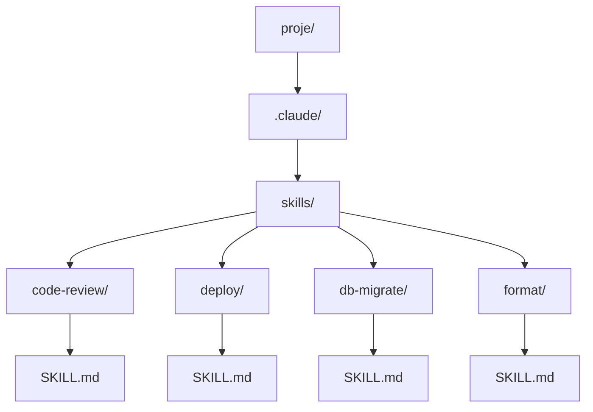
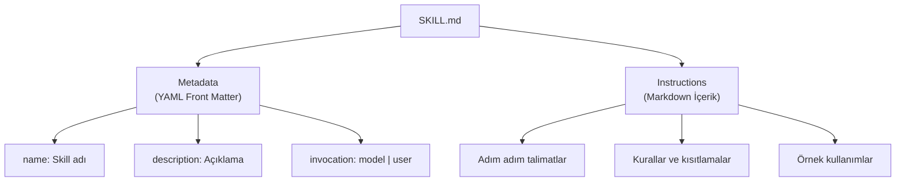
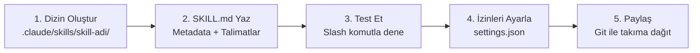
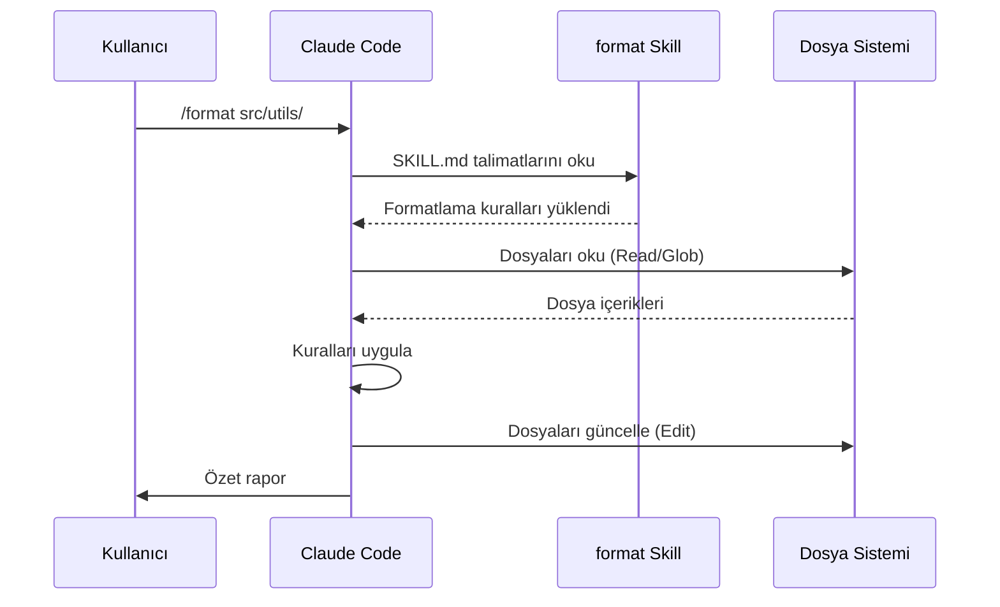
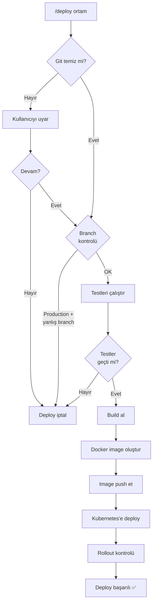
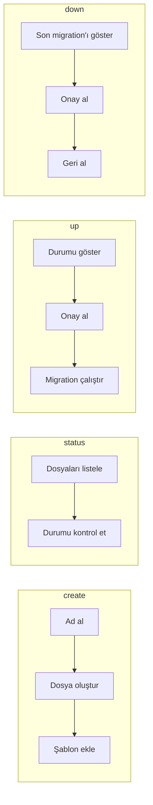
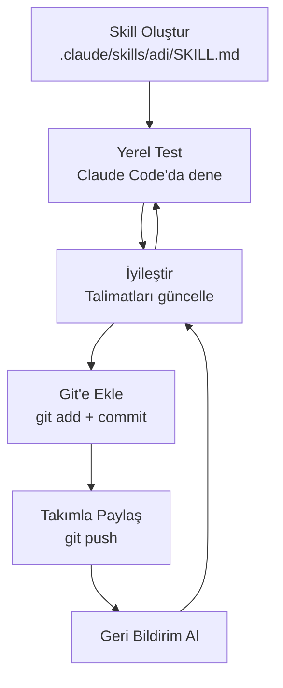

# Skill Oluşturma

Kendi **skill**'lerinizi oluşturarak Claude Code'u projenize ve iş akışınıza özel hale getirebilirsiniz. Bu bölüm, `SKILL.md` dosyasının yapısını, dizin organizasyonunu ve farklı amaçlara yönelik pratik skill örneklerini kapsar.

## Ön Koşullar

| Konu | Bölüm |
|------|-------|
| Skills nedir ve türleri | [Skills Nedir?](./01-skills-nedir.md) |
| CLAUDE.md dosyası | [Bölüm 09](../09-bellek-ve-baglam/01-claude-md-dosyasi.md) |
| İzin sistemi | [Bölüm 10](../10-izinler-ve-guvenlik/01-izin-sistemi.md) |

---

## Dizin Yapısı

Skill'ler projenin `.claude/skills/` dizininde yaşar. Her skill kendi klasöründe bir `SKILL.md` dosyasından oluşur:



```
proje/
├── .claude/
│   ├── settings.json
│   ├── CLAUDE.md
│   └── skills/
│       ├── code-review/
│       │   └── SKILL.md
│       ├── deploy/
│       │   └── SKILL.md
│       ├── db-migrate/
│       │   └── SKILL.md
│       └── format/
│           └── SKILL.md
├── src/
└── package.json
```

---

## SKILL.md Dosya Formatı

Her SKILL.md dosyası iki bölümden oluşur: **metadata** (üst bilgi) ve **instructions** (talimatlar).



### Genel Format

```markdown
---
name: skill-adi
description: Skill'in ne yaptığını açıklayan kısa bir cümle
invocation: user
---

# Skill Başlığı

## Amaç
Bu skill'in ne yaptığını ve neden kullanıldığını açıklayın.

## Talimatlar
1. İlk adım
2. İkinci adım
3. Üçüncü adım

## Kurallar
- Kural 1
- Kural 2

## Örnek
Skill'in nasıl kullanılacağına dair örnekler.
```

### Metadata Alanları

| Alan | Zorunlu | Değerler | Açıklama |
|------|---------|----------|----------|
| `name` | Evet | Herhangi bir string | Skill'in benzersiz adı (slash komut adı olur) |
| `description` | Evet | Herhangi bir string | Skill'in ne yaptığını açıklar |
| `invocation` | Evet | `model` veya `user` | Çağrılma yöntemi |

---

## Adım Adım Skill Oluşturma



### Adım 1: Dizin Oluşturun

```bash
# Proje kökünde
mkdir -p .claude/skills/format
```

### Adım 2: SKILL.md Dosyasını Yazın

```bash
# SKILL.md dosyasını oluşturun
# (Aşağıdaki örneklerden birini kullanabilirsiniz)
```

### Adım 3: Test Edin

```bash
# Claude Code oturumunda skill'i test edin
$ claude

# User-invoked ise:
> /format src/

# Model-invoked ise, ilgili bir görev verin:
> Bu dosyadaki kodu projemizin standartlarına göre düzenle
```

### Adım 4: İzinleri Yapılandırın

```jsonc
// .claude/settings.json
{
  "permissions": {
    "allow": [
      "Skill(format)"
    ]
  }
}
```

### Adım 5: Takımla Paylaşın

```bash
# .claude/skills/ dizinini Git'e ekleyin
git add .claude/skills/
git commit -m "feat: code formatting skill eklendi"
git push
```

---

## Pratik Örnekler

### Örnek 1: Kod Formatlama Skill'i

Projenizin kodlama standartlarına göre dosyaları formatlayan bir skill:

```markdown
---
name: format
description: Proje kodlama standartlarına göre dosyaları formatlar ve düzenler
invocation: user
---

# Kod Formatlama

## Amaç
Belirtilen dosya veya dizindeki kodu projenin kodlama standartlarına uygun hale getirir.

## Talimatlar

1. Kullanıcının belirttiği dosya veya dizini oku.
2. Aşağıdaki formatlama kurallarını uygula:

### TypeScript / JavaScript Kuralları
- Girinti: 2 boşluk (tab kullanma)
- String'ler: tek tırnak (`'`) kullan
- Noktalı virgül: her satır sonunda zorunlu
- Trailing comma: çok satırlı yapılarda zorunlu
- Maksimum satır uzunluğu: 100 karakter
- Import sırası: harici paketler → dahili modüller → tip importları

### Genel Kurallar
- Dosya sonunda boş satır bırak
- Ardışık boş satırları tek satıra indir
- Kullanılmayan import'ları kaldır
- console.log ifadelerini kaldır (console.error ve console.warn hariç)

3. Değişiklikleri uygula ve yapılan düzenlemelerin özetini sun.

## Kullanım

```
/format src/components/Button.tsx
/format src/utils/
/format .
```

## Örnek Çıktı

Formatlama tamamlandı:
- 3 dosya güncellendi
- 12 import yeniden sıralandı
- 5 kullanılmayan import kaldırıldı
- 2 console.log kaldırıldı
```

**Kullanım akışı:**



---

### Örnek 2: Deployment (Dağıtım) Skill'i

Uygulamayı belirtilen ortama deploy eden kapsamlı bir skill:

```markdown
---
name: deploy
description: Uygulamayı belirtilen ortama (staging/production) deploy eder
invocation: user
---

# Deploy

## Amaç
Uygulamayı güvenli bir şekilde belirtilen ortama deploy eder.
Desteklenen ortamlar: staging, production

## Ön Kontroller

Deploy başlamadan önce aşağıdaki kontrolleri yap:

1. **Git durumu:** Commit edilmemiş değişiklik olmamalı
   ```bash
   git status --porcelain
   ```
   Eğer çıktı boş değilse, kullanıcıyı uyar ve devam edip etmeyeceğini sor.

2. **Branch kontrolü:**
   - staging: herhangi bir branch'ten deploy edilebilir
   - production: yalnızca `main` veya `master` branch'ten deploy edilebilir

3. **Test kontrolü:** Tüm testler geçmeli
   ```bash
   npm test
   ```
   Başarısız test varsa deploy'u durdur.

## Deploy Adımları

### Staging
1. `npm run build` ile build al
2. `npm run test:e2e` ile e2e testleri çalıştır
3. `docker build -t app:staging .` ile image oluştur
4. `docker push registry.example.com/app:staging`
5. `kubectl set image deployment/app app=registry.example.com/app:staging -n staging`

### Production
1. Kullanıcıdan açık onay al: "Production'a deploy edilecek. Onaylıyor musunuz?"
2. `npm run build` ile build al
3. `npm run test:e2e` ile e2e testleri çalıştır
4. `docker build -t app:$(git rev-parse --short HEAD) .`
5. `docker push registry.example.com/app:$(git rev-parse --short HEAD)`
6. `kubectl set image deployment/app app=registry.example.com/app:$(git rev-parse --short HEAD) -n production`
7. `kubectl rollout status deployment/app -n production`
8. Deploy başarılıysa git tag oluştur

## Güvenlik Kuralları
- Production deploy'da her zaman kullanıcıdan açık onay al
- Hiçbir zaman `--force` flag'i kullanma
- Deploy sırasında bir hata olursa hemen dur ve rapor et
- Rollback talimatlarını her zaman göster

## Kullanım

```
/deploy staging
/deploy production
```
```

**Deploy akış diyagramı:**



---

### Örnek 3: Veritabanı Migration (Göç) Skill'i

Veritabanı migration'larını yöneten bir skill:

```markdown
---
name: db-migrate
description: Veritabanı migration dosyası oluşturur ve migration'ları yönetir
invocation: user
---

# Database Migration

## Amaç
Veritabanı migration'larını oluşturur, çalıştırır ve yönetir.

## Desteklenen Komutlar

Kullanıcı aşağıdaki alt komutlardan birini belirtmelidir:

### create — Yeni migration oluştur
1. Kullanıcıdan migration adını al
2. Timestamp bazlı dosya adı oluştur: `YYYYMMDDHHMMSS_migration_adi.sql`
3. `database/migrations/` dizinine yerleştir
4. Şablon içeriği ekle:

```sql
-- Migration: migration_adi
-- Created: YYYY-MM-DD HH:MM:SS

-- UP
BEGIN;

-- Değişikliklerinizi buraya yazın

COMMIT;

-- DOWN
BEGIN;

-- Geri alma işlemlerini buraya yazın

COMMIT;
```

### status — Migration durumunu göster
1. `database/migrations/` dizinindeki tüm migration dosyalarını listele
2. Hangi migration'ların çalıştırıldığını kontrol et:
   ```bash
   npm run db:migrate:status
   ```

### up — Bekleyen migration'ları çalıştır
1. Önce `status` alt komutunu çalıştırarak bekleyen migration'ları göster
2. Kullanıcıdan onay al
3. Migration'ları çalıştır:
   ```bash
   npm run db:migrate:up
   ```

### down — Son migration'ı geri al
1. En son çalıştırılan migration'ı göster
2. Kullanıcıdan açık onay al: "Bu migration geri alınacak. Onaylıyor musunuz?"
3. Geri al:
   ```bash
   npm run db:migrate:down
   ```

## Kurallar
- Production veritabanında migration çalıştırmadan önce her zaman onay al
- Her migration'ın hem UP hem DOWN bölümü olmalı
- Destructive işlemlerde (DROP TABLE, DROP COLUMN) ekstra uyarı ver
- Migration dosya adlarında boşluk kullanma, snake_case kullan

## Kullanım

```
/db-migrate create add_users_table
/db-migrate status
/db-migrate up
/db-migrate down
```
```

**Migration iş akışı:**



---

## Skill Yazma İpuçları

### 1. Açık ve Spesifik Talimatlar Yazın

```markdown
# ❌ Kötü — belirsiz
Kodu düzenle ve iyileştir.

# ✅ İyi — spesifik
1. Tüm `var` kullanımlarını `const` veya `let` ile değiştir
2. Arrow function'ları tercih et
3. String concatenation yerine template literal kullan
```

### 2. Hata Durumlarını Ele Alın

```markdown
## Hata Durumları
- Dosya bulunamazsa: Kullanıcıyı bilgilendir ve mevcut dosyaları listele
- Test başarısız olursa: Hata detaylarını göster ve düzeltme öner
- Yetki hatası olursa: Gerekli izinleri açıkla
```

### 3. Güvenlik Kuralları Ekleyin

```markdown
## Güvenlik
- Üretim veritabanında hiçbir zaman `DROP DATABASE` çalıştırma
- Hassas bilgileri (API key, password) çıktıda gösterme
- Destructive işlemlerde her zaman kullanıcıdan onay al
```

### 4. Çıktı Formatını Belirleyin

```markdown
## Çıktı Formatı
İşlem tamamlandığında aşağıdaki formatta özet sun:

- Taranan dosya sayısı
- Değiştirilen dosya sayısı
- Yapılan değişikliklerin listesi
- Varsa uyarılar
```

---

## Skill Yaşam Döngüsü



---

## Özet

| Kavram | Açıklama |
|--------|----------|
| **Dizin yapısı** | `.claude/skills/skill-adi/SKILL.md` |
| **Metadata** | `name`, `description`, `invocation` (YAML front matter) |
| **Instructions** | Doğal dil talimatları (Markdown içerik) |
| **İzinler** | `settings.json` ile `Skill(adi)` formatında yapılandırılır |
| **Paylaşım** | Git ile takıma dağıtılır |

---

## Sonraki Adım

Kendi skill'lerimizi oluşturmayı öğrendik. Şimdi skill'leri daha büyük yapılar halinde paketleyen plugin sistemini inceleyelim:

→ [Plugin Sistemi](./03-plugin-sistemi.md)
