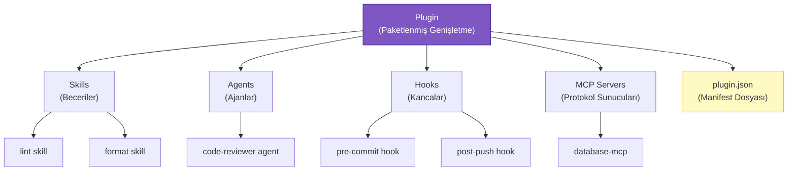
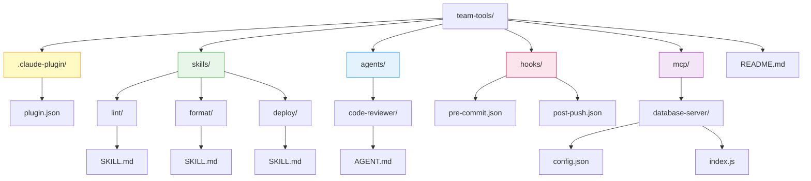
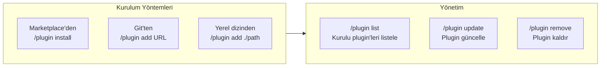
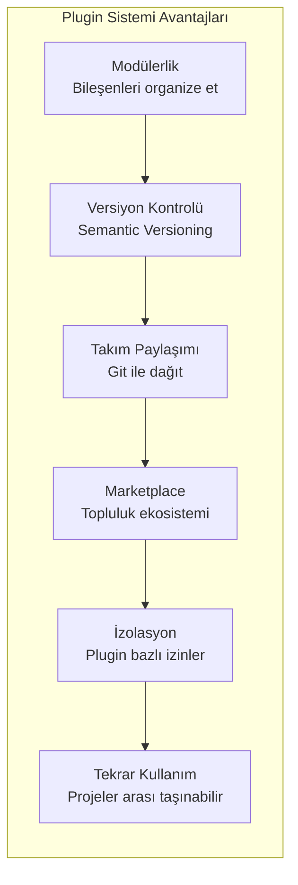

# Plugin Sistemi

**Plugin** (eklenti), birden fazla skill, agent, hook ve MCP sunucusunu bir araya getiren paketlenmiş bir genişletme birimidir. Plugin sistemi sayesinde Claude Code'un yeteneklerini modüler, versiyonlanabilir ve paylaşılabilir şekilde genişletebilirsiniz.

## Ön Koşullar

| Konu | Bölüm |
|------|-------|
| Skills nedir ve türleri | [Skills Nedir?](./01-skills-nedir.md) |
| Skill oluşturma | [Skill Oluşturma](./02-skill-olusturma.md) |
| MCP sunucuları | [Bölüm 11](../11-mcp/README.md) |

---

## Plugin Nedir?

Bir plugin, Claude Code'un yeteneklerini genişleten bileşenlerin organize bir koleksiyonudur. Skills tek başına bir yetenek eklerken, bir plugin birden fazla bileşeni bir arada sunar:



---

## Plugin Manifest: plugin.json

Her plugin'in kök dizininde bir `.claude-plugin/plugin.json` dosyası bulunur. Bu dosya plugin'in kimlik bilgilerini ve yapılandırmasını içerir:

```jsonc
// .claude-plugin/plugin.json
{
  "name": "team-tools",
  "description": "Takım geliştirme araçları — lint, format, test ve deploy",
  "version": "1.2.0",
  "author": {
    "name": "Acme Corp",
    "email": "tools@acme.com",
    "url": "https://github.com/acme/team-tools"
  },
  "license": "MIT",
  "claude_code_version": ">=1.0.0",
  "components": {
    "skills": [
      "skills/lint",
      "skills/format",
      "skills/deploy"
    ],
    "agents": [
      "agents/code-reviewer"
    ],
    "hooks": [
      "hooks/pre-commit.json",
      "hooks/post-push.json"
    ],
    "mcp_servers": [
      "mcp/database-server"
    ]
  },
  "dependencies": {
    "eslint": ">=9.0.0",
    "prettier": ">=3.0.0"
  },
  "repository": "https://github.com/acme/team-tools",
  "keywords": ["lint", "format", "deploy", "team"]
}
```

### Manifest Alanları

| Alan | Zorunlu | Açıklama |
|------|---------|----------|
| `name` | Evet | Plugin'in benzersiz adı (namespace olarak kullanılır) |
| `description` | Evet | Plugin'in ne yaptığını açıklayan kısa metin |
| `version` | Evet | Semantic versioning (semver) formatında versiyon |
| `author` | Evet | Yazar bilgileri (name, email, url) |
| `license` | Hayır | Lisans türü (MIT, Apache-2.0 vb.) |
| `claude_code_version` | Hayır | Minimum Claude Code versiyon gereksinimi |
| `components` | Evet | Plugin bileşenlerinin yol tanımları |
| `dependencies` | Hayır | Harici bağımlılıklar |
| `repository` | Hayır | Kaynak kod deposu URL'si |
| `keywords` | Hayır | Arama ve kategorilendirme etiketleri |

---

## Plugin Dizin Yapısı



**Tam dizin ağacı:**

```
team-tools/
├── .claude-plugin/
│   └── plugin.json              # Plugin manifest
├── skills/
│   ├── lint/
│   │   └── SKILL.md             # Lint skill tanımı
│   ├── format/
│   │   └── SKILL.md             # Format skill tanımı
│   └── deploy/
│       └── SKILL.md             # Deploy skill tanımı
├── agents/
│   └── code-reviewer/
│       └── AGENT.md             # Code reviewer agent tanımı
├── hooks/
│   ├── pre-commit.json          # Pre-commit hook yapılandırması
│   └── post-push.json           # Post-push hook yapılandırması
├── mcp/
│   └── database-server/
│       ├── config.json           # MCP sunucu yapılandırması
│       └── index.js              # MCP sunucu kodu
└── README.md                    # Plugin dokümantasyonu
```

---

## Plugin Bileşenleri

### 1. Skills (Beceriler)

Plugin içindeki skill'ler **namespaced** çalışır. Yani `team-tools` plugin'indeki `lint` skill'i `/team-tools:lint` olarak çağrılır:

```bash
# Plugin skill'leri
> /team-tools:lint src/
> /team-tools:format src/components/
> /team-tools:deploy staging
```

### 2. Agents (Ajanlar)

Plugin'ler özel agent tanımları içerebilir. Agent'lar, belirli görevler için özelleştirilmiş alt ajanlardır:

```markdown
<!-- agents/code-reviewer/AGENT.md -->
---
name: code-reviewer
description: Kod değişikliklerini sistematik olarak inceler
---

# Code Reviewer Agent

## Görev
Git diff'teki değişiklikleri analiz et ve kapsamlı bir inceleme raporu üret.

## İnceleme Kriterleri
1. Güvenlik açıkları
2. Performans sorunları
3. Kod stili tutarlılığı
4. Hata yönetimi
5. Test kapsamı
```

### 3. Hooks (Kancalar)

Plugin'ler, Claude Code yaşam döngüsüne bağlanan hook'lar içerebilir:

```jsonc
// hooks/pre-commit.json
{
  "event": "pre-commit",
  "type": "command",
  "command": "npm run lint && npm run type-check",
  "description": "Commit öncesi lint ve tip kontrolü"
}
```

### 4. MCP Servers (Protokol Sunucuları)

Plugin'ler harici veri kaynaklarına erişim sağlayan MCP sunucuları içerebilir:

```jsonc
// mcp/database-server/config.json
{
  "command": "node",
  "args": ["mcp/database-server/index.js"],
  "env": {
    "DB_CONNECTION": "${DB_URL}"
  }
}
```

---

## Plugin Kurulumu ve Yönetimi



### Kurulum Komutları

```bash
# Marketplace'den kurulum
> /plugin install team-tools

# Git deposundan kurulum
> /plugin add https://github.com/acme/team-tools

# Yerel dizinden kurulum
> /plugin add ./my-plugins/team-tools

# Belirli bir versiyon kurulumu
> /plugin install team-tools@1.2.0
```

### Yönetim Komutları

```bash
# Kurulu plugin'leri listele
> /plugin list

# Çıktı:
# ┌──────────────────────────────────────────────────┐
# │ Installed Plugins                                │
# │                                                  │
# │ team-tools (v1.2.0)                              │
# │   Skills: lint, format, deploy                   │
# │   Agents: code-reviewer                          │
# │   Hooks: pre-commit, post-push                   │
# │   MCP: database-server                           │
# │                                                  │
# │ aws-toolkit (v2.0.1)                             │
# │   Skills: s3-upload, lambda-deploy               │
# │   MCP: aws-mcp                                   │
# └──────────────────────────────────────────────────┘

# Plugin güncelleme
> /plugin update team-tools

# Plugin kaldırma
> /plugin remove team-tools
```

---

## Plugin Avantajları



| Avantaj | Açıklama |
|---------|----------|
| **Modülerlik** | İlgili bileşenleri tek bir pakette organize eder |
| **Versiyon kontrolü** | Semantic versioning ile uyumluluk garantisi |
| **Takım paylaşımı** | Git repository'si olarak paylaşılabilir |
| **Marketplace dağıtımı** | Toplulukla paylaşım için marketplace desteği |
| **İzolasyon** | Her plugin'in izinleri bağımsız yönetilir |
| **Tekrar kullanım** | Bir kez yaz, birçok projede kullan |

---

## Pratik Örnekler

### Örnek 1: Plugin Kurulumu ve Kullanımı

```bash
# 1. Plugin'i marketplace'den kur
> /plugin install team-tools

# Çıktı:
# Installing team-tools@1.2.0...
# ✅ 3 skills registered
# ✅ 1 agent registered
# ✅ 2 hooks registered
# ✅ 1 MCP server started
# Plugin team-tools installed successfully!

# 2. Plugin skill'lerini kullan
> /team-tools:lint src/

# 3. Plugin agent'ını kullan
> @code-reviewer Bu PR'ı incele
```

### Örnek 2: Plugin İzinlerini Yapılandırma

```jsonc
// .claude/settings.json
{
  "permissions": {
    "allow": [
      "Skill(team-tools:lint)",
      "Skill(team-tools:format)",
      "Bash(npm run lint)",
      "Bash(npm run format)"
    ],
    "deny": [
      "Skill(team-tools:deploy)"  // Deploy her zaman onay ister
    ]
  }
}
```

### Örnek 3: Plugin Bilgilerini Görüntüleme

```bash
> /plugin info team-tools

# Çıktı:
# ┌──────────────────────────────────────────────────┐
# │ Plugin: team-tools                               │
# │ Version: 1.2.0                                   │
# │ Author: Acme Corp                                │
# │ License: MIT                                     │
# │                                                  │
# │ Components:                                      │
# │   Skills (3):                                    │
# │     • lint — ESLint analizi yapar           [U]  │
# │     • format — Prettier formatlama          [U]  │
# │     • deploy — Ortama deploy eder           [U]  │
# │                                                  │
# │   Agents (1):                                    │
# │     • code-reviewer — Kod incelemesi        [M]  │
# │                                                  │
# │   Hooks (2):                                     │
# │     • pre-commit — Lint + tip kontrolü           │
# │     • post-push — Bildirim gönderir              │
# │                                                  │
# │   MCP Servers (1):                               │
# │     • database-server — DB erişimi               │
# └──────────────────────────────────────────────────┘
```

---

## Özet

| Kavram | Açıklama |
|--------|----------|
| **Plugin** | Skills, agents, hooks ve MCP sunucularının paketlenmiş koleksiyonu |
| **plugin.json** | Plugin'in kimlik ve yapılandırma bilgilerini içeren manifest dosyası |
| **Components** | Plugin'in içerdiği bileşenler (skills, agents, hooks, MCP) |
| **Namespace** | Plugin adıyla ayrılan skill çağırma formatı (`/plugin:skill`) |
| **Versioning** | Semantic versioning ile uyumluluk yönetimi |

---

## Sonraki Adım

Plugin sisteminin yapısını ve bileşenlerini öğrendik. Şimdi plugin'leri keşfetmek ve kurmak için marketplace ekosistemini inceleyelim:

→ [Plugin Marketplace](./04-plugin-marketplace.md)
