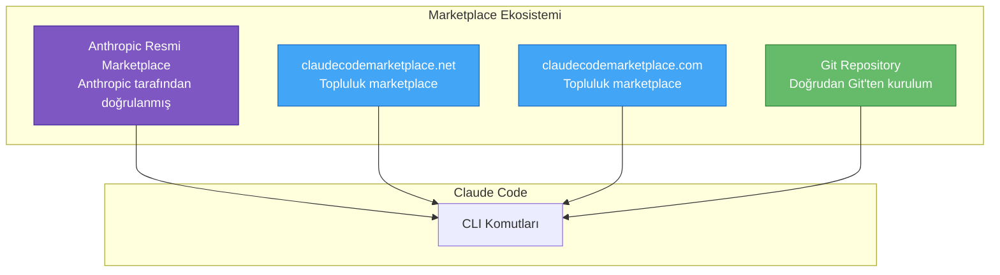
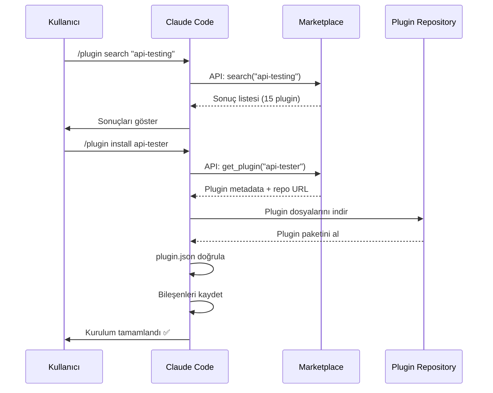
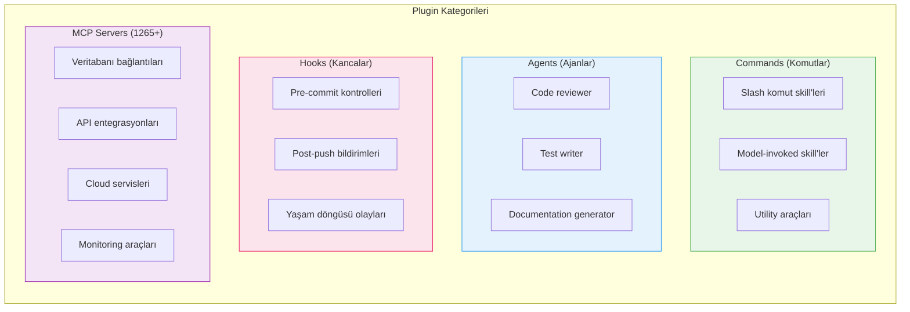
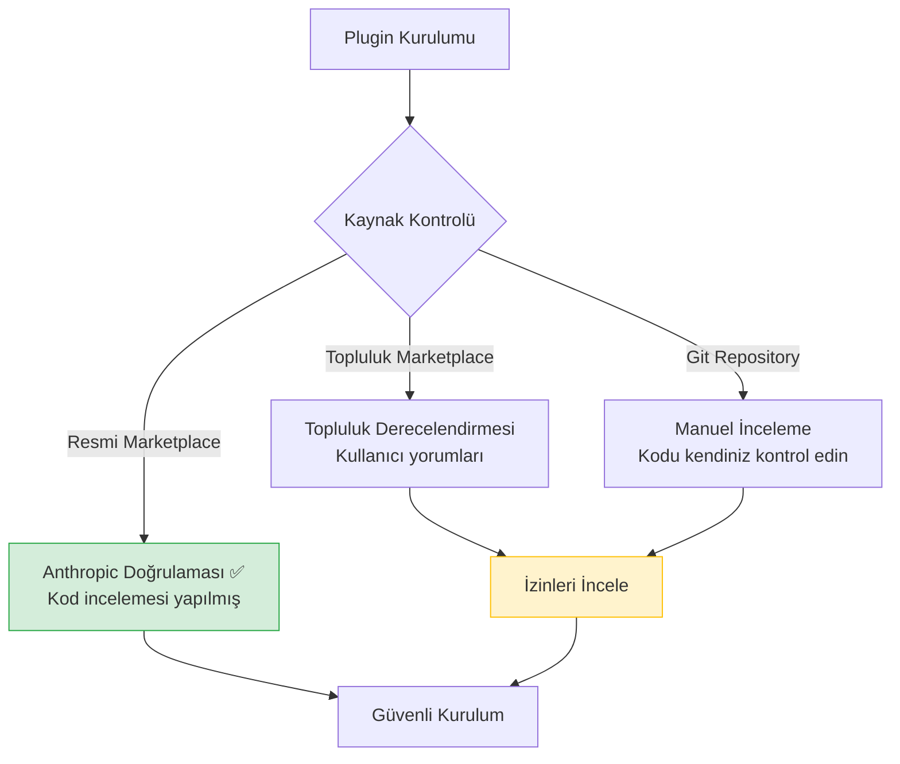

# Plugin Marketplace

**Plugin Marketplace** (eklenti pazaryeri), Claude Code plugin'lerini keşfetmek, kurmak ve paylaşmak için kullanılan ekosistemdir. Resmi Anthropic marketplace'inin yanı sıra topluluk tarafından yönetilen marketplace'ler de bulunmaktadır. Bu bölüm, marketplace ekosistemini, plugin keşfini ve kurulum süreçlerini kapsar.

## Ön Koşullar

| Konu | Bölüm |
|------|-------|
| Skills nedir | [Skills Nedir?](./01-skills-nedir.md) |
| Plugin sistemi | [Plugin Sistemi](./03-plugin-sistemi.md) |
| Claude Code CLI komutları | [Bölüm 07](../07-arayuz-ve-komutlar/04-cli-referansi.md) |

---

## Marketplace Ekosistemi

Claude Code plugin ekosistemi birden fazla marketplace kaynağından oluşur:



### Marketplace Kaynakları

| Marketplace | Tür | URL | Açıklama |
|------------|------|-----|----------|
| **Anthropic Official** | Resmi | Dahili (varsayılan) | Anthropic tarafından doğrulanmış ve denetlenmiş plugin'ler |
| **claudecodemarketplace.net** | Topluluk | claudecodemarketplace.net | Topluluk tarafından yönetilen açık marketplace |
| **claudecodemarketplace.com** | Topluluk | claudecodemarketplace.com | Topluluk tarafından yönetilen açık marketplace |
| **Git Repository** | Doğrudan | Herhangi bir Git URL | Plugin deposundan doğrudan kurulum |

---

## Marketplace Komutları

### Marketplace Kaynağı Ekleme

```bash
# Topluluk marketplace'i ekle
> /plugin marketplace add https://claudecodemarketplace.net

# Başka bir marketplace ekle
> /plugin marketplace add https://claudecodemarketplace.com

# Marketplace listesini görüntüle
> /plugin marketplace list

# Çıktı:
# ┌──────────────────────────────────────────────────────┐
# │ Registered Marketplaces                              │
# │                                                      │
# │ 1. Anthropic Official (default)                      │
# │    Status: ✅ Connected                              │
# │                                                      │
# │ 2. claudecodemarketplace.net                         │
# │    Status: ✅ Connected                              │
# │    Plugins: 847                                      │
# │                                                      │
# │ 3. claudecodemarketplace.com                         │
# │    Status: ✅ Connected                              │
# │    Plugins: 418                                      │
# └──────────────────────────────────────────────────────┘
```

### Plugin Arama ve Keşif

```bash
# Marketplace'de plugin ara
> /plugin search database

# Çıktı:
# ┌──────────────────────────────────────────────────────┐
# │ Search Results: "database" (12 results)              │
# │                                                      │
# │ 1. db-toolkit (v2.1.0) ⭐ 4.8                       │
# │    Source: official                                   │
# │    Migration, seeding ve yönetim araçları             │
# │    Downloads: 15,230                                  │
# │                                                      │
# │ 2. postgres-tools (v1.5.2) ⭐ 4.6                    │
# │    Source: claudecodemarketplace.net                  │
# │    PostgreSQL yönetim ve sorgulama araçları           │
# │    Downloads: 8,450                                   │
# │                                                      │
# │ 3. mongo-helper (v1.0.3) ⭐ 4.3                      │
# │    Source: claudecodemarketplace.com                  │
# │    MongoDB CRUD ve aggregation araçları               │
# │    Downloads: 3,120                                   │
# │                                                      │
# │ [1-12 of 12] Next: /plugin search database --page 2  │
# └──────────────────────────────────────────────────────┘
```

### Plugin Kurulumu

```bash
# Varsayılan marketplace'den kur (resmi)
> /plugin install db-toolkit

# Belirli bir marketplace'den kur
> /plugin install postgres-tools@claudecodemarketplace.net

# Belirli bir versiyon kur
> /plugin install db-toolkit@2.1.0

# Git deposundan kur
> /plugin install https://github.com/acme/db-toolkit
```

---

## Marketplace Etkileşim Akışı



---

## Plugin Kategorileri

Marketplace'lerdeki plugin'ler dört ana kategoriye ayrılır:



### Kategori Detayları

| Kategori | Sayı (Mart 2026) | Açıklama | Örnek Plugin'ler |
|----------|-------------------|----------|------------------|
| **Commands** | 320+ | Skill tabanlı komutlar | `formatter`, `scaffolder`, `migrator` |
| **Agents** | 180+ | Özel agent tanımları | `code-reviewer`, `test-writer`, `doc-gen` |
| **Hooks** | 95+ | Yaşam döngüsü kancaları | `lint-on-commit`, `notify-on-push` |
| **MCP Servers** | 1265+ | Protokol sunucuları | `postgres-mcp`, `github-mcp`, `aws-mcp` |

---

## Popüler Plugin'ler

### En Çok İndirilen Plugin'ler (Mart 2026)

| Plugin | Kategori | İndirme | Açıklama |
|--------|----------|---------|----------|
| `code-quality` | Commands | 52K+ | Kapsamlı kod kalite analizi |
| `git-workflow` | Commands + Hooks | 45K+ | Git iş akışı otomasyonu |
| `test-suite` | Agents | 38K+ | Otomatik test yazma ve çalıştırma |
| `docker-tools` | Commands | 31K+ | Docker yönetim araçları |
| `api-builder` | Commands + MCP | 27K+ | REST/GraphQL API scaffolding |
| `db-toolkit` | Commands + MCP | 15K+ | Veritabanı yönetim araçları |
| `aws-toolkit` | MCP | 12K+ | AWS servis entegrasyonu |
| `k8s-manager` | Commands | 9K+ | Kubernetes yönetim araçları |

---

## Pratik Örnekler

### Örnek 1: Marketplace Keşfi ve Plugin Kurulumu

```bash
# 1. Topluluk marketplace'ini kaydet
> /plugin marketplace add https://claudecodemarketplace.net

# 2. Test araçlarını ara
> /plugin search testing

# 3. En uygun plugin'i seç ve detaylarını gör
> /plugin info test-suite

# Çıktı:
# ┌──────────────────────────────────────────────────────┐
# │ Plugin: test-suite                                   │
# │ Version: 3.1.0                                       │
# │ Author: TestCraft                                    │
# │ Rating: ⭐⭐⭐⭐⭐ (4.9)                              │
# │ Downloads: 38,240                                    │
# │ Source: official                                      │
# │                                                      │
# │ Description:                                         │
# │ Kapsamlı test otomasyon araçları. Unit test, e2e     │
# │ test ve integration test yazma, çalıştırma ve        │
# │ raporlama.                                           │
# │                                                      │
# │ Components:                                          │
# │   Skills: unit-test, e2e-test, coverage-report       │
# │   Agents: test-writer                                │
# │   Hooks: pre-push-test                               │
# │                                                      │
# │ Install: /plugin install test-suite                   │
# └──────────────────────────────────────────────────────┘

# 4. Plugin'i kur
> /plugin install test-suite

# 5. Plugin skill'ini kullan
> /test-suite:unit-test src/utils/auth.ts
```

### Örnek 2: Birden Fazla Marketplace Kullanımı

```bash
# Resmi ve topluluk marketplace'lerini karşılaştır
> /plugin search kubernetes

# Sonuçlarda kaynak marketplace gösterilir:
# ┌──────────────────────────────────────────────────────┐
# │ Search Results: "kubernetes" (5 results)             │
# │                                                      │
# │ 1. k8s-manager (v2.0.0) ⭐ 4.7                      │
# │    Source: official ✓                                 │
# │    Kubernetes cluster yönetim araçları                │
# │                                                      │
# │ 2. k8s-deploy (v1.3.1) ⭐ 4.5                       │
# │    Source: claudecodemarketplace.net                  │
# │    Kubernetes deployment otomasyonu                   │
# │                                                      │
# │ 3. helm-tools (v1.1.0) ⭐ 4.2                       │
# │    Source: claudecodemarketplace.com                  │
# │    Helm chart yönetimi                               │
# └──────────────────────────────────────────────────────┘

# Belirli kaynaktan kur
> /plugin install k8s-manager              # Resmi marketplace'den
> /plugin install k8s-deploy@claudecodemarketplace.net  # Topluluk'tan
```

### Örnek 3: Plugin Güncelleme ve Yönetim

```bash
# Güncelleme kontrolü
> /plugin outdated

# Çıktı:
# ┌──────────────────────────────────────────────────────┐
# │ Outdated Plugins                                     │
# │                                                      │
# │ Plugin         Current   Latest   Source              │
# │ test-suite     3.0.0     3.1.0    official            │
# │ db-toolkit     2.0.0     2.1.0    official            │
# │ k8s-deploy     1.2.0     1.3.1    community           │
# └──────────────────────────────────────────────────────┘

# Tek bir plugin'i güncelle
> /plugin update test-suite

# Tüm plugin'leri güncelle
> /plugin update --all

# Plugin kaldır
> /plugin remove helm-tools
```

---

## Güvenlik ve Güvenilirlik



**Güvenlik ipuçları:**

| İpucu | Açıklama |
|-------|----------|
| Kaynağı kontrol edin | Resmi marketplace'deki plugin'ler doğrulanmıştır |
| İzinleri inceleyin | Plugin'in hangi izinleri istediğine bakın |
| Değerlendirmeleri okuyun | Topluluk geri bildirimlerini kontrol edin |
| Versiyonu sabitleyin | Üretim ortamında belirli versiyon kullanın |
| Kodu inceleyin | Kritik projelerde plugin kodunu gözden geçirin |

---

## Özet

| Kavram | Açıklama |
|--------|----------|
| **Marketplace** | Plugin'leri keşfetme, kurma ve paylaşma platformu |
| **Resmi Marketplace** | Anthropic tarafından doğrulanmış plugin'ler |
| **Topluluk Marketplace** | Topluluk tarafından yönetilen açık marketplace'ler |
| **Kategoriler** | Commands, Agents, Hooks, MCP Servers |
| **`/plugin search`** | Marketplace'de plugin arama komutu |
| **`/plugin install`** | Plugin kurulum komutu |

---

## Sonraki Adım

Marketplace ekosistemini öğrendik. Şimdi kendi plugin'lerimizi nasıl oluşturup dağıtacağımızı inceleyelim:

→ [Plugin Oluşturma ve Dağıtım](./05-plugin-olusturma-ve-dagitim.md)
