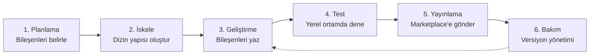
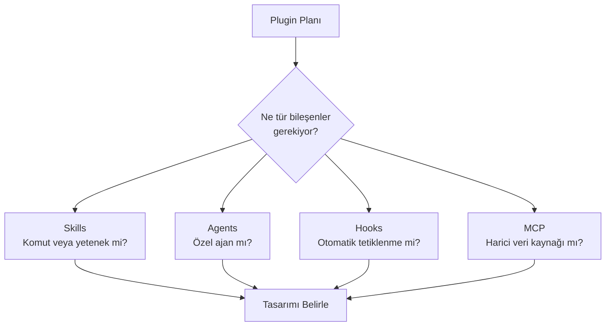
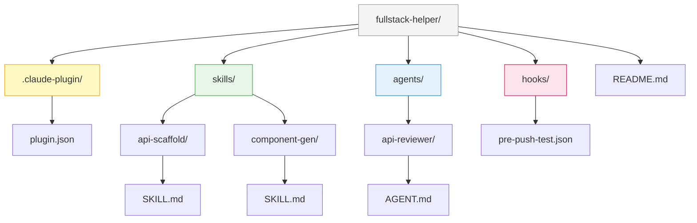
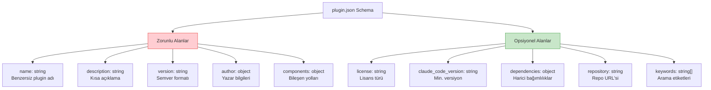
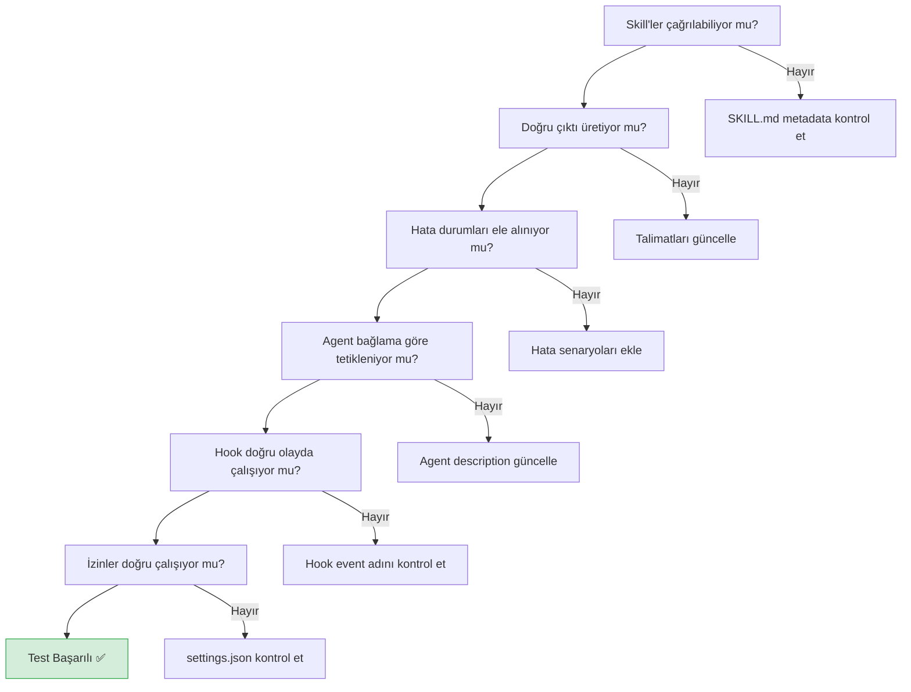
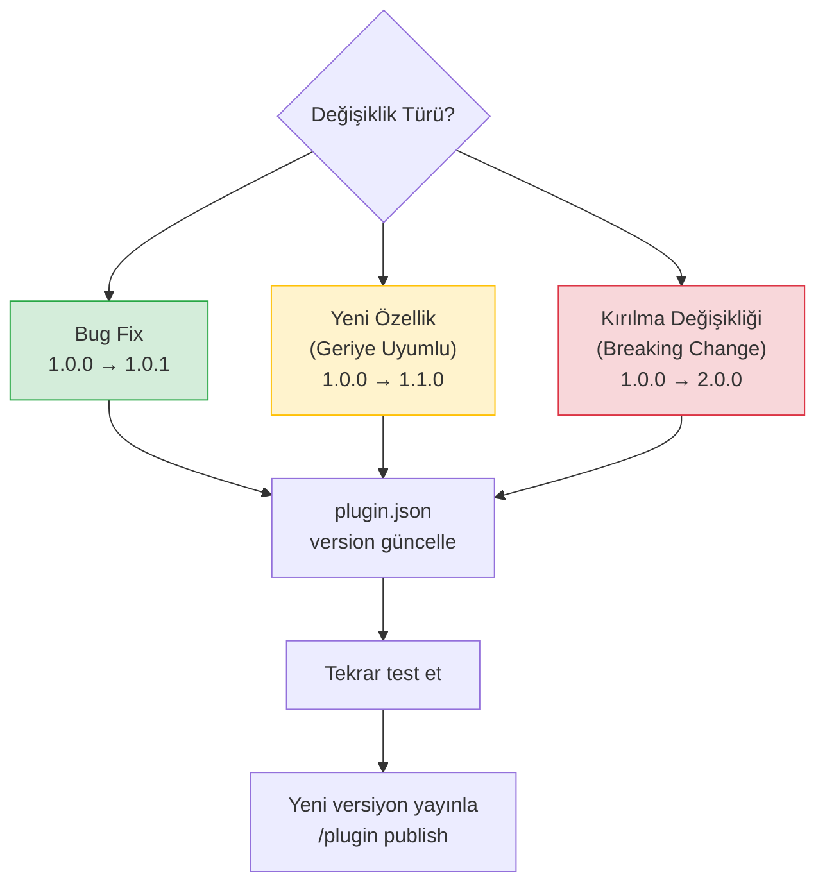
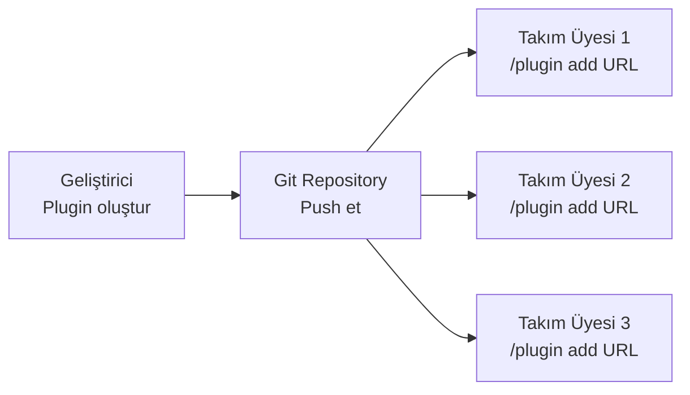
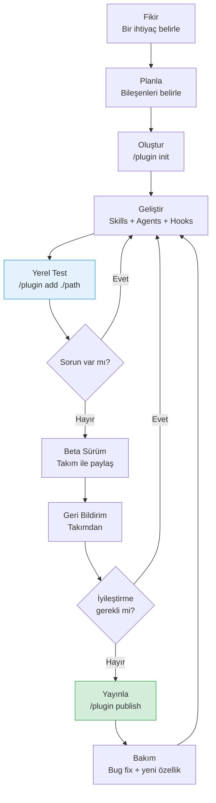

# Plugin Oluşturma ve Dağıtım

Bu bölüm, sıfırdan bir Claude Code plugin'i geliştirmeyi, test etmeyi, marketplace'e yayınlamayı ve takımınızla paylaşmayı adım adım kapsar. Plugin geliştirme sürecinin tamamını uçtan uca öğreneceksiniz.

## Ön Koşullar

| Konu | Bölüm |
|------|-------|
| Skill oluşturma | [Skill Oluşturma](./02-skill-olusturma.md) |
| Plugin sistemi | [Plugin Sistemi](./03-plugin-sistemi.md) |
| Plugin Marketplace | [Plugin Marketplace](./04-plugin-marketplace.md) |
| İzin sistemi | [Bölüm 10](../10-izinler-ve-guvenlik/01-izin-sistemi.md) |

---

## Geliştirme İş Akışı

Plugin geliştirme süreci 6 aşamadan oluşur:



---

## Adım 1: Planlama

Plugin'inize hangi bileşenlerin dahil olacağını belirleyin:



**Örnek planlama — `fullstack-helper` plugin'i:**

| Bileşen | Tür | Amaç |
|---------|------|------|
| `api-scaffold` | Skill (user) | REST API endpoint scaffold oluşturma |
| `component-gen` | Skill (user) | React component oluşturma |
| `api-reviewer` | Agent (model) | API tasarım incelemesi |
| `pre-push-test` | Hook | Push öncesi test çalıştırma |

---

## Adım 2: İskele Oluşturma

### Manuel Oluşturma

Plugin dizin yapısını elle oluşturun:

```bash
# Plugin kök dizinini oluştur
mkdir -p fullstack-helper/.claude-plugin
mkdir -p fullstack-helper/skills/api-scaffold
mkdir -p fullstack-helper/skills/component-gen
mkdir -p fullstack-helper/agents/api-reviewer
mkdir -p fullstack-helper/hooks
```

### `/plugin init` Komutuyla Oluşturma

```bash
# Claude Code içinde interaktif oluşturma
> /plugin init fullstack-helper

# İnteraktif sorular:
# Plugin name: fullstack-helper
# Description: Full-stack geliştirme araçları
# Author: Yasin Ates
# License: MIT
# Components to include:
#   [x] Skills
#   [x] Agents
#   [x] Hooks
#   [ ] MCP Servers
#
# ✅ Plugin scaffold created at ./fullstack-helper/
```

**Oluşan dizin yapısı:**



```
fullstack-helper/
├── .claude-plugin/
│   └── plugin.json
├── skills/
│   ├── api-scaffold/
│   │   └── SKILL.md
│   └── component-gen/
│       └── SKILL.md
├── agents/
│   └── api-reviewer/
│       └── AGENT.md
├── hooks/
│   └── pre-push-test.json
└── README.md
```

---

## Adım 3: Bileşenleri Geliştirme

### 3.1 — plugin.json Oluşturma

```jsonc
// .claude-plugin/plugin.json
{
  "name": "fullstack-helper",
  "description": "Full-stack geliştirme araçları — API scaffolding, component generation ve kod incelemesi",
  "version": "1.0.0",
  "author": {
    "name": "Yasin Ates",
    "email": "yasin@example.com",
    "url": "https://github.com/yasinates"
  },
  "license": "MIT",
  "claude_code_version": ">=1.0.0",
  "components": {
    "skills": [
      "skills/api-scaffold",
      "skills/component-gen"
    ],
    "agents": [
      "agents/api-reviewer"
    ],
    "hooks": [
      "hooks/pre-push-test.json"
    ]
  },
  "dependencies": {},
  "repository": "https://github.com/yasinates/fullstack-helper",
  "keywords": ["fullstack", "api", "react", "scaffold", "component"]
}
```

### plugin.json Şema Referansı



### 3.2 — Skill'leri Yazma

**API Scaffold Skill:**

```markdown
<!-- skills/api-scaffold/SKILL.md -->
---
name: api-scaffold
description: REST API endpoint'i için controller, service, model ve route dosyalarını oluşturur
invocation: user
---

# API Scaffold

## Amaç
Belirtilen kaynak (resource) adı için tam bir REST API endpoint yapısı oluşturur.

## Parametreler
Kullanıcıdan aşağıdaki bilgileri al:
- **Kaynak adı** (zorunlu): Örn. "user", "product", "order"
- **Framework** (opsiyonel): Express (varsayılan), Fastify, NestJS

## Talimatlar

1. Kaynak adını tekil (singular) formda normalize et
2. Aşağıdaki dosyaları oluştur:

### Express (varsayılan)
```
src/
├── controllers/{kaynak}Controller.ts
├── services/{kaynak}Service.ts
├── models/{kaynak}Model.ts
├── routes/{kaynak}Routes.ts
├── types/{kaynak}.types.ts
└── __tests__/{kaynak}.test.ts
```

### Her dosya için şablon:

**Controller:**
- CRUD endpoint handler'ları (getAll, getById, create, update, delete)
- Error handling middleware
- Request validation

**Service:**
- İş mantığı katmanı
- Model ile iletişim
- Hata fırlatma

**Model:**
- TypeScript interface tanımı
- Veritabanı şeması (Mongoose/Prisma)

**Routes:**
- RESTful route tanımları
- Middleware bağlantıları

**Types:**
- Request/Response tip tanımları
- DTO (Data Transfer Object) tipleri

**Test:**
- Her CRUD operasyonu için temel test
- Mock service kullanımı

3. Oluşturulan dosyaların listesini göster
4. Route'u ana router'a nasıl ekleneceğini açıkla

## Kullanım
```
/fullstack-helper:api-scaffold user
/fullstack-helper:api-scaffold product --framework nestjs
```
```

**Component Generation Skill:**

```markdown
<!-- skills/component-gen/SKILL.md -->
---
name: component-gen
description: React component dosyası, stili ve testi ile birlikte oluşturur
invocation: user
---

# Component Generator

## Amaç
Belirtilen isimde React component'i, stil dosyası ve test dosyasıyla birlikte oluşturur.

## Parametreler
- **Component adı** (zorunlu): PascalCase formatında
- **Tür** (opsiyonel): "page" | "layout" | "ui" (varsayılan: "ui")

## Talimatlar

1. Component adını PascalCase formatında normalize et
2. Türe göre hedef dizini belirle:
   - `ui` → `src/components/ui/`
   - `page` → `src/pages/`
   - `layout` → `src/components/layouts/`

3. Aşağıdaki dosyaları oluştur:

```
{hedef-dizin}/{ComponentAdi}/
├── {ComponentAdi}.tsx        # Component kodu
├── {ComponentAdi}.module.css # CSS Modules stil dosyası
├── {ComponentAdi}.test.tsx   # Test dosyası
└── index.ts                  # Re-export barrel file
```

4. Component şablonu:
   - TypeScript ile yazılmalı
   - Props interface tanımlanmalı
   - `forwardRef` kullanılmalı (ui türü için)
   - Erişilebilirlik (a11y) öznitelikleri eklenmeli

5. Oluşturulan dosyaların özetini göster

## Kullanım
```
/fullstack-helper:component-gen Button
/fullstack-helper:component-gen Dashboard --type page
/fullstack-helper:component-gen Sidebar --type layout
```
```

### 3.3 — Agent Yazma

```markdown
<!-- agents/api-reviewer/AGENT.md -->
---
name: api-reviewer
description: REST API tasarımını inceleyerek best practice önerileri sunar
---

# API Reviewer Agent

## Görev
API endpoint tasarımlarını analiz ederek RESTful best practice'lere uygunluğunu değerlendir.

## İnceleme Kriterleri

1. **URL Yapısı:** Kaynak isimlendirmesi, hiyerarşi, çoğul/tekil kullanım
2. **HTTP Metotları:** Doğru metot kullanımı (GET, POST, PUT, PATCH, DELETE)
3. **Durum Kodları:** Uygun HTTP status code döndürülmesi
4. **Error Handling:** Tutarlı hata yanıt formatı
5. **Validation:** Input doğrulama kontrolü
6. **Pagination:** Liste endpoint'lerinde sayfalama desteği
7. **Güvenlik:** Authentication ve authorization kontrolü

## Çıktı Formatı

Her endpoint için:
- ✅ Doğru uygulamalar
- ⚠️ İyileştirme önerileri
- ❌ Kritik sorunlar

Sonunda genel bir puan ve öncelikli eylem listesi sun.
```

### 3.4 — Hook Yazma

```jsonc
// hooks/pre-push-test.json
{
  "event": "pre-push",
  "type": "command",
  "command": "npm test -- --bail",
  "description": "Push öncesi testlerin geçtiğinden emin ol",
  "fail_on_error": true,
  "timeout_ms": 120000
}
```

---

## Adım 4: Yerel Test

### Plugin'i Yerel Olarak Yükleme

```bash
# Plugin'i yerel dizinden yükle
> /plugin add ./fullstack-helper

# Çıktı:
# Installing fullstack-helper from local directory...
# ✅ 2 skills registered
#    - api-scaffold (user-invoked)
#    - component-gen (user-invoked)
# ✅ 1 agent registered
#    - api-reviewer (model-invoked)
# ✅ 1 hook registered
#    - pre-push-test
# Plugin fullstack-helper@1.0.0 installed successfully!
```

### Skill'leri Test Etme

```bash
# API scaffold skill'ini test et
> /fullstack-helper:api-scaffold product

# Beklenen davranış:
# 1. Kaynak adı "product" olarak normalize edilir
# 2. 6 dosya oluşturulur (controller, service, model, routes, types, test)
# 3. Dosya listesi gösterilir
# 4. Router'a nasıl ekleneceği açıklanır

# Component gen skill'ini test et
> /fullstack-helper:component-gen DataTable

# Beklenen davranış:
# 1. Component adı "DataTable" olarak kabul edilir
# 2. 4 dosya oluşturulur (tsx, css module, test, index)
# 3. Dosya listesi ve kullanım örneği gösterilir
```

### Agent'ı Test Etme

```bash
# API reviewer agent'ını test et
> Bu projedeki API endpoint'lerini incele ve best practice önerileri sun

# Claude, api-reviewer agent'ını otomatik olarak kullanmalı
# ve kapsamlı bir inceleme raporu üretmeli
```

### Test Kontrol Listesi



---

## Adım 5: Marketplace'e Yayınlama

### 5.1 — Yayın Öncesi Hazırlık

```bash
# README.md oluştur veya güncelle
# Plugin'in ne yaptığını, nasıl kurulacağını ve kullanılacağını açıkla

# plugin.json versiyonunu kontrol et
# Semantic Versioning kurallarına uy:
# MAJOR.MINOR.PATCH
# 1.0.0 → İlk kararlı sürüm
# 1.1.0 → Geriye uyumlu yeni özellik
# 1.1.1 → Bug fix
# 2.0.0 → Geriye uyumsuz değişiklik
```

### 5.2 — Yayınlama

```bash
# Resmi marketplace'e yayınla
> /plugin publish ./fullstack-helper

# Çıktı:
# ┌──────────────────────────────────────────────────────┐
# │ Publishing fullstack-helper@1.0.0                    │
# │                                                      │
# │ Validating plugin.json...              ✅            │
# │ Checking component integrity...        ✅            │
# │ Verifying SKILL.md formats...          ✅            │
# │ Checking AGENT.md formats...           ✅            │
# │ Validating hook configurations...      ✅            │
# │ Packaging plugin...                    ✅            │
# │ Uploading to marketplace...            ✅            │
# │                                                      │
# │ Plugin published successfully!                       │
# │ URL: https://marketplace.anthropic.com/fullstack-helper │
# │                                                      │
# │ Users can install with:                              │
# │ /plugin install fullstack-helper                      │
# └──────────────────────────────────────────────────────┘
```

### 5.3 — Topluluk Marketplace'e Yayınlama

```bash
# Topluluk marketplace'e yayınla
> /plugin publish ./fullstack-helper --marketplace https://claudecodemarketplace.net

# veya Git repository'si olarak paylaş
# Kullanıcılar doğrudan Git'ten kurabilir:
# /plugin install https://github.com/yasinates/fullstack-helper
```

---

## Adım 6: Versiyon Yönetimi ve Bakım

### Versiyon Güncelleme



### Semantic Versioning Kuralları

| Değişiklik | Versiyon | Örnek |
|------------|----------|-------|
| **Bug fix** | PATCH artır | 1.0.0 → 1.0.1 |
| **Yeni skill ekleme** | MINOR artır | 1.0.1 → 1.1.0 |
| **Skill kaldırma** | MAJOR artır | 1.1.0 → 2.0.0 |
| **Skill talimatı güncelleme** | PATCH artır | 1.1.0 → 1.1.1 |
| **Manifest yapı değişikliği** | MAJOR artır | 1.1.1 → 2.0.0 |

### Güncelleme Yayınlama

```bash
# 1. plugin.json'da versiyonu güncelle
# "version": "1.0.0" → "version": "1.1.0"

# 2. Değişiklikleri test et
> /plugin add ./fullstack-helper  # yerel test

# 3. Yeni versiyonu yayınla
> /plugin publish ./fullstack-helper

# 4. Changelog tut
# CHANGELOG.md dosyasında değişiklikleri belgele
```

---

## Git ile Takım Paylaşımı

Marketplace kullanmadan da plugin'leri Git ile paylaşabilirsiniz:



### Yöntem 1: Bağımsız Repository

```bash
# Plugin'i ayrı bir Git deposunda yönet
cd fullstack-helper
git init
git add .
git commit -m "feat: fullstack-helper v1.0.0 ilk sürüm"
git remote add origin https://github.com/team/fullstack-helper
git push -u origin main

# Takım üyeleri şöyle kurar:
# > /plugin install https://github.com/team/fullstack-helper
```

### Yöntem 2: Proje İçi Plugin

```bash
# Plugin'i projenin .claude/plugins/ dizininde tut
mkdir -p .claude/plugins/fullstack-helper
# Plugin dosyalarını buraya yerleştir

# Git ile projede paylaş
git add .claude/plugins/fullstack-helper/
git commit -m "feat: fullstack-helper plugin eklendi"
git push

# Takım üyeleri projeyi çektiğinde plugin otomatik kullanılabilir
```

### Yöntem 3: Git Submodule

```bash
# Plugin'i submodule olarak ekle
git submodule add https://github.com/team/fullstack-helper .claude/plugins/fullstack-helper

# Takım üyeleri:
git submodule update --init --recursive
```

---

## Pratik Örnekler

### Örnek 1: Sıfırdan Plugin — Tam Süreç

```bash
# 1. Plugin iskelesi oluştur
> /plugin init my-devtools

# 2. Skill ekle
# my-devtools/skills/env-check/SKILL.md dosyasını oluştur:
```

```markdown
---
name: env-check
description: Proje ortam değişkenlerini kontrol eder ve eksikleri raporlar
invocation: user
---

# Environment Check

## Amaç
.env.example dosyasındaki değişkenleri .env ile karşılaştırarak
eksik, fazla ve boş değerleri raporlar.

## Talimatlar
1. `.env.example` dosyasını oku (yoksa kullanıcıya bildir)
2. `.env` dosyasını oku (yoksa oluşturulması gerektiğini söyle)
3. Karşılaştırma yap:
   - .env.example'da olup .env'de olmayan → ❌ Eksik
   - .env'de olup .env.example'da olmayan → ⚠️ Fazla
   - .env'de olup değeri boş olan → ⚠️ Boş değer
   - Her iki dosyada da olan → ✅ Tamam
4. Raporu tablo formatında göster

## Kullanım
```
/my-devtools:env-check
```
```

```bash
# 3. Plugin'i yerel test et
> /plugin add ./my-devtools
> /my-devtools:env-check

# 4. Yayınla
> /plugin publish ./my-devtools
```

### Örnek 2: Mevcut Skill'leri Plugin'e Dönüştürme

```bash
# Mevcut standalone skill'leri plugin yapısına taşı

# Önceki yapı:
# .claude/skills/
# ├── format/SKILL.md
# ├── lint/SKILL.md
# └── test-runner/SKILL.md

# 1. Plugin yapısı oluştur
mkdir -p code-quality-pack/.claude-plugin
mkdir -p code-quality-pack/skills

# 2. Skill'leri taşı
cp -r .claude/skills/format code-quality-pack/skills/
cp -r .claude/skills/lint code-quality-pack/skills/
cp -r .claude/skills/test-runner code-quality-pack/skills/

# 3. plugin.json oluştur
# (yukarıdaki şemaya uygun şekilde)

# 4. Test et ve yayınla
> /plugin add ./code-quality-pack
> /plugin publish ./code-quality-pack
```

### Örnek 3: Plugin Geliştirme Döngüsü



---

## Plugin Geliştirme İpuçları

| İpucu | Açıklama |
|-------|----------|
| **Küçük başlayın** | İlk versiyonda 1-2 skill ile başlayın, sonra genişletin |
| **Açık talimatlar** | SKILL.md'deki talimatları mümkün olduğunca spesifik yazın |
| **Hata senaryoları** | Olası hata durumlarını talimatlarınıza ekleyin |
| **README yazın** | Plugin'in ne yaptığını ve nasıl kullanılacağını belgeleyin |
| **Semantic versioning** | Her değişiklikte uygun versiyon artırımı yapın |
| **Test edin** | Yayınlamadan önce tüm bileşenleri yerel ortamda test edin |
| **Geri bildirim** | Takımdan geri bildirim alarak iyileştirin |
| **İzinleri belgeleyin** | Plugin'in hangi izinlere ihtiyacı olduğunu açıklayın |

---

## Özet

| Kavram | Açıklama |
|--------|----------|
| **`/plugin init`** | Yeni plugin iskelesi oluşturma komutu |
| **plugin.json** | Plugin manifest dosyası (ad, versiyon, bileşenler) |
| **Yerel test** | `/plugin add ./path` ile yerel test |
| **Yayınlama** | `/plugin publish` ile marketplace'e gönderme |
| **Versiyon yönetimi** | Semantic versioning (MAJOR.MINOR.PATCH) |
| **Takım paylaşımı** | Git repository, submodule veya proje içi plugin |

---

## Bölüm 12 Tamamlandı

Skills ve Plugin ekosisteminin tamamını — kavramlardan üretime kadar — öğrendiniz. Şimdi Claude Code'un görevleri bölerek paralel çalışmasını sağlayan subagent sistemini inceleyelim:

→ [Bölüm 13: Subagent'lar ve Agent Takımları](../13-subagentlar-ve-agent-takimlari/README.md)

---

**Önceki:** [Plugin Marketplace](./04-plugin-marketplace.md)
