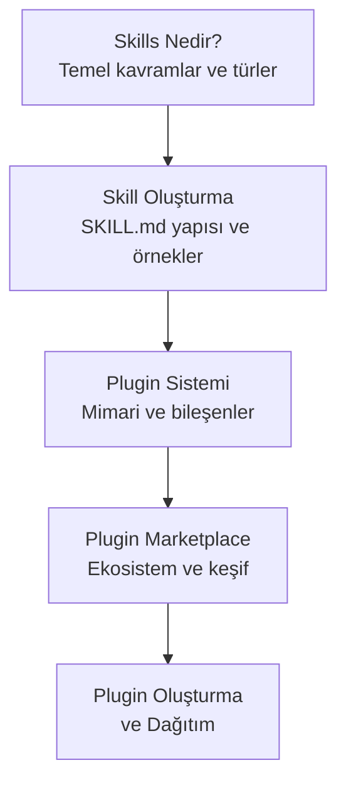
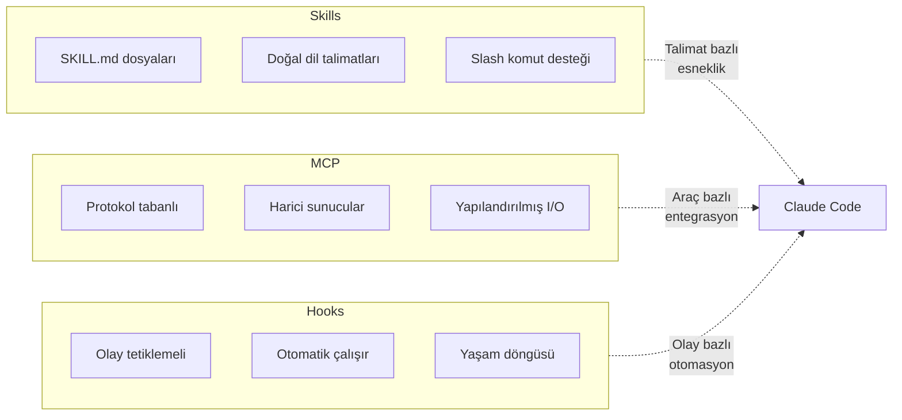

# Bölüm 12: Claude Code — Skills ve Pluginler

Claude Code'un yeteneklerini genişletmenin en güçlü yollarından biri **Skills** (beceriler) ve **Plugins** (eklentiler) sistemidir. Skills, Claude Code'a yeni araçlar ve davranışlar kazandırırken; Plugins, bu becerileri paketleyip paylaşılabilir hale getirir. Bu bölüm, skill oluşturmadan plugin dağıtımına kadar tüm genişletme ekosistemini kapsar.

## Bu Bölümde Neler Öğreneceksiniz?

## İçerik

| # | Dosya | Konu | Süre |
|---|-------|------|------|
| 01 | [Skills Nedir?](./01-skills-nedir.md) | Skill kavramı, invocation türleri, standalone vs namespaced | ~12 dk |
| 02 | [Skill Oluşturma](./02-skill-olusturma.md) | SKILL.md formatı, dizin yapısı, pratik skill örnekleri | ~18 dk |
| 03 | [Plugin Sistemi](./03-plugin-sistemi.md) | Plugin mimarisi, manifest, bileşenler, versiyon yönetimi | ~15 dk |
| 04 | [Plugin Marketplace](./04-plugin-marketplace.md) | Resmi ve topluluk marketplace'leri, kurulum, kategoriler | ~12 dk |
| 05 | [Plugin Oluşturma ve Dağıtım](./05-plugin-olusturma-ve-dagitim.md) | Sıfırdan plugin geliştirme, test, yayınlama ve paylaşım | ~18 dk |

## Ön Koşullar

Bu bölümü okumadan önce aşağıdaki konulara aşina olmanız önerilir:

| Konu | Bölüm |
|------|-------|
| Claude Code araçları (Tools) | [Bölüm 08](../08-araclar/README.md) |
| Bellek ve bağlam yönetimi | [Bölüm 09](../09-bellek-ve-baglam/README.md) |
| İzinler ve güvenlik | [Bölüm 10](../10-izinler-ve-guvenlik/README.md) |
| MCP (Model Context Protocol) | [Bölüm 11](../11-mcp/README.md) |

## Skills vs MCP vs Hooks

> **İpucu:** Skills doğal dil talimatlarıyla çalışırken, MCP yapılandırılmış protokolle çalışır. Hooks ise belirli olaylara tepki verir. Bu üç mekanizma birbirini tamamlar.

## Sonraki Adım

Bu bölümü tamamladıktan sonra → [13 - Subagent'lar ve Agent Takımları](../13-subagentlar-ve-agent-takimlari/README.md)

---

**Önceki Bölüm:** [11 - MCP (Model Context Protocol)](../11-mcp/README.md)
