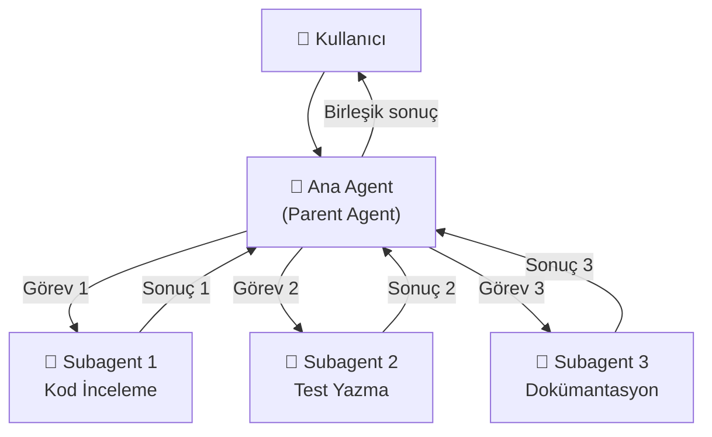
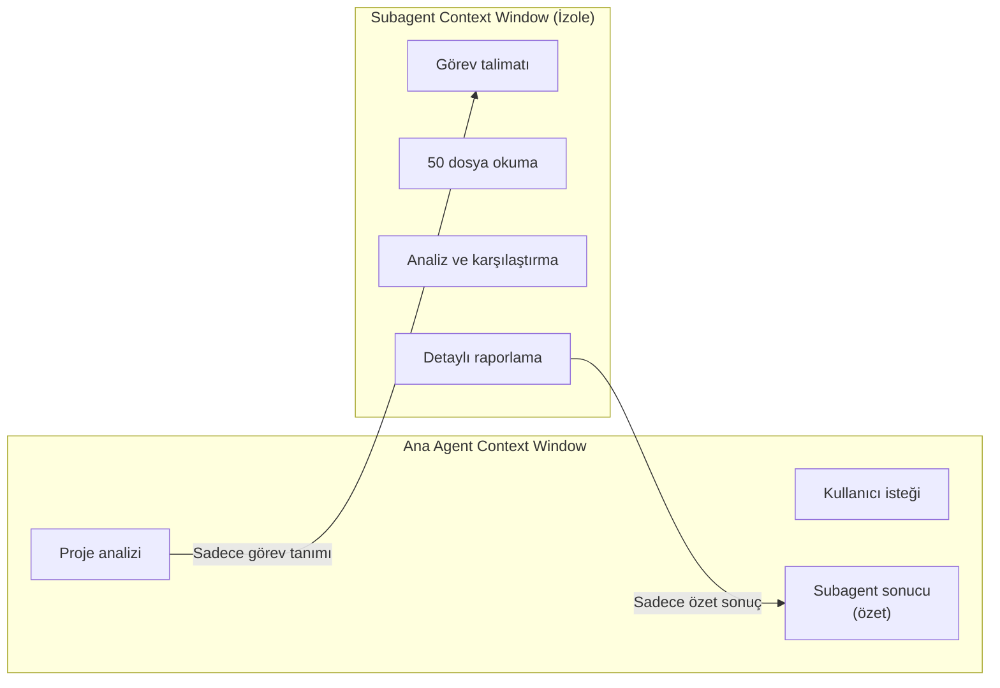
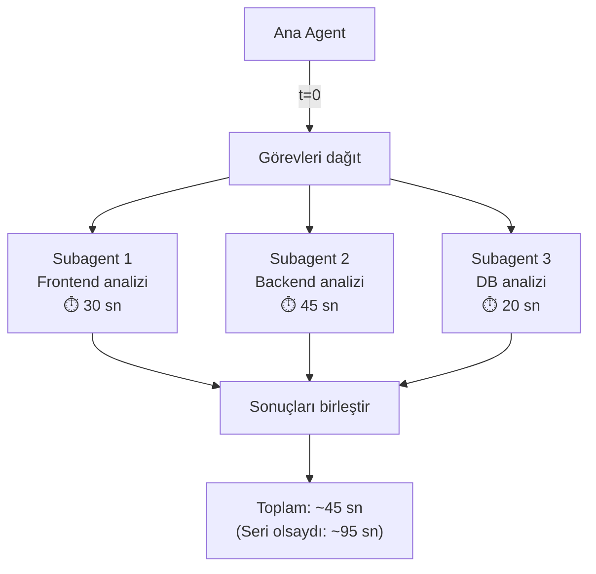
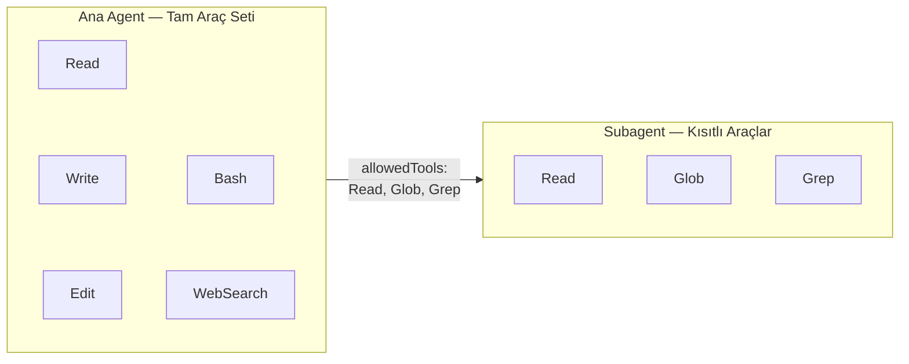
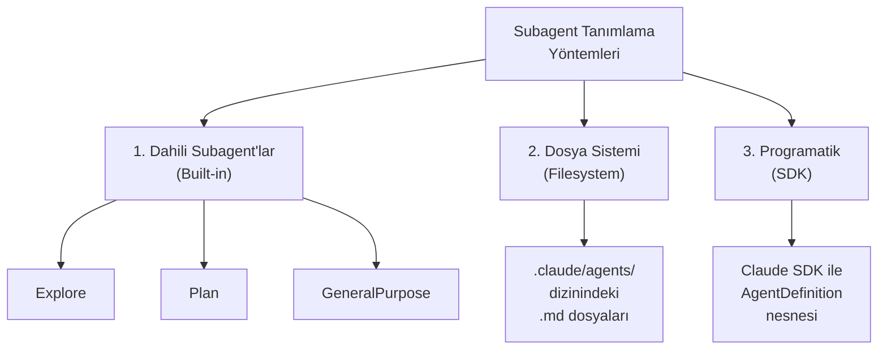
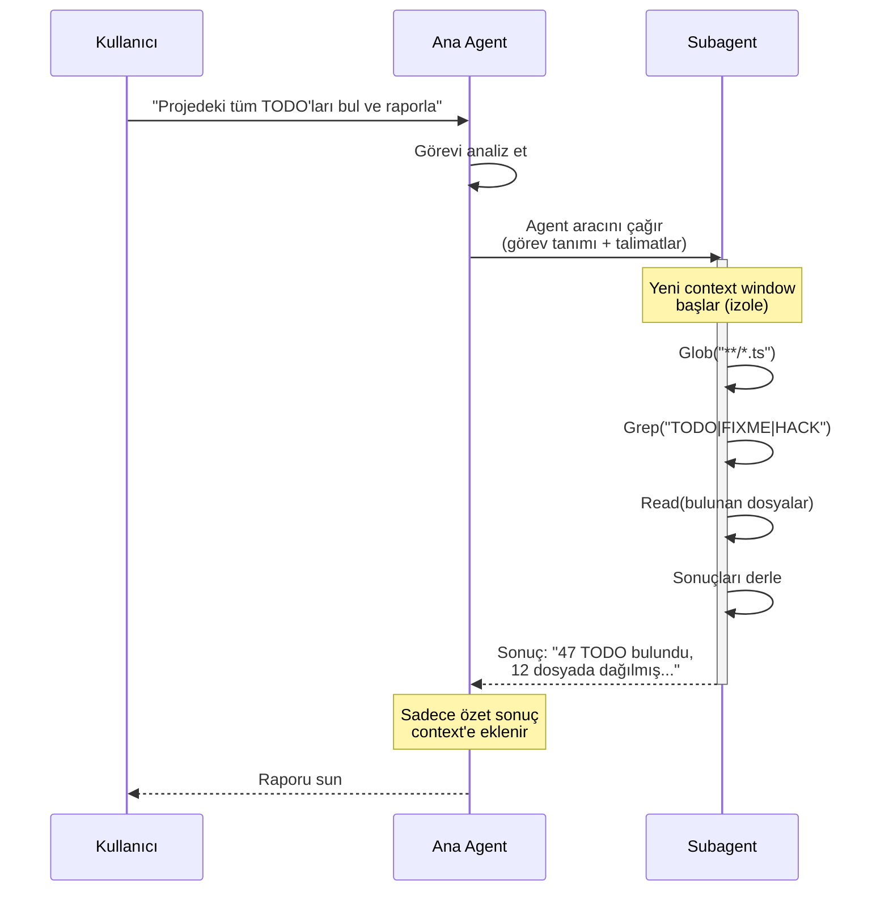
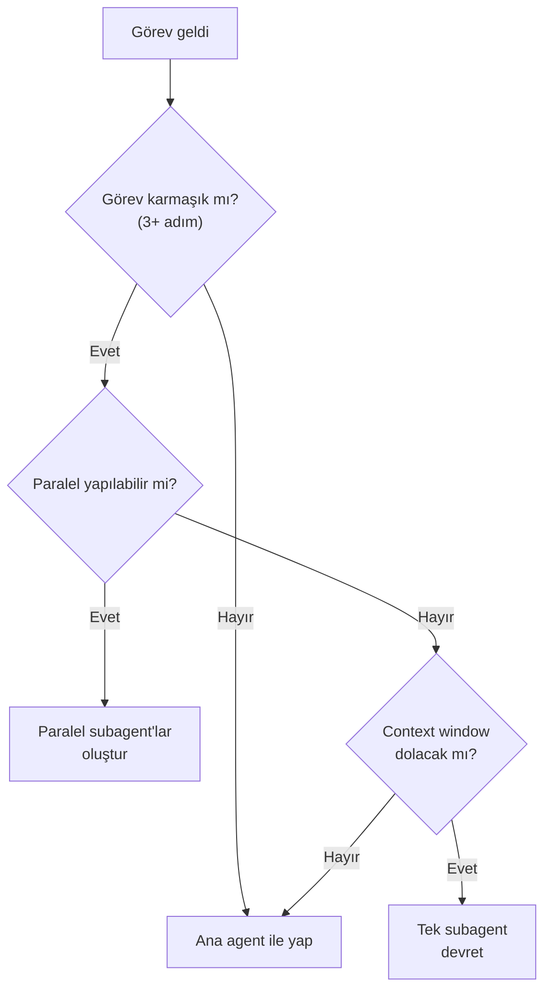
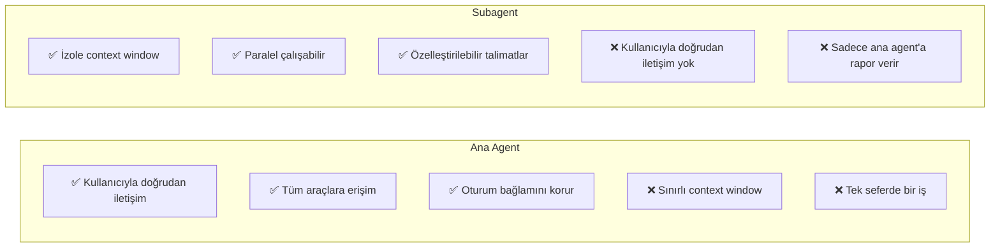

# Subagent Nedir?

Subagent (alt ajan), bir ana Claude Code oturumunun içinden başlatılan **bağımsız, izole bir agent örneğidir**. Ana agent (parent agent), karmaşık bir görevi daha küçük parçalara böler ve her parçayı ayrı bir subagent'a devreder. Subagent kendi bağlamında çalışır, işini bitirir ve yalnızca **nihai sonucu** ana agent'a döndürür.

## Ön Koşullar

| Konu | Bölüm |
|------|-------|
| Claude Code nasıl çalışır | [Claude Code Nasıl Çalışır?](../06-claude-code-tanitim/02-claude-code-nasil-calisir.md) |
| Araçlara genel bakış | [Araçlara Genel Bakış](../08-araclar/01-araclara-genel-bakis.md) |
| Context window yönetimi | [Context Window Yönetimi](../09-bellek-ve-baglam/05-context-window-yonetimi.md) |

---

## Subagent Mimarisi

Bir subagent, ana agent'tan tamamen izole bir şekilde çalışır. Kendi conversation context'i (konuşma bağlamı) vardır ve ana agent'ın context window'unu tüketmez.



---

## Subagent'ların Temel Avantajları

### 1. Context Isolation (Bağlam İzolasyonu)

Her subagent **temiz bir konuşma bağlamıyla** başlar. Ana agent'ın bağlamını kirletmez ve sadece nihai sonuç geri döner.



**Neden önemli?** Bir subagent 50 dosya okuyup binlerce satır kod analiz edebilir, ancak ana agent'ın context window'una yalnızca birkaç paragraflık sonuç eklenir.

### 2. Parallelization (Paralelleştirme)

Birden fazla subagent **eş zamanlı olarak** çalışabilir. Bu, büyük görevlerde dramatik hız artışı sağlar.



### 3. Specialized Instructions (Özelleştirilmiş Talimatlar)

Her subagent'a özel system prompt'lar (sistem istemleri) ve çalışma kuralları verilebilir.

```
Ana Agent: "Bu projenin güvenlik denetimini yap"

├── Subagent 1 (Güvenlik Uzmanı rolü):
│   "SQL injection, XSS ve CSRF açıklarını tara"
│
├── Subagent 2 (Performans Uzmanı rolü):
│   "N+1 sorguları ve bellek sızıntılarını bul"
│
└── Subagent 3 (Kod Kalitesi rolü):
    "SOLID ihlallerini ve code smell'leri raporla"
```

### 4. Tool Restrictions (Araç Kısıtlamaları)

Subagent'ların erişebileceği araçlar sınırlandırılabilir. Örneğin salt okunur bir subagent'a yalnızca `Read`, `Glob`, `Grep` araçları verilebilir.



---

## Subagent Tanımlama Yöntemleri

Claude Code'da subagent'lar üç farklı yöntemle tanımlanabilir:



### 1. Dahili Subagent'lar (Built-in Subagents)

Claude Code ile birlikte gelen, önceden tanımlanmış subagent'lardır. Herhangi bir yapılandırma gerektirmeden kullanılabilir.

| Subagent | Açıklama | Model |
|----------|----------|-------|
| **Explore** | Salt okunur dosya keşfi, hızlı arama | Hafif model |
| **Plan** | Araştırma ve planlama | Varsayılan model |
| **GeneralPurpose** | Çok adımlı karmaşık görevler, tam araç erişimi | Varsayılan model |

> 📖 Detaylı bilgi: [Dahili Subagent'lar](./02-dahili-subagentlar.md)

### 2. Dosya Sistemi ile Tanımlama (Filesystem)

`.claude/agents/` dizininde markdown dosyaları oluşturarak özel subagent'lar tanımlanır.

```
proje/
├── .claude/
│   └── agents/
│       ├── code-reviewer.md
│       ├── test-writer.md
│       └── docs-generator.md
```

> 📖 Detaylı bilgi: [Özel Subagent Oluşturma](./03-ozel-subagent-olusturma.md)

### 3. Programatik Tanımlama (SDK)

Claude SDK üzerinden `AgentDefinition` nesnesi ile runtime'da subagent tanımlanır.

```python
from claude_sdk import AgentDefinition

reviewer = AgentDefinition(
    name="code-reviewer",
    description="Kod inceleme uzmanı",
    instructions="SOLID prensiplerini ve clean code kurallarını kontrol et.",
    allowedTools=["Read", "Glob", "Grep"],
    model="claude-sonnet-4-20250514"
)
```

> 📖 Detaylı bilgi: [Agent Tool Kullanımı](./05-agent-tool-kullanimi.md)

---

## Parent-Subagent Yaşam Döngüsü



---

## Subagent Ne Zaman Kullanılmalı?

| Senaryo | Subagent Gerekli mi? | Neden? |
|---------|:--------------------:|--------|
| Tek dosyada küçük düzenleme | ❌ | Ana agent yeterli |
| 50+ dosyada kod araması | ✅ | Context izolasyonu gerekli |
| Paralel test ve lint çalıştırma | ✅ | Paralelleştirme avantajı |
| Basit soru-cevap | ❌ | Gereksiz overhead |
| Büyük refactoring projeleri | ✅ | Hem izolasyon hem paralellik |
| Farklı uzmanlıklar gerektiren görevler | ✅ | Özelleştirilmiş talimatlar |



---

## Pratik Örnekler

### Örnek 1: Büyük Kod Tabanı Analizi

```bash
> Bu projedeki tüm deprecated API kullanımlarını bul

# Claude Code otomatik olarak bir Explore subagent başlatır:
# 1. Subagent tüm dosyaları tarar (Glob + Grep)
# 2. Deprecated kullanımları tespit eder
# 3. Özet raporu ana agent'a döndürür
# 4. Ana agent raporu kullanıcıya sunar
```

### Örnek 2: Paralel Kod İnceleme

```bash
> Bu PR'daki değişiklikleri incele: güvenlik, performans ve kod kalitesi açısından

# Claude Code üç paralel subagent başlatır:
# Subagent 1: Güvenlik açıklarını tarar
# Subagent 2: Performans sorunlarını analiz eder
# Subagent 3: Kod kalitesi ve SOLID uyumunu kontrol eder
# Sonuçlar birleştirilip sunulur
```

### Örnek 3: Çok Modüllü Test Yazma

```bash
> Tüm service katmanı için unit test yaz

# Claude Code her servis için ayrı subagent başlatır:
# Subagent 1: UserService testleri
# Subagent 2: OrderService testleri
# Subagent 3: PaymentService testleri
# Her subagent kendi servisine odaklanır
```

### Örnek 4: Proje Keşfi ve Dokümantasyon

```bash
> Bu projenin mimarisini analiz et ve API dokümantasyonu oluştur

# İki aşamalı subagent kullanımı:
# Aşama 1 - Explore subagent: Proje yapısını keşfeder
# Aşama 2 - GeneralPurpose subagent: Dokümantasyonu yazar
```

---

## Subagent ve Ana Agent Karşılaştırması



| Özellik | Ana Agent | Subagent |
|---------|-----------|----------|
| Context window | Paylaşımlı (kullanıcı ile) | Bağımsız (izole) |
| Kullanıcı etkileşimi | Doğrudan | Yok (ana agent üzerinden) |
| Araç erişimi | Tam | Kısıtlanabilir |
| Paralel çalışma | Sınırlı | Tam destek |
| Yaşam süresi | Oturum boyunca | Görev bitene kadar |
| Maliyet | Tek context | Ek context maliyeti |

---

## Özet

| Kavram | Açıklama |
|--------|----------|
| **Subagent** | Ana agent tarafından başlatılan bağımsız, izole agent örneği |
| **Context Isolation** | Her subagent kendi bağlamında çalışır, ana context'i kirletmez |
| **Parallelization** | Birden fazla subagent eş zamanlı çalışabilir |
| **Tool Restrictions** | Subagent'ın erişebileceği araçlar sınırlandırılabilir |
| **Tanımlama** | Dahili (built-in), dosya sistemi (.claude/agents/), programatik (SDK) |

---

## Sonraki Adım

Subagent kavramını anladık. Şimdi Claude Code ile birlikte gelen dahili subagent'ları inceleyelim:

→ [Dahili Subagent'lar](./02-dahili-subagentlar.md)
