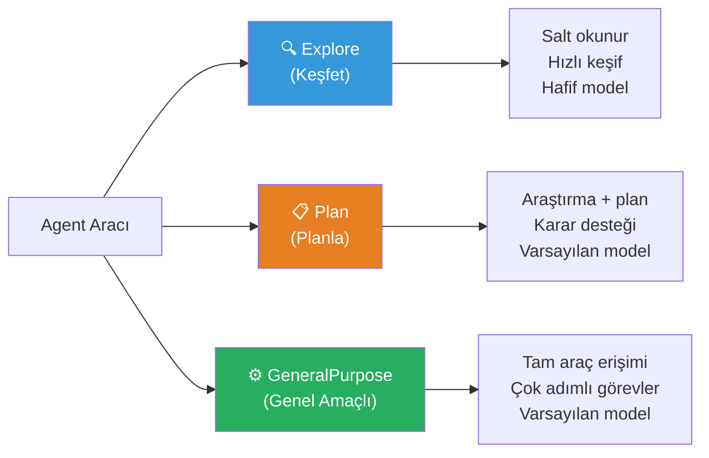
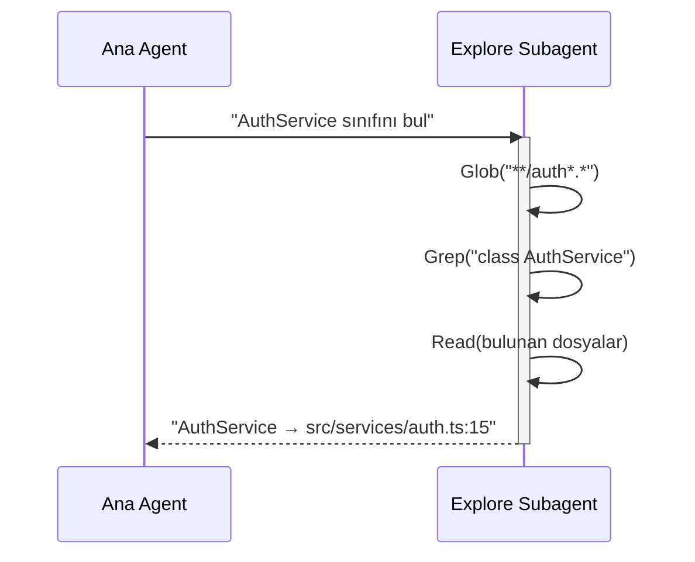
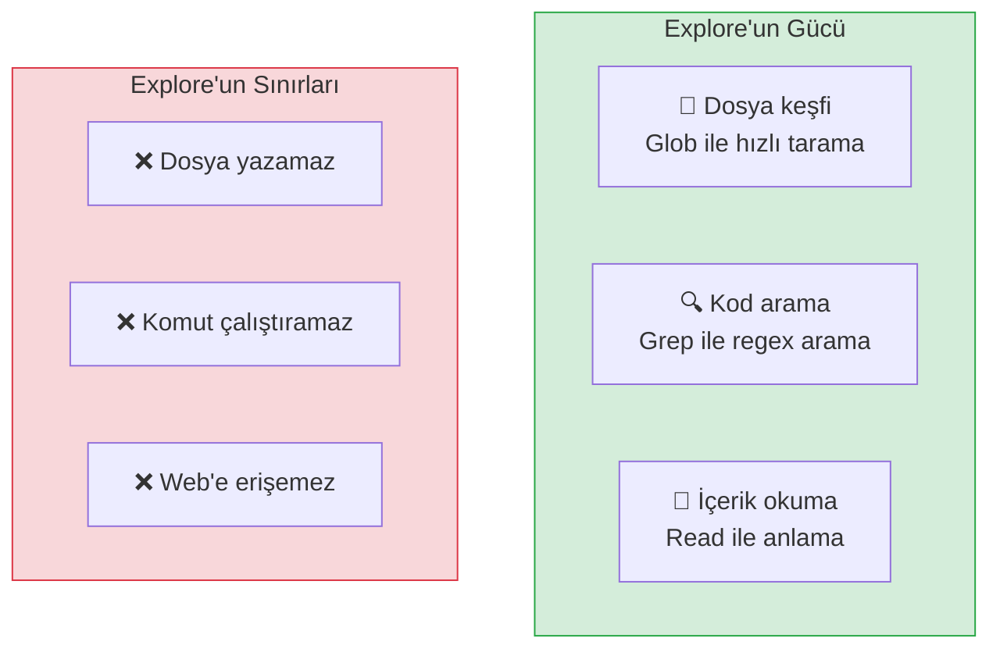
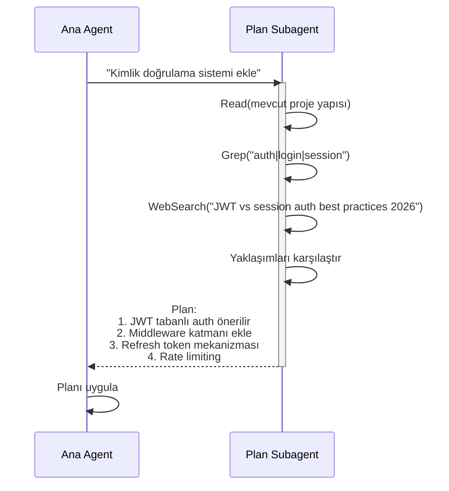
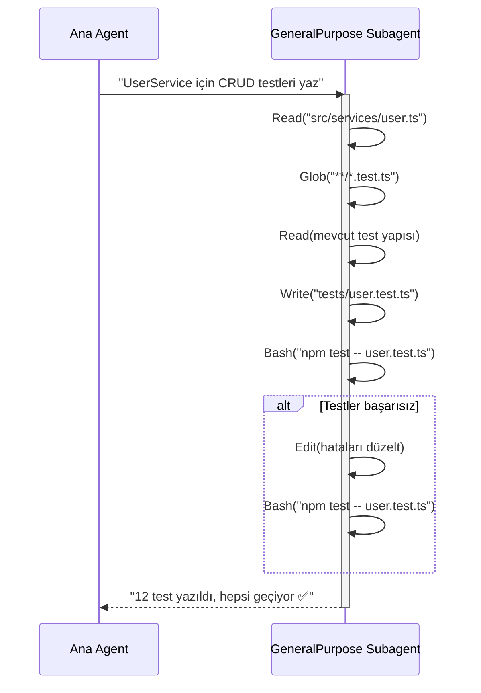
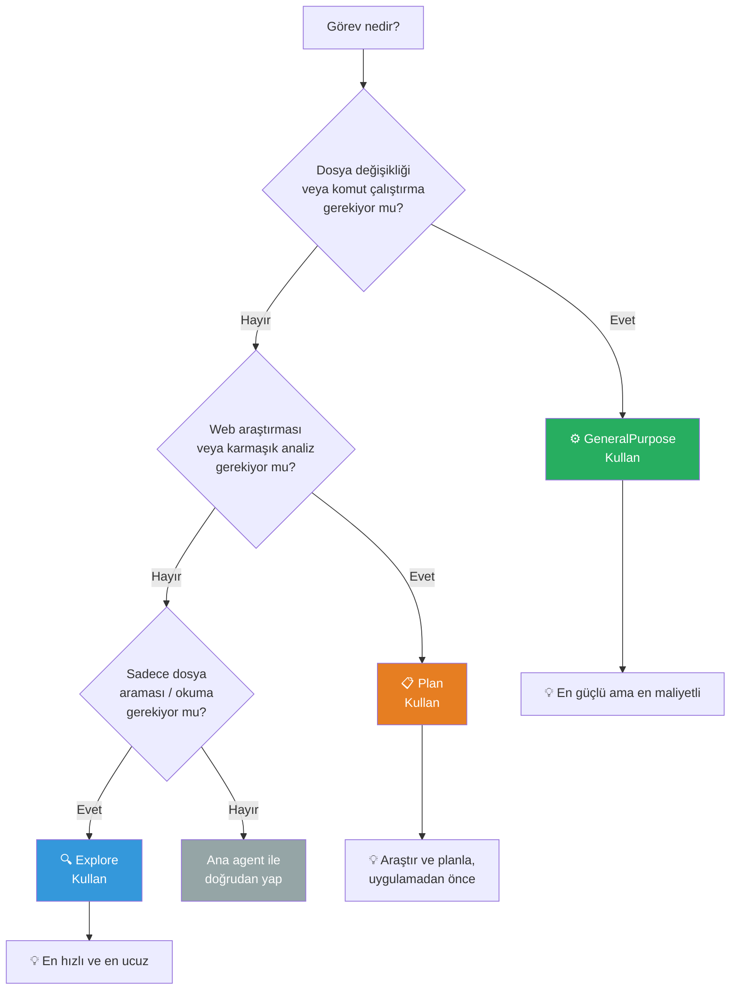
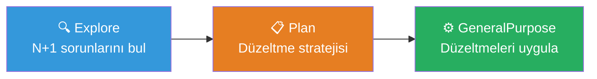

# Dahili Subagent'lar (Built-in Subagents)

Claude Code, çok karşılaşılan görev türleri için **önceden tanımlanmış üç subagent** ile birlikte gelir. Bu dahili subagent'lar herhangi bir yapılandırma gerektirmeden, Claude Code'un kendi kararıyla veya kullanıcının yönlendirmesiyle otomatik olarak devreye girer.

## Ön Koşullar

| Konu | Bölüm |
|------|-------|
| Subagent nedir | [Subagent Nedir?](./01-subagent-nedir.md) |
| Claude Code araçları | [Araçlara Genel Bakış](../08-araclar/01-araclara-genel-bakis.md) |

---

## Üç Dahili Subagent

Claude Code şu anda üç dahili subagent sunar:



---

## 1. Explore Subagent (Keşif Ajanı)

**Amaç:** Kod tabanını hızlıca keşfetmek, dosya bulmak ve yapıyı anlamak.

| Özellik | Değer |
|---------|-------|
| Model | Hafif model (daha hızlı, daha ucuz) |
| Araçlar | Read, Glob, Grep (salt okunur) |
| Yazma yetkisi | ❌ Yok |
| Hız | ⚡ Çok hızlı |
| Maliyet | 💰 Düşük |

### Ne Zaman Kullanılır?

- Projede belirli bir dosya veya sembol araması
- Kod tabanının yapısını anlama
- Bir fonksiyonun nerede tanımlandığını bulma
- Pattern (desen) aramaları

### Çalışma Akışı



### Kullanım Örneği

```bash
> Bu projede veritabanı bağlantısı nerede yapılandırılıyor?

# Claude Code otomatik olarak Explore subagent başlatır
# Explore hafif model kullandığı için çok hızlı yanıt döner
# Sonuç: "Veritabanı konfigürasyonu src/config/database.ts dosyasında,
#          bağlantı havuzu src/lib/pool.ts'de yönetiliyor."
```

### Explore'un Güçlü Yönleri



---

## 2. Plan Subagent (Planlama Ajanı)

**Amaç:** Bir göreve başlamadan önce araştırma yapmak ve yapılandırılmış bir plan oluşturmak.

| Özellik | Değer |
|---------|-------|
| Model | Varsayılan model |
| Araçlar | Read, Glob, Grep, WebSearch, WebFetch |
| Yazma yetkisi | ❌ Yok |
| Hız | ⏱️ Orta |
| Maliyet | 💰💰 Orta |

### Ne Zaman Kullanılır?

- Karmaşık bir özellik eklemeden önce strateji oluşturma
- Birden fazla yaklaşım arasında karar verme
- Mevcut kodu analiz edip refactoring planı çıkarma
- Teknik araştırma gerektiren görevler

### Çalışma Akışı



### Kullanım Örneği

```bash
> Bu monoliti mikroservislere bölmek istiyorum. Önce bir plan yap.

# Claude Code bir Plan subagent başlatır
# Plan subagent:
#   1. Mevcut monoliti analiz eder (Read, Glob)
#   2. Bağımlılık grafiğini çıkarır (Grep)
#   3. Best practice'leri araştırır (WebSearch)
#   4. Ayrıştırma stratejisi önerir
# Sonuç: Detaylı mikroservis ayrıştırma planı
```

---

## 3. GeneralPurpose Subagent (Genel Amaçlı Ajan)

**Amaç:** Tam araç erişimiyle karmaşık, çok adımlı görevleri bağımsız olarak yürütmek.

| Özellik | Değer |
|---------|-------|
| Model | Varsayılan model |
| Araçlar | Tüm araçlar (Read, Write, Edit, Bash, Web vb.) |
| Yazma yetkisi | ✅ Var |
| Hız | ⏱️ Değişken (göreve bağlı) |
| Maliyet | 💰💰💰 Yüksek |

### Ne Zaman Kullanılır?

- Birden fazla dosyada değişiklik gerektiren görevler
- Kod yazma, test etme ve doğrulama döngüsü
- Build, test, lint çalıştırma gerektiren işlemler
- Karmaşık refactoring operasyonları

### Çalışma Akışı



### Kullanım Örneği

```bash
> Tüm REST endpoint'lerini OpenAPI 3.0 şemasıyla belgele ve
> swagger UI sayfası ekle

# Claude Code bir GeneralPurpose subagent başlatır
# Subagent:
#   1. Tüm route dosyalarını tarar (Glob, Read)
#   2. Endpoint parametrelerini analiz eder
#   3. OpenAPI şeması oluşturur (Write)
#   4. Swagger UI entegrasyonu ekler (Write, Edit)
#   5. Çalıştığını doğrular (Bash)
```

---

## Karşılaştırma Tablosu

| Özellik | Explore | Plan | GeneralPurpose |
|---------|:-------:|:----:|:--------------:|
| **Model** | Hafif | Varsayılan | Varsayılan |
| **Hız** | ⚡⚡⚡ | ⚡⚡ | ⚡ |
| **Maliyet** | $ | $$ | $$$ |
| **Dosya okuma** | ✅ | ✅ | ✅ |
| **Dosya yazma** | ❌ | ❌ | ✅ |
| **Bash çalıştırma** | ❌ | ❌ | ✅ |
| **Web erişimi** | ❌ | ✅ | ✅ |
| **Araç seti** | Read, Glob, Grep | + WebSearch, WebFetch | Tüm araçlar |
| **En iyi kullanım** | Hızlı arama | Araştırma ve planlama | Karmaşık uygulama |

---

## Seçim Akış Şeması

Hangi dahili subagent'ı kullanmanız gerektiğini belirlemek için:



---

## Pratik Örnekler

### Örnek 1: Explore — Hızlı Kod Keşfi

```bash
> Projede kaç tane React hook'u tanımlanmış?

# Explore subagent başlatılır (hafif model, çok hızlı)
# Grep("^export (function|const) use[A-Z]") → tüm dosyaları tarar
# Sonuç: "14 özel hook bulundu: useAuth, useDebounce, ..."
```

### Örnek 2: Plan — Mimari Karar

```bash
> Caching stratejisi eklemek istiyorum. Redis mi, in-memory mi kullanmalıyım?

# Plan subagent başlatılır
# 1. Mevcut veri erişim kalıplarını analiz eder
# 2. Trafik ve veri büyüklüğünü değerlendirir
# 3. Web'den güncel karşılaştırma verileri çeker
# 4. Somut öneri ile döner
```

### Örnek 3: GeneralPurpose — Uçtan Uca Uygulama

```bash
> Tüm API endpoint'lerine rate limiting middleware'i ekle

# GeneralPurpose subagent başlatılır
# 1. Mevcut middleware yapısını okur
# 2. Rate limiting paketi yükler (Bash)
# 3. Middleware dosyasını oluşturur (Write)
# 4. Tüm route'lara bağlar (Edit)
# 5. Testleri çalıştırır (Bash)
# 6. Sonucu raporlar
```

### Örnek 4: Kombine Kullanım

```bash
> Projedeki tüm N+1 sorgu sorunlarını bul ve düzelt

# Aşama 1: Explore subagent — sorunlu dosyaları tarar
# Aşama 2: Plan subagent — düzeltme stratejisi oluşturur
# Aşama 3: GeneralPurpose subagent — düzeltmeleri uygular
```



---

## Claude Code Otomatik Seçimi

Claude Code, çoğu durumda uygun subagent'ı **otomatik olarak** seçer. Bu seçim görevin doğasına göre yapılır:

| Görev Türü | Claude Code'un Seçimi |
|------------|----------------------|
| "X nerede tanımlı?" | Explore |
| "Proje yapısını göster" | Explore |
| "Nasıl yapmalıyım?" | Plan |
| "Strateji öner" | Plan |
| "Bunu uygula" | GeneralPurpose |
| "Test yaz ve çalıştır" | GeneralPurpose |

> **İpucu:** Subagent seçimini kendiniz de yönlendirebilirsiniz. Prompt'unuzda "önce araştır" veya "sadece bul, değiştirme" gibi ifadeler kullanarak Claude Code'un tercihini etkileyebilirsiniz.

---

## Özet

| Subagent | Tek Cümle | Ne Zaman? |
|----------|-----------|-----------|
| **Explore** | Hızlı, ucuz, salt okunur keşif | Dosya arama, yapı anlama |
| **Plan** | Araştırma ve strateji oluşturma | Karar vermeden önce analiz |
| **GeneralPurpose** | Tam güçlü, bağımsız çalışan | Kod yazma, test, build |

---

## Sonraki Adım

Dahili subagent'ları öğrendik. Şimdi kendi özel subagent'larımızı nasıl oluşturacağımızı görelim:

→ [Özel Subagent Oluşturma](./03-ozel-subagent-olusturma.md)
