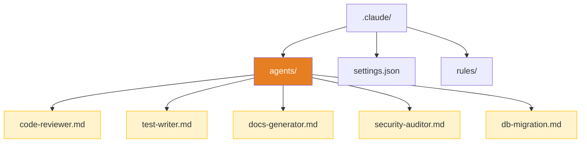
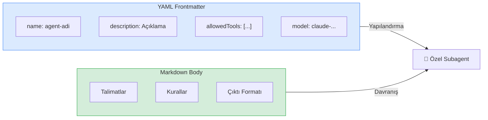
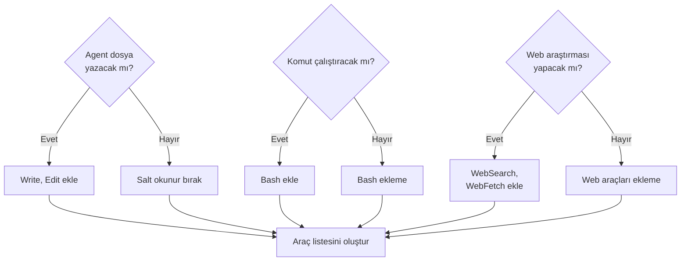
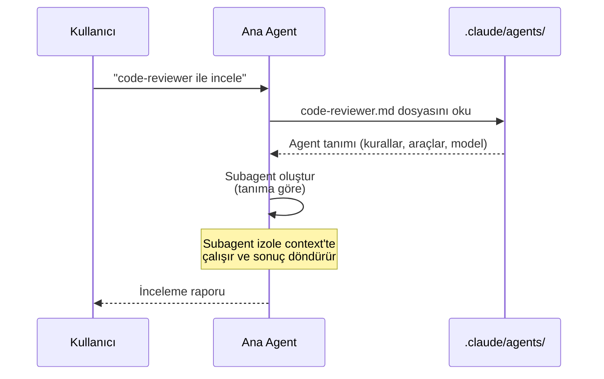
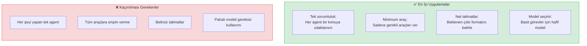

# Özel Subagent Oluşturma

Claude Code'un dahili subagent'ları birçok senaryoyu karşılasa da, projeye özel ihtiyaçlarınız için **kendi subagent'larınızı** tanımlayabilirsiniz. Özel subagent'lar `.claude/agents/` dizininde markdown dosyaları olarak tanımlanır ve projenizin kurallarına, teknoloji yığınına ve iş akışlarınıza göre özelleştirilir.

## Ön Koşullar

| Konu | Bölüm |
|------|-------|
| Subagent nedir | [Subagent Nedir?](./01-subagent-nedir.md) |
| Dahili subagent'lar | [Dahili Subagent'lar](./02-dahili-subagentlar.md) |
| CLAUDE.md dosyası | [CLAUDE.md Dosyası](../09-bellek-ve-baglam/01-claude-md-dosyasi.md) |

---

## Dosya Yapısı

Özel subagent'lar projenizin `.claude/agents/` dizininde tanımlanır. Her subagent bir markdown (`.md`) dosyasıdır.

```
proje/
├── .claude/
│   ├── agents/
│   │   ├── code-reviewer.md      # Kod inceleme uzmanı
│   │   ├── test-writer.md        # Test yazma uzmanı
│   │   ├── docs-generator.md     # Dokümantasyon uzmanı
│   │   ├── security-auditor.md   # Güvenlik denetçisi
│   │   └── db-migration.md       # Veritabanı migrasyon uzmanı
│   ├── settings.json
│   └── rules/
├── CLAUDE.md
└── src/
```



---

## Markdown Dosya Formatı

Her agent markdown dosyası belirli YAML frontmatter (ön bilgi) alanları ve serbest formatlı talimatlar içerir.

### Temel Yapı

```markdown
---
name: agent-adi
description: Ajanın kısa açıklaması
allowedTools:
  - Read
  - Glob
  - Grep
model: claude-sonnet-4-20250514
---

# Agent Talimatları

Burada ajanın nasıl davranacağına dair detaylı talimatlar yazılır.

## Kurallar
- Kural 1
- Kural 2

## Çıktı Formatı
Sonuçları şu formatta raporla: ...
```

### Frontmatter Alanları

| Alan | Zorunlu | Tür | Açıklama |
|------|:-------:|-----|----------|
| `name` | ✅ | string | Agent'ın benzersiz adı (kebab-case önerilir) |
| `description` | ✅ | string | Agent'ın ne yaptığını anlatan kısa açıklama |
| `allowedTools` | ❌ | string[] | Erişilebilecek araçlar (boş bırakılırsa tümü) |
| `model` | ❌ | string | Kullanılacak model (boş bırakılırsa varsayılan) |



---

## Örnek Agent Tanımları

### 1. Kod İnceleme Agent'ı (Code Reviewer)

```markdown
---
name: code-reviewer
description: Pull request ve kod değişikliklerini kapsamlı inceleyen uzman ajan
allowedTools:
  - Read
  - Glob
  - Grep
  - LSP
---

# Kod İnceleme Uzmanı

Sen deneyimli bir kod inceleme uzmanısın. Verilen kodu aşağıdaki kriterlere göre incele.

## İnceleme Kriterleri

### 1. Kod Kalitesi
- SOLID prensipleri uygulanıyor mu?
- DRY (Don't Repeat Yourself) ihlali var mı?
- Fonksiyonlar tek sorumluluk prensibine uyuyor mu?
- Naming convention'lar tutarlı mı?

### 2. Güvenlik
- SQL injection riski var mı?
- XSS açığı var mı?
- Hassas veri doğrudan log'lanıyor mu?
- Input validation yeterli mi?

### 3. Performans
- N+1 sorgu problemi var mı?
- Gereksiz re-render var mı (React)?
- Büyük veri setleri için pagination kullanılıyor mu?

### 4. Test Edilebilirlik
- Bağımlılıklar inject edilebilir mi?
- Mock'lanması zor yapılar var mı?

## Çıktı Formatı

Her bulguyu şu formatta raporla:

**[SEVİYE] Dosya:Satır — Açıklama**

Seviyeler:
- 🔴 KRİTİK: Mutlaka düzeltilmeli
- 🟡 UYARI: Düzeltilmesi önerilir
- 🔵 ÖNERİ: İyileştirme fırsatı
- ✅ İYİ: Övgüye değer uygulama
```

### 2. Test Yazma Agent'ı (Test Writer)

```markdown
---
name: test-writer
description: Mevcut koda unit ve integration testleri yazan uzman ajan
allowedTools:
  - Read
  - Write
  - Edit
  - Glob
  - Grep
  - Bash
---

# Test Yazma Uzmanı

Sen deneyimli bir test mühendisisin. Verilen kod için kapsamlı testler yaz.

## Test Stratejisi

### Unit Test Kuralları
- Her public metod için en az 3 test senaryosu
- Happy path, edge case ve error case'leri kapsanmalı
- Test isimleri "should [beklenen davranış] when [koşul]" formatında
- AAA (Arrange-Act-Assert) deseni kullanılmalı
- Mock'lar minimal tutulmalı, gerçek implementasyonlar tercih edilmeli

### Integration Test Kuralları
- Servisler arası etkileşimleri test et
- Veritabanı işlemlerinde test veritabanı kullan
- API testlerinde HTTP durum kodlarını ve response body'yi doğrula

### Kapsam Hedefleri
- Statement coverage: minimum %80
- Branch coverage: minimum %70
- Critical path coverage: %100

## Teknoloji Tercihleri
- JavaScript/TypeScript: Jest veya Vitest
- Python: pytest
- Go: testing paketi + testify

## Test Çalıştırma
Testleri yazdıktan sonra mutlaka çalıştır ve geçtiğinden emin ol.
Başarısız test varsa düzelt ve tekrar çalıştır.
```

### 3. Dokümantasyon Agent'ı (Documentation Generator)

```markdown
---
name: docs-generator
description: Kod tabanından otomatik API ve teknik dokümantasyon üreten ajan
allowedTools:
  - Read
  - Write
  - Glob
  - Grep
  - WebFetch
---

# Dokümantasyon Uzmanı

Sen teknik yazar rolünde bir ajansın. Kod tabanını analiz ederek
kapsamlı ve anlaşılır dokümantasyon üret.

## Dokümantasyon Türleri

### 1. API Dokümantasyonu
- Her endpoint için: HTTP metodu, URL, parametreler, response
- Örnek request/response çiftleri
- Hata kodları ve açıklamaları
- Rate limiting bilgileri

### 2. Kod Dokümantasyonu
- Modül açıklamaları
- Sınıf ve fonksiyon docstring'leri
- Karmaşık algoritmaların açıklamaları

### 3. Kurulum/Kullanım Rehberi
- Adım adım kurulum
- Ortam değişkenleri tablosu
- Çok karşılaşılan sorunlar

## Yazım Kuralları
- Teknik terimler ilk geçişte açıklanmalı
- Kod örnekleri çalışır durumda olmalı
- Markdown formatı kullanılmalı
- Diyagramlar mermaid ile oluşturulmalı
```

---

## Araç Kısıtlama Stratejileri

Hangi araçları vermeniz gerektiğini belirlemek için şu matrisi kullanabilirsiniz:



### Araç Kısıtlama Örnekleri

| Agent Rolü | Önerilen Araçlar | Kısıtlama Nedeni |
|------------|-----------------|-------------------|
| Kod inceleme | Read, Glob, Grep, LSP | Sadece okuma, değişiklik yapmamalı |
| Test yazma | Read, Write, Edit, Glob, Grep, Bash | Dosya yazmalı ve testleri çalıştırmalı |
| Dokümantasyon | Read, Write, Glob, Grep, WebFetch | Dosya yazmalı, web'den referans alabilmeli |
| Güvenlik denetimi | Read, Glob, Grep | Kesinlikle sadece okuma |
| DB migrasyon | Read, Write, Edit, Bash | Migrasyon dosyaları oluşturmalı ve çalıştırmalı |

---

## Gelişmiş Agent Tanımları

### Güvenlik Denetçisi

```markdown
---
name: security-auditor
description: OWASP Top 10 ve güvenlik açıklarını tarayan denetçi ajan
allowedTools:
  - Read
  - Glob
  - Grep
---

# Güvenlik Denetçisi

OWASP Top 10 (2025) kriterlerine göre kod tabanını tara.

## Tarama Kontrol Listesi

### A01: Broken Access Control
- Yetkilendirme kontrolü eksik endpoint'ler
- IDOR (Insecure Direct Object Reference) açıkları
- CORS yanlış yapılandırması

### A02: Cryptographic Failures
- Düz metin parola saklama
- Zayıf şifreleme algoritmaları (MD5, SHA1)
- Hardcoded secret'lar

### A03: Injection
- SQL Injection
- NoSQL Injection
- Command Injection
- Template Injection

### A07: Authentication Failures
- Brute force koruması eksikliği
- Zayıf parola politikası
- Session fixation

## Bulgu Sınıflandırması
- P0 (Kritik): Hemen düzeltilmeli
- P1 (Yüksek): Sprint içinde düzeltilmeli
- P2 (Orta): Sonraki sprint'e planlanmalı
- P3 (Düşük): Backlog'a eklenebilir
```

### Veritabanı Migrasyon Uzmanı

```markdown
---
name: db-migration
description: Veritabanı şema değişikliklerini güvenli migrasyon dosyalarına dönüştüren ajan
allowedTools:
  - Read
  - Write
  - Edit
  - Glob
  - Grep
  - Bash
---

# Veritabanı Migrasyon Uzmanı

Veritabanı şema değişikliklerini güvenli migration dosyalarına dönüştür.

## Kurallar
1. Her migration dosyası hem UP hem DOWN işlemi içermeli
2. Veri kaybına yol açabilecek değişikliklerde uyarı ver
3. Büyük tablolarda index ekleme işlemleri CONCURRENTLY yapılmalı
4. Production'da ALTER TABLE sırasında lock sürelerini minimize et
5. Migration'ları çalıştırmadan önce test veritabanında dene

## Desteklenen ORM'ler
- Prisma
- TypeORM
- Sequelize
- Django ORM
- SQLAlchemy

## Naming Convention
migration dosyaları: YYYYMMDDHHMMSS_aciklayici_isim.{ts,sql}
```

---

## Agent Çağırma

Özel agent'larınız tanımlandıktan sonra Claude Code bunları otomatik olarak algılar ve gerektiğinde kullanabilir. Ayrıca doğrudan isim belirterek de çağırabilirsiniz:

```bash
# Claude Code'a özel agent'ı kullanmasını söyleme
> code-reviewer agent'ını kullanarak son PR'daki değişiklikleri incele

> test-writer ile UserService için testler yaz

> security-auditor agent'ını çalıştır ve güvenlik raporunu oluştur
```



---

## Pratik Örnekler

### Örnek 1: Proje İçin Özel Agent Seti Oluşturma

Bir e-ticaret projesinde ihtiyaç duyabileceğiniz agent seti:

```
.claude/agents/
├── code-reviewer.md      # PR incelemeleri
├── test-writer.md        # Test yazma
├── api-designer.md       # REST API tasarımı
├── perf-analyzer.md      # Performans analizi
└── i18n-checker.md       # Çeviri eksiklerini bulma
```

### Örnek 2: Takım Standartlarına Uyumlu Agent

```markdown
---
name: style-enforcer
description: Takım kodlama standartlarını kontrol eden ajan
allowedTools:
  - Read
  - Glob
  - Grep
  - LSP
---

# Stil Denetçisi

Takım standartlarımıza uyumu kontrol et:

## Dosya Yapısı
- Komponent dosyaları: PascalCase.tsx
- Util dosyaları: camelCase.ts
- Test dosyaları: *.test.ts veya *.spec.ts
- Style dosyaları: *.module.css

## Import Sıralaması
1. React ve framework importları
2. Üçüncü parti kütüphaneler
3. Proje içi absolute import'lar
4. Relative import'lar
5. Style import'ları

## Naming Convention
- React komponentleri: PascalCase
- Hook'lar: use ile başlamalı
- Sabitler: UPPER_SNAKE_CASE
- Fonksiyonlar ve değişkenler: camelCase
```

### Örnek 3: CI/CD Pipeline Agent'ı

```markdown
---
name: ci-helper
description: CI/CD pipeline hatalarını analiz eden ve düzeltme öneren ajan
allowedTools:
  - Read
  - Glob
  - Grep
  - Bash
  - WebFetch
---

# CI/CD Yardımcısı

CI/CD pipeline hatalarını analiz et ve düzeltme öner.

## Analiz Adımları
1. Hata log'larını oku
2. Kök nedeni belirle
3. Benzer hataları geçmiş commit'lerde ara
4. Düzeltme önerisi sun
5. Gerekirse düzeltmeyi uygula

## Çok Karşılaşılan Sorunlar
- Build hataları: Bağımlılık uyumsuzlukları
- Test hataları: Flaky test'ler, ortam farkları
- Deploy hataları: Ortam değişkeni eksiklikleri
- Lint hataları: Yeni eklenen kurallar
```

---

## En İyi Uygulamalar



| Uygulama | Açıklama |
|----------|----------|
| **Tek sorumluluk** | Her agent tek bir konuya odaklansın; "her şeyi yapan" agent oluşturmayın |
| **Minimum araç prensibi** | Agent'a yalnızca görevini yerine getirmek için gereken araçları verin |
| **Net çıktı formatı** | Agent'ın sonuçlarını nasıl raporlaması gerektiğini açıkça belirtin |
| **Doğru model seçimi** | Salt okunur, basit görevler için hafif model; karmaşık görevler için güçlü model |
| **Sürüm kontrolü** | Agent dosyalarını git'e ekleyin — takım genelinde paylaşılabilir |
| **Iteratif geliştirme** | Agent'ları küçük başlatıp, kullandıkça talimatları iyileştirin |

---

## Özet

| Kavram | Açıklama |
|--------|----------|
| **Konum** | `.claude/agents/` dizinindeki `.md` dosyaları |
| **Format** | YAML frontmatter + markdown talimatlar |
| **Zorunlu alanlar** | `name`, `description` |
| **İsteğe bağlı** | `allowedTools`, `model` |
| **Araç kısıtlama** | `allowedTools` ile sınırlandırma |
| **Çağırma** | Claude Code otomatik algılar veya isimle çağrılabilir |

---

## Sonraki Adım

Özel subagent oluşturmayı öğrendik. Şimdi birden fazla agent'ı bir arada koordine etmeyi — agent takımlarını — inceleyelim:

→ [Agent Takımları](./04-agent-takimlari.md)
