# Agent Takımları (Agent Teams)

Agent Teams (agent takımları), birden fazla Claude Code örneğinin **koordineli bir şekilde** birlikte çalışarak büyük ölçekli görevleri yürütmesini sağlayan bir orkestrasyon modelidir. Tek bir agent'ın kapasitesini aşan projelerde — büyük refactoring'ler, çok modüllü geliştirmeler ve çapraz repo koordinasyonlarında — agent takımları devreye girer.

## Ön Koşullar

| Konu | Bölüm |
|------|-------|
| Subagent nedir | [Subagent Nedir?](./01-subagent-nedir.md) |
| Dahili subagent'lar | [Dahili Subagent'lar](./02-dahili-subagentlar.md) |
| Özel subagent oluşturma | [Özel Subagent Oluşturma](./03-ozel-subagent-olusturma.md) |
| Worktree ile paralel çalışma | [Worktree](../09-bellek-ve-baglam/08-worktree-ile-paralel-calisma.md) |

---

## Agent Takımı Nedir?

Bir agent takımı, bir **orkestratör agent** (conductor) tarafından yönetilen birden fazla **çalışan agent'tan** (worker) oluşur. Orkestratör büyük görevi parçalara ayırır, her parçayı uygun bir worker'a atar ve sonuçları birleştirir.

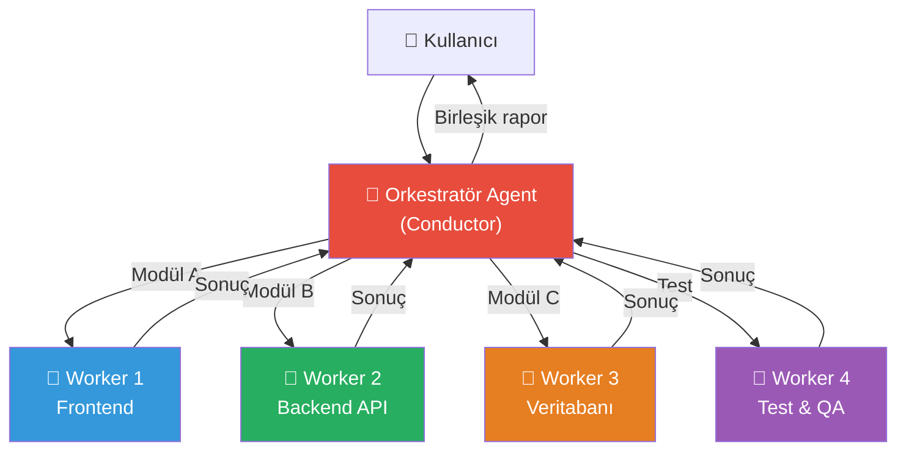

---

## Takım Yapısı ve Roller

### Orkestratör (Conductor)

Orkestratör, takımın "beyni"dir:

- Büyük görevi alt görevlere böler
- Her alt görevi uygun worker'a atar
- Worker'lar arası bağımlılıkları yönetir
- Sonuçları toplar ve birleştirir
- Çakışmaları çözer

### Worker'lar (Çalışanlar)

Her worker belirli bir uzmanlık alanında çalışır:

- Kendi izole context window'unda çalışır
- Atanan alt göreve odaklanır
- Tamamlandığında sonucu orkestratöre raporlar

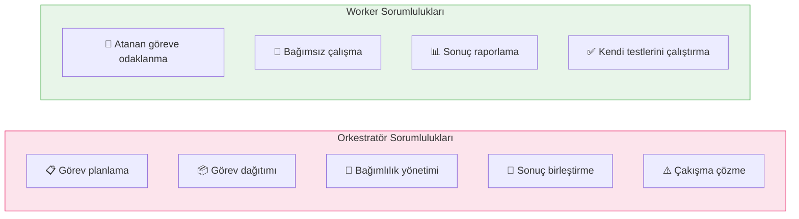

---

## Takım Orkestrasyon Modelleri

### 1. Yıldız Modeli (Star Pattern)

Tüm worker'lar doğrudan orkestratöre bağlıdır. En yaygın ve basit model.

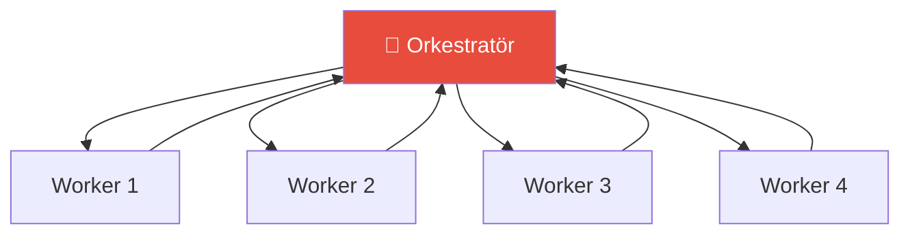

**Ne zaman:** Bağımsız, paralel çalışabilen görevler.

### 2. Pipeline Modeli (Pipeline Pattern)

Worker'lar sıralı bir zincir oluşturur. Bir öncekinin çıktısı sonrakinin girdisi olur.

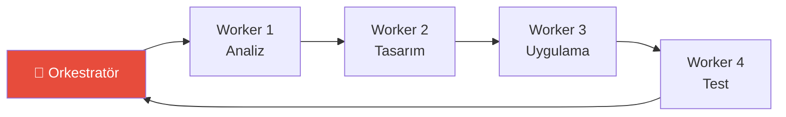

**Ne zaman:** Sıralı bağımlılığı olan görevler (analiz → tasarım → uygulama → test).

### 3. Hiyerarşik Model (Hierarchical Pattern)

Alt orkestratörler kendi worker gruplarını yönetir.

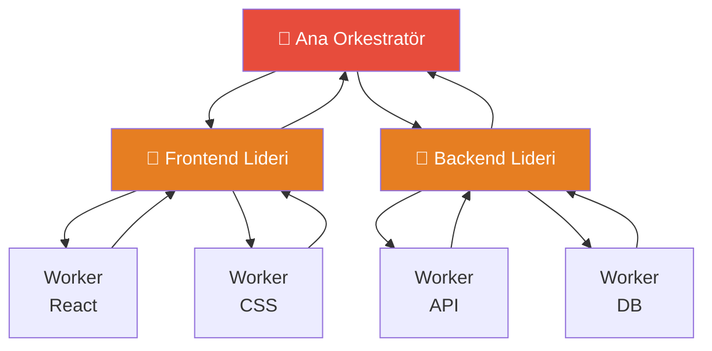

**Ne zaman:** Çok büyük projeler, farklı alan uzmanlıkları gereken durumlar.

---

## Kullanım Senaryoları

### Senaryo 1: Büyük Ölçekli Refactoring

**Görev:** Monolitik uygulamada ORM değişikliği (Sequelize → Prisma)

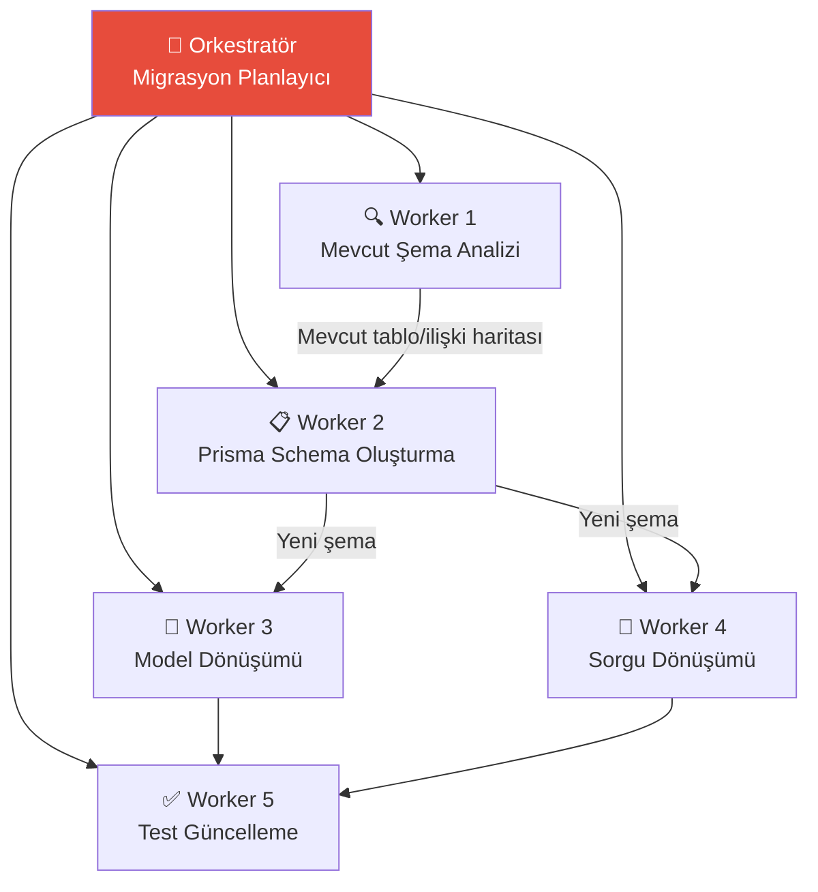

```bash
# Kullanıcı isteği:
> Projemizdeki Sequelize ORM'ini Prisma'ya taşı.
> 47 model ve 120+ sorgu var. Agent takımı ile yap.

# Orkestratör planı:
# 1. Worker 1: Mevcut Sequelize modellerini ve ilişkilerini analiz et
# 2. Worker 2: Prisma schema.prisma dosyasını oluştur
# 3. Worker 3: Model dosyalarını Prisma Client'a dönüştür (paralel)
# 4. Worker 4: Raw sorguları Prisma sorguya çevir (paralel)
# 5. Worker 5: Tüm testleri güncelle ve çalıştır
```

### Senaryo 2: Paralel Feature Development (Paralel Özellik Geliştirme)

**Görev:** Bir sprint'teki birden fazla özelliği aynı anda geliştirme

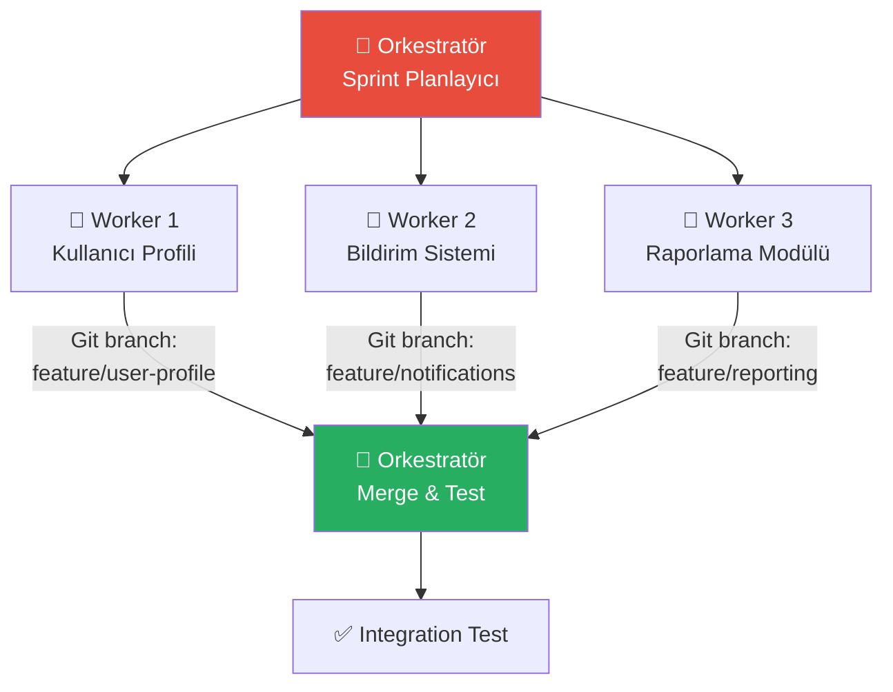

```bash
# Kullanıcı isteği:
> Sprint'teki şu 3 özelliği paralel olarak geliştir:
> 1. Kullanıcı profil sayfası
> 2. Push bildirim sistemi
> 3. Aylık raporlama modülü

# Her worker kendi git branch'inde çalışır
# Orkestratör sonunda merge eder ve integration test çalıştırır
```

### Senaryo 3: Multi-Repo Koordinasyonu (Çoklu Repo Koordinasyonu)

**Görev:** Bir API değişikliğinin birden fazla repo'yu etkilediği durum

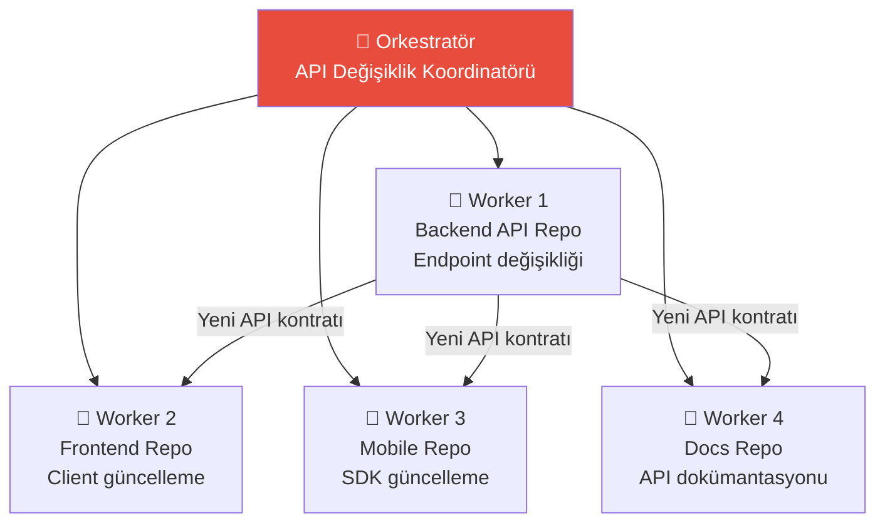

```bash
# Kullanıcı isteği:
> User API'sine 'preferences' alanı ekle.
> Backend, frontend, mobile ve docs repo'larının hepsini güncelle.

# Orkestratör:
# 1. Backend worker: API endpoint'ini günceller, migration oluşturur
# 2. Diğer worker'lar Backend API kontratını referans alır
# 3. Frontend worker: React bileşenlerini günceller
# 4. Mobile worker: SDK'yı günceller
# 5. Docs worker: API dokümantasyonunu günceller
```

---

## Takım Koordinasyon Mekanizmaları

### Paylaşılan Bağlam (Shared Context)

Worker'lar arası bilgi aktarımı orkestratör üzerinden gerçekleşir:

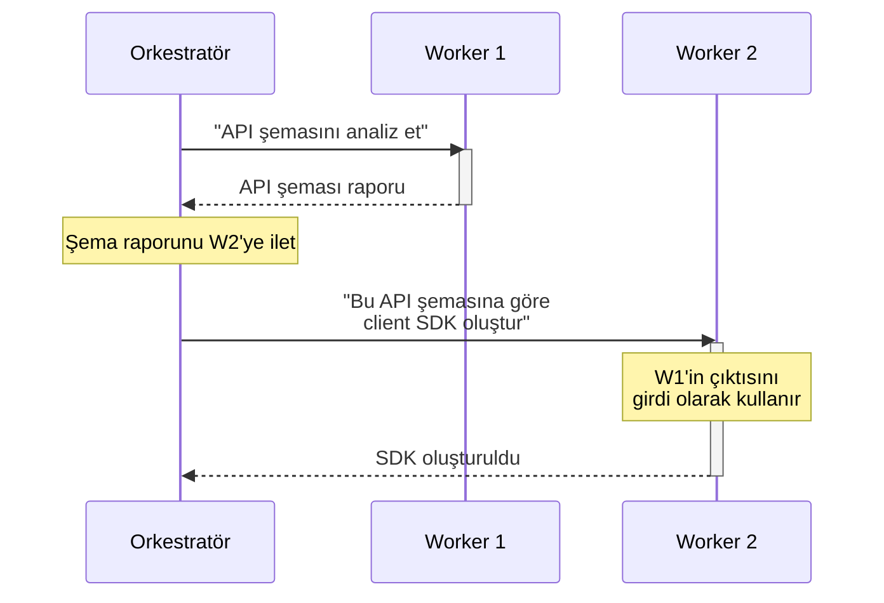

### Çakışma Yönetimi (Conflict Resolution)

Birden fazla worker aynı dosyayı değiştirmeye çalışırsa:

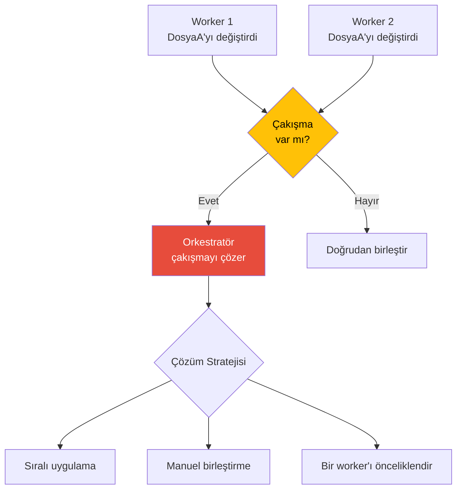

### Worktree ile İzolasyon

Her worker kendi git worktree'sinde çalışarak çakışma riskini minimize eder:

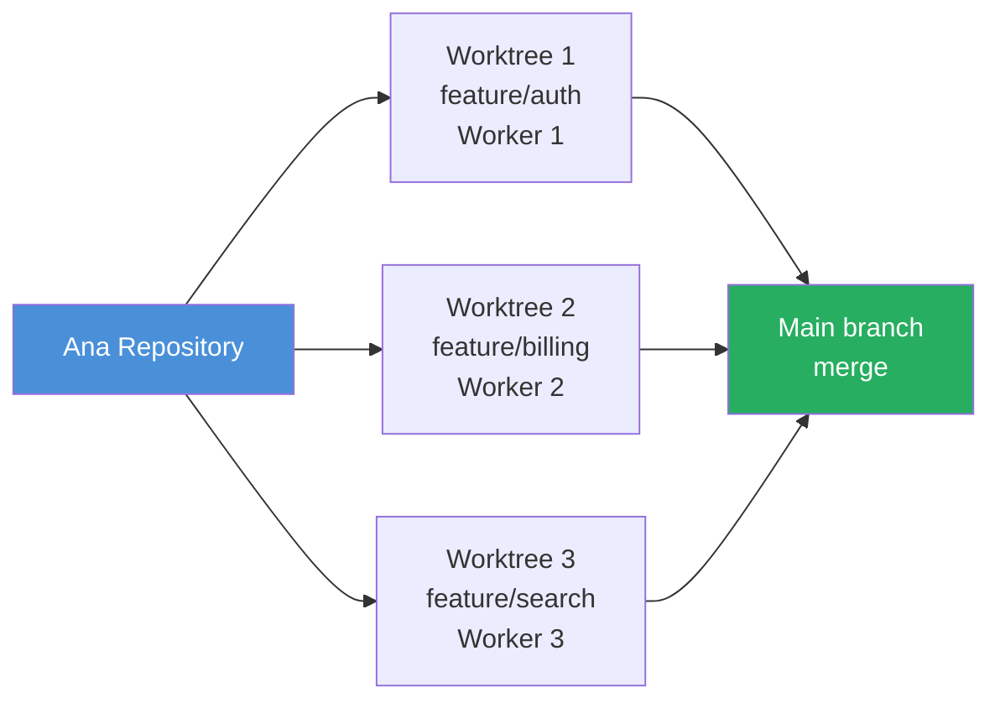

---

## Agent Takımı Oluşturma Adımları

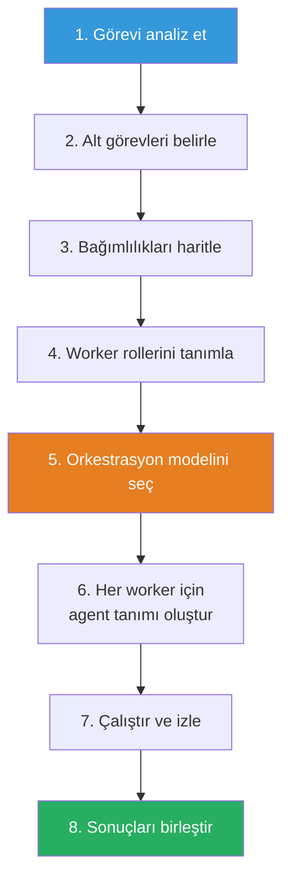

### Adım Adım Uygulama

**1. Görevi Analiz Et**
```bash
> Bu e-ticaret platformunu Next.js 15'e yükselt.
> 120 bileşen, 45 API route, 30 test dosyası var.
```

**2. Alt Görevleri Belirle**
- Paket bağımlılıklarını güncelle
- App Router'a geçiş yap
- Server Component'lara dönüştür
- API Route'ları güncelle
- Testleri güncelle

**3. Worker Rollerini Tanımla**

```
.claude/agents/
├── nextjs-upgrade-deps.md      # Bağımlılık güncelleme
├── nextjs-upgrade-router.md    # Router dönüşümü
├── nextjs-upgrade-components.md # Bileşen dönüşümü
├── nextjs-upgrade-api.md       # API Route güncelleme
└── nextjs-upgrade-tests.md     # Test güncelleme
```

---

## Pratik Örnekler

### Örnek 1: Kod Tabanı Sağlık Kontrolü

```bash
> Tüm projenin sağlık kontrolünü yap:
> güvenlik, performans, kod kalitesi ve test kapsamı

# Agent Takımı:
# Orkestratör: Projeyi modüllere ayırır
# Worker 1 (security-auditor): Güvenlik denetimi
# Worker 2 (perf-analyzer): Performans analizi
# Worker 3 (code-reviewer): Kod kalitesi incelemesi
# Worker 4 (test-coverage): Test kapsam analizi
# Sonuç: Birleşik sağlık raporu
```

### Örnek 2: Dil / Framework Migasyonu

```bash
> JavaScript projesini TypeScript'e dönüştür.
> 85 dosya, strict mode ile.

# Agent Takımı:
# Orkestratör: Dosyaları modüllere göre gruplar
# Worker 1: src/models/ dizinini dönüştür
# Worker 2: src/services/ dizinini dönüştür
# Worker 3: src/controllers/ dizinini dönüştür
# Worker 4: src/utils/ dizinini dönüştür
# Worker 5: tsconfig ve build pipeline güncelle
# Worker 6: Tüm testleri güncelle ve çalıştır
```

### Örnek 3: Çoklu Mikroservis Güncellemesi

```bash
> Tüm mikroservislerde logging kütüphanesini winston'dan pino'ya geçir.
> 8 mikroservis, her birinde farklı konfigürasyon.

# Agent Takımı:
# Orkestratör: Her mikroservis için bir worker atar
# Worker 1-8: Her biri bir mikroservisi dönüştürür
# Her worker: Bağımlılık güncelle → Konfigürasyon değiştir
#             → Import'ları güncelle → Test çalıştır
```

### Örnek 4: Monorepo'da Cross-Package Değişiklik

```bash
> Shared types paketindeki User interface'ine 'role' alanı ekle
> ve tüm bağımlı paketleri güncelle.

# Agent Takımı:
# Orkestratör: Bağımlılık grafiğini çıkarır
# Worker 1: @shared/types paketini günceller
# Worker 2: @app/frontend — UI bileşenlerini günceller
# Worker 3: @app/backend — API handler'larını günceller
# Worker 4: @app/admin — Admin panelini günceller
# Orkestratör: Tüm paketleri build eder ve test eder
```

---

## Takım Boyutu ve Sınırlar

| Parametre | Önerilen Değer | Açıklama |
|-----------|:--------------:|----------|
| Maksimum worker sayısı | 4-6 | Daha fazlası koordinasyon overhead'i artırır |
| Minimum görev büyüklüğü | 3+ dosya | Daha küçük görevler için subagent yeterli |
| Worktree kullanımı | Paralel yazma işlemlerinde | Çakışma riskini ortadan kaldırır |
| Orkestratör modeli | Güçlü model | Planlama ve koordinasyon kapasitesi kritik |
| Worker modeli | Göreve uygun | Basit görevler için hafif model yeterli |

---

## Özet

| Kavram | Açıklama |
|--------|----------|
| **Agent Team** | Birden fazla Claude Code örneğinin koordineli çalışması |
| **Orkestratör** | Görev planlama ve sonuç birleştirmeden sorumlu ana agent |
| **Worker** | Belirli bir alt göreve odaklanan çalışan agent |
| **Yıldız modeli** | Bağımsız görevler için — paralel worker'lar |
| **Pipeline modeli** | Sıralı bağımlılıklar için — zincir yapısı |
| **Hiyerarşik model** | Büyük projeler için — alt orkestratörler |
| **Worktree** | Her worker'ın kendi git branch'inde çalışması |

---

## Sonraki Adım

Agent takımlarının konseptini ve organizasyonunu öğrendik. Şimdi Agent aracının teknik detaylarına ve SDK ile programatik kullanımına bakalım:

→ [Agent Tool Kullanımı](./05-agent-tool-kullanimi.md)
