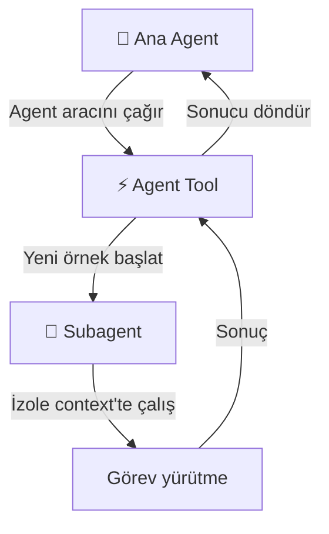
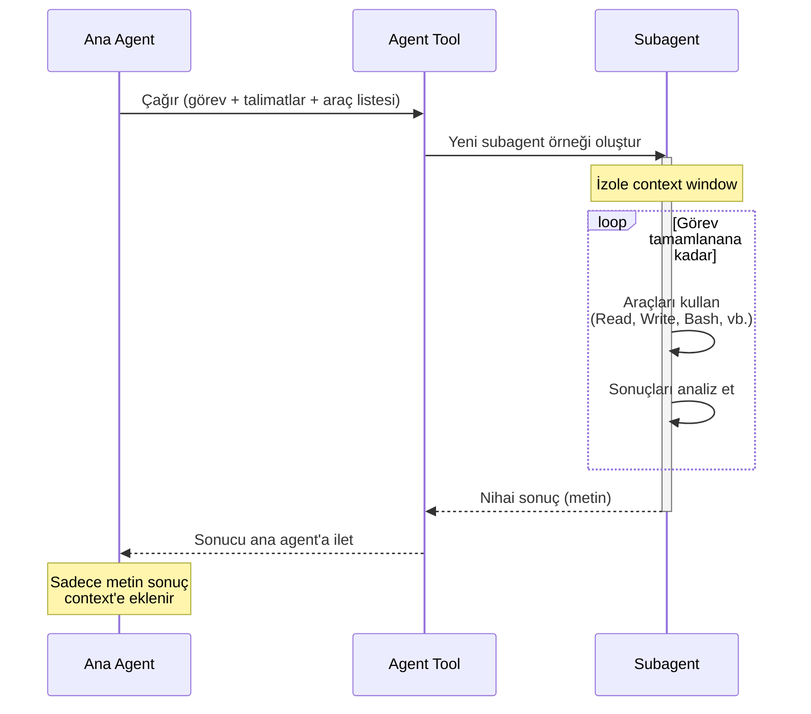
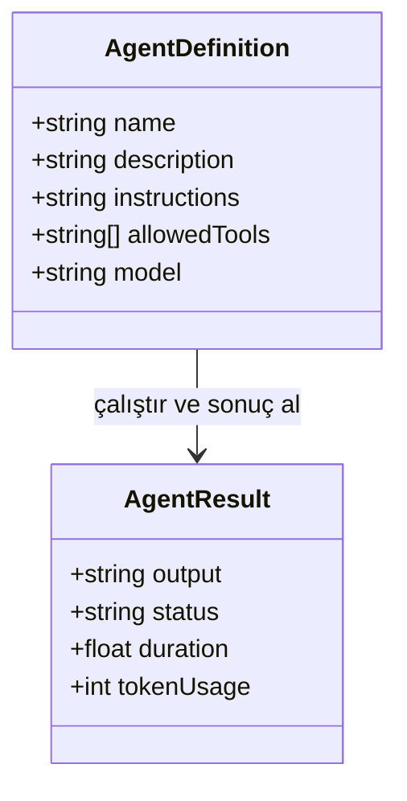
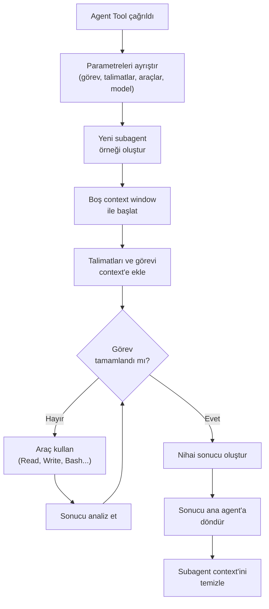
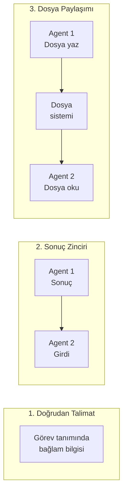
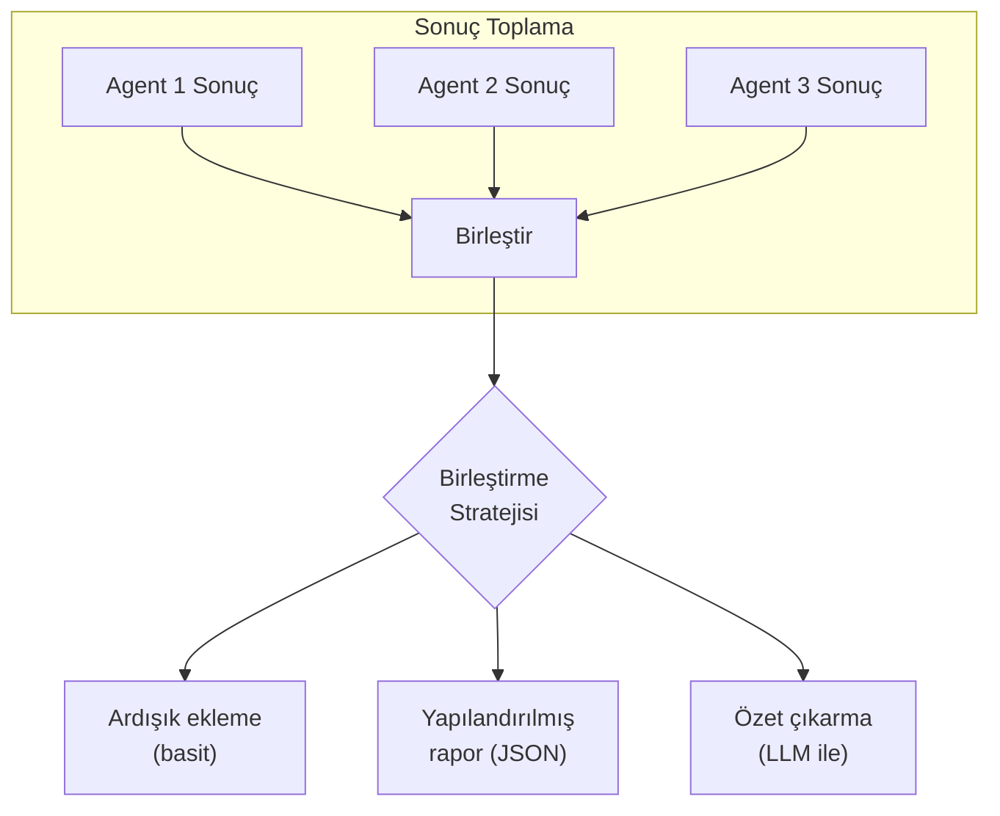
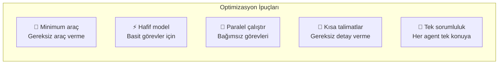

# Agent Tool Kullanımı

Agent aracı (Agent Tool), Claude Code'un subagent'lar oluşturmak için kullandığı temel mekanizmadır. Bu bölüm, Agent aracının çalışma detaylarını, SDK ile programatik kullanımı, bağlam aktarımını ve paralel görev dağıtımını kapsamlı şekilde ele alır.

## Ön Koşullar

| Konu | Bölüm |
|------|-------|
| Subagent nedir | [Subagent Nedir?](./01-subagent-nedir.md) |
| Dahili subagent'lar | [Dahili Subagent'lar](./02-dahili-subagentlar.md) |
| Özel subagent oluşturma | [Özel Subagent Oluşturma](./03-ozel-subagent-olusturma.md) |
| Claude SDK temelleri | [Claude API ve SDK](../05-claude-ekosistemi/03-claude-api-ve-sdk.md) |

---

## Agent Aracı Nedir?

Agent aracı, Claude Code'un araç setindeki özel bir araçtır. Çağrıldığında yeni bir Claude Code örneği (subagent) başlatır, ona görev ve talimatlar aktarır, çalışmasını bekler ve sonucu alır.



### Agent Aracının Özellikleri

| Özellik | Değer |
|---------|-------|
| İzin gerekli mi? | ❌ Hayır |
| Araç kategorisi | Çalıştırma (Execution) |
| Bloklanır mı? | Evet — sonuç dönene kadar bekler |
| İzolasyon | Tam — ayrı context window |
| Paralel çalışma | Birden fazla agent aracı eş zamanlı çağrılabilir |

---

## Agent Tool İş Akışı



---

## SDK ile Programatik Kullanım

Claude SDK, subagent'ları programatik olarak tanımlamak ve yönetmek için `AgentDefinition` sınıfını sunar.

### AgentDefinition Yapısı



| Alan | Tür | Zorunlu | Açıklama |
|------|-----|:-------:|----------|
| `name` | string | ✅ | Agent'ın benzersiz adı |
| `description` | string | ✅ | Ne yaptığını anlatan kısa açıklama |
| `instructions` | string | ✅ | Detaylı çalışma talimatları |
| `allowedTools` | string[] | ❌ | Kullanabileceği araçlar (boş = tümü) |
| `model` | string | ❌ | Kullanılacak model (boş = varsayılan) |

---

## Python SDK Örnekleri

### Temel Subagent Oluşturma

```python
import anthropic
from claude_code_sdk import AgentDefinition, run_agent

# Agent tanımı oluştur
code_reviewer = AgentDefinition(
    name="code-reviewer",
    description="Kod değişikliklerini inceleyen uzman ajan",
    instructions="""
    Verilen dosyaları şu kriterlere göre incele:
    1. SOLID prensipleri uyumu
    2. Güvenlik açıkları
    3. Performans sorunları
    4. Test edilebilirlik
    
    Bulguları önem sırasına göre raporla.
    """,
    allowedTools=["Read", "Glob", "Grep", "LSP"],
    model="claude-sonnet-4-20250514"
)

# Agent'ı çalıştır
result = await run_agent(
    agent=code_reviewer,
    task="src/services/ dizinindeki tüm servisleri incele"
)

print(result.output)
print(f"Süre: {result.duration:.1f}s")
print(f"Token kullanımı: {result.token_usage}")
```

### Paralel Subagent'lar

```python
import asyncio
from claude_code_sdk import AgentDefinition, run_agent

# Farklı uzmanlıklarda agent'lar tanımla
security_agent = AgentDefinition(
    name="security-checker",
    description="Güvenlik açıklarını tarayan ajan",
    instructions="OWASP Top 10 kriterlerine göre tara. Her bulgu için P0-P3 seviyesi belirt.",
    allowedTools=["Read", "Glob", "Grep"]
)

perf_agent = AgentDefinition(
    name="perf-analyzer",
    description="Performans sorunlarını analiz eden ajan",
    instructions="N+1 sorguları, gereksiz hesaplamalar ve bellek sızıntılarını bul.",
    allowedTools=["Read", "Glob", "Grep", "Bash"]
)

test_agent = AgentDefinition(
    name="test-writer",
    description="Eksik testleri yazan ajan",
    instructions="Kapsam analizi yap, eksik testleri yaz, çalıştır ve doğrula.",
    allowedTools=["Read", "Write", "Edit", "Glob", "Grep", "Bash"]
)

# Üç agent'ı paralel çalıştır
async def run_team(target_dir: str):
    tasks = [
        run_agent(agent=security_agent, task=f"{target_dir} dizinini tara"),
        run_agent(agent=perf_agent, task=f"{target_dir} dizinini analiz et"),
        run_agent(agent=test_agent, task=f"{target_dir} için eksik testleri yaz"),
    ]
    
    results = await asyncio.gather(*tasks)
    
    for agent_def, result in zip(
        [security_agent, perf_agent, test_agent], results
    ):
        print(f"\n{'='*50}")
        print(f"Agent: {agent_def.name}")
        print(f"Durum: {result.status}")
        print(f"Süre: {result.duration:.1f}s")
        print(f"{'='*50}")
        print(result.output)

asyncio.run(run_team("src/services"))
```

### Bağlam Aktarma (Context Passing)

```python
from claude_code_sdk import AgentDefinition, run_agent

# Adım 1: Analiz agent'ı
analyzer = AgentDefinition(
    name="analyzer",
    description="Proje yapısını analiz eden ajan",
    instructions="Proje yapısını, kullanılan teknolojileri ve mimariyi analiz et.",
    allowedTools=["Read", "Glob", "Grep"]
)

analysis_result = await run_agent(
    agent=analyzer,
    task="Projenin genel yapısını analiz et"
)

# Adım 2: Analiz sonucunu bağlam olarak ikinci agent'a aktar
implementer = AgentDefinition(
    name="implementer",
    description="Analiz sonucuna göre uygulama yapan ajan",
    instructions=f"""
    Proje analizi:
    {analysis_result.output}
    
    Yukarıdaki analiz sonucuna uygun şekilde 
    istenen değişiklikleri uygula.
    """,
    allowedTools=["Read", "Write", "Edit", "Bash"]
)

impl_result = await run_agent(
    agent=implementer,
    task="Logging middleware ekle"
)
```

---

## TypeScript SDK Örnekleri

### Temel Kullanım

```typescript
import { AgentDefinition, runAgent } from '@anthropic-ai/claude-code-sdk';

// Agent tanımı
const codeReviewer: AgentDefinition = {
  name: 'code-reviewer',
  description: 'Kod değişikliklerini inceleyen uzman ajan',
  instructions: `
    Verilen dosyaları şu kriterlere göre incele:
    1. SOLID prensipleri uyumu
    2. Güvenlik açıkları
    3. Performans sorunları
    
    Her bulguyu [SEVİYE] Dosya:Satır — Açıklama formatında raporla.
  `,
  allowedTools: ['Read', 'Glob', 'Grep', 'LSP'],
  model: 'claude-sonnet-4-20250514',
};

// Çalıştır
const result = await runAgent({
  agent: codeReviewer,
  task: 'src/controllers/ dizinindeki tüm controller dosyalarını incele',
});

console.log(`Sonuç: ${result.output}`);
console.log(`Süre: ${result.duration}ms`);
```

### Paralel Görev Dağıtımı

```typescript
import { AgentDefinition, runAgent } from '@anthropic-ai/claude-code-sdk';

const modules = ['auth', 'billing', 'notifications', 'search'];

const testWriter: AgentDefinition = {
  name: 'test-writer',
  description: 'Unit test yazan ajan',
  instructions: `
    Verilen modül için kapsamlı unit testler yaz.
    - Jest kullan
    - AAA pattern uygula  
    - Minimum %80 coverage hedefle
    - Testleri çalıştırıp geçtiğini doğrula
  `,
  allowedTools: ['Read', 'Write', 'Edit', 'Glob', 'Grep', 'Bash'],
};

// Her modül için paralel agent başlat
const results = await Promise.all(
  modules.map((mod) =>
    runAgent({
      agent: testWriter,
      task: `src/modules/${mod}/ dizini için unit testler yaz`,
    })
  )
);

// Sonuçları raporla
results.forEach((result, idx) => {
  console.log(`\n${modules[idx]} modülü:`);
  console.log(`  Durum: ${result.status}`);
  console.log(`  Süre: ${result.duration}ms`);
  console.log(`  Token: ${result.tokenUsage}`);
});
```

### Pipeline (Ardışık Düzen) Kullanımı

```typescript
import { AgentDefinition, runAgent } from '@anthropic-ai/claude-code-sdk';

// Pipeline: Analiz → Plan → Uygulama → Test
async function migrationPipeline(targetDir: string) {
  // Aşama 1: Analiz
  const analyzer: AgentDefinition = {
    name: 'migration-analyzer',
    description: 'Migrasyon analizi yapan ajan',
    instructions: 'Mevcut kodu analiz et, bağımlılık grafiğini çıkar.',
    allowedTools: ['Read', 'Glob', 'Grep'],
  };

  const analysis = await runAgent({
    agent: analyzer,
    task: `${targetDir} dizinini analiz et`,
  });

  // Aşama 2: Plan
  const planner: AgentDefinition = {
    name: 'migration-planner',
    description: 'Migrasyon planı oluşturan ajan',
    instructions: `
      Analiz sonucu: ${analysis.output}
      Bu analize göre adım adım migrasyon planı oluştur.
    `,
    allowedTools: ['Read', 'Glob', 'Grep', 'WebSearch'],
  };

  const plan = await runAgent({
    agent: planner,
    task: 'Migrasyon planı oluştur',
  });

  // Aşama 3: Uygulama
  const implementer: AgentDefinition = {
    name: 'migration-implementer',
    description: 'Migrasyon uygulayan ajan',
    instructions: `
      Migrasyon planı: ${plan.output}
      Bu planı adım adım uygula.
    `,
    allowedTools: ['Read', 'Write', 'Edit', 'Bash'],
  };

  const implementation = await runAgent({
    agent: implementer,
    task: 'Migrasyon planını uygula',
  });

  // Aşama 4: Test
  const tester: AgentDefinition = {
    name: 'migration-tester',
    description: 'Migrasyon sonrası test yapan ajan',
    instructions: 'Tüm testleri çalıştır, kırılanları düzelt.',
    allowedTools: ['Read', 'Edit', 'Bash'],
  };

  const testResult = await runAgent({
    agent: tester,
    task: 'Migrasyon sonrası testleri çalıştır ve doğrula',
  });

  return {
    analysis: analysis.output,
    plan: plan.output,
    implementation: implementation.output,
    tests: testResult.output,
  };
}
```

---

## Agent Tool İş Akışı Diyagramı



---

## Bağlam Aktarma Stratejileri

Subagent'lara bağlam aktarmanın farklı yolları:

### 1. Doğrudan Talimat ile

Görev tanımı içinde bağlam bilgisini doğrudan verin:

```python
result = await run_agent(
    agent=my_agent,
    task="""
    Proje: Next.js e-ticaret uygulaması
    Teknoloji: TypeScript, Prisma, PostgreSQL
    Görev: Ödeme modülünü incele ve güvenlik sorunlarını bul
    """
)
```

### 2. Önceki Sonuç ile Zincir

Bir agent'ın çıktısını sonraki agent'ın talimatlarına ekleyin:

```python
# Agent 1 sonucu → Agent 2 girdisi
analysis = await run_agent(agent=analyzer, task="Projeyi analiz et")

implementer.instructions += f"\n\nProje analizi:\n{analysis.output}"
result = await run_agent(agent=implementer, task="Analiz doğrultusunda değişiklik yap")
```

### 3. Dosya Tabanlı Paylaşım

Paylaşılan dosya sistemi üzerinden büyük veri aktarımı:

```python
# Agent 1: Sonuçları dosyaya yaz
writer_agent = AgentDefinition(
    name="report-writer",
    instructions="Analiz sonuçlarını .claude/temp/analysis.json dosyasına yaz",
    allowedTools=["Read", "Write", "Glob", "Grep"]
)

# Agent 2: Dosyadan oku
reader_agent = AgentDefinition(
    name="report-reader",
    instructions="Analiz sonuçlarını .claude/temp/analysis.json dosyasından oku ve uygula",
    allowedTools=["Read", "Write", "Edit", "Glob"]
)
```



---

## Paralel Görev Dağıtım Stratejileri

### Modül Bazlı Dağıtım

```python
import asyncio
from claude_code_sdk import AgentDefinition, run_agent

# Her modül için aynı agent tanımını kullan, farklı görevler ver
shared_agent = AgentDefinition(
    name="module-updater",
    description="Modül güncelleyen ajan",
    instructions="Verilen modüldeki tüm deprecated API çağrılarını güncelle.",
    allowedTools=["Read", "Write", "Edit", "Glob", "Grep"]
)

modules = [
    "src/modules/auth",
    "src/modules/billing",
    "src/modules/users",
    "src/modules/products",
]

# Paralel çalıştır
results = await asyncio.gather(*[
    run_agent(
        agent=shared_agent,
        task=f"{module} dizinindeki deprecated çağrıları güncelle"
    )
    for module in modules
])
```

### Rol Bazlı Dağıtım

```python
import asyncio
from claude_code_sdk import AgentDefinition, run_agent

target = "src/services/payment.ts"

# Farklı rollerdeki agent'lar aynı dosyayı farklı açılardan inceler
agents_and_tasks = [
    (
        AgentDefinition(
            name="security-review",
            description="Güvenlik incelemesi",
            instructions="PCI DSS uyumluluğunu kontrol et.",
            allowedTools=["Read", "Glob", "Grep"]
        ),
        f"{target} dosyasının güvenlik incelemesi"
    ),
    (
        AgentDefinition(
            name="perf-review",
            description="Performans incelemesi",
            instructions="DB sorgu sayısı ve yanıt süresini analiz et.",
            allowedTools=["Read", "Glob", "Grep"]
        ),
        f"{target} dosyasının performans incelemesi"
    ),
    (
        AgentDefinition(
            name="arch-review",
            description="Mimari inceleme",
            instructions="SOLID ve Clean Architecture uyumunu kontrol et.",
            allowedTools=["Read", "Glob", "Grep"]
        ),
        f"{target} dosyasının mimari incelemesi"
    ),
]

# Hepsini paralel çalıştır
results = await asyncio.gather(*[
    run_agent(agent=agent, task=task)
    for agent, task in agents_and_tasks
])

# Sonuçları birleştir
for (agent, _), result in zip(agents_and_tasks, results):
    print(f"\n--- {agent.name} ---")
    print(result.output)
```

---

## Sonuç Toplama ve Birleştirme



```python
# Yapılandırılmış sonuç birleştirme
import json

results = await asyncio.gather(*agent_tasks)

report = {
    "timestamp": "2026-03-15T10:30:00Z",
    "target": "src/services/",
    "findings": []
}

for agent_def, result in zip(agents, results):
    report["findings"].append({
        "agent": agent_def.name,
        "status": result.status,
        "duration_seconds": result.duration,
        "output": result.output,
    })

# Raporu kaydet
with open(".claude/temp/team-report.json", "w") as f:
    json.dump(report, f, indent=2, ensure_ascii=False)
```

---

## Pratik Örnekler

### Örnek 1: CI Hata Analizi Otomasyonu

```python
from claude_code_sdk import AgentDefinition, run_agent

ci_analyzer = AgentDefinition(
    name="ci-error-analyzer",
    description="CI pipeline hatalarını analiz eden ajan",
    instructions="""
    1. CI log dosyasını oku
    2. Hata mesajlarını ayrıştır
    3. Kök nedeni belirle
    4. Düzeltme önerisi sun
    5. Gerekirse otomatik düzelt
    """,
    allowedTools=["Read", "Glob", "Grep", "Bash", "Edit", "WebSearch"]
)

result = await run_agent(
    agent=ci_analyzer,
    task="Son CI çalışmasının log'unu analiz et: .github/ci-output.log"
)
```

### Örnek 2: Çoklu Dil Desteği (i18n) Taraması

```typescript
const i18nScanner: AgentDefinition = {
  name: 'i18n-scanner',
  description: 'Çevirilmemiş string\'leri bulan ajan',
  instructions: `
    1. Tüm UI bileşenlerini tara
    2. Hardcoded string'leri bul (i18n key kullanmayan)
    3. Her bulguyu dosya:satır formatında raporla
    4. Toplam eksik çeviri sayısını bildir
  `,
  allowedTools: ['Read', 'Glob', 'Grep'],
};

const result = await runAgent({
  agent: i18nScanner,
  task: 'src/components/ dizininde çevirilmemiş string\'leri bul',
});
```

### Örnek 3: Dependency Audit (Bağımlılık Denetimi)

```python
from claude_code_sdk import AgentDefinition, run_agent

dep_auditor = AgentDefinition(
    name="dependency-auditor",
    description="Proje bağımlılıklarını denetleyen ajan",
    instructions="""
    1. package.json veya requirements.txt dosyasını oku
    2. npm audit veya pip-audit çalıştır
    3. Güvenlik açığı olan paketleri listele
    4. Her biri için güncelleme önerisi sun
    5. Breaking change riski varsa uyar
    """,
    allowedTools=["Read", "Bash", "WebSearch"]
)

result = await run_agent(
    agent=dep_auditor,
    task="Projenin tüm bağımlılıklarını denetle"
)
```

### Örnek 4: Tam Orkestrasyon Senaryosu

```python
import asyncio
from claude_code_sdk import AgentDefinition, run_agent

async def full_code_review(pr_branch: str):
    """Bir PR için tam kapsamlı otomatik inceleme."""
    
    # Aşama 1: Değişiklikleri analiz et
    diff_analyzer = AgentDefinition(
        name="diff-analyzer",
        description="PR diff analizi",
        instructions="git diff ile değişen dosyaları ve satırları analiz et.",
        allowedTools=["Read", "Bash", "Glob"]
    )
    
    diff = await run_agent(
        agent=diff_analyzer,
        task=f"git diff main...{pr_branch} çıktısını analiz et"
    )
    
    # Aşama 2: Paralel incelemeler
    reviews = await asyncio.gather(
        run_agent(
            agent=AgentDefinition(
                name="security-review",
                description="Güvenlik incelemesi",
                instructions=f"Değişiklikler:\n{diff.output}\nGüvenlik açısından incele.",
                allowedTools=["Read", "Glob", "Grep"]
            ),
            task="Güvenlik incelemesi yap"
        ),
        run_agent(
            agent=AgentDefinition(
                name="test-coverage",
                description="Test kapsam kontrolü",
                instructions=f"Değişiklikler:\n{diff.output}\nTest kapsamını kontrol et.",
                allowedTools=["Read", "Glob", "Grep", "Bash"]
            ),
            task="Test kapsamını kontrol et"
        ),
        run_agent(
            agent=AgentDefinition(
                name="style-check",
                description="Stil kontrolü",
                instructions=f"Değişiklikler:\n{diff.output}\nKodlama standartlarını kontrol et.",
                allowedTools=["Read", "Glob", "Grep", "LSP"]
            ),
            task="Kodlama standartlarını kontrol et"
        ),
    )
    
    # Aşama 3: Sonuçları birleştir
    return {
        "pr_branch": pr_branch,
        "diff_summary": diff.output,
        "security": reviews[0].output,
        "test_coverage": reviews[1].output,
        "style": reviews[2].output,
    }
```

---

## Performans ve Maliyet Optimizasyonu



| Strateji | Etki | Açıklama |
|----------|------|----------|
| **Minimum araç** | 💰 Maliyet düşer | Agent'a sadece gerekli araçları verin |
| **Hafif model** | ⚡ Hız artar, 💰 maliyet düşer | Salt okunur görevler için hafif model |
| **Paralel çalıştırma** | ⚡ Süre kısalır | Bağımsız görevleri eş zamanlı çalıştırın |
| **Kısa talimatlar** | 💰 Token tasarrufu | Talimatları öz ve net tutun |
| **Sonuç formatı belirle** | 💰 Token tasarrufu | Gereksiz uzun çıktıları önleyin |

---

## Hata Yönetimi

```python
from claude_code_sdk import AgentDefinition, run_agent, AgentError

agent = AgentDefinition(
    name="risky-task",
    description="Hata riski olan görev",
    instructions="Verilen görevi yap.",
    allowedTools=["Read", "Write", "Bash"]
)

try:
    result = await run_agent(agent=agent, task="Migrasyon çalıştır")
    
    if result.status == "success":
        print(f"Başarılı: {result.output}")
    elif result.status == "partial":
        print(f"Kısmen tamamlandı: {result.output}")
        
except AgentError as e:
    print(f"Agent hatası: {e.message}")
    print(f"Son kullanılan araç: {e.last_tool}")
except TimeoutError:
    print("Agent zaman aşımına uğradı")
```

---

## Özet

| Kavram | Açıklama |
|--------|----------|
| **Agent Tool** | Claude Code'un subagent oluşturmak için kullandığı araç |
| **AgentDefinition** | SDK'da subagent tanımlamak için kullanılan sınıf |
| **allowedTools** | Subagent'ın erişebileceği araçları kısıtlama |
| **Paralel çalıştırma** | `asyncio.gather` / `Promise.all` ile eş zamanlı agent'lar |
| **Bağlam aktarma** | Talimat, sonuç zinciri veya dosya ile bilgi paylaşımı |
| **Pipeline** | Sıralı agent zincirleri (analiz → plan → uygulama → test) |

---

## Sonraki Adım

Subagent'lar ve agent takımları konusunu tamamladık. Şimdi Claude Code'un otomasyon yeteneklerini — hooks sistemini — inceleyelim:

→ [Hooks ve Otomasyon](../14-hooks-ve-otomasyon/README.md)
