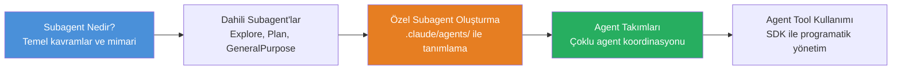
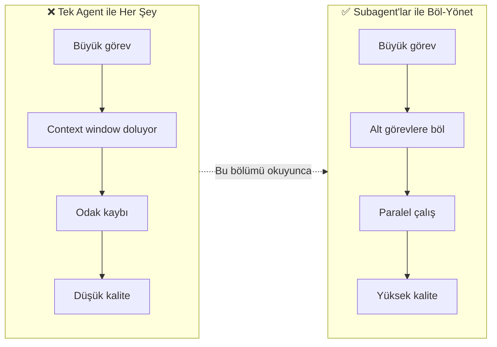

# Bölüm 13: Subagent'lar ve Agent Takımları

Claude Code, karmaşık görevleri daha küçük, odaklanmış parçalara bölerek **bağımsız agent örnekleri** (subagent) üzerinden yürütebilir. Bu bölüm, subagent kavramından özel agent oluşturmaya, agent takımlarından SDK ile programatik agent yönetimine kadar tüm mekanizmaları kapsar.

## Bu Bölümde Neler Öğreneceksiniz?

## İçerik

| # | Dosya | Konu | Süre |
|---|-------|------|------|
| 01 | [Subagent Nedir?](./01-subagent-nedir.md) | Subagent kavramı, izolasyon, paralelleştirme, tanımlama yöntemleri | ~12 dk |
| 02 | [Dahili Subagent'lar](./02-dahili-subagentlar.md) | Explore, Plan, GeneralPurpose agent'ları, seçim kriterleri | ~10 dk |
| 03 | [Özel Subagent Oluşturma](./03-ozel-subagent-olusturma.md) | .claude/agents/ dizini, markdown formatı, özel agent örnekleri | ~15 dk |
| 04 | [Agent Takımları](./04-agent-takimlari.md) | Çoklu agent orkestrasyonu, paylaşımlı görevler, kullanım senaryoları | ~12 dk |
| 05 | [Agent Tool Kullanımı](./05-agent-tool-kullanimi.md) | Agent aracı detayları, SDK örnekleri, paralel görev dağılımı | ~15 dk |

## Neden Subagent Kullanmalıyız?

## Ön Koşullar

| Konu | Bölüm |
|------|-------|
| Claude Code nedir ve nasıl çalışır | [Bölüm 06](../06-claude-code-tanitim/README.md) |
| Araçlar (özellikle Agent aracı) | [Bölüm 08](../08-araclar/README.md) |
| Bellek ve bağlam yönetimi | [Bölüm 09](../09-bellek-ve-baglam/README.md) |
| Skills ve pluginler | [Bölüm 12](../12-skills-ve-pluginler/README.md) |

## Sonraki Adım

Bu bölümü tamamladıktan sonra → [14 - Hooks ve Otomasyon](../14-hooks-ve-otomasyon/README.md)
