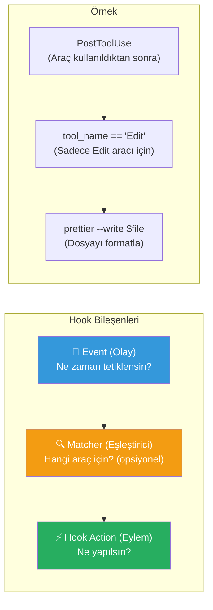
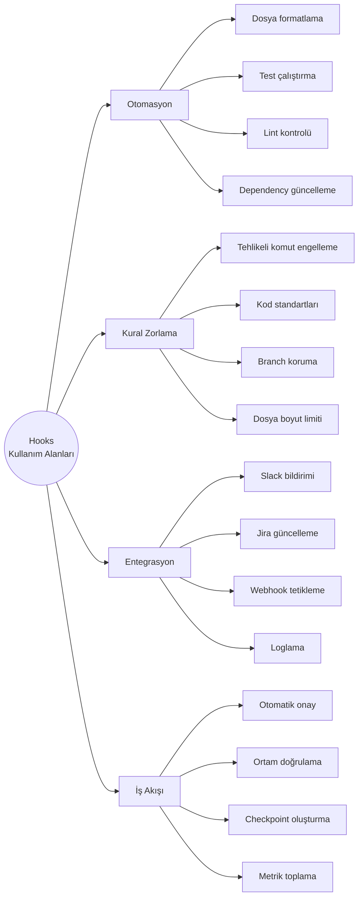
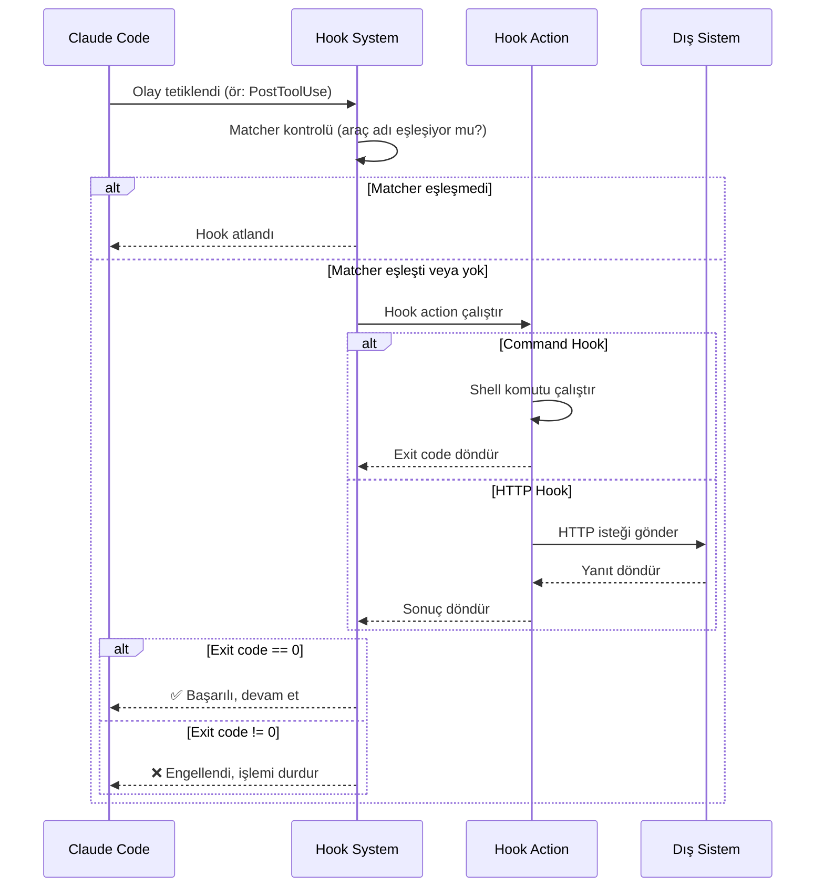
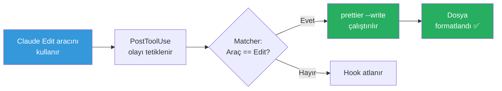
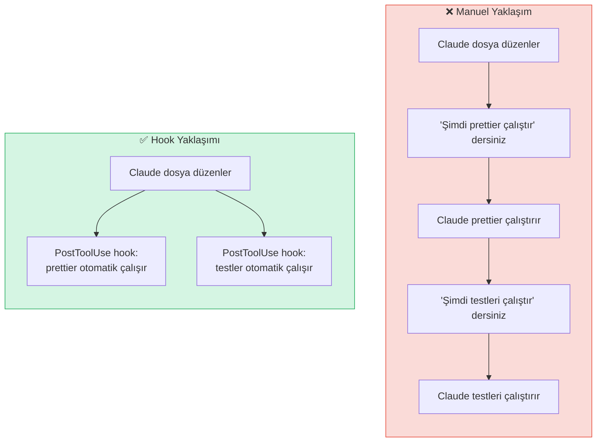

# Hooks Nedir?

**Hooks** (kancalar), Claude Code'un yaşam döngüsündeki belirli anlarda otomatik olarak tetiklenen, kullanıcı tanımlı eylemlerdir. Event-driven automation (olay tabanlı otomasyon) prensibiyle çalışarak tekrarlayan görevleri ortadan kaldırır, kuralları zorunlu kılar ve dış sistemlerle entegrasyon sağlar.

## Ön Koşullar

| Konu | Bölüm |
|------|-------|
| Claude Code araçları | [Araçlara Genel Bakış](../08-araclar/01-araclara-genel-bakis.md) |
| İzin sistemi | [İzin Sistemi](../10-izinler-ve-guvenlik/01-izin-sistemi.md) |
| JSON temel bilgisi | Harici kaynak |

---

## Hook Kavramı

Hook, "bir olay gerçekleştiğinde otomatik olarak bir şey yap" demektir. Claude Code'da hook'lar üç temel bileşenden oluşur:



### Üç Bileşen Detaylı

| Bileşen | Zorunlu mu? | Açıklama | Örnek |
|---------|-------------|----------|-------|
| **Event** (Olay) | ✅ Evet | Hook'un ne zaman tetikleneceğini belirler | `PreToolUse`, `SessionStart` |
| **Matcher** (Eşleştirici) | ❌ Hayır | Hangi araç veya koşul için geçerli olduğunu filtreler | `tool_name: "Bash"` |
| **Hook Action** (Eylem) | ✅ Evet | Tetiklendiğinde ne yapılacağını tanımlar | Shell komutu, HTTP çağrısı |

---

## Neden Hook Kullanmalı?

Hooks, Claude Code deneyiminizi dört ana alanda güçlendirir:



### Somut Faydalar

| Senaryo | Hook Olmadan | Hook İle |
|---------|-------------|----------|
| Dosya formatı | Her düzenlemeden sonra `prettier` çalıştır demeniz gerekir | Otomatik formatlanır |
| Tehlikeli komut | Claude `rm -rf /` çalıştırabilir | Hook engeller, uyarı verir |
| Bildirim | Oturum sonunu manuel takip edersiniz | Slack'e otomatik mesaj gider |
| Test | "Testleri çalıştır" demeniz gerekir | Her kod değişikliğinde otomatik çalışır |

---

## Hook Yaşam Döngüsü

Bir hook tetiklendiğinde şu adımlar sırayla gerçekleşir:



### Yaşam Döngüsü Adımları

1. **Olay Tetiklenir** — Claude Code belirli bir yaşam döngüsü noktasına ulaşır
2. **Matcher Kontrolü** — Tanımlı matcher varsa, koşulun sağlanıp sağlanmadığı kontrol edilir
3. **Hook Çalıştırılır** — Koşullar sağlanırsa, hook action yürütülür
4. **Sonuç Değerlendirilir** — Exit code'a göre işlem devam eder veya engellenir
5. **Çıktı İşlenir** — Hook'un stdout çıktısı Claude'un bağlamına eklenebilir

---

## Temel Hook Yapısı

Hook'lar `settings.json` dosyasında tanımlanır. İşte en basit yapı:

```json
{
  "hooks": {
    "PostToolUse": [
      {
        "matcher": "Edit",
        "hooks": [
          {
            "type": "command",
            "command": "prettier --write $CLAUDE_FILE_PATH"
          }
        ]
      }
    ]
  }
}
```

Bu örnekte:
- **Event:** `PostToolUse` — Bir araç kullanıldıktan sonra
- **Matcher:** `"Edit"` — Sadece Edit aracı için
- **Action:** `prettier --write` komutu — Düzenlenen dosyayı formatla

---

## Pratik Örnek 1: İlk Hook'unuz

Dosya düzenlemelerinden sonra otomatik formatlama yapan basit bir hook:

```json
{
  "hooks": {
    "PostToolUse": [
      {
        "matcher": "Edit",
        "hooks": [
          {
            "type": "command",
            "command": "npx prettier --write \"$CLAUDE_FILE_PATH\""
          }
        ]
      }
    ]
  }
}
```

Bu hook şu şekilde çalışır:



---

## Pratik Örnek 2: Tehlikeli Komut Engelleme

`rm -rf /` gibi tehlikeli komutları engelleyen bir güvenlik hook'u:

```json
{
  "hooks": {
    "PreToolUse": [
      {
        "matcher": "Bash",
        "hooks": [
          {
            "type": "command",
            "command": "echo \"$CLAUDE_TOOL_INPUT\" | python -c \"import sys,json; cmd=json.load(sys.stdin).get('command',''); sys.exit(1 if any(d in cmd for d in ['rm -rf /','rm -rf ~','mkfs.','dd if=']) else 0)\""
          }
        ]
      }
    ]
  }
}
```

Bu hook'ta exit code davranışı kritiktir:
- **Exit code 0:** Komut güvenli, devam et
- **Exit code 1:** Tehlikeli komut tespit edildi, engelle!

---

## Pratik Örnek 3: Oturum Başlangıç Doğrulaması

Oturum başladığında gerekli araçların kurulu olduğunu doğrulayan bir hook:

```json
{
  "hooks": {
    "SessionStart": [
      {
        "hooks": [
          {
            "type": "command",
            "command": "node --version && npm --version && git --version && echo 'Tüm araçlar mevcut' || echo 'UYARI: Bazı araçlar eksik!'"
          }
        ]
      }
    ]
  }
}
```

---

## Hook vs Manuel Yaklaşım Karşılaştırması



---

## Sık Yapılan Hatalar

| Hata | Doğrusu |
|------|---------|
| Matcher'ı büyük/küçük harf yanlış yazmak | Araç adları büyük harfle başlar: `"Edit"`, `"Bash"` |
| Exit code davranışını anlamamak | 0 = başarı/izin ver, non-zero = engelle |
| Hook'ta sonsuz döngü oluşturmak | Hook'un tetiklediği işlem yeni hook tetiklemesin |
| Asenkron hook'u senkron gibi beklemek | `async: true` ayarını kontrol edin |
| Tüm hook'ları tek bir event'e yığmak | İlgili event'lere dağıtın |

---

## Özet

| Kavram | Açıklama |
|--------|----------|
| **Hook** | Yaşam döngüsü olaylarında tetiklenen kullanıcı tanımlı eylem |
| **Event** | Hook'un ne zaman tetikleneceğini belirler |
| **Matcher** | Hangi araç/koşul için geçerli olduğunu filtreler |
| **Hook Action** | Tetiklendiğinde çalıştırılacak komut veya istek |
| **Exit Code** | 0 = başarı, non-zero = engelleme |
| **Konfigürasyon** | `settings.json` dosyasında `hooks` objesi altında |

---

## Sonraki Adım

Hook'ların hangi olaylarda tetiklenebileceğini ve her olayda hangi verilere erişilebildiğini detaylı inceleyelim:

→ [Hook Olayları](./02-hook-olaylari.md)
