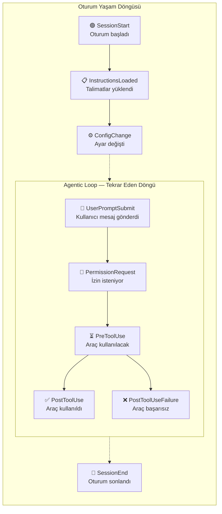
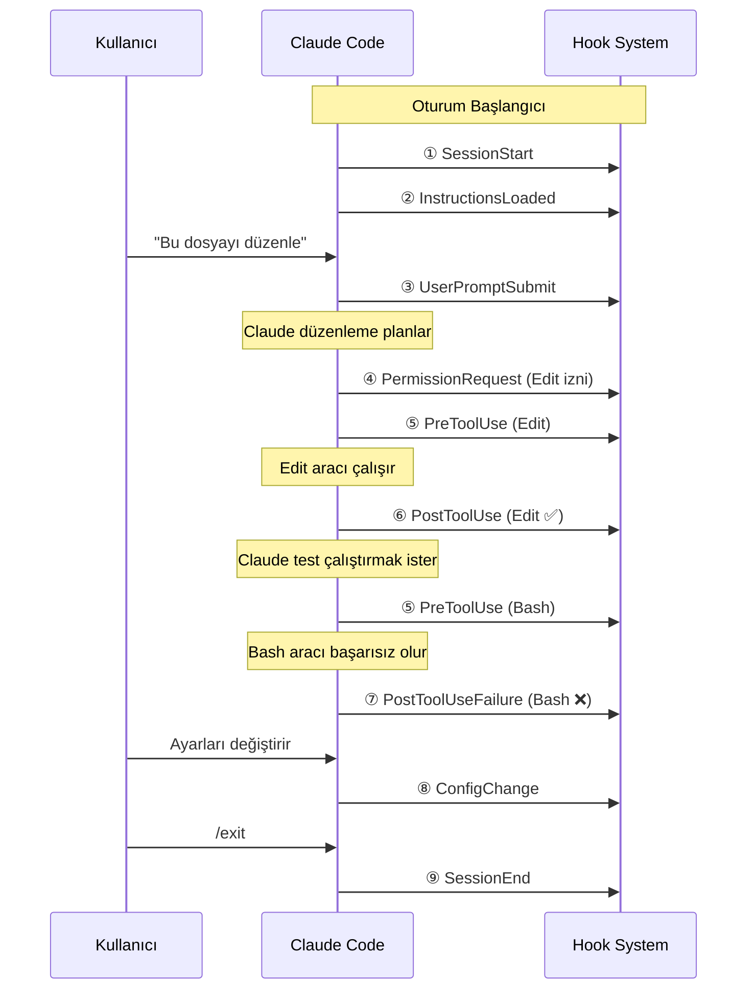
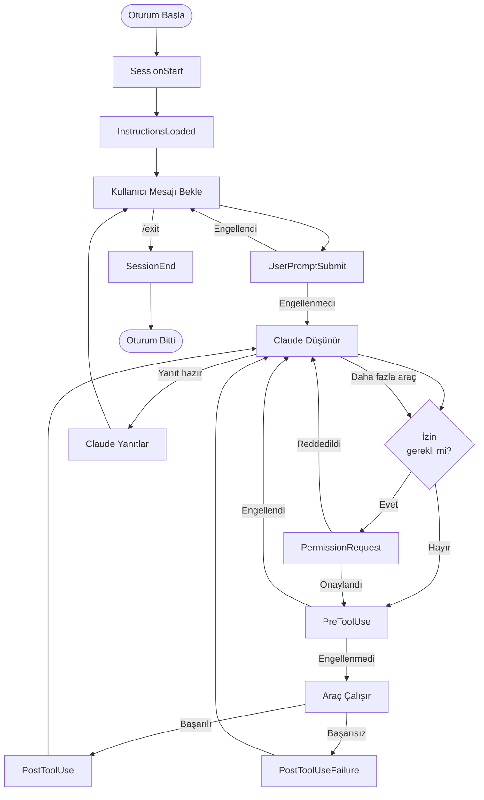

# Hook Olayları (Hook Events)

Claude Code, yaşam döngüsünün farklı noktalarında tetiklenen 9 farklı **hook event** (kanca olayı) sunar. Her olay, belirli bir anda belirli verilere erişim sağlar ve farklı müdahale imkânları tanır.

## Ön Koşullar

| Konu | Bölüm |
|------|-------|
| Hook kavramı ve bileşenleri | [Hooks Nedir?](./01-hooks-nedir.md) |
| Claude Code araçları | [Araçlara Genel Bakış](../08-araclar/01-araclara-genel-bakis.md) |

---

## Olay Genel Bakışı



---

## Olay Zaman Çizelgesi

Tipik bir Claude Code oturumunda olayların tetiklenme sırası:



---

## 1. SessionStart

Oturum başladığında, herhangi bir kullanıcı etkileşiminden önce tetiklenir.

| Özellik | Değer |
|---------|-------|
| **Ne zaman tetiklenir** | Claude Code oturumu başlatıldığında |
| **Tetiklenme sayısı** | Oturum başına 1 kez |
| **Engelleyebilir mi** | Hayır (bilgilendirme amaçlı) |

### Giriş Verisi (Input Data)

```json
{
  "session_id": "sess_abc123",
  "working_directory": "/home/user/project",
  "timestamp": "2026-03-15T10:00:00Z"
}
```

### Kullanım Alanları

- Ortam doğrulama (Node, Python sürüm kontrolü)
- Gerekli servislerin çalışıp çalışmadığını kontrol etme
- Loglama başlatma
- Metrik toplama başlatma

### Örnek Konfigürasyon

```json
{
  "hooks": {
    "SessionStart": [
      {
        "hooks": [
          {
            "type": "command",
            "command": "echo \"Oturum başladı: $(date)\" >> ~/.claude/session.log && node --version && npm --version"
          }
        ]
      }
    ]
  }
}
```

---

## 2. SessionEnd

Oturum sonlandığında tetiklenir.

| Özellik | Değer |
|---------|-------|
| **Ne zaman tetiklenir** | `/exit`, `Ctrl+C` veya oturum zaman aşımı |
| **Tetiklenme sayısı** | Oturum başına 1 kez |
| **Engelleyebilir mi** | Hayır |

### Giriş Verisi

```json
{
  "session_id": "sess_abc123",
  "working_directory": "/home/user/project",
  "duration_seconds": 1845,
  "timestamp": "2026-03-15T10:30:45Z"
}
```

### Kullanım Alanları

- Oturum özeti oluşturma
- Slack/Teams bildirimi gönderme
- Log dosyasını kapatma
- Geçici dosyaları temizleme

### Örnek Konfigürasyon

```json
{
  "hooks": {
    "SessionEnd": [
      {
        "hooks": [
          {
            "type": "command",
            "command": "echo \"Oturum sona erdi: $(date), Süre: ${CLAUDE_SESSION_DURATION}s\" >> ~/.claude/session.log"
          }
        ]
      }
    ]
  }
}
```

---

## 3. UserPromptSubmit

Kullanıcı bir prompt (istem) gönderdiğinde, Claude işlemeye başlamadan önce tetiklenir.

| Özellik | Değer |
|---------|-------|
| **Ne zaman tetiklenir** | Kullanıcı mesajı gönderdikten hemen sonra |
| **Tetiklenme sayısı** | Her mesajda |
| **Engelleyebilir mi** | Evet (exit code != 0 mesajı engeller) |

### Giriş Verisi

```json
{
  "session_id": "sess_abc123",
  "prompt": "Bu dosyadaki bug'ı düzelt",
  "timestamp": "2026-03-15T10:05:00Z"
}
```

### Kullanım Alanları

- Prompt filtreleme ve doğrulama
- Prompt loglama
- Proje kurallarını enjekte etme
- Prompt içeriğine göre özel davranış tetikleme

### Örnek Konfigürasyon

```json
{
  "hooks": {
    "UserPromptSubmit": [
      {
        "hooks": [
          {
            "type": "command",
            "command": "echo \"$(date) | $CLAUDE_PROMPT\" >> ~/.claude/prompt-history.log"
          }
        ]
      }
    ]
  }
}
```

---

## 4. PreToolUse

Bir araç (tool) çalıştırılmadan hemen önce tetiklenir. En güçlü engelleme noktasıdır.

| Özellik | Değer |
|---------|-------|
| **Ne zaman tetiklenir** | Araç çağrılmadan hemen önce |
| **Tetiklenme sayısı** | Her araç kullanımında |
| **Engelleyebilir mi** | ✅ Evet (exit code != 0 aracı engeller) |

### Giriş Verisi

```json
{
  "session_id": "sess_abc123",
  "tool_name": "Bash",
  "tool_input": {
    "command": "rm -rf node_modules && npm install"
  },
  "timestamp": "2026-03-15T10:06:00Z"
}
```

### Erişilebilir Ortam Değişkenleri

| Değişken | Açıklama |
|----------|----------|
| `CLAUDE_TOOL_NAME` | Kullanılacak aracın adı |
| `CLAUDE_TOOL_INPUT` | Araca gönderilen parametreler (JSON) |
| `CLAUDE_SESSION_ID` | Mevcut oturum kimliği |
| `CLAUDE_FILE_PATH` | İlgili dosya yolu (varsa) |

### Kullanım Alanları

- Tehlikeli komutları engelleme
- Dosya erişim kontrolü
- Komut denetimi ve loglama
- Belirli araçları belirli koşullarda kısıtlama

### Örnek: Belirli Dosyaları Koruma

```json
{
  "hooks": {
    "PreToolUse": [
      {
        "matcher": "Edit",
        "hooks": [
          {
            "type": "command",
            "command": "echo \"$CLAUDE_TOOL_INPUT\" | python -c \"import sys,json; i=json.load(sys.stdin); sys.exit(1 if '.env' in i.get('file_path','') or 'package-lock' in i.get('file_path','') else 0)\""
          }
        ]
      }
    ]
  }
}
```

---

## 5. PostToolUse

Bir araç başarıyla çalıştırıldıktan sonra tetiklenir.

| Özellik | Değer |
|---------|-------|
| **Ne zaman tetiklenir** | Araç başarıyla tamamlandıktan sonra |
| **Tetiklenme sayısı** | Her başarılı araç kullanımında |
| **Engelleyebilir mi** | Hayır (bilgilendirme amaçlı) |

### Giriş Verisi

```json
{
  "session_id": "sess_abc123",
  "tool_name": "Edit",
  "tool_input": {
    "file_path": "src/utils/helper.ts",
    "old_string": "const x = 1",
    "new_string": "const x = 2"
  },
  "tool_output": {
    "success": true
  },
  "timestamp": "2026-03-15T10:07:00Z"
}
```

### Kullanım Alanları

- Otomatik formatlama (prettier, black)
- Otomatik test çalıştırma
- Değişiklik loglama
- Lint kontrolü
- Dosya boyutu kontrolü

### Örnek: Değişiklik Logu

```json
{
  "hooks": {
    "PostToolUse": [
      {
        "matcher": "Edit",
        "hooks": [
          {
            "type": "command",
            "command": "echo \"$(date) | EDIT | $CLAUDE_FILE_PATH\" >> ~/.claude/changes.log"
          }
        ]
      },
      {
        "matcher": "Write",
        "hooks": [
          {
            "type": "command",
            "command": "echo \"$(date) | WRITE | $CLAUDE_FILE_PATH\" >> ~/.claude/changes.log"
          }
        ]
      }
    ]
  }
}
```

---

## 6. PostToolUseFailure

Bir araç başarısız olduğunda tetiklenir.

| Özellik | Değer |
|---------|-------|
| **Ne zaman tetiklenir** | Araç hata ile sonuçlandığında |
| **Tetiklenme sayısı** | Her başarısız araç kullanımında |
| **Engelleyebilir mi** | Hayır |

### Giriş Verisi

```json
{
  "session_id": "sess_abc123",
  "tool_name": "Bash",
  "tool_input": {
    "command": "npm test"
  },
  "error": "Process exited with code 1",
  "stderr": "FAIL src/utils/helper.test.ts\n  ● adds numbers correctly",
  "timestamp": "2026-03-15T10:08:00Z"
}
```

### Kullanım Alanları

- Hata loglama ve analizi
- Hata bildirim gönderme
- Otomatik hata kurtarma denemesi
- Hata istatistikleri toplama

### Örnek Konfigürasyon

```json
{
  "hooks": {
    "PostToolUseFailure": [
      {
        "matcher": "Bash",
        "hooks": [
          {
            "type": "command",
            "command": "echo \"HATA $(date) | $CLAUDE_TOOL_NAME | $(echo $CLAUDE_TOOL_INPUT | head -c 200)\" >> ~/.claude/errors.log"
          }
        ]
      }
    ]
  }
}
```

---

## 7. PermissionRequest

Claude Code bir araç için izin istediğinde tetiklenir.

| Özellik | Değer |
|---------|-------|
| **Ne zaman tetiklenir** | İzin gerektiren bir araç kullanılmak istendiğinde |
| **Tetiklenme sayısı** | Her izin istendiğinde |
| **Engelleyebilir mi** | Evet (otomatik onay veya red) |

### Giriş Verisi

```json
{
  "session_id": "sess_abc123",
  "tool_name": "Bash",
  "tool_input": {
    "command": "npm install lodash"
  },
  "permission_type": "tool_execution",
  "timestamp": "2026-03-15T10:09:00Z"
}
```

### Özel Çıkış Davranışı

| Exit Code | Davranış |
|-----------|----------|
| `0` | Otomatik **onayla** (kullanıcıya sorulmaz) |
| `1` | Otomatik **reddet** (kullanıcıya sorulmaz) |
| `2+` | Normal davranış (kullanıcıya sor) |

### Kullanım Alanları

- Güvenli işlemleri otomatik onaylama
- Tehlikeli işlemleri otomatik reddetme
- İzin kararlarını loglama
- Koşullu otomatik onay (çalışma saatleri, branch, vb.)

### Örnek: Read İşlemlerini Otomatik Onaylama

```json
{
  "hooks": {
    "PermissionRequest": [
      {
        "matcher": "Read",
        "hooks": [
          {
            "type": "command",
            "command": "exit 0"
          }
        ]
      },
      {
        "matcher": "Bash",
        "hooks": [
          {
            "type": "command",
            "command": "echo \"$CLAUDE_TOOL_INPUT\" | python -c \"import sys,json; cmd=json.load(sys.stdin).get('command',''); sys.exit(0 if cmd.startswith(('ls','cat','echo','pwd','git status','git log','git diff')) else 2)\""
          }
        ]
      }
    ]
  }
}
```

---

## 8. InstructionsLoaded

CLAUDE.md ve diğer talimat dosyaları yüklendiğinde tetiklenir.

| Özellik | Değer |
|---------|-------|
| **Ne zaman tetiklenir** | Talimat dosyaları parse edildikten sonra |
| **Tetiklenme sayısı** | Oturum başına 1+ kez |
| **Engelleyebilir mi** | Hayır |

### Giriş Verisi

```json
{
  "session_id": "sess_abc123",
  "instructions_sources": [
    "~/.claude/CLAUDE.md",
    "./CLAUDE.md",
    "./.claude/rules/typescript.md"
  ],
  "total_instructions_length": 2450,
  "timestamp": "2026-03-15T10:00:01Z"
}
```

### Kullanım Alanları

- Talimat yükleme kontrolü
- Talimat boyutu izleme
- Ek kurallar enjekte etme
- Talimat kaynağı loglama

### Örnek Konfigürasyon

```json
{
  "hooks": {
    "InstructionsLoaded": [
      {
        "hooks": [
          {
            "type": "command",
            "command": "echo \"Talimatlar yüklendi: $CLAUDE_INSTRUCTIONS_LENGTH karakter\" >> ~/.claude/session.log"
          }
        ]
      }
    ]
  }
}
```

---

## 9. ConfigChange

Konfigürasyon ayarları değiştiğinde tetiklenir.

| Özellik | Değer |
|---------|-------|
| **Ne zaman tetiklenir** | settings.json veya diğer config dosyaları değiştiğinde |
| **Tetiklenme sayısı** | Her değişiklikte |
| **Engelleyebilir mi** | Hayır |

### Giriş Verisi

```json
{
  "session_id": "sess_abc123",
  "changed_key": "hooks.PostToolUse",
  "config_source": "project",
  "timestamp": "2026-03-15T10:15:00Z"
}
```

### Kullanım Alanları

- Config değişikliklerini loglama
- Değişiklik bildirimi gönderme
- Config doğrulama

### Örnek Konfigürasyon

```json
{
  "hooks": {
    "ConfigChange": [
      {
        "hooks": [
          {
            "type": "command",
            "command": "echo \"Config değişti: $(date) | $CLAUDE_CHANGED_KEY\" >> ~/.claude/config-changes.log"
          }
        ]
      }
    ]
  }
}
```

---

## Olay Karşılaştırma Tablosu

| Olay | Tetiklenme Zamanı | Engelleyebilir | Matcher Destekler | Tipik Kullanım |
|------|-------------------|----------------|-------------------|----------------|
| **SessionStart** | Oturum başı | ❌ | ❌ | Ortam doğrulama |
| **SessionEnd** | Oturum sonu | ❌ | ❌ | Bildirim, temizlik |
| **UserPromptSubmit** | Mesaj gönderiminde | ✅ | ❌ | Prompt filtreleme |
| **PreToolUse** | Araç çalışmadan önce | ✅ | ✅ | Güvenlik, engelleme |
| **PostToolUse** | Araç başarılı olduktan sonra | ❌ | ✅ | Formatlama, test |
| **PostToolUseFailure** | Araç başarısız olduktan sonra | ❌ | ✅ | Hata loglama |
| **PermissionRequest** | İzin istendiğinde | ✅ | ✅ | Otomatik onay/red |
| **InstructionsLoaded** | Talimatlar yüklendiğinde | ❌ | ❌ | İzleme |
| **ConfigChange** | Ayar değiştiğinde | ❌ | ❌ | Loglama |

---

## Olaylar Arası İlişki Diyagramı



---

## Pratik Örnek: Tüm Olayları Loglayan Hook Seti

Tüm olayları tek bir log dosyasına kaydeden kapsamlı konfigürasyon:

```json
{
  "hooks": {
    "SessionStart": [
      {
        "hooks": [
          {
            "type": "command",
            "command": "echo '=== OTURUM BAŞLADI ===' >> ~/.claude/full.log && echo \"Zaman: $(date)\" >> ~/.claude/full.log && echo \"Dizin: $(pwd)\" >> ~/.claude/full.log"
          }
        ]
      }
    ],
    "UserPromptSubmit": [
      {
        "hooks": [
          {
            "type": "command",
            "command": "echo \"[PROMPT] $(date) | $CLAUDE_PROMPT\" >> ~/.claude/full.log"
          }
        ]
      }
    ],
    "PreToolUse": [
      {
        "hooks": [
          {
            "type": "command",
            "command": "echo \"[PRE] $(date) | $CLAUDE_TOOL_NAME\" >> ~/.claude/full.log"
          }
        ]
      }
    ],
    "PostToolUse": [
      {
        "hooks": [
          {
            "type": "command",
            "command": "echo \"[POST-OK] $(date) | $CLAUDE_TOOL_NAME\" >> ~/.claude/full.log"
          }
        ]
      }
    ],
    "PostToolUseFailure": [
      {
        "hooks": [
          {
            "type": "command",
            "command": "echo \"[POST-FAIL] $(date) | $CLAUDE_TOOL_NAME\" >> ~/.claude/full.log"
          }
        ]
      }
    ],
    "SessionEnd": [
      {
        "hooks": [
          {
            "type": "command",
            "command": "echo '=== OTURUM SONLANDI ===' >> ~/.claude/full.log && echo \"Zaman: $(date)\" >> ~/.claude/full.log && echo '' >> ~/.claude/full.log"
          }
        ]
      }
    ]
  }
}
```

---

## Özet

| Kavram | Açıklama |
|--------|----------|
| **9 Hook Event** | SessionStart'tan ConfigChange'e kadar tüm yaşam döngüsü |
| **Engelleyici olaylar** | PreToolUse, UserPromptSubmit, PermissionRequest |
| **Matcher destekli** | PreToolUse, PostToolUse, PostToolUseFailure, PermissionRequest |
| **Ortam değişkenleri** | `CLAUDE_TOOL_NAME`, `CLAUDE_TOOL_INPUT`, `CLAUDE_FILE_PATH` vb. |
| **Exit code** | 0 = başarı/izin, non-zero = engelleme (PermissionRequest'te farklı) |

---

## Sonraki Adım

Olayları öğrendiğimize göre, şimdi hook'ların hangi tiplerde tanımlanabileceğini inceleyelim:

→ [Hook Tipleri](./03-hook-tipleri.md)
