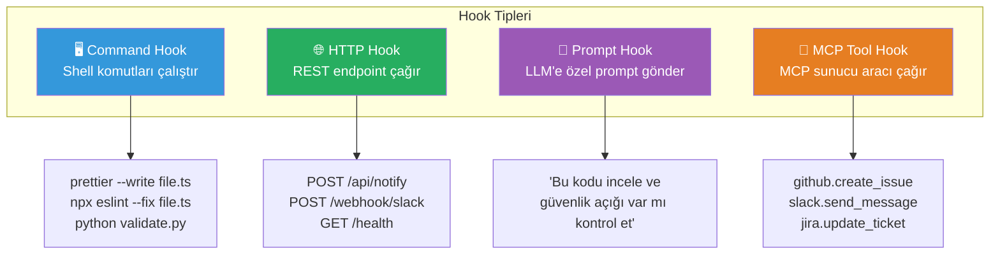
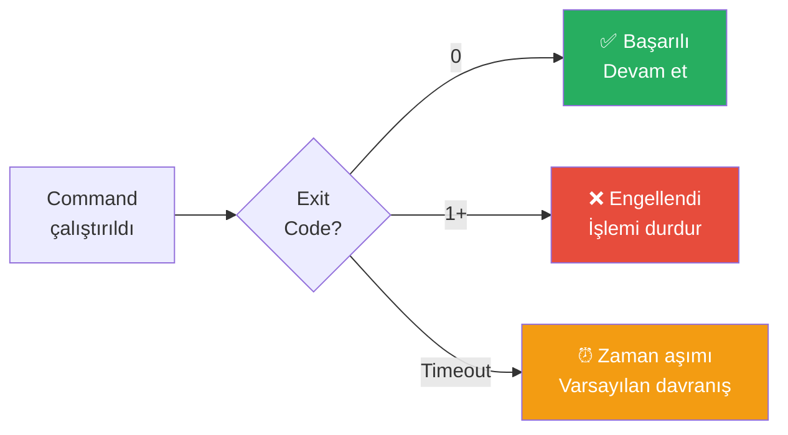
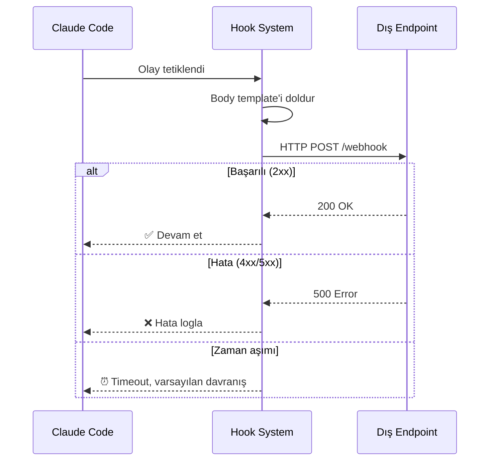
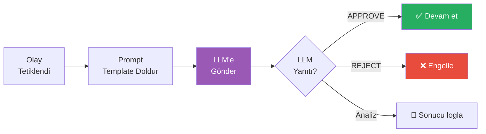
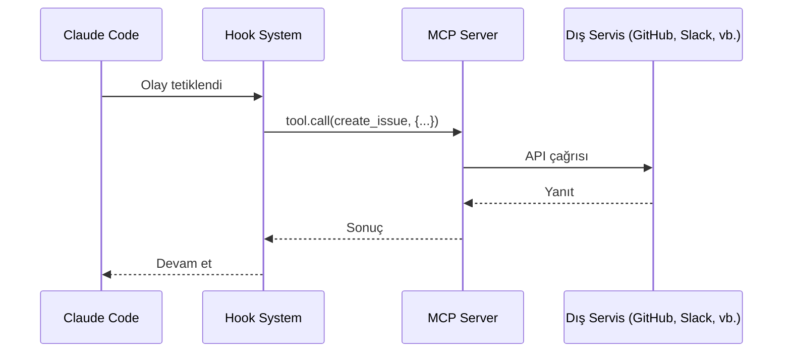
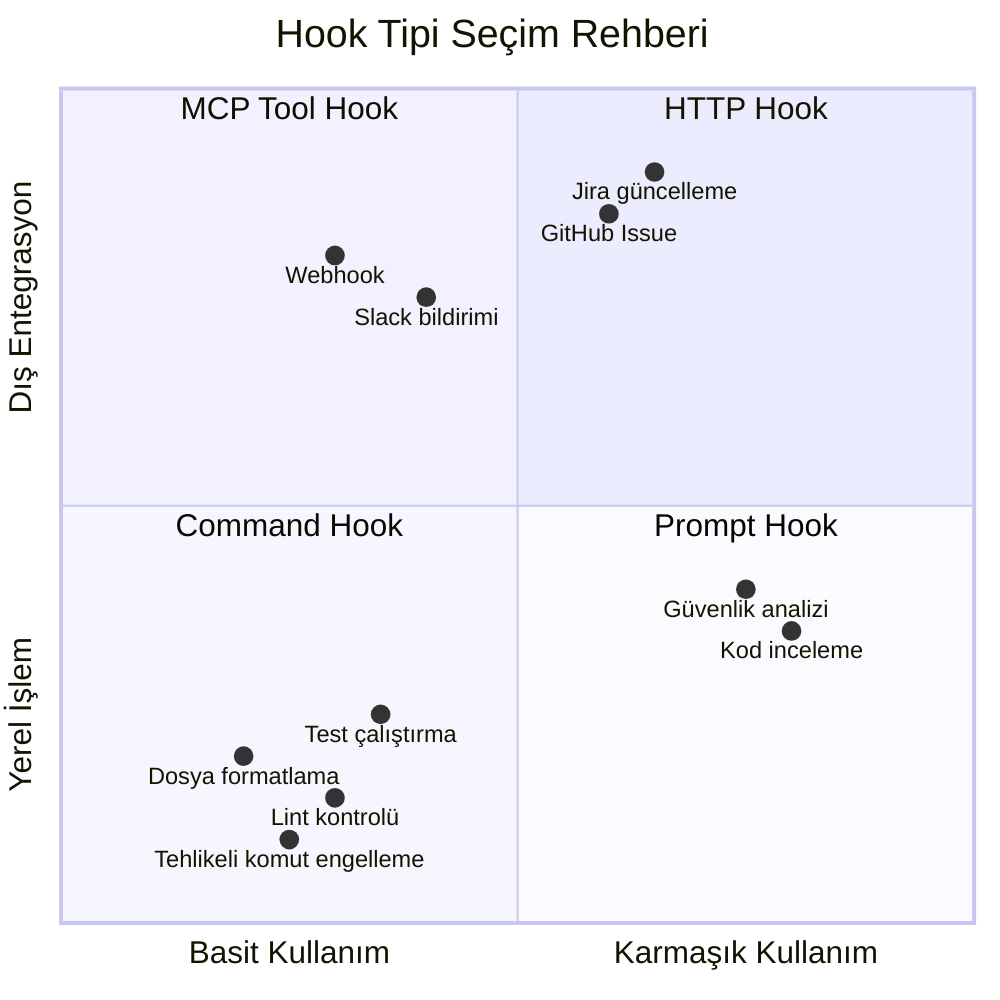
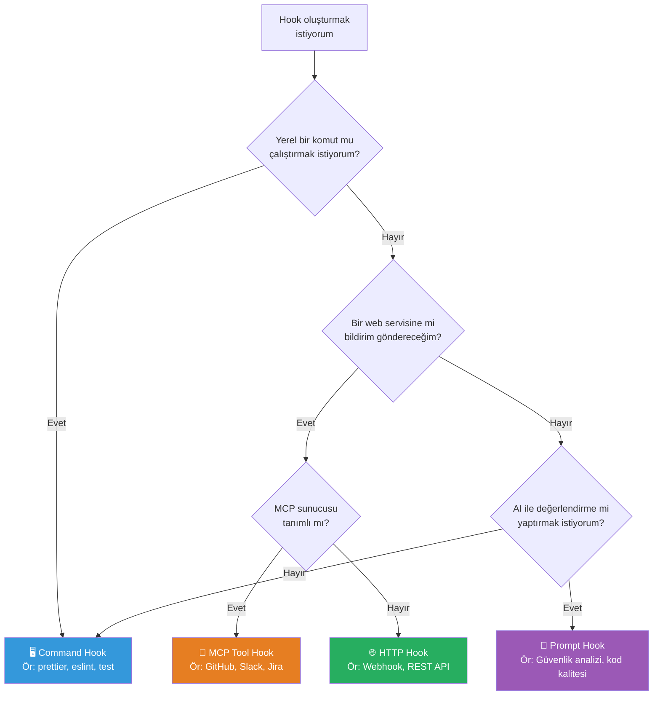

# Hook Tipleri

Claude Code hook'ları dört farklı **hook type** (kanca tipi) olarak tanımlanabilir. Her tip, farklı bir çalıştırma mekanizması sunar: shell komutları, HTTP istekleri, LLM prompt'ları veya MCP araç çağrıları.

## Ön Koşullar

| Konu | Bölüm |
|------|-------|
| Hook kavramı ve bileşenleri | [Hooks Nedir?](./01-hooks-nedir.md) |
| Hook olayları | [Hook Olayları](./02-hook-olaylari.md) |
| MCP (Model Context Protocol) | [Bölüm 11](../11-mcp/README.md) |

---

## Hook Tiplerine Genel Bakış



---

## 1. Command Hook (Komut Kancası)

En yaygın ve güçlü hook tipidir. Bir shell komutu çalıştırır ve exit code'a göre akışı kontrol eder.

### Yapısı

```json
{
  "type": "command",
  "command": "prettier --write \"$CLAUDE_FILE_PATH\"",
  "timeout_ms": 30000
}
```

### Konfigürasyon Alanları

| Alan | Zorunlu | Tür | Açıklama |
|------|---------|-----|----------|
| `type` | ✅ | `"command"` | Hook tipini belirtir |
| `command` | ✅ | string | Çalıştırılacak shell komutu |
| `timeout_ms` | ❌ | number | Zaman aşımı (ms), varsayılan: 30000 |

### Ortam Değişkenleri

Command hook'lar aşağıdaki ortam değişkenlerine otomatik erişir:

| Değişken | Açıklama | Örnek |
|----------|----------|-------|
| `CLAUDE_SESSION_ID` | Oturum kimliği | `sess_abc123` |
| `CLAUDE_TOOL_NAME` | Kullanılan araç adı | `Edit` |
| `CLAUDE_TOOL_INPUT` | Araç giriş verisi (JSON) | `{"file_path":"..."}` |
| `CLAUDE_FILE_PATH` | İlgili dosya yolu | `src/app.ts` |
| `CLAUDE_PROMPT` | Kullanıcı prompt'u | `Bug'ı düzelt` |
| `CLAUDE_WORKING_DIR` | Çalışma dizini | `/home/user/project` |

### Exit Code Davranışı



### Pratik Örnek: Python Dosyalarını Formatlama

```json
{
  "hooks": {
    "PostToolUse": [
      {
        "matcher": "Edit",
        "hooks": [
          {
            "type": "command",
            "command": "if [[ \"$CLAUDE_FILE_PATH\" == *.py ]]; then black \"$CLAUDE_FILE_PATH\" 2>/dev/null; fi"
          }
        ]
      }
    ]
  }
}
```

### Pratik Örnek: Commit Mesajı Doğrulama

```json
{
  "hooks": {
    "PreToolUse": [
      {
        "matcher": "Bash",
        "hooks": [
          {
            "type": "command",
            "command": "echo \"$CLAUDE_TOOL_INPUT\" | python3 -c \"\nimport sys, json\ncmd = json.load(sys.stdin).get('command', '')\nif 'git commit' in cmd and '-m' in cmd:\n    msg = cmd.split('-m')[1].strip().strip('\\\"\\'')\n    import re\n    if not re.match(r'^(feat|fix|docs|style|refactor|test|chore)(\\(.+\\))?: .+', msg):\n        print('HATA: Commit mesajı Conventional Commits formatında olmalı')\n        sys.exit(1)\n\""
          }
        ]
      }
    ]
  }
}
```

---

## 2. HTTP Hook (HTTP Kancası)

Bir REST endpoint'ine HTTP isteği gönderir. Dış servislerle entegrasyon için idealdir.

### Yapısı

```json
{
  "type": "http",
  "url": "https://hooks.slack.com/services/T00/B00/xxxx",
  "method": "POST",
  "headers": {
    "Content-Type": "application/json"
  },
  "body": "{\"text\": \"Claude Code oturumu sona erdi\"}",
  "timeout_ms": 10000
}
```

### Konfigürasyon Alanları

| Alan | Zorunlu | Tür | Açıklama |
|------|---------|-----|----------|
| `type` | ✅ | `"http"` | Hook tipini belirtir |
| `url` | ✅ | string | Hedef URL |
| `method` | ❌ | string | HTTP metodu, varsayılan: `POST` |
| `headers` | ❌ | object | HTTP başlıkları |
| `body` | ❌ | string | İstek gövdesi (template destekler) |
| `timeout_ms` | ❌ | number | Zaman aşımı (ms), varsayılan: 10000 |

### İstek Akışı



### Body Template Değişkenleri

HTTP hook body alanında aşağıdaki template değişkenleri kullanılabilir:

```json
{
  "type": "http",
  "url": "https://api.example.com/webhook",
  "method": "POST",
  "headers": {
    "Content-Type": "application/json",
    "Authorization": "Bearer ${WEBHOOK_TOKEN}"
  },
  "body": "{\"session_id\": \"{{session_id}}\", \"tool\": \"{{tool_name}}\", \"file\": \"{{file_path}}\", \"timestamp\": \"{{timestamp}}\"}"
}
```

### Pratik Örnek: Slack Bildirimi

```json
{
  "hooks": {
    "SessionEnd": [
      {
        "hooks": [
          {
            "type": "http",
            "url": "https://hooks.slack.com/services/T00000/B00000/xxxxxxxx",
            "method": "POST",
            "headers": {
              "Content-Type": "application/json"
            },
            "body": "{\"text\": \"🤖 Claude Code oturumu sona erdi.\\nProje: {{working_directory}}\\nSüre: {{duration_seconds}} saniye\"}"
          }
        ]
      }
    ]
  }
}
```

### Pratik Örnek: Webhook ile Değişiklik Bildirimi

```json
{
  "hooks": {
    "PostToolUse": [
      {
        "matcher": "Edit",
        "hooks": [
          {
            "type": "http",
            "url": "https://api.internal.com/code-changes",
            "method": "POST",
            "headers": {
              "Content-Type": "application/json",
              "X-API-Key": "${CODE_TRACKER_API_KEY}"
            },
            "body": "{\"file\": \"{{file_path}}\", \"tool\": \"Edit\", \"session\": \"{{session_id}}\"}"
          }
        ]
      }
    ]
  }
}
```

---

## 3. Prompt Hook (Prompt Kancası)

LLM'e (Large Language Model — büyük dil modeli) özel bir prompt göndererek değerlendirme yaptırır. AI destekli doğrulama ve analiz için kullanılır.

### Yapısı

```json
{
  "type": "prompt",
  "prompt": "Aşağıdaki kodu güvenlik açısından incele. SQL injection, XSS veya dosya erişim açığı var mı kontrol et:\n\n{{tool_input}}",
  "model": "claude-sonnet-4-20250514"
}
```

### Konfigürasyon Alanları

| Alan | Zorunlu | Tür | Açıklama |
|------|---------|-----|----------|
| `type` | ✅ | `"prompt"` | Hook tipini belirtir |
| `prompt` | ✅ | string | LLM'e gönderilecek prompt |
| `model` | ❌ | string | Kullanılacak model (varsayılan: aktif model) |

### Çalışma Akışı



### Pratik Örnek: Güvenlik İncelemesi

```json
{
  "hooks": {
    "PreToolUse": [
      {
        "matcher": "Bash",
        "hooks": [
          {
            "type": "prompt",
            "prompt": "Aşağıdaki bash komutunu güvenlik açısından değerlendir. Tehlikeli mi, güvenli mi?\n\nKomut: {{tool_input}}\n\nSadece 'SAFE' veya 'DANGEROUS' yaz. DANGEROUS ise nedenini açıkla."
          }
        ]
      }
    ]
  }
}
```

### Pratik Örnek: Kod Kalitesi Kontrolü

```json
{
  "hooks": {
    "PostToolUse": [
      {
        "matcher": "Write",
        "hooks": [
          {
            "type": "prompt",
            "prompt": "Yazılan dosyayı incele. SOLID prensiplerine uygun mu? Anti-pattern var mı? Kısa bir değerlendirme yap:\n\nDosya: {{file_path}}\nİçerik: {{tool_input}}"
          }
        ]
      }
    ]
  }
}
```

---

## 4. MCP Tool Hook (MCP Araç Kancası)

Yapılandırılmış bir MCP (Model Context Protocol) sunucusunun araçlarını çağırır. MCP ekosistemiyle doğrudan entegrasyon sağlar.

### Yapısı

```json
{
  "type": "mcp_tool",
  "server": "github",
  "tool": "create_issue",
  "input": {
    "owner": "my-org",
    "repo": "my-repo",
    "title": "Otomatik: Hata tespit edildi — {{tool_name}}",
    "body": "Araç hatası: {{error}}"
  }
}
```

### Konfigürasyon Alanları

| Alan | Zorunlu | Tür | Açıklama |
|------|---------|-----|----------|
| `type` | ✅ | `"mcp_tool"` | Hook tipini belirtir |
| `server` | ✅ | string | MCP sunucu adı (settings'te tanımlı) |
| `tool` | ✅ | string | Çağrılacak araç adı |
| `input` | ✅ | object | Araca gönderilecek parametreler |

### MCP Entegrasyon Akışı



### Pratik Örnek: GitHub Issue Oluşturma

```json
{
  "hooks": {
    "PostToolUseFailure": [
      {
        "matcher": "Bash",
        "hooks": [
          {
            "type": "mcp_tool",
            "server": "github",
            "tool": "create_issue",
            "input": {
              "owner": "my-org",
              "repo": "my-project",
              "title": "CI Hatası: {{tool_name}} başarısız",
              "body": "## Hata Detayı\n\n**Araç:** {{tool_name}}\n**Komut:** {{tool_input}}\n**Hata:** {{error}}\n**Zaman:** {{timestamp}}",
              "labels": ["bug", "automated"]
            }
          }
        ]
      }
    ]
  }
}
```

### Pratik Örnek: Slack MCP ile Mesaj Gönderme

```json
{
  "hooks": {
    "SessionEnd": [
      {
        "hooks": [
          {
            "type": "mcp_tool",
            "server": "slack",
            "tool": "send_message",
            "input": {
              "channel": "#dev-notifications",
              "text": "Claude Code oturumu tamamlandı.\nProje: {{working_directory}}\nSüre: {{duration_seconds}}s"
            }
          }
        ]
      }
    ]
  }
}
```

---

## Hook Tipi Karşılaştırma



### Detaylı Karşılaştırma Tablosu

| Özellik | Command | HTTP | Prompt | MCP Tool |
|---------|---------|------|--------|----------|
| **Karmaşıklık** | Düşük | Orta | Orta | Yüksek |
| **Hız** | ⚡ Çok hızlı | 🔄 Ağ bağımlı | 🐢 Yavaş (LLM) | 🔄 Sunucu bağımlı |
| **Dış bağımlılık** | Shell araçları | HTTP endpoint | LLM API | MCP sunucusu |
| **Engelleme yeteneği** | ✅ Exit code ile | ⚠️ Sınırlı | ⚠️ Dolaylı | ❌ Hayır |
| **Offline çalışır** | ✅ Evet | ❌ Hayır | ❌ Hayır | ⚠️ Sunucuya bağlı |
| **Maliyet** | Ücretsiz | Ücretsiz* | Token maliyeti | Ücretsiz* |
| **En iyi kullanım** | Otomasyon, kontrol | Bildirim, webhook | Analiz, inceleme | Servis entegrasyonu |

> \* Dış API'lerin kendi maliyetleri olabilir.

---

## Hangi Tipi Ne Zaman Kullanmalı?



---

## Birden Fazla Hook Tipini Birleştirme

Aynı olay için birden fazla hook tanımlanabilir. Farklı tipleri bir arada kullanarak güçlü otomasyon akışları oluşturabilirsiniz:

```json
{
  "hooks": {
    "PostToolUse": [
      {
        "matcher": "Edit",
        "hooks": [
          {
            "type": "command",
            "command": "prettier --write \"$CLAUDE_FILE_PATH\""
          },
          {
            "type": "command",
            "command": "npx eslint \"$CLAUDE_FILE_PATH\" --fix"
          },
          {
            "type": "http",
            "url": "https://api.internal.com/file-change",
            "method": "POST",
            "body": "{\"file\": \"{{file_path}}\", \"action\": \"edit\"}",
            "async": true
          }
        ]
      }
    ]
  }
}
```

Bu konfigürasyonda bir dosya düzenlendiğinde sırayla:
1. **Command:** Prettier ile formatlanır
2. **Command:** ESLint ile düzeltilir
3. **HTTP:** Değişiklik dış sisteme bildirilir (asenkron)

---

## Özet

| Tip | Kullanım Alanı | Engelleme | Hız |
|-----|----------------|-----------|-----|
| **Command** | Yerel otomasyon, kontrol, formatlama | ✅ | ⚡ |
| **HTTP** | Bildirim, webhook, dış API | ⚠️ | 🔄 |
| **Prompt** | AI değerlendirme, güvenlik analizi | ⚠️ | 🐢 |
| **MCP Tool** | Servis entegrasyonu (GitHub, Slack, Jira) | ❌ | 🔄 |

---

## Sonraki Adım

Hook tiplerini öğrendiğimize göre, şimdi detaylı konfigürasyon yapısını ve hiyerarşisini inceleyelim:

→ [Hook Konfigürasyonu](./04-hook-konfigurasyonu.md)
