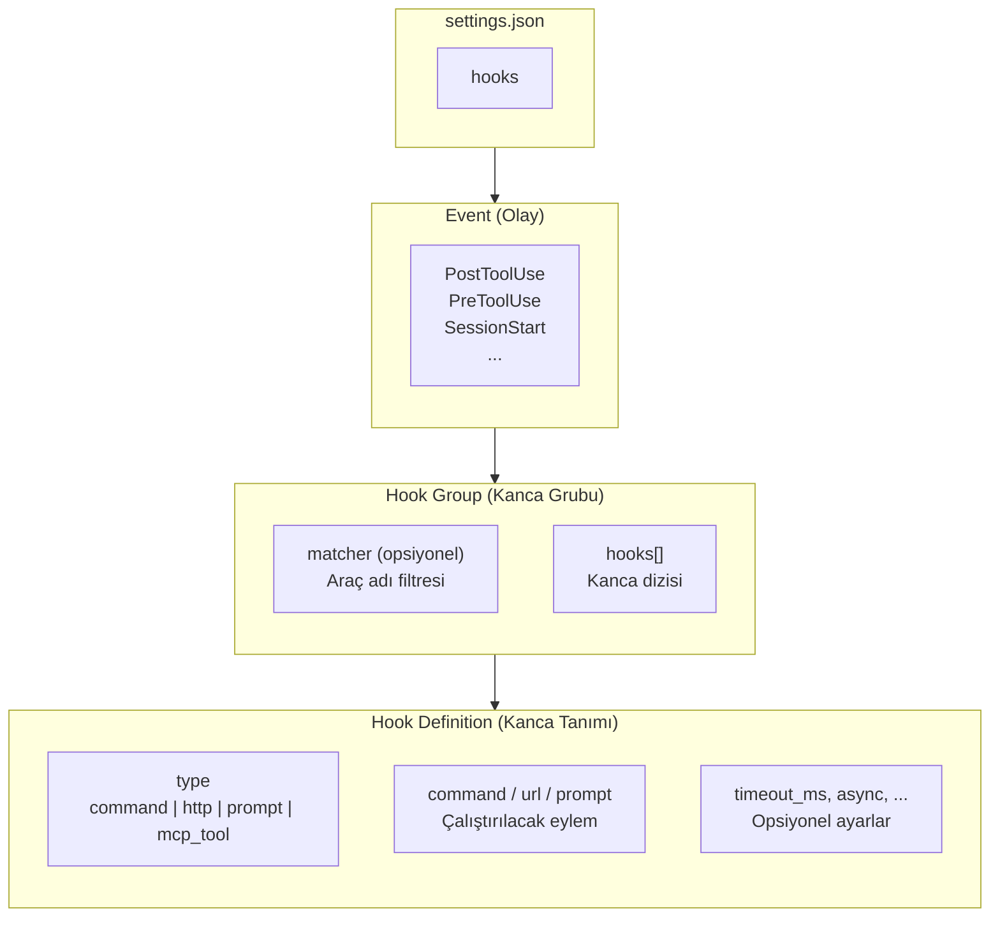
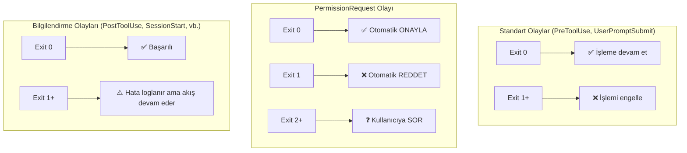
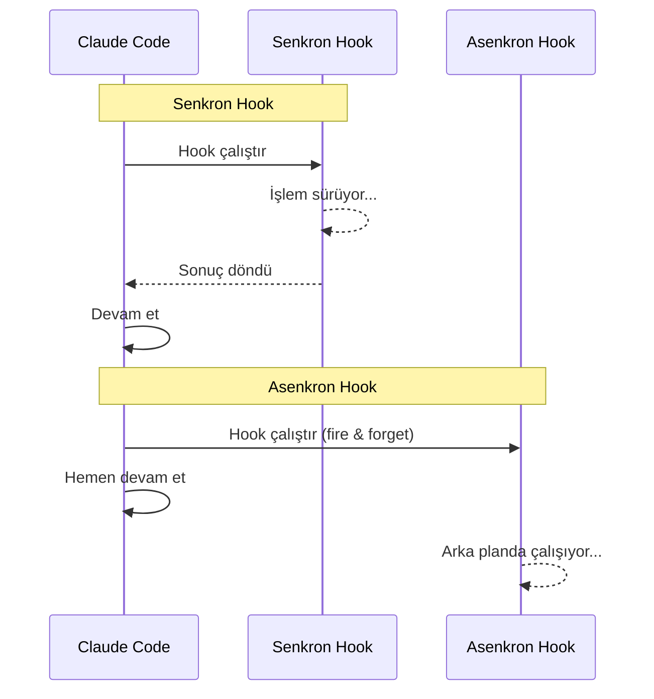
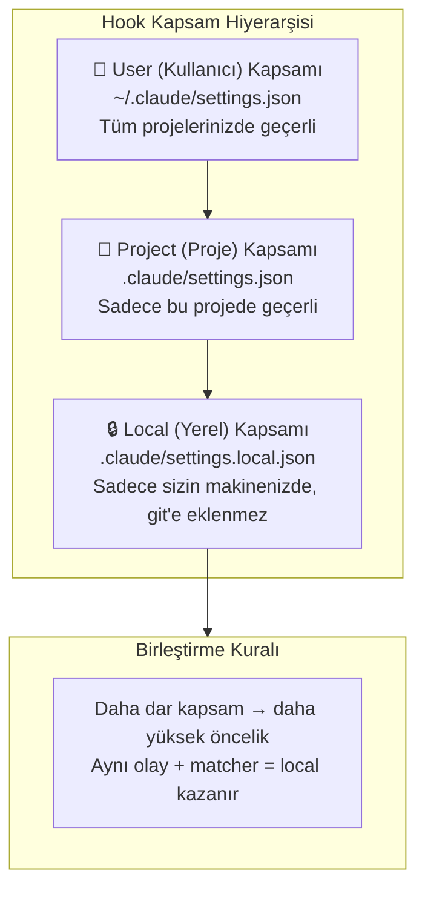

# Hook Konfigürasyonu

Hook'lar `settings.json` dosyasında JSON formatında tanımlanır. Bu bölüm, konfigürasyon yapısını, exit code davranışını, asenkron hook'ları, JSON giriş/çıkış formatını ve kapsam hiyerarşisini detaylı şekilde ele alır.

## Ön Koşullar

| Konu | Bölüm |
|------|-------|
| Hook kavramı | [Hooks Nedir?](./01-hooks-nedir.md) |
| Hook olayları | [Hook Olayları](./02-hook-olaylari.md) |
| Hook tipleri | [Hook Tipleri](./03-hook-tipleri.md) |
| Konfigürasyon ve ayarlar | [Bölüm 17](../17-konfigurasyon/README.md) |

---

## JSON Yapısı

Hook konfigürasyonunun tam yapısı şu şekildedir:



### Tam JSON Şeması

```json
{
  "hooks": {
    "<EventName>": [
      {
        "matcher": "<ToolName>",
        "hooks": [
          {
            "type": "command",
            "command": "<shell komutu>",
            "timeout_ms": 30000,
            "async": false
          }
        ]
      }
    ]
  }
}
```

### Yapı Katmanları

| Katman | Açıklama | Zorunlu |
|--------|----------|---------|
| `hooks` | Kök obje, tüm hook tanımlarını içerir | ✅ |
| `<EventName>` | Olay adı (ör: `PostToolUse`, `SessionStart`) | ✅ |
| Hook Group `[]` | Aynı olay için birden fazla grup tanımlanabilir | ✅ |
| `matcher` | Araç adı filtresi (ör: `"Edit"`, `"Bash"`) | ❌ |
| `hooks[]` | Grup içindeki hook tanımları dizisi | ✅ |
| Hook Definition | Tek bir hook'un tip, komut ve ayarları | ✅ |

---

## Matcher (Eşleştirici) Detayları

Matcher, hook'un yalnızca belirli araçlar için çalışmasını sağlar.

### Basit Matcher

```json
{
  "matcher": "Edit"
}
```

Sadece `Edit` aracı kullanıldığında tetiklenir.

### Matcher Olmadan

```json
{
  "hooks": {
    "PostToolUse": [
      {
        "hooks": [
          {
            "type": "command",
            "command": "echo 'Herhangi bir araç kullanıldı'"
          }
        ]
      }
    ]
  }
}
```

Matcher belirtilmezse hook tüm araçlar için tetiklenir.

### Birden Fazla Araç İçin Ayrı Matcher'lar

```json
{
  "hooks": {
    "PostToolUse": [
      {
        "matcher": "Edit",
        "hooks": [
          {
            "type": "command",
            "command": "prettier --write \"$CLAUDE_FILE_PATH\""
          }
        ]
      },
      {
        "matcher": "Write",
        "hooks": [
          {
            "type": "command",
            "command": "prettier --write \"$CLAUDE_FILE_PATH\""
          }
        ]
      }
    ]
  }
}
```

---

## Exit Code Davranışı

Exit code, hook sonucunun Claude Code akışını nasıl etkileyeceğini belirler.



### Exit Code Özet Tablosu

| Olay | Exit 0 | Exit 1 | Exit 2+ |
|------|--------|--------|---------|
| **PreToolUse** | Devam et | Engelle | Engelle |
| **UserPromptSubmit** | Devam et | Engelle | Engelle |
| **PermissionRequest** | Otomatik onayla | Otomatik reddet | Kullanıcıya sor |
| **PostToolUse** | Başarılı | Hata logla | Hata logla |
| **SessionStart** | Başarılı | Hata logla | Hata logla |
| **SessionEnd** | Başarılı | Hata logla | Hata logla |

### Hook Çıktısının Claude'a İletilmesi

Hook'un **stdout** çıktısı Claude'un bağlamına eklenir. Bu sayede hook, Claude'a bilgi iletebilir:

```json
{
  "hooks": {
    "PreToolUse": [
      {
        "matcher": "Bash",
        "hooks": [
          {
            "type": "command",
            "command": "echo \"$CLAUDE_TOOL_INPUT\" | python3 -c \"\nimport sys, json\ncmd = json.load(sys.stdin).get('command', '')\nif 'rm -rf' in cmd:\n    print('UYARI: rm -rf komutu tespit edildi. Bu komut tehlikeli olabilir.')\n    sys.exit(1)\nelse:\n    print('Komut güvenli görünüyor.')\n    sys.exit(0)\n\""
          }
        ]
      }
    ]
  }
}
```

---

## Asenkron Hook'lar

Varsayılan olarak hook'lar **senkron** çalışır — Claude Code hook tamamlanana kadar bekler. Asenkron hook'lar ise **fire-and-forget** (ateşle ve unut) mantığıyla çalışır.

### Senkron vs Asenkron



### Asenkron Konfigürasyon

```json
{
  "hooks": {
    "PostToolUse": [
      {
        "matcher": "Edit",
        "hooks": [
          {
            "type": "command",
            "command": "prettier --write \"$CLAUDE_FILE_PATH\"",
            "async": false
          },
          {
            "type": "http",
            "url": "https://api.internal.com/file-changes",
            "method": "POST",
            "body": "{\"file\": \"{{file_path}}\"}",
            "async": true
          }
        ]
      }
    ]
  }
}
```

### Ne Zaman Asenkron Kullanmalı?

| Durum | Senkron | Asenkron |
|-------|---------|----------|
| Dosya formatlama | ✅ | ❌ |
| Tehlikeli komut engelleme | ✅ | ❌ |
| Slack bildirimi | ❌ | ✅ |
| Webhook çağrısı | ❌ | ✅ |
| Loglama (dosyaya) | ✅ | ✅ |
| Metrik gönderme | ❌ | ✅ |

> **Kural:** Sonucu Claude'un bilmesi gerekiyorsa veya engelleme yapılacaksa **senkron**, bildirim veya loglama amaçlı ise **asenkron** kullanın.

---

## JSON Giriş/Çıkış Formatı

### Hook'a Gelen Veri (stdin)

Command hook'lar, olay verilerini ortam değişkenleri üzerinden ve bazı durumlarda stdin üzerinden alır:

```json
{
  "event": "PreToolUse",
  "session_id": "sess_abc123",
  "tool_name": "Bash",
  "tool_input": {
    "command": "npm install lodash"
  },
  "timestamp": "2026-03-15T10:05:00Z"
}
```

### Hook'tan Çıkan Veri (stdout)

Hook'un stdout'a yazdığı metin Claude'un bağlamına eklenir:

```bash
#!/bin/bash
if echo "$CLAUDE_TOOL_INPUT" | grep -q "rm -rf"; then
  echo "Bu komut tehlikeli! rm -rf komutu engellenmiştir."
  exit 1
fi
echo "Komut onaylandı."
exit 0
```

---

## Kapsam Hiyerarşisi (Scope Hierarchy)

Hook'lar üç farklı kapsamda tanımlanabilir:



### Kapsam Detayları

| Kapsam | Dosya Yolu | Git'e Eklenmeli mi? | Kullanım |
|--------|------------|---------------------|----------|
| **User** | `~/.claude/settings.json` | N/A | Tüm projelerde geçerli kişisel hook'lar |
| **Project** | `.claude/settings.json` | ✅ Evet | Takım genelinde geçerli proje hook'ları |
| **Local** | `.claude/settings.local.json` | ❌ Hayır | Kişisel proje hook'ları |

### Birleştirme Kuralları

1. Tüm kapsamlardaki hook'lar **birleştirilir** (merge)
2. Aynı event + matcher kombinasyonu varsa, **dar kapsam** öncelik alır
3. Farklı event veya matcher'lar **birlikte çalışır**

### Kapsam Örneği

**User kapsamı** (`~/.claude/settings.json`):

```json
{
  "hooks": {
    "SessionStart": [
      {
        "hooks": [
          {
            "type": "command",
            "command": "echo 'Kişisel oturum başladı' >> ~/.claude/session.log"
          }
        ]
      }
    ]
  }
}
```

**Project kapsamı** (`.claude/settings.json`):

```json
{
  "hooks": {
    "PostToolUse": [
      {
        "matcher": "Edit",
        "hooks": [
          {
            "type": "command",
            "command": "npx prettier --write \"$CLAUDE_FILE_PATH\""
          }
        ]
      }
    ],
    "PreToolUse": [
      {
        "matcher": "Bash",
        "hooks": [
          {
            "type": "command",
            "command": "echo \"$CLAUDE_TOOL_INPUT\" | python3 -c \"import sys,json; cmd=json.load(sys.stdin).get('command',''); sys.exit(1 if 'DROP TABLE' in cmd.upper() else 0)\""
          }
        ]
      }
    ]
  }
}
```

**Local kapsamı** (`.claude/settings.local.json`):

```json
{
  "hooks": {
    "SessionEnd": [
      {
        "hooks": [
          {
            "type": "command",
            "command": "say 'Claude Code oturumu bitti'"
          }
        ]
      }
    ]
  }
}
```

Bu konfigürasyonla:
- **Tüm projelerde:** Oturum başlangıç logu tutulur (user)
- **Bu projede:** Edit sonrası prettier, Bash'te DROP TABLE engellenir (project)
- **Sadece bu makinede:** Oturum bitince sesli uyarı verilir (local)

---

## Pratik Örnek 1: Tam Proje Konfigürasyonu

Bir TypeScript + React projesi için kapsamlı hook konfigürasyonu:

```json
{
  "hooks": {
    "SessionStart": [
      {
        "hooks": [
          {
            "type": "command",
            "command": "node --version && npm --version && echo 'Ortam hazır'"
          }
        ]
      }
    ],
    "PreToolUse": [
      {
        "matcher": "Bash",
        "hooks": [
          {
            "type": "command",
            "command": "echo \"$CLAUDE_TOOL_INPUT\" | python3 -c \"import sys,json; cmd=json.load(sys.stdin).get('command',''); dangerous=['rm -rf /','rm -rf ~','DROP TABLE','TRUNCATE','--force']; sys.exit(1 if any(d in cmd for d in dangerous) else 0)\""
          }
        ]
      }
    ],
    "PostToolUse": [
      {
        "matcher": "Edit",
        "hooks": [
          {
            "type": "command",
            "command": "if [[ \"$CLAUDE_FILE_PATH\" == *.ts || \"$CLAUDE_FILE_PATH\" == *.tsx ]]; then npx prettier --write \"$CLAUDE_FILE_PATH\"; fi"
          }
        ]
      },
      {
        "matcher": "Write",
        "hooks": [
          {
            "type": "command",
            "command": "if [[ \"$CLAUDE_FILE_PATH\" == *.ts || \"$CLAUDE_FILE_PATH\" == *.tsx ]]; then npx prettier --write \"$CLAUDE_FILE_PATH\"; fi"
          }
        ]
      }
    ],
    "SessionEnd": [
      {
        "hooks": [
          {
            "type": "command",
            "command": "echo \"$(date) | Oturum sona erdi | $(pwd)\" >> ~/.claude/sessions.log"
          }
        ]
      }
    ]
  }
}
```

---

## Pratik Örnek 2: Çoklu Hook Tipi Kombinasyonu

Bir hook grubunda birden fazla tipi birleştiren konfigürasyon:

```json
{
  "hooks": {
    "PostToolUse": [
      {
        "matcher": "Edit",
        "hooks": [
          {
            "type": "command",
            "command": "npx prettier --write \"$CLAUDE_FILE_PATH\"",
            "timeout_ms": 15000
          },
          {
            "type": "command",
            "command": "npx eslint \"$CLAUDE_FILE_PATH\" --fix 2>/dev/null || true",
            "timeout_ms": 15000
          },
          {
            "type": "http",
            "url": "https://hooks.slack.com/services/T00/B00/xxx",
            "method": "POST",
            "headers": { "Content-Type": "application/json" },
            "body": "{\"text\": \"📝 Dosya düzenlendi: {{file_path}}\"}",
            "async": true
          }
        ]
      }
    ]
  }
}
```

Bu konfigürasyonda sıra önemlidir:
1. Prettier çalışır (senkron, bekler)
2. ESLint çalışır (senkron, bekler)
3. Slack bildirimi gönderilir (asenkron, beklemez)

---

## Pratik Örnek 3: Koşullu Hook Zinciri

Dosya uzantısına göre farklı formatlayıcı çalıştıran konfigürasyon:

```json
{
  "hooks": {
    "PostToolUse": [
      {
        "matcher": "Edit",
        "hooks": [
          {
            "type": "command",
            "command": "EXT=\"${CLAUDE_FILE_PATH##*.}\"; case \"$EXT\" in ts|tsx|js|jsx|json|css|scss) npx prettier --write \"$CLAUDE_FILE_PATH\" ;; py) black \"$CLAUDE_FILE_PATH\" 2>/dev/null ;; go) gofmt -w \"$CLAUDE_FILE_PATH\" ;; rs) rustfmt \"$CLAUDE_FILE_PATH\" 2>/dev/null ;; *) echo 'Formatlayıcı bulunamadı' ;; esac"
          }
        ]
      }
    ]
  }
}
```

---

## Hata Ayıklama (Debugging)

Hook'lar beklendiği gibi çalışmadığında şu yöntemleri kullanabilirsiniz:

### 1. Verbose Loglama

```json
{
  "hooks": {
    "PreToolUse": [
      {
        "matcher": "Bash",
        "hooks": [
          {
            "type": "command",
            "command": "echo \"DEBUG [$(date)] Event=PreToolUse Tool=$CLAUDE_TOOL_NAME Input=$(echo $CLAUDE_TOOL_INPUT | head -c 500)\" >> ~/.claude/hook-debug.log && echo \"$CLAUDE_TOOL_INPUT\" | python3 -c \"import sys,json; cmd=json.load(sys.stdin).get('command',''); sys.exit(1 if 'rm -rf /' in cmd else 0)\""
          }
        ]
      }
    ]
  }
}
```

### 2. Hook Test Scripti

Hook'larınızı test etmek için bağımsız bir script oluşturun:

```bash
#!/bin/bash
# test-hook.sh
export CLAUDE_TOOL_NAME="Bash"
export CLAUDE_TOOL_INPUT='{"command":"rm -rf node_modules"}'
export CLAUDE_FILE_PATH="src/app.ts"

# Hook komutunuzu buraya yapıştırın
echo "$CLAUDE_TOOL_INPUT" | python3 -c "
import sys, json
cmd = json.load(sys.stdin).get('command', '')
dangerous = ['rm -rf /', 'rm -rf ~', 'DROP TABLE']
if any(d in cmd for d in dangerous):
    print(f'ENGELLENDI: {cmd}')
    sys.exit(1)
else:
    print(f'ONAYLANDI: {cmd}')
    sys.exit(0)
"
echo "Exit code: $?"
```

---

## Sık Yapılan Hatalar

| Hata | Çözüm |
|------|-------|
| JSON sözdizimi hatası | JSON validator kullanın, virgül eksikliklerine dikkat |
| Matcher büyük/küçük harf | Araç adları büyük harfle başlar: `"Edit"`, `"Bash"`, `"Write"` |
| Ortam değişkeni erişilemiyor | Tırnak içinde `$VARIABLE` kullanın, tek tırnak kullanmayın |
| Hook çok yavaş | `timeout_ms` artırın veya `async: true` kullanın |
| Exit code yanlış davranış | PermissionRequest'te 0=onayla, 1=reddet, 2+=sor |
| Dosya yolu boşluk içeriyor | `"$CLAUDE_FILE_PATH"` çift tırnak içinde kullanın |

---

## Özet

| Kavram | Açıklama |
|--------|----------|
| **JSON Yapısı** | `hooks` → `EventName` → `[{matcher, hooks[]}]` |
| **Matcher** | Opsiyonel araç adı filtresi |
| **Exit Code** | 0=başarı, 1+=engelleme (PermissionRequest farklı) |
| **Async** | `async: true` ile fire-and-forget |
| **stdout** | Hook çıktısı Claude bağlamına eklenir |
| **Kapsam** | User → Project → Local (dar kapsam öncelikli) |

---

## Sonraki Adım

Konfigürasyonu öğrendiğimize göre, şimdi gerçek dünya senaryoları için hazır hook tariflerine geçelim:

→ [Hook Örnekleri ve Tarifler](./05-hook-ornekleri-ve-tarifler.md)
