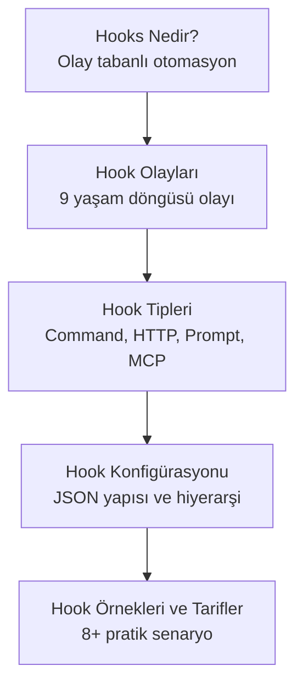

# Bölüm 14: Hooks ve Otomasyon

Hooks (kancalar), Claude Code'un yaşam döngüsündeki belirli anlarda otomatik olarak tetiklenen, kullanıcı tanımlı eylemlerdir. Bu bölüm, hook sisteminin tamamını — olay türlerinden konfigürasyona, pratik tariflerden ileri düzey kullanım senaryolarına kadar — kapsamlı şekilde ele alır.

## Bu Bölümde Neler Öğreneceksiniz?

## İçerik

| # | Dosya | Konu | Süre |
|---|-------|------|------|
| 01 | [Hooks Nedir?](./01-hooks-nedir.md) | Hook kavramı, bileşenleri, yaşam döngüsü | ~10 dk |
| 02 | [Hook Olayları](./02-hook-olaylari.md) | 9 hook event detaylı açıklama ve zaman çizelgesi | ~15 dk |
| 03 | [Hook Tipleri](./03-hook-tipleri.md) | Command, HTTP, Prompt, MCP hook tipleri | ~12 dk |
| 04 | [Hook Konfigürasyonu](./04-hook-konfigurasyonu.md) | JSON yapısı, exit code davranışı, scope hiyerarşisi | ~15 dk |
| 05 | [Hook Örnekleri ve Tarifler](./05-hook-ornekleri-ve-tarifler.md) | 8+ pratik hook tarifi, tam konfigürasyonlarla | ~20 dk |

## Ön Koşullar

Bu bölümü okumadan önce aşağıdaki konulara aşina olmanız önerilir:

| Konu | Bölüm |
|------|-------|
| Claude Code nasıl çalışır | [Bölüm 06](../06-claude-code-tanitim/README.md) |
| Araçlar (Tools) ve izin sistemi | [Bölüm 08](../08-araclar/README.md) |
| İzinler ve güvenlik | [Bölüm 10](../10-izinler-ve-guvenlik/README.md) |
| Subagent'lar | [Bölüm 13](../13-subagentlar-ve-agent-takimlari/README.md) |

## Önceki Bölüm

← [13 - Subagent'lar ve Agent Takımları](../13-subagentlar-ve-agent-takimlari/README.md)

## Sonraki Adım

Bu bölümü tamamladıktan sonra → [15 - IDE ve Platform Entegrasyonları](../15-entegrasyonlar/README.md)
