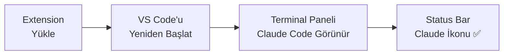
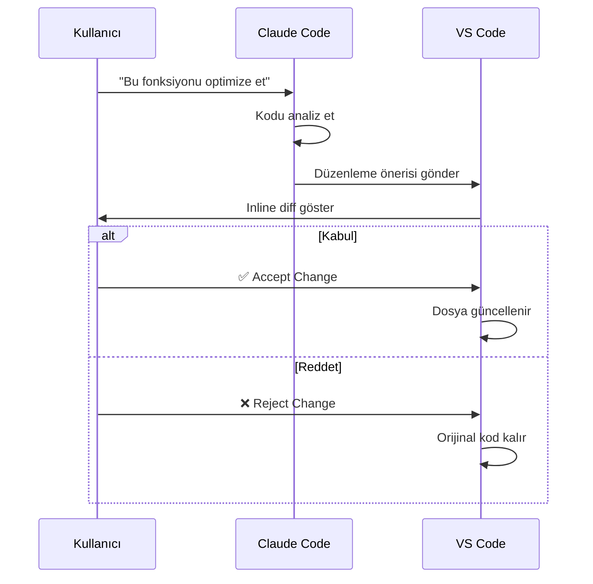
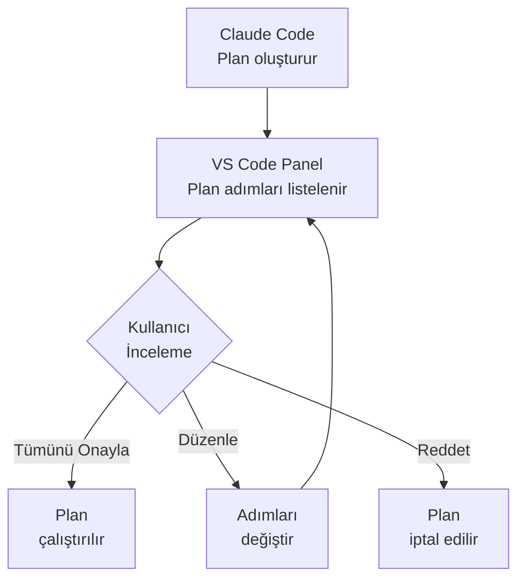
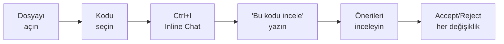

# VS Code Entegrasyonu

Claude Code, Visual Studio Code ile Extension (eklenti) aracılığıyla derin entegrasyon sunar. Inline diff review (satır içi fark inceleme), @-mentions (bahsetmeler) ile bağlam sağlama, plan onaylama ve terminal paneli üzerinden doğrudan erişim gibi özellikler, geliştirme iş akışınızı hızlandırır.

## Ön Koşullar

| Konu | Bölüm |
|------|-------|
| Claude Code kurulumu | [Kurulum ve Gereksinimler](../06-claude-code-tanitim/03-kurulum-ve-gereksinimler.md) |
| Temel Claude Code kullanımı | [İlk Oturum](../06-claude-code-tanitim/05-ilk-oturum.md) |
| VS Code temel bilgisi | Harici kaynak |

---

## Kurulum

### Adım 1: Extension Yükleme

VS Code Extension (eklenti), Claude Code CLI yüklendiğinde otomatik olarak kurulabilir veya manuel olarak yüklenebilir:

```bash
# Claude Code CLI üzerinden otomatik kurulum
claude integrations install vs-code

# Veya VS Code Marketplace'ten manuel kurulum
# VS Code → Extensions → "Claude Code" aratın → Install
```

### Adım 2: Doğrulama

Extension yüklendikten sonra VS Code'u yeniden başlatın:



### Adım 3: İlk Yapılandırma

Extension ayarları `settings.json` üzerinden yapılandırılabilir:

```json
{
  "claudeCode.enableInlineDiff": true,
  "claudeCode.enableCodeLens": true,
  "claudeCode.terminalProfile": "Claude Code",
  "claudeCode.autoActivate": true
}
```

---

## Temel Özellikler

### 1. Inline Diff Review (Satır İçi Fark İnceleme)

Claude Code dosya düzenlediğinde, değişiklikler VS Code'un native diff görünümünde gösterilir:



Diff görünümünde:
- **Yeşil satırlar:** Eklenen kodlar
- **Kırmızı satırlar:** Silinen kodlar
- **Accept/Reject butonları:** Her değişiklik bloğu için ayrı ayrı onay

### 2. @-Mentions ile Bağlam Sağlama

Claude Code'a bağlam sağlamak için `@` sembolü ile dosya, klasör veya sembol referansı verebilirsiniz:

```
@src/utils/auth.ts bu dosyadaki JWT doğrulama mantığını incele

@src/components/ klasöründeki tüm bileşenlere TypeScript tipi ekle

@UserService sınıfına cache mekanizması ekle
```

Desteklenen @-mention türleri:

| Tür | Söz Dizimi | Açıklama |
|-----|-----------|----------|
| Dosya | `@dosya/yolu.ts` | Belirli bir dosyayı bağlama ekler |
| Klasör | `@klasor/yolu/` | Klasör içeriğini bağlama ekler |
| Sembol | `@SembolAdı` | Fonksiyon, sınıf veya değişken referansı |
| Git | `@git:branch-name` | Branch veya commit referansı |
| Web | `@https://url.com` | Web sayfası içeriğini bağlama ekler |

### 3. Plan Mode Onaylama

Claude Code Plan Mode'da çalışırken, VS Code üzerinden plan adımlarını görsel olarak inceleyip onaylayabilirsiniz:



### 4. Terminal Panel Entegrasyonu

Claude Code, VS Code terminal panelinde özel bir profil olarak çalışır:

```
Terminal → New Terminal → Claude Code

veya

Ctrl+Shift+` (yeni terminal) → Profil seçin: Claude Code
```

---

## Klavye Kısayolları

| Kısayol | İşlev | Açıklama |
|---------|-------|----------|
| `Ctrl+Shift+P` → "Claude" | Komut paleti | Tüm Claude komutlarını listeler |
| `Ctrl+I` | Inline chat | Seçili kod üzerinde Claude ile sohbet |
| `Ctrl+L` | Chat panel | Claude Code sohbet panelini açar |
| `Ctrl+Shift+I` | Yeni oturum | Yeni Claude Code oturumu başlatır |
| `Ctrl+Enter` | Kabul et | Mevcut diff önerisini kabul eder |
| `Escape` | Reddet | Mevcut diff önerisini reddeder |

Kısayolları özelleştirmek için:

```json
// keybindings.json
[
  {
    "key": "ctrl+shift+c",
    "command": "claudeCode.openChat",
    "when": "editorTextFocus"
  },
  {
    "key": "ctrl+shift+a",
    "command": "claudeCode.acceptAllChanges",
    "when": "claudeCode.hasPendingChanges"
  }
]
```

---

## İş Akışı Örnekleri

### Örnek 1: Kod İnceleme İş Akışı



**Adım adım:**

1. İncelemek istediğiniz dosyayı VS Code'da açın
2. İlgili kodu seçin (veya tüm dosyayı bırakın)
3. `Ctrl+I` ile inline chat'i açın
4. Komutunuzu yazın:

```
Bu fonksiyondaki potansiyel hataları bul ve düzelt.
Performans iyileştirmesi de öner.
```

5. Claude Code'un önerdiği diff'leri inceleyin
6. Her değişikliği ayrı ayrı kabul veya reddedin

### Örnek 2: Yeni Özellik Geliştirme

```
1. @src/models/user.ts modeline "lastLoginAt" alanı ekle
2. @src/services/auth.ts servisinde login sonrası bu alanı güncelle
3. @src/routes/user.ts route'una son giriş bilgisini döndüren endpoint ekle
4. Tüm değişiklikler için unit test yaz
```

### Örnek 3: Refactoring İş Akışı

Terminal panelinde Claude Code oturumu açın:

```bash
# Claude Code terminalinde
> @src/legacy/ klasöründeki callback tabanlı fonksiyonları async/await'e dönüştür
```

Claude Code her dosyayı sırayla düzenler ve VS Code'da inline diff olarak gösterir. Siz her değişikliği inceleyip onaylarsınız.

---

## VS Code Workspace Ayarları

Proje bazlı Claude Code yapılandırması `.vscode/settings.json` dosyasında:

```json
{
  "claudeCode.defaultModel": "sonnet",
  "claudeCode.workspaceContext": [
    "src/**/*.ts",
    "docs/**/*.md"
  ],
  "claudeCode.excludeFromContext": [
    "node_modules/**",
    "dist/**",
    ".env"
  ],
  "claudeCode.terminalAutoStart": true,
  "claudeCode.diffViewMode": "inline"
}
```

---

## Sorun Giderme

| Sorun | Çözüm |
|-------|-------|
| Extension görünmüyor | VS Code'u güncelleyin (minimum 1.85+), extension'ı yeniden yükleyin |
| Diff görünümü açılmıyor | `claudeCode.enableInlineDiff` ayarını kontrol edin |
| Terminal profili eksik | `claude integrations install vs-code` komutunu çalıştırın |
| @-mentions çalışmıyor | Workspace'in düzgün açıldığından emin olun |
| Yavaş yanıt | Context boyutunu sınırlamak için `excludeFromContext` kullanın |

---

## Özet

| Özellik | Açıklama |
|---------|----------|
| **Inline Diff** | Değişiklikleri VS Code native diff görünümünde inceleme |
| **@-Mentions** | Dosya, klasör, sembol referansı ile bağlam sağlama |
| **Plan Review** | Plan adımlarını görsel panel üzerinden onaylama |
| **Terminal Panel** | Claude Code'u VS Code terminal profili olarak çalıştırma |
| **Kısayollar** | Özelleştirilebilir klavye kısayolları ile hızlı erişim |

---

## Sonraki Adım

JetBrains IDE'leri (IntelliJ, PyCharm, WebStorm) ile Claude Code entegrasyonunu inceleyelim:

→ [JetBrains Entegrasyonu](./02-jetbrains-entegrasyonu.md)
