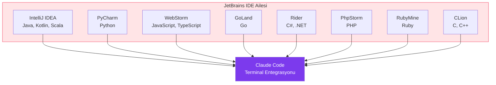
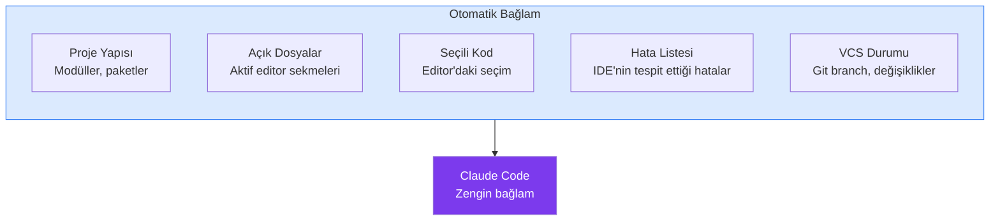
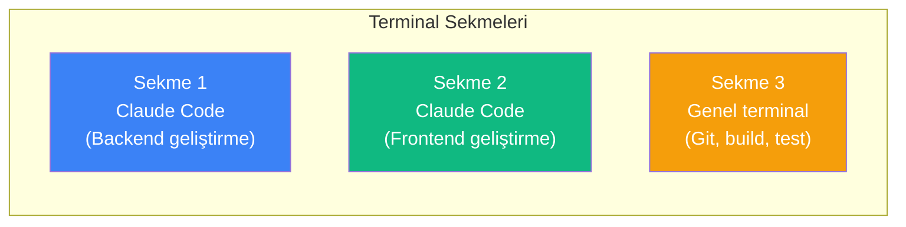
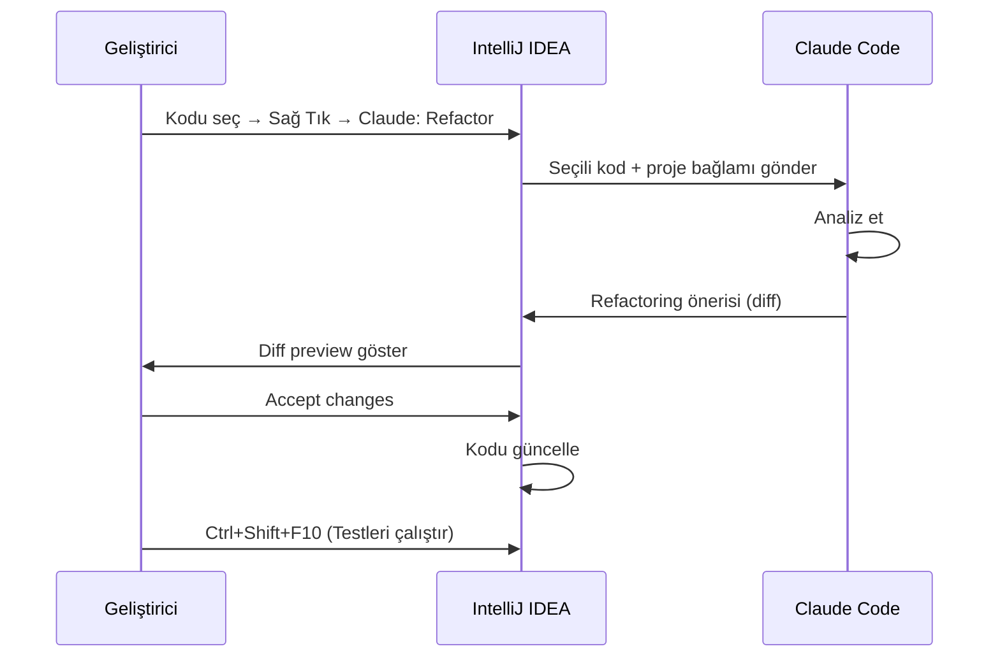

# JetBrains Entegrasyonu

Claude Code, JetBrains IDE ailesi — IntelliJ IDEA, PyCharm, WebStorm, GoLand, Rider ve diğerleri — ile terminal tabanlı entegrasyon sunar. Plugin (eklenti) kurulumu, dahili terminal kullanımı ve IDE özelliklerinden yararlanma yöntemlerini bu bölümde ele alıyoruz.

## Ön Koşullar

| Konu | Bölüm |
|------|-------|
| Claude Code kurulumu | [Kurulum ve Gereksinimler](../06-claude-code-tanitim/03-kurulum-ve-gereksinimler.md) |
| Terminal kullanımı | [İnteraktif Mod](../07-arayuz-ve-komutlar/01-interaktif-mod.md) |
| JetBrains IDE temel bilgisi | Harici kaynak |

---

## Desteklenen IDE'ler



---

## Kurulum

### Yöntem 1: Plugin Marketplace'ten Yükleme

1. JetBrains IDE'nizi açın
2. `File → Settings → Plugins → Marketplace` sekmesine gidin
3. "Claude Code" aratın
4. `Install` butonuna tıklayın
5. IDE'yi yeniden başlatın

### Yöntem 2: CLI Üzerinden Otomatik Kurulum

```bash
# Tüm yüklü JetBrains IDE'ler için kurulum
claude integrations install jetbrains

# Belirli bir IDE için kurulum
claude integrations install intellij
claude integrations install pycharm
claude integrations install webstorm
```

### Yöntem 3: Dahili Terminal Kullanımı

Plugin yüklemeden de JetBrains'in dahili terminalinden doğrudan Claude Code kullanabilirsiniz:


```bash
# JetBrains dahili terminalinde
claude
```

---

## Plugin Özellikleri

### 1. Tool Window (Araç Penceresi)

Plugin yüklendikten sonra sağ kenar çubuğunda Claude Code tool window'u görünür:

| Alan | İşlev |
|------|-------|
| Chat Panel | Claude Code ile mesajlaşma alanı |
| File Context | Otomatik proje bağlamı |
| Diff Preview | Değişikliklerin ön izlemesi |
| Action Buttons | Kabul, reddet ve düzenleme butonları |

### 2. Bağlamsal Eylemler

Kod üzerinde sağ tıklayarak Claude Code eylemlerine erişebilirsiniz:

```
Sağ Tık → Claude Code → 
  ├── Explain Code (Kodu Açıkla)
  ├── Refactor (Yeniden Düzenle)
  ├── Fix Bug (Hata Düzelt)
  ├── Add Tests (Test Ekle)
  ├── Add Documentation (Dokümantasyon Ekle)
  └── Custom Prompt... (Özel Komut...)
```

### 3. Proje Bağlamı

JetBrains plugin'i otomatik olarak şu bilgileri Claude Code'a aktarır:



---

## Terminal Kullanımı

JetBrains IDE'lerin dahili terminali Claude Code ile tam uyumludur:

### Terminal Açma

| Kısayol | İşlev |
|---------|-------|
| `Alt+F12` | Terminal panelini aç/kapat |
| `Ctrl+Shift+T` | Yeni terminal sekmesi |

### Çalışma Dizini

JetBrains terminali proje kök dizininde açılır, bu Claude Code'un proje bağlamını otomatik algılamasını sağlar:

```bash
# Terminal açıldığında proje kök dizinindeysinizdir
$ pwd
/home/user/projects/my-app

# Claude Code başlatın
$ claude

# Proje bağlamı otomatik algılanır
> Bu projenin yapısını analiz et
```

### Birden Fazla Terminal Sekmesi

Farklı görevler için birden fazla Claude Code oturumu açabilirsiniz:



---

## IDE-Spesifik Özellikler

### IntelliJ IDEA (Java/Kotlin)

```bash
# Maven/Gradle proje yapısını anlayarak kod üretme
> @pom.xml bağımlılıklarına göre yeni bir Spring Boot controller oluştur

# JPA entity'lerden repository oluşturma
> @src/main/java/com/app/entity/ altındaki entity'ler için Spring Data JPA repository'leri oluştur
```

### PyCharm (Python)

```bash
# Virtual environment bağlamında çalışma
> requirements.txt'e yeni bağımlılık ekle ve import'ları güncelle

# Django/Flask proje yapısıyla uyumlu kod üretme
> @models.py modeline yeni alan ekle ve migration oluştur
```

### WebStorm (JavaScript/TypeScript)

```bash
# package.json bağlamında çalışma
> @package.json bağımlılıklarını analiz et ve güvenlik açığı olanları güncelle

# React/Vue/Angular projelerinde bileşen oluşturma
> @src/components/ yapısına uygun yeni bir DataTable bileşeni oluştur
```

---

## Pratik Örnekler

### Örnek 1: Refactoring İş Akışı (IntelliJ)



### Örnek 2: Bug Fix İş Akışı (PyCharm)

Terminal sekmesinde Claude Code oturumu:

```
> Bu stack trace'i analiz et ve düzelt:
  
  Traceback (most recent call last):
    File "app/services/user_service.py", line 45, in get_user
      return self.repository.find_by_id(user_id)
  AttributeError: 'NoneType' object has no attribute 'find_by_id'
```

### Örnek 3: Test Yazma (WebStorm)

```
> @src/utils/validation.ts dosyasındaki tüm fonksiyonlar için 
  Jest test dosyası oluştur. Edge case'leri de kapsasın.
```

---

## Yapılandırma

JetBrains plugin ayarları `File → Settings → Tools → Claude Code` altında:

| Ayar | Varsayılan | Açıklama |
|------|-----------|----------|
| Auto-activate on project open | `true` | Proje açıldığında otomatik bağlam yükle |
| Diff view mode | `side-by-side` | Değişiklikleri yan yana veya inline göster |
| Terminal font size | IDE varsayılanı | Claude Code terminal font boyutu |
| Context include patterns | `src/**` | Bağlama dahil edilecek dosya desenleri |
| Context exclude patterns | `build/**, .idea/**` | Bağlamdan hariç tutulacak dosyalar |

---

## Sorun Giderme

| Sorun | Çözüm |
|-------|-------|
| Plugin yüklenmiyor | JetBrains IDE'nin 2024.1+ sürüm olduğundan emin olun |
| Terminal'de `claude` bulunamıyor | PATH ortam değişkenini kontrol edin, IDE'yi yeniden başlatın |
| Proje bağlamı algılanmıyor | Projenin düzgün açıldığından ve `.idea` klasörü olduğundan emin olun |
| Diff preview çalışmıyor | Plugin sürümünü güncelleyin |
| Yavaş yanıt | `Context exclude patterns` ile gereksiz dosyaları hariç tutun |

---

## Özet

| Özellik | Açıklama |
|---------|----------|
| **Plugin** | JetBrains Marketplace'ten tek tıkla kurulum |
| **Terminal** | Dahili terminalden plugin'siz doğrudan kullanım |
| **Bağlam** | Proje yapısı, açık dosyalar ve VCS otomatik algılama |
| **Eylemler** | Sağ tık menüsünden Claude Code komutlarına erişim |
| **IDE Uyumu** | Her JetBrains IDE'nin dil/framework özelliklerine uyum |

---

## Sonraki Adım

Cursor IDE içinde Claude Code kullanımını ve `.cursorrules` ile `CLAUDE.md` uyumunu inceleyelim:

→ [Cursor IDE Kullanımı](./03-cursor-ide-kullanimi.md)
